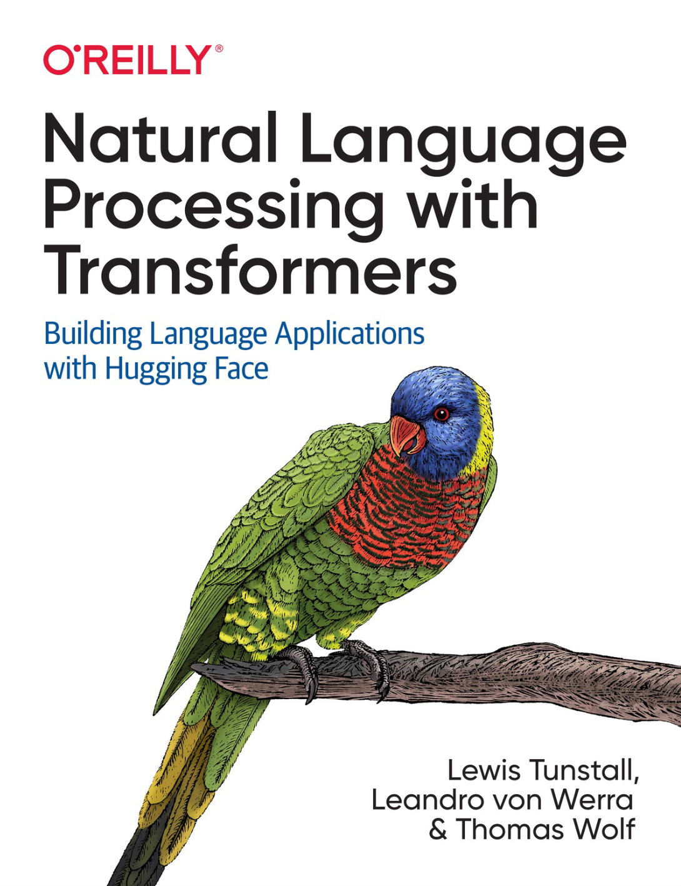

# Natural Language Processing with Transformers: 用Transformers处理自然语言

## Natural Language Processing with Transformers: Building Language Applications with Hugging Face 

### Lewis Tunstall, Leandro von Werra, and Thomas Wolf  （Hugging face Transformer库作者 , 详情：[作者介绍](authors.md)）
### Aurélien Géron 《Hands-on Machine Learning with Scikit-Learn and TensorFlow》作者 撰写序。

2022年新书《用Transformers处理自然语言 - 创建基于hugging face transformer程序库的自然语言处理程序》 中文翻译版

出版联系（需要能引进版权的出版社）： znsoft@163.com   Daniel ，微信： znsoft （北京理工大学 自然语言处理方向人工智能博士）

**本译文在代码或文本中已经嵌入水印，非授权商业使用将追究法律责任！！！**

**本版本为初稿，欢迎大家Start, PR, Fork 一键三连！**

## 访问 [目录](toc.md)

## 

### 进度条 ---------- 100%

Chapter 1 done.

Chapter 2 done.

chapter 3 done.

chapter 4 done.

chapter 5 done.

chapter 6 done.

chapter 7 done.

chapter 8 done.

chapter 9 done.

chapter 10 done.

chapter 11 done.

## 其它资源 
[Transformer 上手教程](https://datawhalechina.github.io/learn-nlp-with-transformers/#/)
