# 第1章. Hello Transformers

&emsp;&emsp;2017年，谷歌的研究人员发表了一篇论文，提出了一种用于序列建模的新型神经网络架构。 被称为Transformer的这一架构在机器翻译任务上的表现优于循环神经网络（RNN），在翻译质量和训练成本方面都是如此。

&emsp;&emsp;同时，一种被称为ULMFiT的有效迁移学习方法表明，在一个非常大的、多样化的语料库上训练长短期记忆（LSTM）网络，可以在很少的标记数据下产生最先进的文本分类器。

&emsp;&emsp;这些进展是今天两个最著名的Transformers的催化剂。 生成性预训练变换器（GPT）和变换器的双向编码器表示法（BERT）。 通过将Transformer架构与无监督学习相结合，这些模型消除了从头开始训练特定任务架构的需要，并以明显的优势打破了NLP中几乎所有的基准测试。 自从GPT和BERT发布以来，已经出现了大量的Transformers模型。 图1-1显示了最闪亮模型的发展时间线。

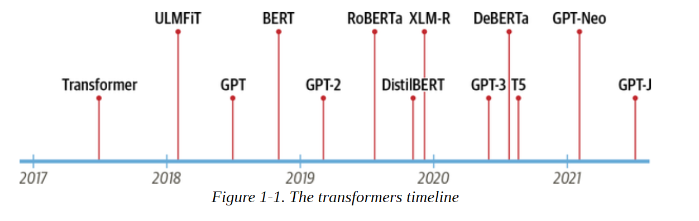

我们正在超越自己。 为了理解Transformers的新颖之处，我们首先需要解释:

- 编码器-解码器框架
- 注意机制
- 迁移学习


&emsp;&emsp;在这一章中，我们将介绍支撑Transformers普遍存在的核心概念，参观一些它们擅长的任务，并在最后看一下Hugging Face生态系统的工具和库。 

&emsp;&emsp;让我们先来探讨一下编码器-解码器的框架和Transformers兴起之前的架构。


## 编码器-解码器框架

&emsp;&emsp;在Transformers模型之前，LSTM等递归架构是NLP中最先进的技术。 这些架构在网络连接中包含一个反馈回路，允许信息从一个步骤传播到另一个步骤，使它们成为模拟文本等顺序数据的理想选择。 如图1-2左侧所示，RNN接收一些输入（可能是一个词或字符），通过网络输入，并输出一个称为隐藏状态的矢量。 同时，模型通过反馈回路将一些信息反馈给自己，然后可以在下一步使用。 如果我们 "解开 "循环，可以更清楚地看到这一点，如图1-2右侧所示。 RNN将其每一步的状态信息传递给序列中的下一个操作。 这使得RNN可以跟踪以前步骤的信息，并将其用于输出预测。


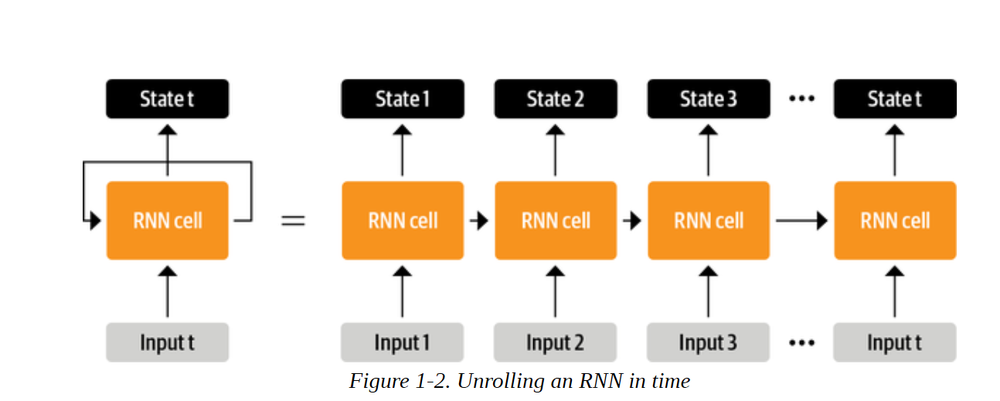

&emsp;&emsp;这些架构曾经（并将继续）被广泛用于NLP任务、语音处理和时间序列。 你可以在Andrej Karpathy的博文[《循环神经网络的不可思议的有效性》]([The Unreasonable Effectiveness of Recurrent Neural Networks (karpathy.github.io)](http://karpathy.github.io/2015/05/21/rnn-effectiveness/))中找到对其能力的精彩阐述。

&emsp;&emsp;RNNs发挥重要作用的一个领域是机器翻译系统的开发，其目标是将一种语言的单词序列映射到另一种语言。 这类任务通常用编码器-解码器或序列-序列结构来解决，这很适合于输入和输出都是任意长度的序列的情况。 编码器的工作是将输入序列的信息编码为数字表示，通常被称为最后的隐藏状态。 然后将这个状态传递给解码器，由其产生输出序列。

&emsp;&emsp;一般来说，编码器和解码器组件可以是任何一种可以为序列建模的神经网络架构。 这在图1-3中对一对RNN进行了说明，英语句子 "Transformers are great!"被编码为一个隐藏的状态向量，然后被解码以产生德语翻译 "Transformer sind grossartig!" 输入词被依次送入编码器，输出词从上到下逐一产生。

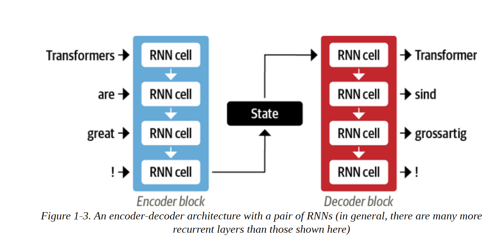

&emsp;&emsp;尽管这种结构的简单性很优雅，但它的一个弱点是，编码器的最终隐藏状态会产生一个信息瓶颈。 它必须代表整个输入序列的含义，因为这是解码器在生成输出时所能获得的全部内容。 这对长序列来说尤其具有挑战性，因为在将所有东西压缩到一个单一的、固定的表示法的过程中，序列前部分的信息可能会丢失。

 &emsp;&emsp;幸运的是，通过允许解码器访问编码器的所有隐藏状态，有办法摆脱这一瓶颈。 这方面的一般机制被称为注意力，它是许多现代神经网络架构的一个关键组成部分。 了解注意力是如何为RNN开发的，将使我们能够很好地理解Transformer架构的主要组成部分之一。 让我们更深入地了解一下。


## 注意机制 
&emsp;&emsp;注意力背后的主要思想是，编码器不是为输入序列产生一个单一的隐藏状态，而是在每一步输出一个隐藏状态，让解码器可以访问。 然而，同时使用所有的状态会给解码器带来巨大的输入，所以需要一些机制来确定使用哪些状态的优先次序。 这就是注意力的来源。 它让解码器对每个人分配不同的权重，或 "注意力"。
&emsp;&emsp;编码器在每个解码时间段的状态。 这个过程如图1-4所示，其中注意力的作用是预测输出序列中的第三个标记。


&emsp;&emsp;通过关注在每个时间点上哪些输入标记是最相关的，这些基于注意力的模型能够学习生成的翻译中的词和源句中的词之间的非线性排列。 例如，图1-5直观地显示了一个英法翻译模型的注意力权重，其中每个像素表示一个权重。 图中显示了解码器是如何正确对齐 "zone "和 "Area "这两个词的，这两个词在两种语言中的排序不同。


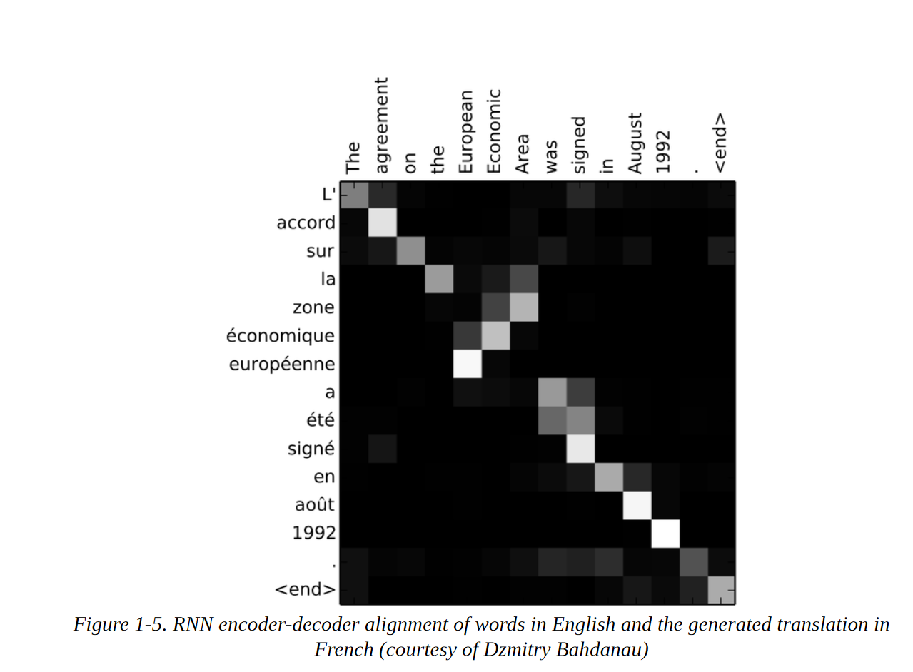

图1-5.  英文的RNN编码器-解码器对齐和生成的法文翻译（由Dzmitry Bahdanau提供）。


&emsp;&emsp;尽管注意力使译文产生得更好，但在编码器和解码器上使用递归模型仍有一个重大缺陷。 计算是固有的先后串行顺序，不能在输入序列中进行并行化。

 &emsp;&emsp;随着Transformers的出现，一个新的建模范式被引入。 完全不需要复述，而是完全依靠一种叫做自我注意的特殊形式的注意。 我们将在第三章中更详细地介绍自我注意，但其基本思想是让注意力在神经网络的同一层中操作所有的状态。 这在图1-6中显示，编码器和解码器都有自己的自我注意机制，其输出被送入前馈神经网络（FF NN）。 这种架构的训练速度比递归模型快得多，为最近在NLP方面的许多突破铺平了道路。

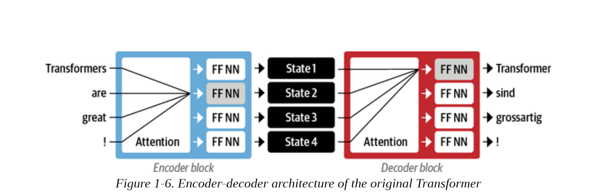

图1-6.  原始Transformer的编码器-解码器结构


&emsp;&emsp;在最初的Transformer论文中，翻译模型是在各种语言的大型句对语料库中从头开始训练的。 然而，在NLP的许多实际应用中，我们无法获得大量的标记文本数据来训练我们的模型。 要让Transformer革命开启，还缺少最后一块：迁移学习。


## NLP中的迁移学习 
&emsp;&emsp;如今，在计算机视觉领域，使用迁移学习来训练像ResNet这样的卷积神经网络，然后让它适应或微调一个新的任务，是很常见的做法。 这使得网络能够利用从原始任务中学到的知识。 从架构上看，这涉及到将模型分成一个主体和一个头部，其中头部是一个特定的任务网络。 在训练过程中，主体的权重学习了源域的广泛特征，这些权重被用来为新任务初始化一个新的模型。 与传统的监督学习相比，这种方法通常能产生高质量的模型，可以在各种下游任务上更有效地进行训练，而且标注的数据要少得多。 这两种方法的比较见图1-7.

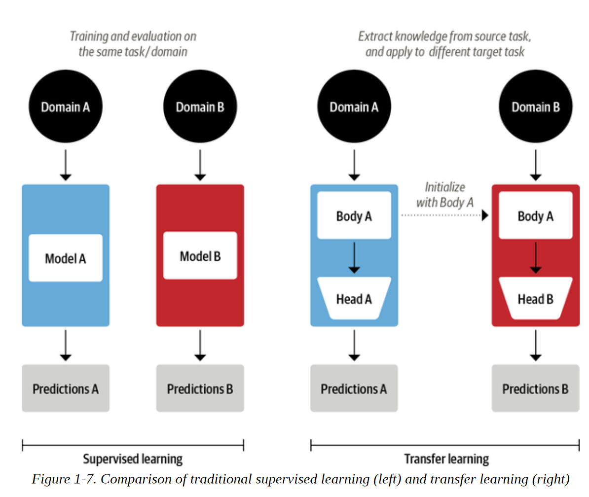


&emsp;&emsp;在计算机视觉中，模型首先在大规模的数据集上进行训练，如ImageNet，其中包含数百万张图像。 这个过程被称为预训练，其主要目的是让模型了解图像的基本特征，如边缘或颜色。 然后，这些预训练的模型可以在下游任务上进行微调，如用相对较少的标记实例（通常每类几百个）对花种进行分类。 经过微调的模型通常比在相同数量的标记数据上从头开始训练的监督模型取得更高的准确性。 

&emsp;&emsp;虽然转移学习成为计算机视觉的标准方法，但多年来，人们并不清楚NLP的类似预训练过程是什么。 因此，NLP应用通常需要大量的标记数据来实现高性能。 即使如此，这种表现也无法与在视觉领域取得的成果相比。

&emsp;&emsp;在2017年和2018年，几个研究小组提出了新的方法，最终使转移学习在NLP中发挥作用。 它始于OpenAI的研究人员的洞察力，他们通过使用从无监督预训练中提取的特征，在情感分类任务中获得了强大的性能。 随后是ULMFiT，它引入了一个通用框架，使预训练的LSTM模型适用于各种任务。 

&emsp;&emsp;如图1-8所示，ULMFiT包括三个主要步骤:

- 预训练 
  最初的训练目标相当简单。 根据前面的词来预测下一个词。 这项任务被称为语言建模。 这种方法的优雅之处在于不需要标注数据，人们可以利用维基百科等来源的大量文本。 

- 领域适应性 
    一旦语言模型在大规模的语料库上进行了预训练，下一步就是使其适应领域内的语料库（例如，从维基百科到电影评论的IMDb语料库，如图1-8）。 这个阶段仍然使用语言建模，但现在该模型必须预测目标语料库中的下一个词。

    

 - 微调 
   在这一步骤中，语言模型通过目标任务的分类层进行微调（例如，在图1-8中对电影评论的情感进行分类）。


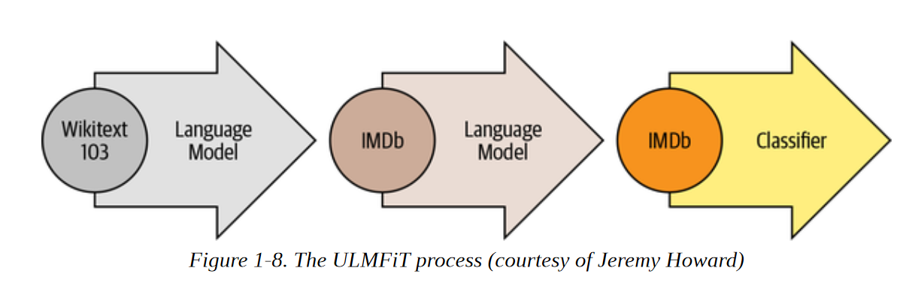

&emsp;&emsp;通过在NLP中引入一个可行的预训练和迁移学习框架，ULMFiT提供了使Transformers起飞的缺失部分。 2018年，有两款将自注意力与迁移学习相结合的Transformer模型被发布。


- GPT 
  只使用Transformer架构的解码器部分，以及与ULMFiT相同的语言建模方法。 GPT在BookCorpus上进行了预训练，它由7000本未出版的书籍组成，包括冒险、幻想和浪漫等各种类型。 
- BERT
     使用Transformer架构的编码器部分，以及一种特殊形式的语言建模，称为掩码式语言建模。 屏蔽语言建模的目的是预测文本中的随机屏蔽词。 例如，给定一个类似于 "我看了看我的[MASK]，发现[MASK]迟到了。"的句子，该模型需要预测最有可能成为由[MASK]表示的掩码词的候选人。 BERT在BookCorpus和英语维基百科上进行了预训练。


&emsp;&emsp;GPT和BERT为各种NLP基准设定了新的技术状态，并迎来了变压器的时代。

&emsp;&emsp;然而，由于不同的研究实验室以不兼容的框架（PyTorch或TensorFlow）发布他们的模型，NLP从业者要将这些模型移植到自己的应用程序中并不容易。 随着Transformers的发布，一个跨越50多个架构的统一的API被逐步建立起来。 本程序库催化了对Transformer研究的爆炸性增长，并迅速渗透到NLP的从业人员，使得今天很容易将这些模型整合到许多现实生活中的应用。 让我们看一看!


## Hugging Face Transformers: 搭起跨越的桥梁


&emsp;&emsp;&emsp;将一个新的机器学习架构应用于一个新的任务可能是一项复杂的工作，通常包括以下步骤：

1. 用代码实现模型架构，通常基于PyTorch或TensorFlow。
2. 从服务器上加载预训练的权重（如果有的话）。 
3. 对输入进行预处理，将其传递给模型，并应用一些特定任务的后处理。 
4. 实现数据加载器，并定义损失函数和优化器来训练模型。

&emsp;&emsp;这些步骤中的每一步都需要为每个模型和任务定制逻辑。 传统上（但并不总是如此！），当研究小组发表一篇新文章时，他们也会将代码与模型权重一起发布。 然而，这种代码很少是标准化的，往往需要数天的工程来适应新的用例。

&emsp;&emsp;这就是Hugging face Transformers 对NLP从业者的拯救之处! 它提供了一个标准化的接口，可以连接到广泛的Transformer模型以及代码和工具，以使这些模型适应新的用例。 该库目前支持三个主要的深度学习框架（PyTorch、TensorFlow和JAX），并允许你在它们之间轻松切换。 此外，它还提供了特定任务的类库 ，因此你可以轻松地在下游任务上微调转化器，如文本分类、命名实体识别和问题回答。 这将从业者训练和测试少量模型的时间从一个星期减少到一个下午！这也是一个很好的例子。

&emsp;&emsp;你将在下一节中看到这一点，在那里我们显示，只需几行代码，变形金刚就可以应用于解决一些你可能在野外遇到的最常见的NLP应用。

## Transformers 应用示例


&emsp;&emsp;每个NLP任务都是从一段文字开始的，比如下面这段关于某个在线订单的客户反馈，是捏造的。

```
text = """Dear Amazon, last week I ordered an Optimus Prime action figure from your online store in Germany. Unfortunately, when I opened the package, I discovered to my horror that I had been sent an action figure of Megatron instead! As a lifelong enemy of the Decepticons, I hope you can understand my dilemma. To resolve the issue, I demand an exchange of Megatron for the Optimus Prime figure I ordered. Enclosed are copies of my records concerning this purchase. I expect to hear from you soon. Sincerely, Bumblebee."""

```

&emsp;&emsp;根据你的应用，你所处理的文本可能是一份法律合同、一份产品描述，或者完全是其他东西。 在客户反馈的情况下，你可能想知道反馈是正面的还是负面的。这项任务被称为情感分析，是我们将在第二章探讨的更广泛的文本分类主题的一部分。 现在，让我们来看看使用Transforms从我们的文本中提取情感需要什么。

## 文本分类 
&emsp;&emsp;正如我们在后面的章节中所看到的，Transforms有一个分层的API，允许你在不同的抽象层次上与库交互。 在这一章中，我们将从管道开始，它抽象出将原始文本转换为一组来自微调模型的预测所需的所有步骤。

&emsp;&emsp;在Transformers中，我们通过调用pipeline()函数并提供我们感兴趣的任务的名称来实例化一个流水线。

```
from transformers import pipeline 
classifier = pipeline("text-classification")

```

&emsp;&emsp;你第一次运行这段代码时，你会看到一些进度条出现，因为流水线会自动从Hugging Face Hub下载模型权重。 当你第二次实例化管道时，本程序库会注意到你已经下载了权重，并将使用缓存的版本来代替。 默认情况下，文本分类流水线使用一个为情感分析设计的模型，但它也支持多类和多标签分类。

&emsp;&emsp;现在我们有了我们的流水线，让我们产生一些预测！ 每个流水线接受一串文本（或一串字符串）作为输入，并返回一个预测列表。 每个预测都是一个Python字典，所以我们可以用Pandas把它们很好地显示为一个DataFrame。

```
import pandas as pd 
outputs = classifier(text) 
pd.DataFrame(outputs)

```

|      | label    | score    |
| ---- | -------- | -------- |
| 0    | NEGATIVE | 0.901546 |

&emsp;&emsp;在这种情况下，该模型非常确信该文本具有负面情绪，考虑到我们正在处理一个愤怒的客户的投诉，这是有道理的。 请注意，对于情感分析任务，该管道只返回正面或负面标签中的一个，因为另一个可以通过计算1分推断出来。 

&emsp;&emsp;现在让我们来看看另一项常见的任务，即识别文本中的命名实体。

## 命名实体识别 （NER)

&emsp;&emsp;预测客户反馈的情绪是很好的第一步，但你经常想知道反馈是否是关于某个特定的项目或服务。 在NLP中，像产品、地点和人这样的真实世界的对象被称为命名实体，从文本中提取它们被称为命名实体识别（NER）。 我们可以通过加载相应的流水线并将我们的客户评论输入其中来应用NER。

```
ner_tagger = pipeline("ner", aggregation_strategy="simple")
outputs = ner_tagger(text) 
pd.DataFrame(outputs)

```

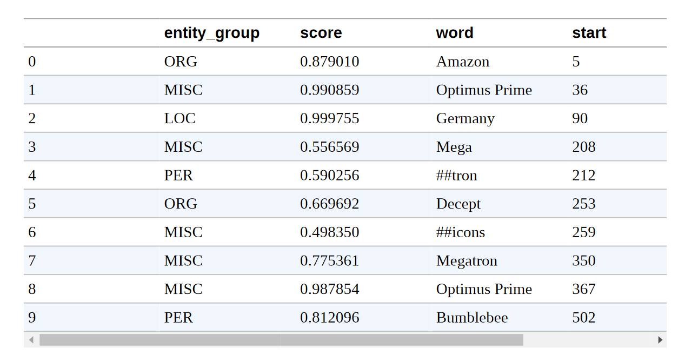

&emsp;&emsp;你可以看到，管道检测到了所有的实体，还为每个实体分配了一个类别，如ORG（组织）、LOC（地点）或PER（人）。 在这里，我们使用了aggregation_strategy参数，根据模型的预测对单词进行分组。 例如，实体 "擎天柱 "是由两个词组成的，但被分配到一个单一的类别。 MISC（杂项）。 分数告诉我们该模型对它所识别的实体有多大的信心。 我们可以看到，它对 "霸天虎 "和第一次出现的 "威震天 "最没有信心，这两个东西它都没能作为一个单一的实体进行分组。


**注意：**

看到前面表格中单词栏里那些奇怪的哈希符号（#）了吗？ 这些都是由模型的标记器产生的，标记器将单词分割成称为标记的原子单元。 你将在第二章中了解所有关于标记化的知识。


&emsp;&emsp;提取文本中的所有命名实体是很好的，但有时我们希望提出更有针对性的问题。 这就是我们可以使用问题回答的地方。

## 问答系统

&emsp;&emsp;在问题回答中，我们向模型提供一段称为上下文的文字，以及一个我们想提取答案的问题。 然后该模型返回与答案相对应的文本跨度。 让我们看看当我们问一个关于客户反馈的具体问题时，我们会得到什么。

```
reader = pipeline("question-answering") 
question = "What does the customer want?" 
outputs = reader(question=question, context=text) 
pd.DataFrame([outputs])

```

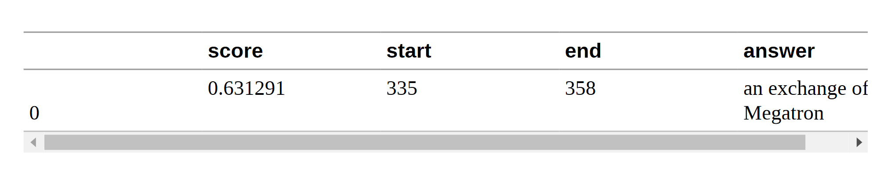

&emsp;&emsp;我们可以看到，与答案一起，管道还返回了起点和终点的整数，这些整数对应于找到答案跨度的字符索引（就像NER标签一样）。 有几种类型的问题回答，我们将在第7章中进行研究，上面所示的这种特殊的问题回答被称为提取式问题回答，因为答案是直接从文本中提取的。

&emsp;&emsp;通过这种方法，你可以从客户的反馈中快速阅读和提取相关信息。 但是，如果你收到堆积如山的冗长投诉，而你又没有时间全部阅读，怎么办？ 让我们看看归纳模型是否能提供帮助!


## 摘要

&emsp;&emsp;文本总结的目标是将一个长文本作为输入，并生成一个包含所有相关事实的简短版本。 这是一项比以前复杂得多的任务，因为它要求模型产生连贯的文本。 在现在应该是一个熟悉的模式中，我们可以将一个总结管道实例化如下：

```
summarizer = pipeline("summarization") 
outputs = summarizer(text, max_length=45, clean_up_tokenization_spaces=True) 
print(outputs[0]['summary_text'])

Bumblebee ordered an Optimus Prime action figure from your online store in Germany. Unfortunately, when I opened the package, I discovered to my horror that I had been sent an action figure of Megatron instead.

```

&emsp;&emsp;这个摘要还不算太糟! 虽然原文的部分内容被复制了，但该模型能够抓住问题的本质，并正确识别出 "大黄蜂"（出现在最后）是投诉的作者。 在这个例子中，你还可以看到，我们向流水线传递了一些关键字参数，如max_length和clean_up_tokenization_spaces。 这些允许我们在运行时对输出进行调整。

&emsp;&emsp;但是，当你得到的反馈是用你不懂的语言描述的时，会发生什么？ 你可以使用谷歌翻译，或者你可以使用你自己的Transformers为你翻译!

## 机器翻译

&emsp;&emsp;与摘要一样，翻译是一项任务，其输出包括生成的文本。 让我们使用一个翻译流水线，将一个英文文本翻译成德文。

```
translator = pipeline("translation_en_to_de", model="Helsinki-NLP/opus-mt-en-de") 
outputs = translator(text, clean_up_tokenization_spaces=True, min_length=100) 
print(outputs[0]['translation_text']) 


Sehr geehrter Amazon, letzte Woche habe ich eine Optimus Prime Action Figur aus Ihrem Online-Shop in Deutschland bestellt. Leider, als ich das Paket öffnete, entdeckte ich zu meinem Entsetzen, dass ich stattdessen eine Action Figur vo
Megatron geschickt worden war! Als lebenslanger Feind der Decepticons, Ich hoffe, Sie können mein Dilemma verstehen. Um das Problem zu lösen, Ich fordere einen Austausch von Megatron für die Optimus Prime Figur habe ich bestellt. Anbei sind Kopien meiner Aufzeichnungen über diesen Kauf. Ich erwarte, bald von Ihnen zu hören. Aufrichtig, Bumblebee.
```

&emsp;&emsp;同样，该模型产生了一个非常好的翻译，正确地使用了德语的正式代词，如 "Ihrem "和 "Sie"。 这里我们还展示了你如何覆盖流水线中的默认模型，为你的应用选择最好的模型--你可以在Hugging Face Hub上找到成千上万种语言对的模型。 在我们退一步看整个 Hugging face 生态系统之前，让我们检查一下最后一个应用。

## 文本生成

&emsp;&emsp;比方说，你希望能够通过访问自动完成功能对客户的反馈提供更快的回复。 有了文本生成模型，你可以按以下方式进行：

```
generator = pipeline("text-generation") 
response = "Dear Bumblebee, I am sorry to hear that your order was mixed up." 
prompt = text + "\n\nCustomer service response:\n" + response
outputs = generator(prompt, max_length=200) 
print(outputs[0]['generated_text'])


Dear Amazon, last week I ordered an Optimus Prime action figure from your online store in Germany. Unfortunately, when I opened the package, I discovered to my horror that I had been sent an action figure of Megatron instead! As a lifelong enemy of the Decepticons, I hope you can understand my dilemma. To resolve the issue, I demand an exchange of Megatron for the Optimus Prime figure I ordered. Enclosed are copies of my records concerning this purchase. I expect to hear from you soon. Sincerely, Bumblebee. Customer service response: Dear Bumblebee, I am sorry to hear that your order was mixed up. The order was completely mislabeled, which is very common in our online store, but I can appreciate it because it was my understanding from this site and our customer service of the previous day that your order was not made correct in our mind
and that we are in a process of resolving this matter. We can assure you that your order

```

&emsp;&emsp;好吧，也许我们不会想用这种完成方式来安抚大黄蜂，但你会明白大概的意思。

&emsp;&emsp;现在你已经看到了Transformers模型的一些很酷的应用，你可能想知道训练在哪里发生。 我们在本章中使用的所有模型都是公开可用的，并且已经为手头的任务进行了微调。 然而，一般来说，你会想在自己的数据上对模型进行微调，在下面的章节中，你将学习如何做到这一点。

&emsp;&emsp;但是，训练一个模型只是任何NLP项目的一小部分--能够有效地处理数据，与同事分享结果，并使你的工作可重复，也是关键的组成部分。 幸运的是，Transformers被一个大的有用工具的生态系统所包围，支持现代机器学习工作流程的大部分。 让我们来看看。


## Hugging face 软件生态

&emsp;&emsp;从 Hugging face Transformers开始，已经迅速发展成为一个由许多库和工具组成的整个生态系统，以加速你的NLP和机器学习项目。 Hugging face的生态系统主要由两部分组成。 如图1-9所示，一个程序库家族和Hub(模型仓库）。 程序库提供代码，而Hub提供预训练的模型权重、数据集、评估指标的脚本等。 在这一节中，我们将简要地看一下各种组件。 我们将跳过Transformers，因为我们已经讨论过了，而且在整个书的过程中我们将看到更多的内容。


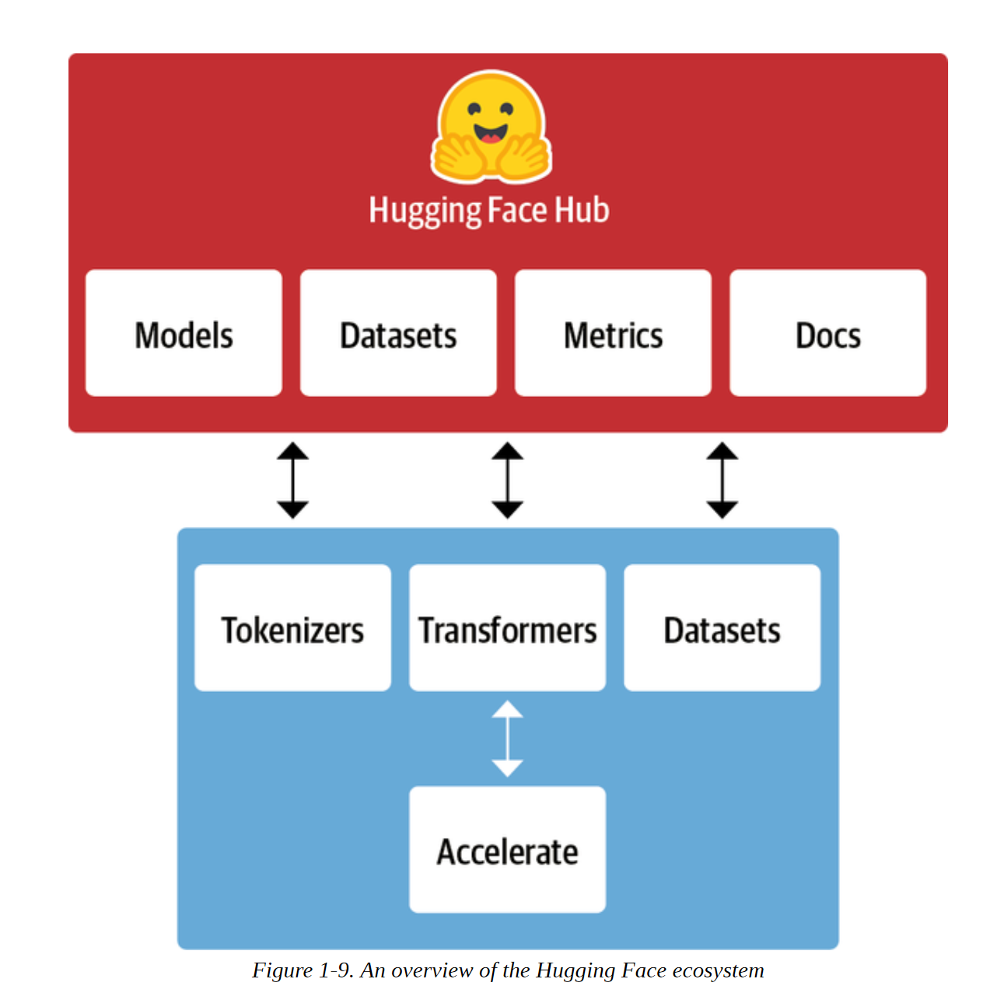


## Hugging face 模型仓库（Hub)

&emsp;&emsp;如前所述，迁移学习是推动Transformers成功的关键因素之一，因为它使重用预先训练好的模型来完成新任务成为可能。 因此，能够快速加载预训练的模型并使用它们进行实验是至关重要的。 

&emsp;&emsp;Hugging Face Hub承载了超过20,000个免费提供的模型。 如图1-10所示，有针对任务、框架、数据集的过滤器。
更多旨在帮助你浏览中心并迅速找到有前途的候选人。 正如我们在管道中看到的那样，在你的代码中加载一个有前途的模型，实际上只需要一行代码就可以了。 这使得实验广泛的模型变得简单，并允许你专注于你的项目的特定领域部分。

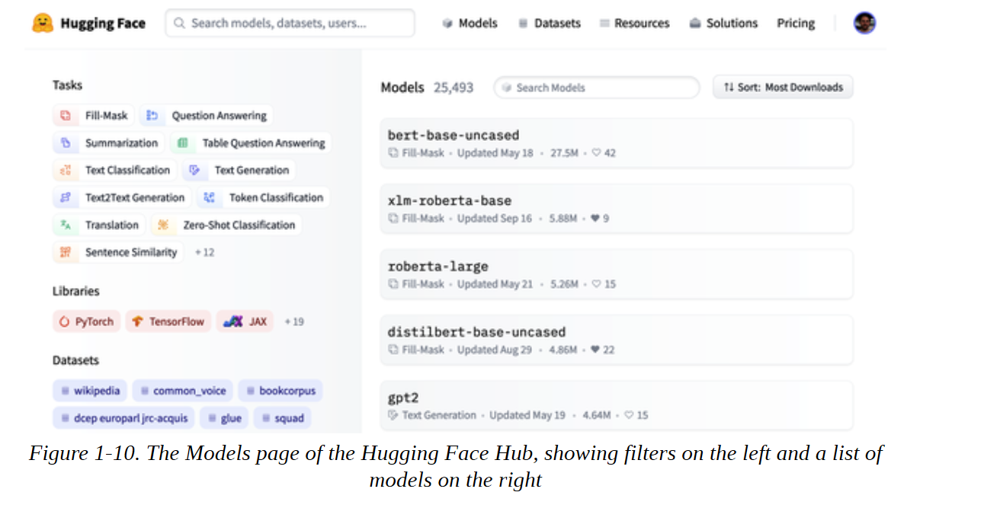

&emsp;&emsp;除了模型权重，模型仓库还托管了数据集和计算指标的脚本，让你重现已发布的结果或为你的应用利用额外的数据。 

&emsp;&emsp;模型仓库还提供了模型和数据集卡片，以记录模型和数据集的内容，并帮助你做出明智的决定，确定它们是否适合你。 Hub最酷的特点之一是，你可以直接通过各种特定任务的交互式部件尝试任何模型，如图1-11所示。

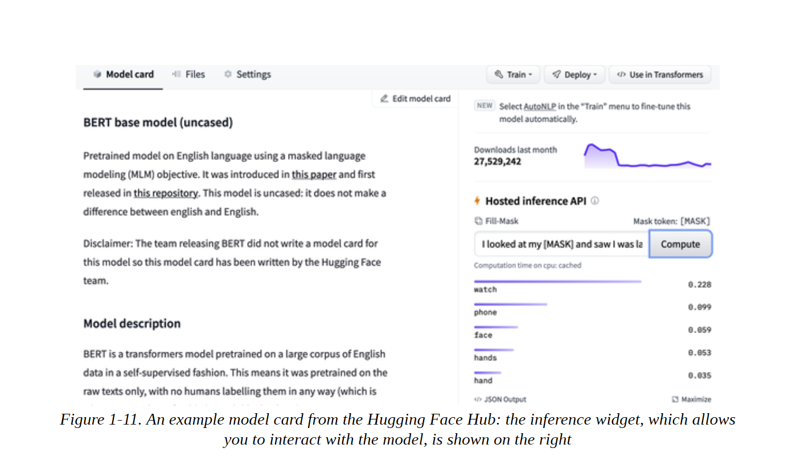

让我们继续我们的Tokenizers之旅。

**注意**

PyTorch和TensorFlow也提供了自己的模型仓库，如果某个特定的模型或数据集在Hugging Face模型仓库中没有提供，也值得去他们自己的模型仓库留意下。


## Hugging Face Tokenizers （标记化器，分词器）

&emsp;&emsp;在本章中我们所看到的每个流水线实例的背后都有一个标记化步骤，它将原始文本分割成更小的片段，称为标记。 我们将在第2章中看到这个工作的细节，但现在只需了解标记可以是单词、单词的一部分，或者只是像标点符号这样的字符。 Transformers模型是在这些标记的数字表示上进行训练的，因此做好这一步对整个NLP项目相当重要。

&emsp;&emsp;Tokenizers提供了许多标记化策略，并且由于其Rust后端（由Rust开发的，完全编译，类似c/cpp语言编写的模块），在标记化文本方面非常快。 它还负责所有的预处理和后处理步骤，如对输入进行归一化处理和将模型的输出转化为所需的格式。 有了标记化器，我们可以用Transformers加载预训练模型权重的方式来加载标记化器。

&emsp;我们需要一个数据集和指标来训练和评估模型，所以让我们看看负责这方面的Hugging face数据集。


## Hugging Face 数据集

&emsp;&emsp;加载、处理和存储数据集可能是一个繁琐的过程，特别是当数据集变得太大，无法装入你的笔记本电脑的RAM时。 此外，你通常需要实现各种脚本来下载数据并将其转化为标准格式。

&emsp;&emsp;Hugging face 数据集简化了这一过程，它提供了一个标准的接口，可以在Hub上找到成千上万的数据集。 它还提供了智能缓存（因此你不必在每次运行代码时重新进行预处理），并通过利用一种称为内存映射的特殊机制来避免RAM的限制，该机制将文件的内容存储在虚拟内存中，使多个进程能够更有效地修改一个文件。 该库还可以与流行的框架如Pandas和NumPy进行互操作，所以你不必离开你最喜欢的数据处理工具的舒适性。

&emsp;&emsp;然而，如果你不能可靠地测量性能，拥有一个好的数据集和强大的模型是没有价值的。 不幸的是，经典的NLP指标有许多不同的实现方式，这些实现方式可能略有不同，导致欺骗性的结果。 通过提供许多指标的脚本，Datasets有助于使实验更具可重复性，结果更值得信赖。

&emsp;&emsp;有了Transformers、Tokenizers和Datasets库，我们就有了训练我们自己的Transformer模型所需的一切。 然而，正如我们将在第10章看到的那样，在有些情况下，我们需要对训练循环进行精细的控制。 这就是生态系统的最后一个程序库发挥作用的地方：Accelerate （加速模块）

## Hugging Face Accelerate （加速器）

&emsp;&emsp;如果你曾经不得不在PyTorch中编写自己的训练脚本，那么当你试图将在你的笔记本电脑上运行的代码移植到你的组织的集群上运行的代码时，你有可能会感到一些头痛。 加速器为你的正常训练循环增加了一个抽象层，负责处理训练基础设施所需的所有定制逻辑。 这实际上是通过在必要时简化基础设施的改变来加速你的工作流程。

&emsp;&emsp;这总结了 "Hugging face "开源生态系统的核心组成部分。 但在结束本章之前，让我们看一下在现实世界中尝试部署Transformers模型时遇到的一些常见挑战。


## 使用Transformers的主要挑战


- 语言

  ​	   英文是NLP研究的主要目标语言，也存在几个其它语言的模型，但是很难找到针对小语种或低资源语种的预训练模型。在第4章中，我们将探讨多语言Transformers及其执行零样本跨语言迁移的能力。

- 数据可获取能力

  ​	    尽管我们可以使用迁移学习来大幅减少模型所需的标注训练数据量，但与人类执行任务所需的数据量相比，这仍然是一个很大的差距。第9章的主题是解决几乎没有标注数据的情况。

  

- 长文本问题

  ​      自注意力模型在段落较长的文本中效果非常好，但当我们转向较长的文本（如整个文档）时，它会变得非常昂贵。第11章讨论了缓解这种情况的方法。

- 不可解释性

  ​       与其他深度学习模式一样，Transformers在很大程度上是不透明的。很难或不可能解释一个模型做出某种预测的“原因”。当部署这些模型来做出关键决策时，这是一个特别困难的挑战。在第2章和第4章中，我们将探索一些探索Transformers模型错误的方法。

- 偏见

​				Transformers模型主要是在互联网的文本数据上进行预训练。 这就把数据中存在的所有偏见都包括进了模型中。 确保这些模型既不是种族主义者、性别歧视者，也不是更糟糕的人，是一项具有挑战性的任务。 我们在第10章中更详细地讨论其中的一些问题。


&emsp;&emsp;虽然令人生畏，但是可以克服许多这些挑战。除了提到的特定章节中，我们将在未来的每一章中触及这些主题。

## 小结

&emsp;&emsp;希望到现在为止，你已经很想知道如何开始训练并将这些多功能模型整合到你自己的应用中去了。在本章中你已经看到，只需几行代码，你就可以将最先进的模型用于分类、命名实体识别、问题回答、翻译和总结，但这实际上只是 "冰山一角"。在下面的章节中，你将学习如何使Transformers适应广泛的使用情况，如建立一个文本分类器，或一个用于生产的轻量级模型，甚至从头开始训练一个语言模型。 我们将采取亲身实践的方法，这意味着所涉及的每个概念都会有相应的代码，你可以在谷歌Colab或你自己的GPU机器上运行。

&emsp;&emsp;现在我们已经掌握了Transformers背后的基本概念，现在是时候动手做我们的第一个应用了，文本分类。 这就是下一章的主题!
