#  第11章  未来发展方向

在本书中，我们已经探讨了Transformers在广泛的NLP任务中的强大功能。在这最后一章中，我们将转换视角，看看这些模型目前面临的一些挑战以及试图克服这些挑战的研究趋势。在第一部分中，我们探讨了在模型和语料库规模方面扩大Transformers的主题。然后，我们将注意力转向已经提出的各种技术，以使自注意力机制更加有效。最后，我们探讨了新兴的、令人振奋的多模态Transformers领域，它可以为文本、图像和音频等多个领域的输入建模。

## 可伸缩 Tranformers

2019年，研究员理查德-萨顿写了一篇题为 "苦涩的教训 "的挑衅性文章，他认为。

*从70年的人工智能研究中可以读出的最大教训是，利用计算的一般方法最终是最有效的，而且幅度很大....。为了寻求在短期内有所作为的改进，研究人员寻求利用人类对该领域的知识，但从长远来看，唯一重要的是对计算的利用。这两者并不需要相互抵触，但在实践中它们往往....。而人类知识的方法往往会使方法复杂化，使其不太适合利用利用计算的一般方法。*

这篇文章提供了几个历史上的例子，比如下象棋或围棋，在人工智能系统中编码人类知识的方法最终被增加的计算量所超越。萨顿称这是人工智能研究领域的 "惨痛教训"。

*我们必须吸取痛苦的教训，即建立在我们认为的思维方式上，从长远来看是行不通的....。从这个痛苦的教训中应该学到的一点是通用方法的巨大威力，这些方法随着计算量的增加而继续扩展，即使可用计算量变得非常大。两种似乎能以这种方式任意扩展的方法是搜索和学习。*

现在有迹象表明，Transformers也有类似的教训；虽然许多早期的BERT和GPT的后代专注于调整架构或预训练目标，但2021年中期表现最好的模型，如GPT-3，基本上是原始模型的基本放大版本，没有许多架构的修改。在图11-1中，你可以看到自2017年原始Transformer架构发布以来最大模型的发展时间表，这表明模型规模在短短几年内增加了四个以上的数量级!


这种急剧增长的动机是经验性的证据，即大型语言模型在下游任务中表现更好，并且在100到1000亿个参数的范围内出现了有趣的能力，如零样本学习和少样本学习。然而，参数的数量并不是影响模型性能的唯一因素；计算量和训练数据也必须同步扩展以训练这些怪物。鉴鉴于像GPT-3这样的大型语言模型估计要花费460万美元来训练。因此，能够提前估计模型的性能显然是可取的。有点令人惊讶的是，语言模型的性能似乎与模型的大小和其他因素服从一种幂律关系，这种关系被编入一组缩放规律中。让我们来看看这个令人兴奋的研究领域。

**缩放法则** 
缩放法则允许人们通过研究语言模型在不同的计算预算C、数据集大小D和模型大小N下的行为来经验性地量化 "越大越好 "的范式。对于像GPT系列中的自回归模型，产生的损失曲线如图11-2所示，其中每条蓝色曲线代表一个模型的训练运行。

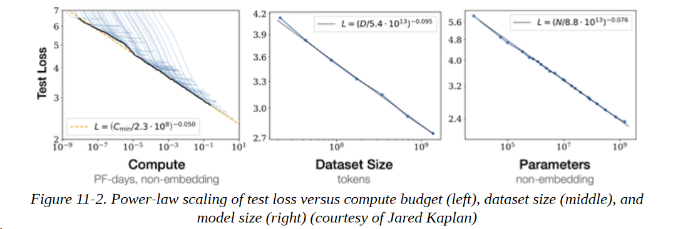

从这些损失曲线中，我们可以得出一些结论。

**性能和规模的关系** 

尽管许多NLP研究人员专注于架构调整或超参数优化（如调整层数或注意力头数），以提高在一组固定数据集上的性能，但缩放规律的含义是，通往更好的模型的更有成效的路径是专注于同步增加N、C和D。

**平滑幂律**

测试损耗L与N、C和D中的每一个都有几个数量级的幂律关系（幂律关系在对数尺度上是线性的）。对于X = N、C、D，我们可以将这些幂律关系表示为L (X) ∼ 1/Xα，其中α是一个缩放指数，由图11-2所示的损耗曲线的拟合决定。αX的典型值在0.05-0.095之间，这些幂律的一个吸引人的特点是，损失曲线的早期部分可以被推断出，以预测如果训练的时间更长，大概会有什么损失。

**采样效率**
大型模型能够在较少的训练步数下达到与小型模型相同的性能。这可以通过比较损失曲线在一定数量的训练步骤中达到平稳的区域而看出，这表明与简单地扩大模型的规模相比，人们得到的性能回报越来越少。

有点令人惊讶的是，人们还观察到其他模式的缩放规律，如图像、视频和数学问题的解决，如图11-3所示。

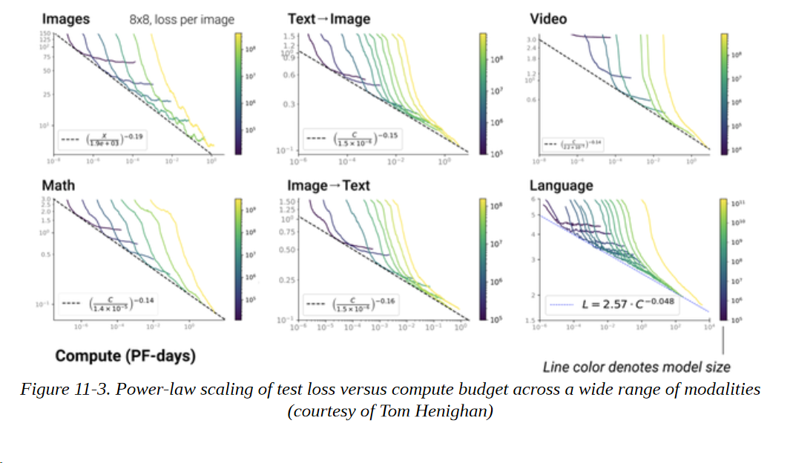

幂律缩放是否是Transformers语言模型的普遍属性，目前尚不清楚。就目前而言，我们可以将缩放规律作为一种工具来推断大型、昂贵的模型，而不必明确地训练它们。然而，缩放并不像它听起来那么容易。现在让我们来看看在描绘这一前沿领域时出现的几个挑战。

### 扩展的挑战 

虽然扩大规模在理论上听起来很简单（"只要增加更多的层！"），但在实践中却有很多困难。以下是你在扩展语言模型时可能遇到的几个最大的挑战。

**基础设施** 

配置和管理可能跨越数百或数千个节点的基础设施，并配备同样多的GPU，这不是为胆小的人准备的。所需数量的节点是否可用？节点之间的通信是一个瓶颈吗？解决这些问题需要一个与大多数数据科学团队非常不同的技能组合，通常需要熟悉运行大规模、分布式实验的专业工程师。

**成本** 

大多数ML从业者都经历过这样的感觉：在半夜里被冷汗惊醒，想起他们忘了关闭云端上的那台漂亮的GPU。这种感觉在运行大规模实验时更加强烈，而大多数公司无法负担以最大规模训练模型所需的团队和资源。训练一个GPT-3规模的模型可能需要花费几百万美元，这可不是很多公司的零花钱。

**数据集整理**

一个模型的好坏只取决于它所训练的数据。训练大型模型需要大型、高质量的数据集。当使用数千字节的 文本数据时，确保数据集包含高质量的文本变得更加困难，甚至预处理也变得具有挑战性。此外，人们需要确保有办法控制偏见，如性别歧视和种族主义，这些语言模型在大规模的网络文本语料库上训练时可能获得偏见。另一类考虑是围绕着训练数据的许可问题和可能嵌入大型文本数据集的个人信息。

**模型评估** 

一旦模型训练完成，挑战并没有停止。在下游任务上评估模型又需要时间和资源。此外，你要探测模型是否有偏差和有毒的生成，即使你确信你创建了一个干净的数据集。这些步骤需要时间，并且需要彻底进行，以尽量减少以后的不利影响的风险。
**部署** 

最后，为大型语言模型提供服务也是一个重大挑战。在第八章中，我们看了一些方法，如蒸馏、修剪和量化，以帮助解决这些问题。然而，如果你开始时的模型大小为几百GB，这可能是不够的。托管服务，如OpenAI API或Hugging Face的加速推理API，旨在帮助那些不能或不想处理这些部署挑战的公司。

这绝不是一个详尽的清单，但它应该让你了解到在将语言模型扩展到更大的规模时需要考虑的各种因素和挑战。虽然这些努力大多集中在一些拥有资源和技术的机构，以推动其发展，但目前有两个由社区主导的项目，旨在生产和探测开放的大型语言模型：

**BigScience**

这是一个为期一年的研究研讨会，从2021年到2022年，主要研究大型语言模型。该研讨会旨在促进围绕这些模型的研究问题（能力、局限性、潜在的改进、偏见、伦理、环境影响、在一般人工智能/认知研究领域的作用）的讨论和反思，以及围绕为研究目的和在研究界之间创建和分享此类模型和数据集的挑战。合作任务包括创建、分享和评估一个大型多语言数据集和一个大型语言模型。为这些合作任务分配了异常庞大的计算预算（在几千个GPU上的几百万GPU小时）。如果成功的话，这个研讨会将在未来再次举行，重点是涉及更新的或不同的合作任务集。如果你想加入这项工作，你可以在项目的网站上找到更多信息。

**EleutherAI**

这是一个由志愿者研究人员、工程师和开发人员组成的分散的集体，专注于人工智能的调整、扩展和开源的人工智能研究。它的目标之一是训练和开源一个GPT-3大小的模型，该小组已经发布了一些令人印象深刻的模型，如GPT-Neo和GPT-J，这是一个60亿个参数的模型，目前是在零射性能方面表现最好的公开可用Transformers。你可以在EleutherAI的网站上找到更多信息。

现在我们已经探讨了如何在计算、模型大小和数据集大小之间扩展变换器，让我们来研究另一个活跃的研究领域：使自我关注更有效率。

### Attention 来了! 
我们在本书中看到，自注意力机制在Transformers的结构中起着核心作用；毕竟，Transformers的原始论文被称为 "Attention is all you need "! 然而，有一个与自注意力相关的关键挑战：由于权重是通过对序列中的所有标记进行配对比较而产生的，因此当试图处理长文档或将Transformers应用于语音处理或计算机视觉等领域时，这一层就成为了计算瓶颈。就时间和内存复杂度而言，Transformer架构的自注意力层的规模与O(n2)相似，其中n是序列的长度。

因此，最近关于Transformers的大部分研究都集中在使自注意力更有效率。这些研究方向大致集中在图11-4中。

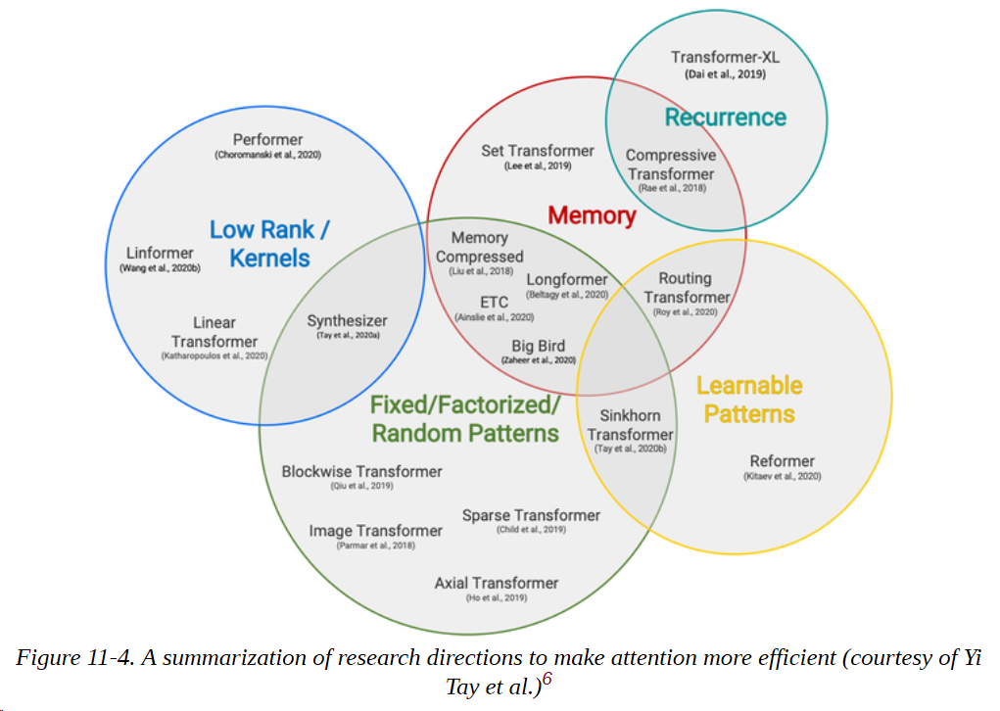

一个常见的模式是通过在注意力机制中引入稀疏性或对注意力矩阵应用内核来使注意力更有效率。让我们快速看一下一些最流行的使自注意力更有效的方法，从稀疏性开始。

### 稀疏注意力 
减少自注意力层中的计算数量的一个方法是简单地限制根据一些预定义模式产生的查询-键对的数量。文献中已经探讨了许多稀疏模式，但大多数都可以分解为图11-5中所示的少数 "原子 "模式。

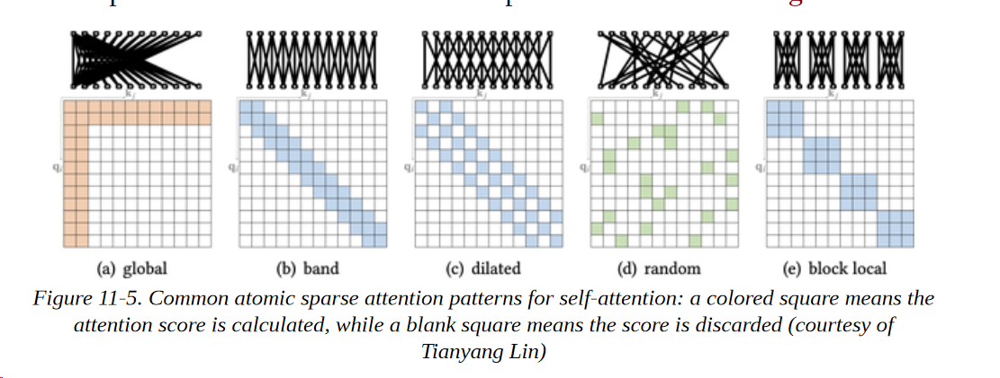

我们可以将这些模式描述如下：

**全局注意** 

在序列中定义几个特殊的标记，允许其关注所有其他的标记 

**带状注意** 

在一个对角线带上计算注意力 

**扩张性注意** 

通过使用一个有间隙的扩张窗口，跳过一些查询-键对。

**随机注意** 

对每个查询随机抽取几个键来计算注意力分数 

**块状局部注意**

将序列划分为若干块，并将注意力限制在这些块内

在实践中，大多数具有稀疏注意力的变换器模型使用图11-5中所示的原子稀疏模式的混合来生成最终的注意力矩阵。如图11-6所示，像Longformer这样的模型使用全局和带状注意力的混合，而BigBird则在混合中加入了随机注意力。在注意力矩阵中引入稀疏性使这些模型能够处理更长的序列；在Longformer和BigBird的情况下，最大的序列长度是4,096个标记，比BERT大8倍!

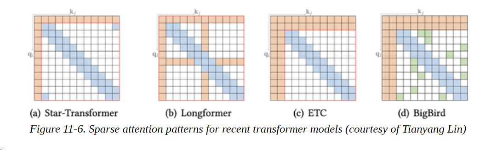

**注意事项**

也有可能以数据驱动的方式学习稀疏模式。这类方法的基本思路是将标记聚成块状。例如，Reformer使用哈希函数将相似的标记聚在一起。

现在我们已经看到了稀疏性如何降低自我关注的复杂性，让我们来看看另一种基于直接改变操作的流行方法。

### 线性化注意力

另一种使自注意力更有效的方法是改变计算注意分数时的操作顺序。回顾一下，为了计算查询和钥匙的自注意力分数，我们需要一个相似性函数，对于Transformers来说，它只是一个简单的点乘。然而，对于一般的相似性函数sim(qi, kj)，我们可以将注意力输出表达为以下公式：

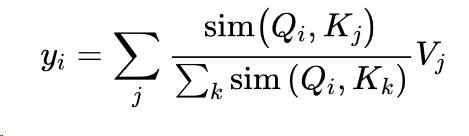

线性化注意力机制背后的诀窍是将相似性函数表达为一个内核函数，将操作分解为两部分：

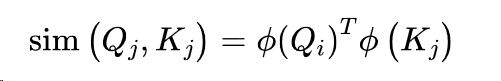

其中φ通常是一个高维的特征图。由于φ(Qi)与j和k无关，我们可以把它拉到和下，把注意力输出写成如下：

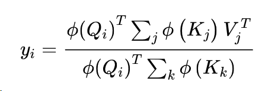

通过首先计算∑j φ (Kj) V T j和∑k φ (Kk)，我们可以有效地将自注意力的空间和时间复杂性线性化! 图11-7说明了这两种方法的比较。实现线性化自我关注的流行模型包括线性Transformer和Performer。

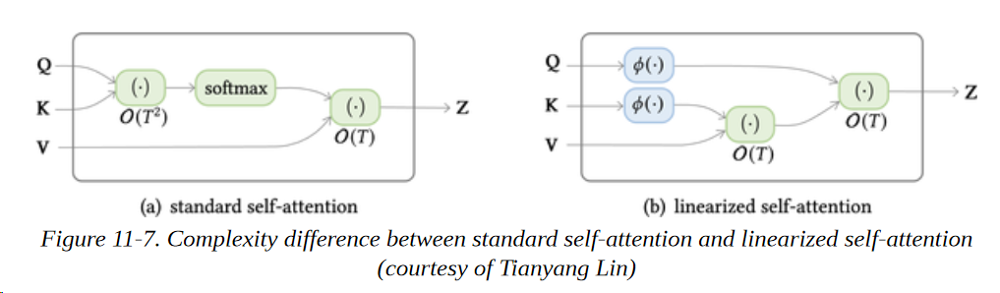

在这一节中，我们看到了Transformer架构如何在一般情况下，特别是在注意力方面，可以扩大规模以达到更好的性能 在一系列广泛的任务上。在下一节中，我们将看看Transformers是如何从NLP中分支到其他领域的，如音频和计算机视觉。

## 超越文本

使用文本来训练语言模型一直是Transformers语言模型成功背后的驱动力，与转移学习相结合。一方面，文本很丰富，可以实现大型模型的自我监督训练。另一方面，分类和问题回答等文本任务很常见，为它们开发有效的策略使我们能够解决广泛的现实世界问题。
然而，这种方法也有局限性，包括：
**人类的报告偏差** 

文本中的事件频率可能不代表其真实频率。仅仅根据互联网上的文本进行训练的模型可能会对世界有一个非常扭曲的印象。

**常识** 

常识是人类推理的一个基本特点，但很少被写下来。因此，根据文本训练的语言模型可能知道许多关于世界的事实，但缺乏基本的常识性推理。

**事实** 

一个概率语言模型不能以可靠的方式存储事实，并可能产生与事实不符的文本。同样，这样的模型可以检测到命名的实体，但没有直接的方法来访问关于它们的信息。

**模态**

语言模型没有办法连接到可以解决前述问题的其他模式，如音频或视觉信号或表格数据。

因此，如果我们能够解决模式的限制，我们也可能解决其他的一些问题。最近，在将Transformers推向新的模式，甚至建立多模式模型方面，已经有了很多进展。在本节中，我们将强调其中的一些进展。


#### 视觉

自从卷积神经网络（CNN）掀起深度学习革命以来，视觉一直是卷积神经网络的大本营。最近，Transformers开始被应用于这一领域，并取得了与CNN相似或更好的效率。让我们看一下几个例子。

#### iGPT
 受GPT系列模型在文本方面的成功启发，iGPT（图像GPT的简称）将同样的方法应用于图像。通过将图像视为像素序列，iGPT使用GPT架构和自回归预训练目标来预测下一个像素值。对大型图像数据集的预训练使iGPT能够 "自动完成 "部分图像，如图11-8中所示。当分类头被添加到模型中时，它还能在分类任务上取得高性能的结果。

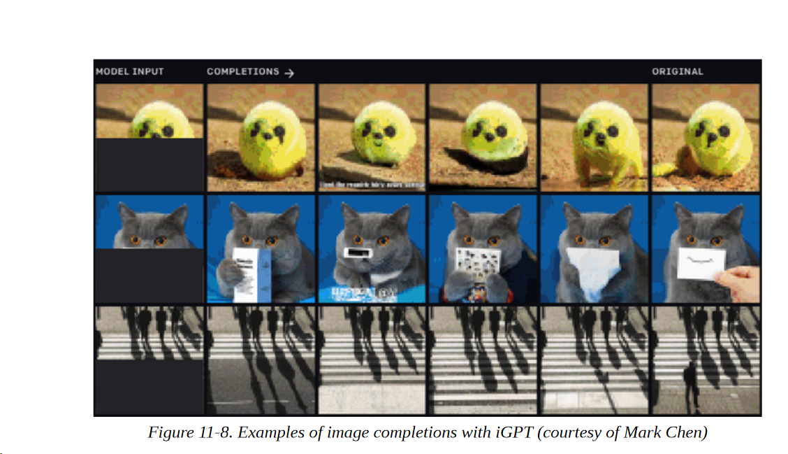

#### ViT
我们看到，iGPT严格遵循GPT风格的架构和预训练程序。视觉变换器（ViT）是一个BERT风格的视觉变换器，如图11-9所示。首先，图像被分割成较小的斑块，每个斑块都被嵌入一个线性投影。其结果非常类似于BERT中的标记嵌入，而且接下来的内容几乎是相同的。斑块嵌入与位置嵌入相结合，然后通过一个普通的变换器编码器输入。在预训练过程中，一些斑块被遮蔽或扭曲，目标是预测被遮蔽斑块的平均颜色。

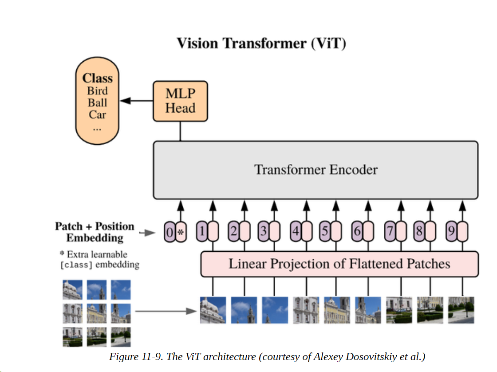

尽管这种方法在标准的ImageNet数据集上进行预训练时并没有产生更好的结果，但在更大的数据集上，它的扩展性明显优于CNNs。

ViT集成在Transformers中，使用它与我们在本书中使用的NLP管道非常相似。让我们从加载一只相当有名的狗的图像开始。

```
from PIL import Image import matplotlib.pyplot as plt 
image = Image.open("images/doge.jpg") 
plt.imshow(image) 
plt.axis("off") 
plt.show()

```


要加载一个ViT模型，我们只需要指定图像分类管道，然后输入图像来提取预测的类别:

```
import pandas as pd 
from transformers import pipeline 
image_classifier = pipeline("image-classification") 
preds = image_classifier(image) 
preds_df = pd.DataFrame(preds) 

preds_df

```

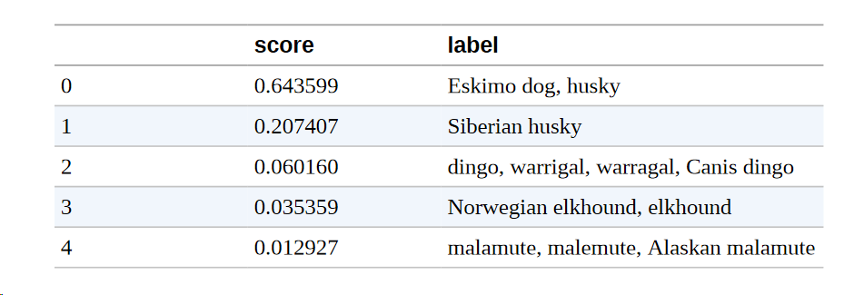

很好，预测的类别似乎与图像相匹配! 

图像模型的一个自然延伸就是视频模型。除了空间维度之外，视频还带有时间维度。这使得任务更具挑战性，因为数据量变得更大，人们需要处理额外的维度。像TimeSformer这样的模型引入了一个空间和时间注意力机制来考虑这两个问题。

在未来，这样的模型可以帮助建立用于广泛的任务的工具，如视频序列的分类或注释。

### 表格处理

很多数据，比如公司内部的客户数据，都是存储在结构化的数据库中，而不是原始文本。我们在第七章中看到，通过问题回答模型，我们可以用自然文本的问题来查询文本。如果我们也能像图11-10所示那样用表来做，那不是很好吗？

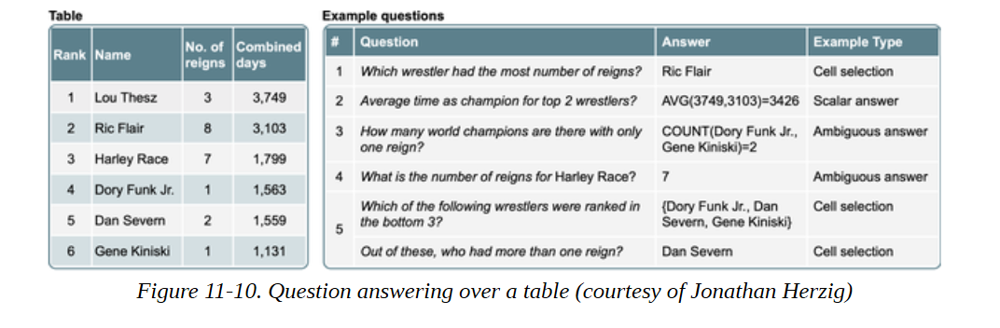

TAPAS（Table Parser的缩写）来拯救我们了 这个模型将Transformer架构应用于表，将表的信息与查询相结合，如图11-11所示。

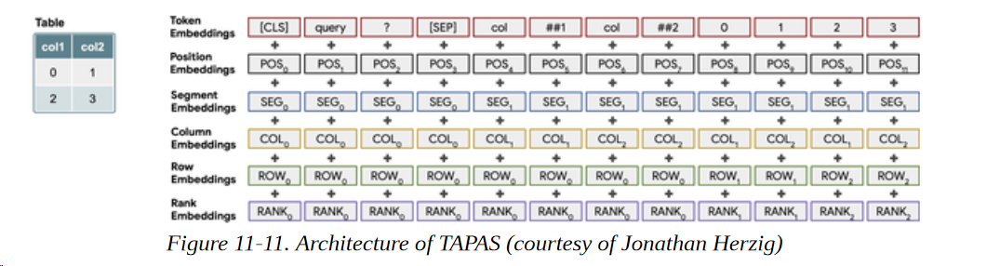

让我们来看看TAPAS在实践中是如何工作的一个例子。我们创建了一个本书目录的虚构版本。它包含章节编号、章节名称以及章节的起始页和结束页：

```
book_data = [ 
{"chapter": 0, "name": "Introduction", "start_page": 1, "end_page": 11}, 
{"chapter": 1, "name": "Text classification", "start_page": 12, "end_page": 48}, 
{"chapter": 2, "name": "Named Entity Recognition", "start_page": 49, "end_page": 73},
{"chapter": 3, "name": "Question Answering", "start_page": 74, "end_page": 120}, 
{"chapter": 4, "name": "Summarization", "start_page": 121, "end_page": 140}, 
{"chapter": 5, "name": "Conclusion", "start_page": 141, "end_page": 144} 
]

```

我们也可以用现有的字段轻松地添加每章的页数。为了与TAPAS模型很好地配合，我们需要确保所有列都是str类型：

```
table = pd.DataFrame(book_data) 
table['number_of_pages'] = table['end_page']-table['start_page'] 
table = table.astype(str) table

```

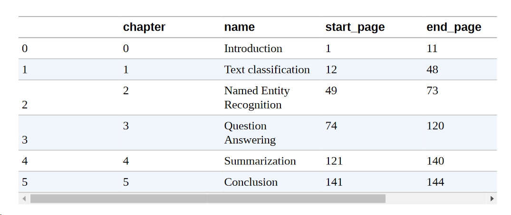

现在你应该知道这个程序了。我们首先加载表-问题回答管道。

```
table_qa = pipeline("table-question-answering")

```

然后通过一些查询来提取答案：

```
table_qa = pipeline("table-question-answering") 
queries = ["What's the topic in chapter 4?", "What is the total number of pages?", "On which page does the chapter about question-answering start?", "How many chapters have more than 20 pages?"] 
preds = table_qa(table, queries)

```

这些预测将表的操作类型与答案一起存储在一个聚合器字段中。让我们看看TAPAS在我们的问题上表现得如何：

```
for query, pred in zip(queries, preds): 
	print(query) 
	if pred["aggregator"] == "NONE": 
		print("Predicted answer: " + pred["answer"]) 
	else: 
		print("Predicted answer: " + pred["answer"]) 
	print('='*50)

```

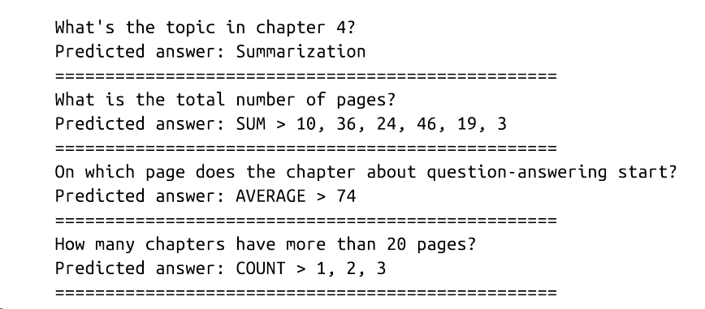

对于第一章，该模型正好预测了一个没有聚集的单元。如果我们看一下表格，就会发现答案其实是正确的。在下一个例子中，模型预测了所有包含页数的单元格，并结合了总和聚合，这又是计算总页数的正确方法。问题三的答案也是正确的；在这种情况下，平均聚合是没有必要的，但这并没有什么区别。最后，我们有一个问题，这个问题有点复杂。为了确定有多少章节有20页以上，我们首先需要找出哪些章节符合这一标准，然后对它们进行统计。看来TAPAS又一次做对了，正确地确定了第1、2、3章有20页以上的内容，并在单元格中加入了计数聚合器。

我们提出的这类问题也可以用几个简单的Pandas命令来解决；然而，用自然语言而不是Python代码来提问的能力，可以让更多的人查询数据来回答具体问题。想象一下，这样的工具掌握在商业分析师或经理的手中，他们能够验证自己对数据的假设!

## 多模 Transformers

到目前为止，我们已经研究了将Transformers扩展到单一的新模式。TAPAS可以说是多模态的，因为它结合了文本和表格，但表格也被当作文本来处理。在这一节中，我们考察了同时结合两种模式的Transformers：音频加文本和视觉加文本。

### 语音转文字

虽然能够使用文本与计算机对接是一个巨大的进步，但使用口语是我们更自然的沟通方式。你可以在工业领域看到这种趋势，Siri和Alexa等应用程序正在上升，并逐渐变得更加有用。另外，对于很大一部分人来说，写作和阅读比说话更有挑战性。因此，能够处理和理解音频不仅方便，而且可以帮助许多人获得更多信息。这个领域的一个常见任务是自动语音识别（ASR），它将口语转换为文本，并使Siri等语音技术能够回答诸如 "今天的天气如何？"这样的问题。wav2vec 2.0系列模型是自动语音识别领域的最新发展之一：它们使用Transformers层与CNN相结合，如图11-12所示。通过在预训练期间利用未标记的数据，这些模型只需几分钟的标记数据就能达到有竞争力的结果。


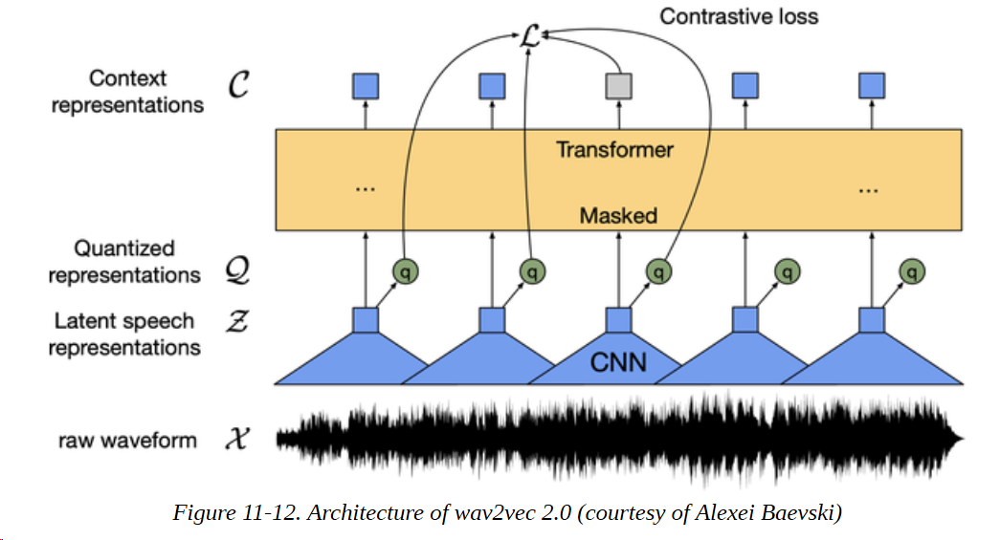

wav2vec 2.0模型集成在Transformers中，你不会惊讶地发现，加载和使用它们遵循我们在本书中看到的熟悉步骤。让我们加载一个经过预训练的模型，这个模型是在960小时的语音音频上训练的：

```
asr = pipeline("automatic-speech-recognition")

```

为了将这个模型应用于一些音频文件，我们将使用SUPERB数据集的ASR子集，这也是该模型预训练的数据集。由于该数据集相当大，我们将只加载一个例子用于我们的演示目的：

```
from datasets import load_dataset 
ds = load_dataset("superb", "asr", split="validation[:1]") 
print(ds[0]) 

{'chapter_id': 128104, 'speaker_id': 1272, 'file': '~/.cache/huggingf ace/datasets/downloads/extracted/e4e70a454363bec1c1a8ce336139866a39442114d86a4 3
6014acd4b1ed55e55/LibriSpeech/dev-clean/1272/128104/1272-128104-0000.flac', 'id': '1272-128104-0000', 'text': 'MISTER QUILTER IS THE APOSTLE OF THE MIDDLE CLASSES AND WE ARE GLAD TO WELCOME HIS GOSPEL'}

```

在这里我们可以看到，文件列中的音频是以FLAC编码格式存储的，而预期的转录则由文本列给出。为了将音频转换为浮点数组，我们可以使用SoundFile库，用map()读取我们数据集中的每个文件：

```
import soundfile as sf 
def map_to_array(batch): 
	speech, _ = sf.read(batch["file"]) 
	batch["speech"] = speech r
	eturn batch 
ds = ds.map(map_to_array)

```

如果你使用的是Jupyter笔记本，你可以用下面的IPython小工具轻松播放声音文件：

```
from IPython.display import Audio 
display(Audio(ds[0]['speech'], rate=16000))

```

最后，我们可以将输入传递给管道，并检查预测结果：

```
pred = asr(ds[0]["speech"]) 
print(pred) 

{'text': 'MISTER QUILTER IS THE APOSTLE OF THE MIDDLE CLASSES AND WE ARE GLAD TO WELCOME HIS GOSPEL'}

```

这个转录似乎是正确的。我们可以看到缺少一些标点符号，但这很难仅从音频中获得，可以在后期处理步骤中添加。只需几行代码，我们就可以为自己建立一个最先进的语音到文本的应用程序了。

为一种新的语言建立模型仍然需要最低数量的标记数据，而这些数据的获得是具有挑战性的，特别是对于低资源语言。在wav2vec 2.0发布后不久，一篇描述名为wav2vec-U的方法的论文被发表。在这项工作中，巧妙的聚类和GAN训练相结合，只用独立的未标记的语音和未标记的文本数据来建立一个语音到文本模型。这个过程在图11-13中得到了详细的可视化。完全不需要对齐的语音和文本数据，这就可以为更多的语言谱系训练高性能的语音到文本模型。

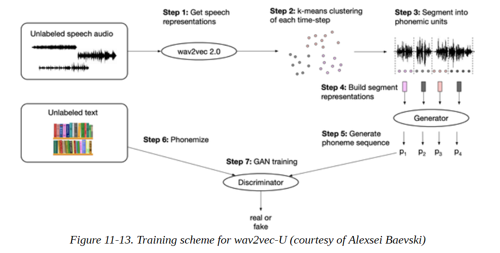

很好，所以Transformers现在可以 "读 "文本和 "听 "音频--它们也可以 "看 "吗？答案是肯定的，这也是目前该领域的热门研究前沿之一。

**视觉和文本** 

视觉和文本是另一对自然结合的模式，因为我们经常使用语言来交流和推理图像和视频的内容。除了视觉转换器之外，在结合视觉和文本信息方面也有一些发展。
 信息。在本节中，我们将看一下结合视觉和文本的模型的四个例子。VisualQA、LayoutLM、DALL-E和CLIP。

**VQA** 
在第七章中，我们探讨了如何使用Transformers模型来提取基于文本的问题的答案。这可以临时进行，以便从文本中提取信息，也可以离线进行，在这种情况下，问题回答模型被用来从一组文档中提取结构化信息。已经有一些努力将这种方法扩展到视觉领域，如图11-14所示的VQA等数据集。

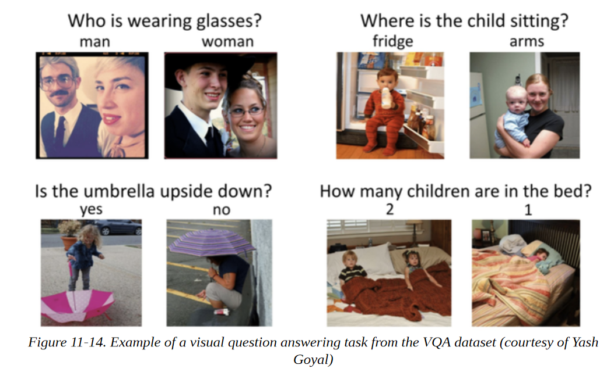

LXMERT和VisualBERT等模型使用ResNets等视觉模型从图片中提取特征，然后使用变换器编码器将其与自然问题相结合并预测答案。

**LayoutLM** 

分析收据、发票或报告等扫描的商业文件是另一个领域，提取视觉和布局信息可以成为识别感兴趣的文本字段的有用方法。在这里，LayoutLM系列的模型是目前最先进的。它们使用一个增强的Transformer结构，接收三种模式的输入：文本、图像和布局。因此，如图11-15所示，有与每个模态相关的嵌入层，一个空间感知的自我关注机制，以及一个混合的图像和文本/图像预训练目标，以对齐不同的模态。通过对数以百万计的扫描文件进行预训练，LayoutLM模型能够以类似于NLP的BERT的方式转移到各种下游任务中。


**DALL·E**

DALL-E是一个结合了视觉和文本的生成任务的模型。它使用GPT架构和自回归建模来从文本中生成图像。受iGPT的启发，它将文字和像素视为一个令牌序列，因此能够继续从文本提示中生成图像，如图11-16所示。

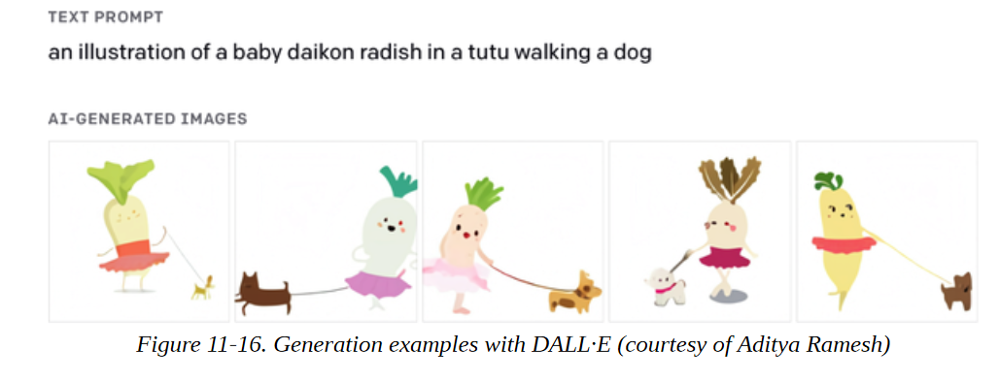

**CLIP**
最后，让我们来看看CLIP，它也结合了文本和视觉，但是是为监督任务设计的。它的创造者构建了一个有4亿个图像/标题对的数据集，并使用对比性学习来预训练模型。CLIP的架构包括一个文本和一个图像编码器（都是Transformers），创建了标题和图像的嵌入。一批带有标题的图像被取样，对比性目标是使相应的一对嵌入的相似性最大化（由点积衡量），同时使其余的相似性最小化，如图11-17所示。
 为了使用预训练的模型进行分类，可能的类被嵌入到文本编码器中，类似于我们使用零点拍摄管道的方式。然后将所有类别的嵌入与我们想要分类的图像嵌入进行比较，选择相似度最高的类别。

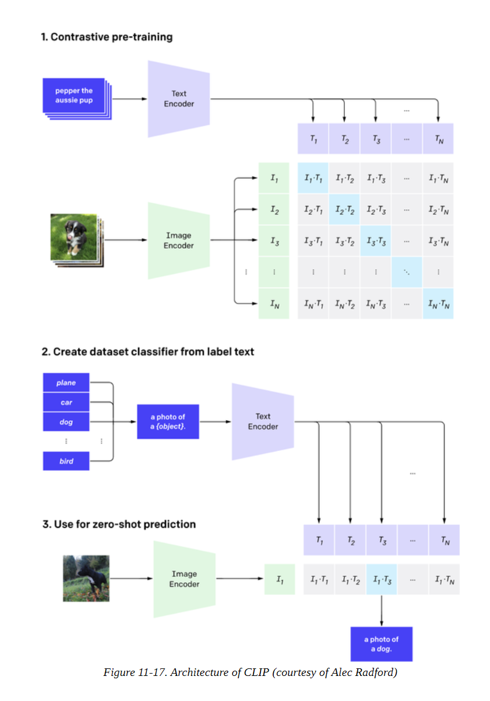

CLIP的零样本图像分类性能显著，与完全监督训练的视觉模型竞争，同时在新的类别方面更加灵活。CLIP也完全集成在Transformers中，所以我们可以试用它。对于图像到文本的任务，我们实例化了一个处理器，由一个特征提取器和一个标记器组成。特征提取器的作用是将图像转换成适合于模型的形式，而标记器负责将模型的预测解码成文本。

```
from transformers import CLIPProcessor, CLIPModel 
clip_ckpt = "openai/clip-vit-base-patch32" 
model = CLIPModel.from_pretrained(clip_ckpt) 
processor = CLIPProcessor.from_pretrained(clip_ckpt)

```

那么我们需要一个合适的图片来尝试。有什么会比擎天柱的照片更合适呢？

```
image = Image.open("images/optimusprime.jpg") 
plt.imshow(image) 
plt.axis("off") 
plt.show()

```

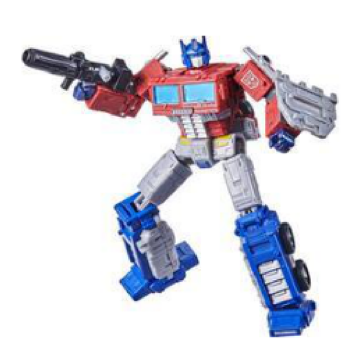

接下来，我们设置了文本，将图像与之进行比较，并通过模型进行传递：

```
import torch 
texts = ["a photo of a transformer", "a photo of a robot", "a photo of agi"] 
inputs = processor(text=texts, images=image, return_tensors="pt", padding=True) 
with torch.no_grad(): 
	outputs = model(**inputs) 
logits_per_image = outputs.logits_per_image 
probs = logits_per_image.softmax(dim=1) p
robs 

tensor([[0.9557, 0.0413, 0.0031]])

```

嗯，它几乎得到了正确的答案（当然是一张AGI的照片）。玩笑归玩笑，CLIP使图像分类非常灵活，它允许我们通过文本定义类，而不是在模型架构中硬编码类。这就结束了我们对多模态变换器模型的参观，但我们希望我们已经吊起了你的胃口。

## 接下来的旅程在何方？
好了，旅程结束了；感谢您加入我们的Transformers之旅！在本书中，我们探讨了Transformers如何解决广泛的任务，实现最先进的结果。在本书中，我们已经探讨了Transformers如何解决广泛的任务并实现最先进的结果。在这一章中，我们已经看到了当前一代模型是如何被扩展到极限的，以及它们是如何在新的领域和模式中分支的。
如果你想巩固你在本书中学到的概念和技能，这里有几个想法，你可以从这里开始。

**加入 Hugging Face 社区活动** 

Hugging Face举办短期冲刺活动，专注于改善生态系统中的库，这些活动是认识社区和体验开源软件开发的好方法。到目前为止，已经有了在Datasets中添加600多个数据集、在各种语言中微调300多个ASR模型，以及在JAX/Flax中实现数百个项目的冲刺活动。

**建立你自己的项目** 

测试你的机器学习知识的一个非常有效的方法是建立一个项目来解决你感兴趣的问题。你可以重新实现一篇Transformer论文，或者将Transformers应用于一个新的领域。

**贡献一个模型给Transformers** 

如果你正在寻找更高级的东西，那么为Transformers贡献一个新发表的架构是深入了解该库的核心内容的好方法。在Transformers文档中，有一个详细的指南来帮助你开始。

**将你所学的东西写成博客** 

把你学到的东西教给别人是对你自己知识的有力检验，从某种意义上说，这也是我们写这本书的动力之一! 有一些很好的工具可以帮助你开始写技术博客；我们推荐fastpages，因为你可以很容易地使用Jupyter笔记本来写一切。
