# 第2章  文本分类

&emsp;&emsp;文本分类是NLP中最常见的任务之一。 它可用于广泛的应用，如将客户反馈意见标记为类别，或根据其语言归类客户服务申请单。 你的电子邮件程序的垃圾邮件过滤器有可能正在使用文本分类来保护你的收件箱免受大量不需要的垃圾的侵扰。

&emsp;&emsp;另一种常见的文本分类是情感分析，（正如我们在第1章中所看到的），其目的是识别特定文本的倾向性。 例如，像特斯拉这样的公司可能会分析像图2-1中的Twitter帖子，以确定人们是否喜欢它的新车顶。


&emsp;&emsp;现在想象一下，你是一个数据科学家，需要建立一个系统，能够自动识别人们在Twitter上对你公司的产品所表达的情绪状态，如 "愤怒 "或 "喜悦"。 在这一章中，我们将使用BERT的一个变种DistilBERT来解决这一任务。 这种模式的主要优点是，它实现了与BERT相当的性能，同时明显更小、更有效率。 这使我们能够在几分钟内训练一个分类器，如果你想训练一个更大的BERT模型，你可以简单地改变预训练模型的检查点。 一个检查点对应于被加载到一个给定的变换器架构中的权重集。

&emsp;&emsp;这也将是我们第一次接触到 "拥抱 "生态系统中的三个核心库。 数据集、符号化器和变形器。 如图2-2所示，这些库将使我们能够快速地从原始文本到一个可用于推理新推文的微调模型。 因此，本着擎天柱的精神，让我们潜入其中，"变身，滚出去！"

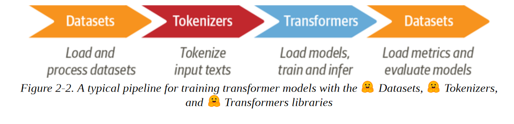

## 数据集

&emsp;&emsp;为了建立我们的情绪检测器，我们将使用一个伟大的数据集，该数据集来自一篇探讨英语Twitter消息中情绪如何表现的文章。 与大多数只涉及 "积极 "和 "消极 "两极的情感分析数据集不同，这个数据集包含六种基本情感。 愤怒、厌恶、恐惧、喜悦、悲伤和惊讶。 给定一条推文，我们的任务是训练一个可以将其归类为这些情绪之一的模型。

### 对Hugging face数据集的初步了解

&emsp;&emsp;我们将使用Datasets 类库从Hugging Face Hub下载数据。 我们可以使用list_datasets()函数来查看Hub上有哪些数据集可用。

```
from datasets import list_datasets 
all_datasets = list_datasets() 
print(f"There are {len(all_datasets)} datasets currently available on the Hub") 
print(f"The first 10 are: {all_datasets[:10]}") 

---------输出 -------------------
There are 1753 datasets currently available on the Hub The first 10 are: ['acronym_identification', 'ade_corpus_v2', 'adversarial_qa', 'aeslc', 'afrikaans_ner_corpus', 'ag_news', 'ai2_arc', 'air_dialogue', 'ajgt_twitter_ar', 'allegro_reviews']

```

&emsp;&emsp;我们看到每个数据集都有一个名字，所以让我们用load_dataset()函数加载情感数据集。

```
from datasets import load_dataset
emotions = load_dataset("emotion")

```

如果我们看一下我们的emotion对象的内部：

```
emotions 
DatasetDict(
{ 
train: Dataset({ features: ['text', 'label'], num_rows: 16000 }) 
validation: Dataset({ features: ['text', 'label'], num_rows: 2000 }) 
test: Dataset({ features: ['text', 'label'], num_rows: 2000 }) 
}
)

```

我们看到它类似于一个Python字典，每个键都对应于不同的分割。 我们可以使用通常的字典语法来访问一个单独的分割：

```
train_ds = emotions["train"]

train_ds 

Dataset({ features: ['text', 'label'], num_rows: 16000 })

```

返回一个Dataset类的实例。 数据集对象是数据集的核心数据结构之一，我们将在本书中探索其许多特性。 首先，它的行为就像一个普通的 Python 数组或列表，所以我们可以查询它的长度：

```
len(train_ds) 

16000

```

或通过其索引访问一个单一的例子：

```
train_ds[0] 

{'label': 0, 'text': 'i didnt feel humiliated'}

```


这里我们看到，单行被表示为一个字典，其中的键对应于列名：

```
train_ds.column_names

['text', 'label']

```


并且值是推文和情感类型。 这反映出Datasets是基于Apache Arrow的，它定义了一种类型化的列式格式，比本地Python更节省内存。 我们可以通过访问Dataset对象的特征属性来了解在引擎盖下使用了哪些数据类型：

```
print(train_ds.features)

{'text': Value(dtype='string', id=None), 'label': ClassLabel(num_classes=6, names=['sadness', 'joy', 'love', 'anger', 'fear', 'surprise'], names_file=None, id=None)}

```

在这种情况下，文本列的数据类型是字符串，而标签列是一个特殊的ClassLabel对象，包含了关于类名和它们与整数的映射信息。 我们也可以用一个切片来访问几条记录：

```
print(train_ds[:5])

{'text': ['i didnt feel humiliated', 'i can go from feeling so hopeless to so damned hopeful just from being around someone who cares and is awake', 'im grabbing a minute to post i feel greedy wrong', 'i am ever feeling nostalgic about the fireplace i will know that it is still on the property', 'i am feeling grouchy'], 'label': [0, 0, 3, 2, 3]}

```

注意，在这种情况下，字典中的值现在是一个List，而不是单个元素。 我们也可以通过名称来获得完整的列：

```
print(train_ds["text"][:5]) 

['i didnt feel humiliated', 'i can go from feeling so hopeless to so damned hopeful just from being around someone who cares and is awake', 'im grabbing a minute to post i feel greedy wrong', 'i am ever feeling nostalgic about the fireplace i will know that it is still on the property', 'i am feeling grouchy']

```

现在我们已经看到了如何用Datasets类加载和检查数据，让我们对推文的内容做一些检查：


### 如果我的数据集不在模型仓库中怎么办？

我们将使用Hugging Face Hub来下载本书中大多数例子的数据集。 但在许多情况下，你会发现自己的工作数据要么存储在你的笔记本电脑上，要么存储在你组织的远程服务器上。 数据集提供了几个加载脚本来处理本地和远程数据集。 最常见的数据格式的例子见表2-1：

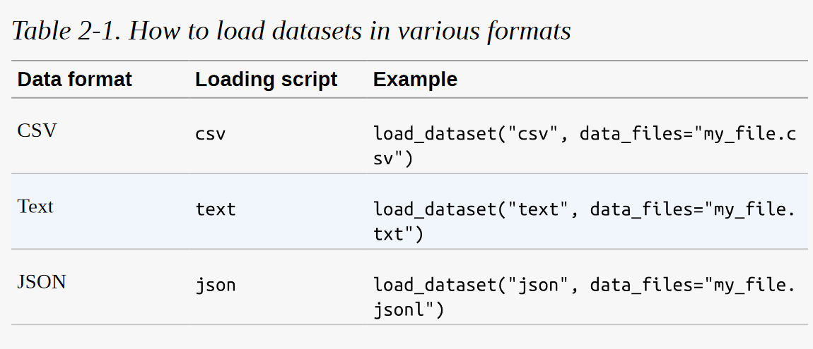

正如你所看到的，对于每一种数据格式，我们只需要将相关的加载脚本传递给load_dataset()函数，以及指定一个或多个文件的路径或URL的 data_files 参数。 例如，情感数据集的源文件实际上托管在Dropbox上，所以加载数据集的另一种方法是先下载其中一个分割文件。 

```
dataset_url = "https://www.dropbox.com/s/1pzkadrvffbqw6o/train.txt" 

!wget {dataset_url} 
```

如果你想知道为什么有一个! 在Shell命令的前面，那是因为我们正在Jupyter笔记本中运行这些命令。 如果你想在终端内下载和解压数据集，只需删除 ! 前缀。 现在，如果我们偷看一下train.txt文件的第一行:

```
!head -n 1 train.txt 

i didnt feel humiliated;sadness

```

我们可以看到，这里没有列标题，每条推文和情感都用分号分开。 尽管如此，这与CSV文件很相似，所以我们可以通过使用csv脚本并将data_files参数指向train.txt文件，在本地加载数据集: 

emotions_local = load_dataset("csv", data_files="train.txt", sep=";", names=["text", "label"]) 

这里我们还指定了分隔符的类型和列的名称。 一个更简单的方法是直接将data_files参数指向URL本身:

 dataset_url = "https://www.dropbox.com/s/1pzkadrvffbqw6o/train.txt?dl=1" 

emotions_remote = load_dataset("csv", data_files=dataset_url, sep=";", names=["text", "label"]) 

这将为你自动下载和缓存数据集。 正如你所看到的，load_dataset()函数是非常通用的。 我们建议查看数据集文档以获得完整的概述。

## 从 Datasets 类 到 DataFrames 类

虽然Datasets提供了很多底层的功能来切分我们的数据，但将Dataset对象转换为Pandas DataFrame通常是很方便的，这样我们就可以访问高层的API来实现数据可视化。 为了实现转换，数据集提供了一个set_format()方法，允许我们改变数据集的输出格式。 请注意，这并不改变底层的数据格式（这是一个箭头表），如果需要，你可以在以后切换到另一种格式：

```
import pandas as pd 
emotions.set_format(type="pandas") 
df = emotions["train"][:] 
df.head()

```

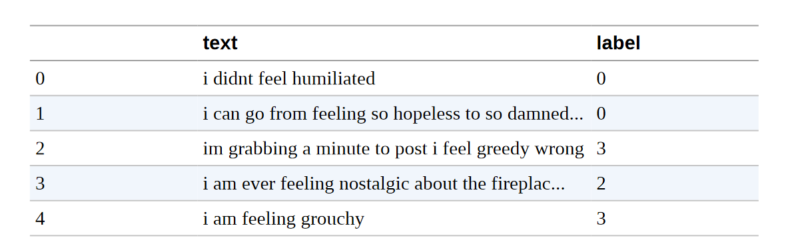

正如你所看到的，列标题被保留了下来，前几行与我们之前的数据视图相吻合。 然而，标签是以整数表示的，所以让我们使用标签功能的int2str()方法，在我们的DataFrame中创建一个新的列，其中有相应的标签名称：

```
def label_int2str(row): 
	return emotions["train"].features["label"].int2str(row) 
df["label_name"] = df["label"].apply(label_int2str) 
df.head()

```

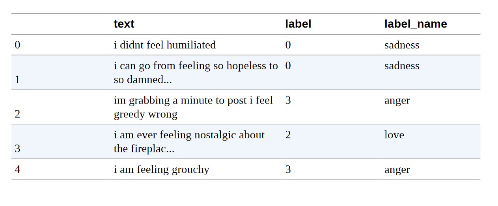

在深入构建分类器之前，让我们仔细看看这个数据集。 正如Andrej Karpathy在他著名的博文 "训练神经网络的配方 "中指出的那样，成为 "与数据合一 "是训练伟大模型的一个重要步骤：

### 查看类分布

每当你在处理文本分类问题时，检查例子在各个类别中的分布是一个好主意。 一个具有倾斜类分布的数据集在训练损失和评价指标方面可能需要与平衡的数据集有不同的处理。

通过Pandas和Matplotlib，我们可以快速地将类的分布可视化，如下所示:

```
import matplotlib.pyplot as plt
df["label_name"].value_counts(ascending=True).plot.barh() 
plt.title("Frequency of Classes") 
plt.show()

```

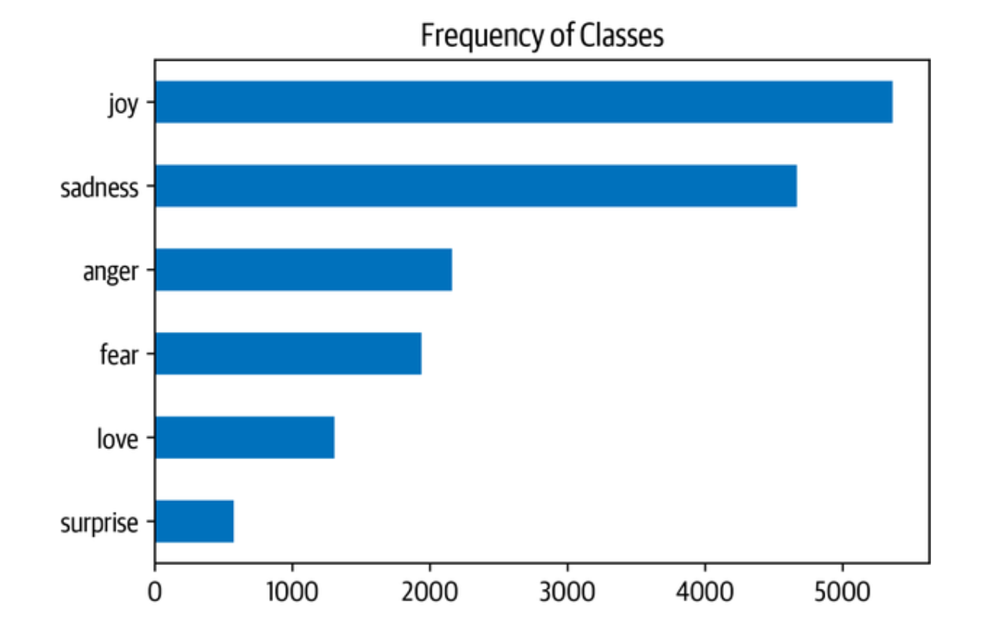

在这种情况下，我们可以看到数据集是严重不平衡的。 喜悦和悲伤的类别经常出现，而爱和惊喜则大约罕见5-10倍。 有几种方法来处理不平衡的数据，包括:

- 随机地对少样本类别进行超采样。 
- 随机地对多样本类别进行欠采样。
-  从代表性不足的类别收集更多的标签数据。


在本章中，为了保持简单，我们将使用原始的、不平衡的类别频率。 如果你想了解更多关于这些采样技术的信息，我们建议你去看看Imbalanced-learn库。 只要确保你在创建训练/测试划分之前不应用抽样方法，否则你就会在它们之间得到大量的泄漏！


现在我们已经看了这些类，让我们来看看推文本身：


### 我们的推文有多长？

Transformers模型有一个最大的输入序列长度，被称为最大上下文大小。 对于使用DistilBERT的应用程序，最大的上下文大小是512个标记，相当于几段文字。 正如我们将在下一节中看到的，一个标记是一个原子性的文本。 现在，我们将把一个标记视为一个单字。 我们可以通过观察每条推文的字数分布来粗略估计每种情绪的推文长度:


```
df["Words Per Tweet"] = df["text"].str.split().apply(len) 
df.boxplot("Words Per Tweet", by="label_name", grid=False, showfliers=False, color="black") 
plt.suptitle("") 
plt.xlabel("") 
plt.show()

```

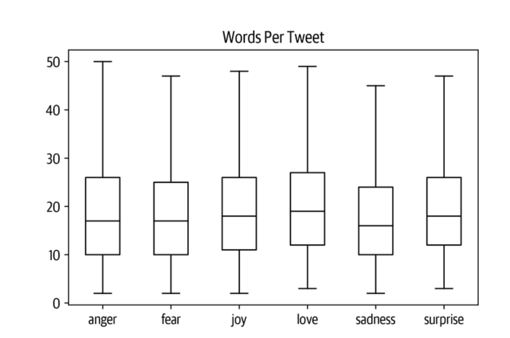

从图中我们看到，对于每一种情绪，大多数推文的长度都在15个字左右，最长的推文远远低于DistilBERT的最大上下文大小。 长于模型上下文尺寸的文本需要被截断，如果被截断的文本包含关键信息，就会导致性能损失。 在这种情况下，看起来这不会是一个问题。

现在让我们想一想，如何将这些原始文本转换成适合变形金刚的格式! 既然我们已经不需要DataFrame格式了，那么我们也重新设置一下我们的数据集的输出格式吧:

```
emotions.reset_format()
```


## 从 文本到标记

像DistilBERT这样的转化器模型不能接收原始字符串作为输入。 相反，他们假设文本已被标记化并被编码为数字向量。 符号化是将字符串分解为模型中使用的原子单元的步骤。 有几种标记化策略可以采用，而且通常从语料库中学习到最佳的单词拆分成子单元的方法。 在研究用于DistilBERT的标记器之前，让我们考虑两个极端情况。 字符和词的标记化。


### 字符标记

最简单的标记化方案是将每个字符单独送入模型。 在Python中，str对象实际上就是引擎盖下的数组，这使得我们只需一行代码就可以快速实现字符级的标记化：


```
text = "Tokenizing text is a core task of NLP."
tokenized_text = list(text) 
print(tokenized_text) 
['T', 'o', 'k', 'e', 'n', 'i', 'z', 'i', 'n', 'g', ' ', 't', 'e', 'x', 't', ' ', 'i', 's', ' ', 'a', ' ', 'c', 'o', 'r', 'e', ' ', 't', 'a', 's', 'k', ' ', 'o', 'f', ' ', 'N', 'L', 'P', '.']

```

这是一个好的开始，但我们还没有完成。 我们的模型希望每个字符都被转换为一个整数，这个过程有时被称为数值化。 做到这一点的一个简单方法是对每个独特的标记（在这种情况下是字符）用一个独特的整数进行编码：

```
token2idx = {ch: idx for idx, ch in enumerate(sorted(set(tokenized_text)))} 
print(token2idx) 
{' ': 0, '.': 1, 'L': 2, 'N': 3, 'P': 4, 'T': 5, 'a': 6, 'c': 7, 'e': 8, 'f': 9, 'g': 10, 'i': 11, 'k': 12, 'n': 13, 'o': 14, 'r': 15, 's': 16, 't': 17, 'x': 18, 'z': 19}

```

这给了我们一个从词汇表中的每个字符到一个唯一的整数的映射。 现在我们可以使用token2idx将标记化的文本转换为一个整数的列表：

```
input_ids = [token2idx[token] for token in tokenized_text] 
print(input_ids)

[5, 14, 12, 8, 13, 11, 19, 11, 13, 10, 0, 17, 8, 18, 17, 0, 11, 16, 0, 6, 0, 7, 14, 15, 8, 0, 17, 6, 16, 12, 0, 14, 9, 0, 3, 2, 4, 1]

```

每个标记现在都被映射到一个唯一的数字标识符（因此被称为input_ids）。 最后一步是将input_ids转换为二维独热向量的张量。 一热向量在机器学习中经常被用来编码分类数据，这些数据可以是顺序的，也可以是名义的。 例如，假设我们想对《变形金刚》电视剧中的人物名称进行编码。 一种方法是将每个名字映射到一个唯一的ID，如下所示：

```
categorical_df = pd.DataFrame( {"Name": ["Bumblebee", "Optimus Prime", "Megatron"], "Label ID": [0,1,2]}) 

categorical_df

```

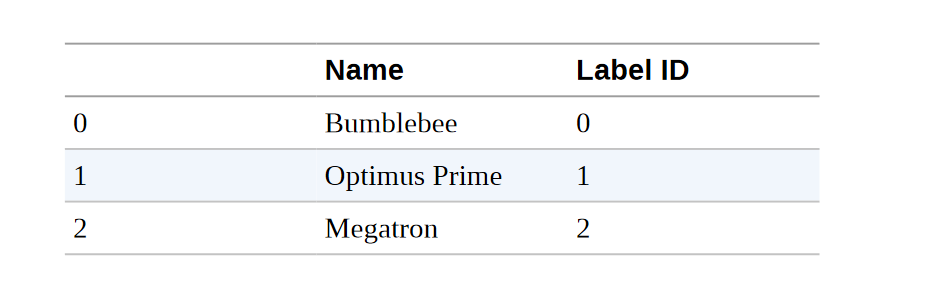

这种方法的问题是，它在名字之间创造了一个虚构的排序，而神经网络在学习这类关系方面确实很出色。 因此，我们可以为每个类别创建一个新的列，并在该类别为真的情况下指定为1，否则为0。 在Pandas中，这可以通过get_dummies()函数实现，如下所示：

```
pd.get_dummies(categorical_df["Name"])

```

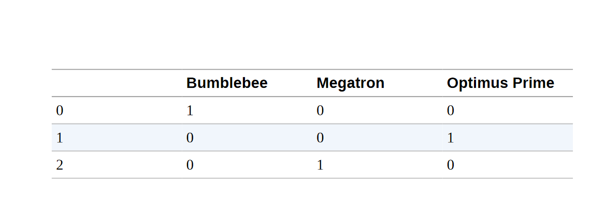

这个DataFrame的行是独热向量，它有一个带1的 "热 "条目，其他地方都是0。 现在，看一下我们的input_ids，我们有一个类似的问题。 元素创建了一个序数尺度。 这意味着加减两个ID是一个无意义的操作，因为结果是一个新的ID，代表另一个随机标记。

另一方面，添加两个一热编码的结果可以很容易地被解释。 两条 "热门 "的条目表示相应的标记共同出现。 我们可以在PyTorch中通过将input_ids转换为张量并应用one_hot()函数来创建独热编码，具体方法如下：

```
import torch import torch.nn.functional as F 
input_ids = torch.tensor(input_ids) 
one_hot_encodings = F.one_hot(input_ids, num_classes=len(token2idx)) 


one_hot_encodings.shape 
torch.Size([38, 20])

```

对于38个输入符号中的每一个，我们现在有一个20维的one-hot向量，因为我们的词汇表由20个独特的字符组成。


**警告**

 一定要在one_hot()函数中设置num_classes，这一点很重要，否则one-hot向量可能最终短于词汇表的长度（需要手动填充零）。 在TensorFlow中，等同的函数是tf.one_hot()，其中深度参数扮演num_classes的角色。


通过检查第一个向量，我们可以验证一个1出现在input_ids[0]所指示的位置:

```
print(f"Token: {tokenized_text[0]}") 
print(f"Tensor index: {input_ids[0]}") 
print(f"One-hot: {one_hot_encodings[0]}") 

Token: T 
Tensor index: 5 
One-hot: tensor([0, 0, 0, 0, 0, 1, 0, 0, 0, 0, 0, 0, 0, 0, 0, 0, 0, 0, 0, 0])
```

从我们的简单例子中，我们可以看到，字符级标记化忽略了文本中的任何结构，并将整个字符串视为字符流。 虽然这有助于处理拼写错误和罕见的单词，但主要的缺点是需要从数据中学习语言结构，如单词。 这需要大量的计算、内存和数据。 由于这个原因，字符标记化在实践中很少被使用。 相反，在标记化步骤中，文本的一些结构被保留下来。 词汇标记化是实现这一目标的直接方法，所以让我们看看它是如何工作的。

## 词标记化

我们可以不把文本分割成字符，而是把它分割成单词，并把每个单词映射成一个整数。 从一开始就使用单词，使模型能够跳过从字符中学习单词的步骤，从而降低训练过程的复杂性。


一类简单的单词标记器使用空白处对文本进行标记。 我们可以通过在原始文本上直接应用Python的split()函数来做到这一点（就像我们在测量推文长度时一样）：


```
tokenized_text = text.split() 
print(tokenized_text) 

['Tokenizing', 'text', 'is', 'a', 'core', 'task', 'of', 'NLP.']

```

从这里，我们可以采取与字符标记器相同的步骤，将每个词映射到一个ID。 然而，我们已经可以看到这种标记化方案的一个潜在问题。 标点符号没有被计算在内，所以NLP。 被视为一个单一的标记。 考虑到单词可以包括分词、变体或拼写错误，词汇量可以很容易地增长到数百万!

**注意事项 ***

一些单词标记器对标点符号有额外的规则。 我们也可以应用词干化或词母化，将单词归纳为它们的词干（例如，"伟大"、"更伟大 "和 "最伟大 "都变成 "伟大"），代价是失去文本中的一些信息


拥有庞大的词汇量是一个问题，因为它要求神经网络拥有大量的参数。 为了说明这一点，假设我们有100万个独特的词，并希望在我们的神经网络的第一层将1百万维的输入向量压缩为1千维的向量。 这是大多数NLP架构中的一个标准步骤，这个第一层的权重矩阵将包含100万×1000=10亿的权重。 这已经可以与最大的GPT-2模型相提并论，后者总共有大约15亿个参数!


自然，我们希望避免在模型参数上如此浪费，因为模型的训练费用很高，而且更大的模型更难维护。 一个常见的方法是通过考虑比如说语料库中最常见的100,000个词来限制词汇量并抛弃稀有词。 不属于词汇表的单词被归类为 "未知"，并映射到一个共享的UNK标记。 这意味着我们在词的标记化过程中失去了一些潜在的重要信息，因为该模型没有与UNK相关的词的信息。

如果在字符和词的标记化之间有一个折中方案，保留所有的输入信息和一些输入结构，那不是很好吗？ 有的：子词标记化。


### 子词标记化

子词标记化的基本思路是结合字符和词的标记化的最佳方面。 一方面，我们想把罕见的词分成更小的单元，以使模型能够处理复杂的词和拼写错误。 另一方面，我们希望把频繁出现的词作为唯一的实体，这样我们就可以把输入的长度保持在一个可控的规模。 子词标记化（以及单词标记化）的主要区别在于，它是利用统计规则和算法的混合，从预训练语料库中学习的。

在NLP中，有几种常用的子词标记化算法，但让我们从WordPiece开始，它被BERT和DistilBERT标记化程序所使用。 了解WordPiece如何工作的最简单方法是看它的运行情况。Transformers提供了一个方便的AutoTokenizer类，允许你快速加载与预训练模型相关的标记器--我们只需调用其from_pretrained()方法，提供Hub上模型的ID或本地文件路径。 让我们从加载DistilBERT的标记器开始:


```
from transformers import AutoTokenizer 
model_ckpt = "distilbert-base-uncased" 
tokenizer = AutoTokenizer.from_pretrained(model_ckpt)
```

AutoTokenizer类属于一个更大的 "auto "类集合，其工作是自动检索模型的配置、预训练的权重或来自检查点名称的词汇。 这允许你在不同的模型之间快速切换，但如果你想手动加载特定的类，你也可以这样做。 例如，我们可以按以下方式加载DistilBERT标记器:


```
from transformers import DistilBertTokenizer 
distilbert_tokenizer = DistilBertTokenizer.from_pretrained(model_ckpt)


```


**注意事项**

当你第一次运行AutoTokenizer.from_pretrained()方法时，你会看到一个进度条，显示预训练标记器的哪些参数从Hugging Face Hub加载。 当你第二次运行该代码时，它将从缓存中加载标记器，通常在~/.cache/huggingface。


让我们通过向它输入简单的 "对文本进行标记是NLP的一项核心任务 "的例子文本，来检查这个标记器是如何工作的：

```
encoded_text = tokenizer(text) 
print(encoded_text) 

{'input_ids': [101, 19204, 6026, 3793, 2003, 1037, 4563, 4708, 1997, 17953, 2361, 1012, 102], 'attention_mask': [1, 1, 1, 1, 1, 1, 1, 1, 1, 1, 1, 1, 1]}

```

就像字符标记化一样，我们可以看到单词已经被映射到input_ids字段中的唯一整数。 我们将在下一节讨论attention_mask字段的作用。 现在我们有了input_ids，我们可以通过使用tokenizer的convert_ids_to_tokens()方法将它们转换为tokens：

```
tokens = tokenizer.convert_ids_to_tokens(encoded_text.input_ids) 
print(tokens) 

['[CLS]', 'token', '##izing', 'text', 'is', 'a', 'core', 'task', 'of', 'nl', '##p', '.', '[SEP]']

```

我们在这里可以观察到三件事。 首先，一些特殊的[CLS]和[SEP]标记已被添加到序列的开始和结束。 这些标记因模型而异，但它们的主要作用是指示序列的开始和结束。 第二，代币都被小写了，这是这个特定检查点的一个特点。 最后，我们可以看到，"tokenizing "和 "NLP "被分成了两个标记，这是有道理的，因为它们不是常见的词。 ##izing和##p中的##前缀意味着前面的字符串不是空白。 任何带有此前缀的标记在你将标记转换为字符串时，应与前一个标记合并。 AutoTokenizer类有一个convert_tokens_to_string()方法来做这件事，所以让我们把它应用到我们的tokens中：

```
print(tokenizer.convert_tokens_to_string(tokens)) 

[CLS] tokenizing text is a core task of nlp. [SEP]

```

AutoTokenizer类也有几个属性，提供关于标记器的信息。 例如，我们可以检查词汇量的大小：

```
tokenizer.vocab_size 

30522

```

和相应模型的最大上下文大小：

```
tokenizer.model_max_length 

512

```

另一个需要了解的有趣属性是模型在其前向传递中期望的字段的名称：

```
tokenizer.model_input_names 

['input_ids', 'attention_mask']
```

现在我们对单个字符串的标记化过程有了基本了解，让我们看看如何对整个数据集进行标记化:


**警告**

当使用预训练的模型时，确保你使用与模型训练时相同的标记器是非常重要的。 从模型的角度来看，切换标记器就像更换词汇表一样。 如果你周围的人都开始把 "房子 "换成 "猫 "这样的随机词汇，你也会很难理解发生了什么事!


## 对整个数据集进行标记化

为了对整个语料库进行标记，我们将使用DatasetDict对象的map（）方法。 在本书中，我们会多次遇到这种方法，因为它提供了一种方便的方法，可以对数据集中的每个元素应用处理函数。 我们很快就会看到，map()方法也可以用来创建新的行和列。

为了开始工作，我们首先需要一个处理函数来对我们的例子进行标记：


```
def tokenize(batch): 
	return tokenizer(batch["text"], padding=True, truncation=True)

```

这个函数将标记器应用于一批例子。 padding=True将用零填充例子，使其达到一个批次中最长的一个的大小，truncation=True将把例子截断到模型的最大上下文大小。 为了看看tokenize()的作用，让我们从训练集中传递一批两个例子：

```
print(tokenize(emotions["train"][:2]))
{'input_ids': [[101, 1045, 2134, 2102, 2514, 26608, 102, 0, 0, 0, 0, 0, 0, 0, 0, 0, 0, 0, 0, 0, 0, 0, 0], [101, 1045, 2064, 2175, 2013, 3110, 2061, 20625, 2000, 2061, 9636, 17772, 2074, 2013, 2108, 2105, 2619, 2040, 14977, 1998, 2003, 8300, 102]], 'attention_mask': [[1, 1, 1, 1, 1, 1, 1, 0, 0, 0, 0, 0, 0, 0, 0, 0, 0, 0, 0, 0, 0, 0, 0], [1, 1, 1, 1, 1, 1, 1, 1, 1, 1, 1, 1, 1, 1, 1, 1, 1, 1, 1, 1
,,,,],[,,,,,,,,,,,,,,,,,,,, 1, 1, 1]]}

```

这里我们可以看到填充的结果。 input_ids的第一个元素比第二个短，所以在这个元素上加了零，使它们的长度相同。 这些零在词汇中都有一个相应的[PAD]标记，特殊标记集还包括我们之前遇到的[CLS]和[SEP]标记:


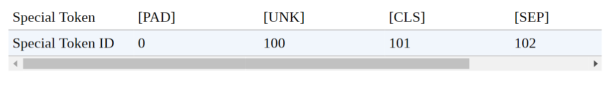

还要注意的是，除了返回编码后的推文作为input_ids外，tokenizer还返回一个attention_mask数组的列表。 这是因为我们不希望模型被额外的填充标记所迷惑。 注意力掩码允许模型忽略输入的填充部分。 图2-3直观地解释了输入ID和注意掩码的填充方式。


一旦我们定义了一个处理函数，我们就可以用一行代码将其应用于语料库中的所有分片:

```
emotions_encoded = emotions.map(tokenize, batched=True, batch_size=None)

```

默认情况下，map()方法对语料库中的每个例子进行单独操作，所以设置batched=True将对推文进行分批编码。 因为我们设置了batch_size=None，我们的tokenize()函数将作为一个批次应用于整个数据集。 这确保了输入张量和注意力掩码在全球范围内具有相同的形状，我们可以看到这个操作为数据集增加了新的输入_ids和注意力掩码列:

```
print(emotions_encoded["train"].column_names) 

['attention_mask', 'input_ids', 'label', 'text']

```

**注意事项**


在后面的章节中，我们将看到如何使用data collators来动态地填充每一批的张量。 在下一节我们从整个语料库中提取特征矩阵时，全局填充将派上用场。


## 训练文本分类器


正如第1章所讨论的，像DistilBERT这样的模型是经过预训练的，可以预测一连串文本中的遮蔽词。 然而，我们不能直接使用这些语言模型进行文本分类。 我们需要对它们稍作修改。 为了了解哪些修改是必要的，让我们看看像DistilBERT这样基于编码器的模型的结构，如图2-4所描述：

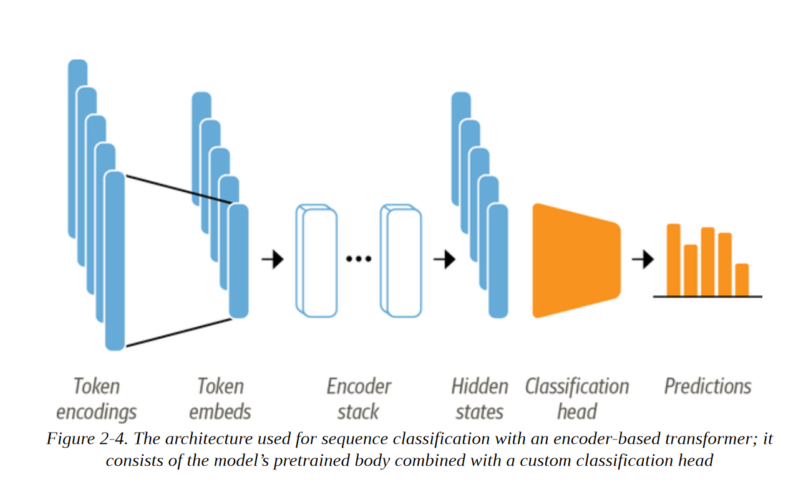

&emsp;&emsp;首先，文本被标记化，并被表示为称为标记编码的独热向量。 标记器词汇的大小决定了标记编码的维度，它通常由20k-200k的独特标记组成。 接下来，这些标记编码被转换为标记嵌入，它们是生活在低维空间中的向量。 然后，令牌嵌入通过编码器块层，为每个输入令牌产生一个隐藏状态。 对于语言建模的预训练目标，每个隐藏状态都被送入一个预测被掩盖的输入标记的层。 对于分类任务，我们用分类层取代语言建模层。


**注意事项**

&emsp;&emsp;在实践中，PyTorch跳过了为标记编码创建独热向量的步骤，因为将矩阵与独热向量相乘，与从矩阵中选择一列是一样的。 这可以直接通过从矩阵中获取带有Token-ID的列来完成。 我们将在第三章使用nn.Embedding类时看到这一点。


我们有两个选择来训练我们的Twitter数据集上的这样一个模型：

- 特征提取

  我们将隐藏状态作为特征，只需对其进行分类器训练，而无需修改预训练的模型。

- 微调

​		我们对整个模型进行端到端的训练，这也是对预训练模型的参数进行更新。


在下面的章节中，我们探讨了DistilBERT的两种选择，并对这两种选择进行权衡。

### 用Transformers 提取特征

&emsp;&emsp;使用Transformers 作为特征提取器是相当简单的。 如图2-5所示，我们在训练期间冻结了主体的权重，并将隐藏状态作为分类器的特征。 这种方法的优点是，我们可以快速训练一个小的或浅的模型。 这样的模型可以是一个神经分类层或一个不依赖梯度的方法，如随机森林。 如果无法使用GPU，这种方法尤其方便，因为隐藏状态只需要预计算一次。

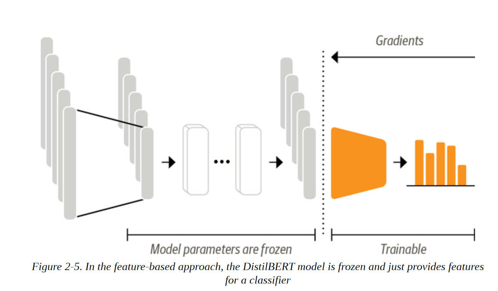

#### 使用预训练模型

&emsp;&emsp;我们将使用变形金刚中另一个方便的自动类，叫做AutoModel。 与AutoTokenizer类类似，AutoModel有一个from_pretrained()方法来加载预训练模型的权重。 让我们用这个方法来加载DistilBERT检查点：

```
from transformers import AutoModel 
model_ckpt = "distilbert-base-uncased" 
device = torch.device("cuda" if torch.cuda.is_available() else "cpu") 
model = AutoModel.from_pretrained(model_ckpt).to(device)

```

在这里，我们使用PyTorch来检查是否有GPU可用，然后将PyTorch nn.Module.to()方法链接到模型加载器。 这确保了模型将在GPU上运行，如果我们有一个。 如果没有，该模型将在CPU上运行，这可能会大大降低速度。


AutoModel类将令牌编码转换为嵌入，然后通过编码器堆栈将其送入，以返回隐藏状态。 让我们看看我们如何从我们的语料库中提取这些状态。


**框架之间的互操作性**

&emsp;&emsp;虽然本书的代码大多是用PyTorch编写的，但Transformers提供了与TensorFlow和JAX的紧密互操作性。 这意味着，你只需要修改几行代码，就可以在你最喜欢的深度学习框架中加载一个预训练的模型 例如，我们可以通过使用TFAutoModel类在TensorFlow中加载DistilBERT，如下所示：

```
from transformers import TFAutoModel 
tf_model = TFAutoModel.from_pretrained(model_ckpt)

```

当一个模型只在一个框架中发布，但你想在另一个框架中使用它时，这种互操作性特别有用。 例如，我们将在第四章遇到的XLM-RoBERTa模型只有PyTorch的权重，所以如果你试图像之前那样在TensorFlow中加载它：

```
tf_xlmr = TFAutoModel.from_pretrained("xlm-roberta-base")

```

你会得到一个错误。 在这些情况下，你可以为TfAutoModel.from_pt=True()函数指定一个参数，该库将自动为你下载并转换PyTorch权重:

```
tf_xlmr = TFAutoModel.from_pretrained("xlm-roberta-base", from_pt=True)

```

正如你所看到的，在《变形金刚》中切换框架是非常简单的。 在大多数情况下，你只需在类中添加一个 "TF "前缀，你就会得到等效的TensorFlow 2.0类。 当我们使用 "pt "时 字符串（例如在下一节），它是PyTorch的简称，只需将其替换为 "tf"，它是TensorFlow的简称。

#### 提取最后一层隐藏状态

&emsp;&emsp;为了热身，让我们检索一下单个字符串的最后隐藏状态。 我们需要做的第一件事是对字符串进行编码，并将令牌转换为PyTorch张量。 这可以通过提供return_tensors="pt "来实现。 参数给标记器，如下所示：

```
text = "this is a test" 
inputs = tokenizer(text, return_tensors="pt") 
print(f"Input tensor shape: {inputs['input_ids'].size()}") 

Input tensor shape: torch.Size([1, 6])

```

&emsp;&emsp;我们可以看到，所产生的张量具有[batch_size, n_tokens]的形状。 现在我们有了作为张量的编码，最后一步是把它们放在与模型相同的设备上，并按如下方式传递输入：

```
inputs = {k:v.to(device) 
for k,v in inputs.items()} 
with torch.no_grad(): 
	outputs = model(**inputs) 

print(outputs) 

BaseModelOutput(last_hidden_state=tensor([[[-0.1565, -0.1862, 0.0528, ..., -0.1188, 0.0662, 0.5470], [-0.3575, -0.6484, -0.0618, ..., -0.3040, 0.3508, 0.5221], [-0.2772, -0.4459, 0.1818, ..., -0.0948, -0.0076, 0.9958], [-0.2841, -0.3917, 0.3753, ..., -0.2151, -0.1173, 1.0526], [ 0.2661, -0.5094, -0.3180, ..., -0.4203, 0.0144, -0.2149], [ 0.9441, 0.0112, -0.4714, ..., 0.1439, -0.7288, -0.1619]]], device='cuda:0'), hidden_states=None, attentions=None)

```

&emsp;&emsp;这里我们使用了torch.no_grad()上下文管理器来禁用梯度的自动计算。 这对推理很有用，因为它减少了计算的内存占用。 根据模型配置，输出可以包含几个对象，如隐藏状态、损失或注意力，排列在一个类似于Python中的命名图元的类中。 在我们的例子中，模型输出是BaseModelOutput的一个实例，我们可以简单地通过名称访问它的属性。 目前的模型只返回一个属性，也就是最后一个隐藏状态，所以我们来研究一下它的形状：


```
outputs.last_hidden_state.size() 
torch.Size([1, 6, 768])

```

&emsp;&emsp;看一下隐藏状态张量，我们看到它的形状是[batch_size, n_tokens, hidden_dim]。 换句话说，6个输入标记中的每一个都会返回一个768维的向量。 对于分类任务，通常的做法是只使用与[CLS]标记相关的隐藏状态作为输入特征。 由于这个标记出现在每个序列的开始，我们可以通过简单地索引到output.last_hidden_state来提取它，如下所示：

```
outputs.last_hidden_state[:,0].size() 

torch.Size([1, 768])

```

&emsp;&emsp;现在我们知道如何获得单个字符串的最后隐藏状态。 让我们对整个数据集进行同样的处理，创建一个新的hidden_state列，存储所有这些向量。 正如我们对标记器所做的那样，我们将使用DatasetDict的map()方法来一次性提取所有的隐藏状态。 我们需要做的第一件事是将前面的步骤包裹在一个处理函数中：

```
def extract_hidden_states(batch): # Place model inputs on the GPU 
	inputs = {
	k:v.to(device) for k,v in batch.items() if k in tokenizer.model_input_names
	} # Extract last hidden states 
	with torch.no_grad(): 
		last_hidden_state = model(**inputs).last_hidden_state # Return vector for [CLS] token 
	return {"hidden_state": last_hidden_state[:,0].cpu().numpy()}

```

&emsp;&emsp;这个函数和我们之前的逻辑的唯一区别是最后一步，我们把最终的隐藏状态作为一个NumPy数组放回CPU上。 当我们使用分批输入时，map()方法要求处理函数返回Python或NumPy对象。

由于我们的模型希望将张量作为输入，接下来要做的是将input_ids和attention_mask列转换为 "Torch"。 格式，如下所示：

```
emotions_encoded.set_format("torch", columns=["input_ids", "attention_mask", "label"])
```

然后，我们可以继续前进，一次性提取所有分片的隐藏状态：

```
emotions_hidden = emotions_encoded.map(extract_hidden_states, batched=True)

```

注意，在这种情况下，我们没有设置 batch_size=None，这意味着使用默认的 batch_size=1000 来代替。 正如预期的那样，应用extract_hidden_states()函数为我们的数据集增加了一个新的hidden_state列：

```
emotions_hidden["train"].column_names 

['attention_mask', 'hidden_state', 'input_ids', 'label', 'text']

```

现在我们有了与每条推文相关的隐藏状态，下一步就是对它们进行分类器训练。 要做到这一点，我们需要一个特征矩阵。


让我们一探究竟。

#### 创建特征矩阵


&emsp;&emsp;预处理过的数据集现在包含了我们需要在上面训练分类器的所有信息。 我们将把隐藏状态作为输入特征，把标签作为目标。 我们可以很容易地以众所周知的Scikit-learn格式创建相应的数组，如下所示：

```
import numpy as np 
X_train = np.array(emotions_hidden["train"]["hidden_state"]) 
X_valid = np.array(emotions_hidden["validation"]["hidden_state"]) 
y_train = np.array(emotions_hidden["train"]["label"]
y_valid = np.array(emotions_hidden["validation"]["label"]) 


X_train.shape, X_valid.shape ((16000, 768), (2000, 768))

```

&emsp;&emsp;在我们对隐藏状态进行模型训练之前，最好的做法是进行一次快速检查，以确保它们对我们想要分类的情绪提供有用的表述。 在下一节中，我们将看到可视化的特征是如何提供一种快速的方式来实现这一目标的。


#### 可视化训练集

&emsp;&emsp;由于在768个维度上实现隐藏状态的可视化至少是很棘手的，我们将使用强大的UMAP算法将向量向下投射到二维。 由于UMAP在特征被缩放到位于[0,1]区间时效果最好，我们将首先应用MinMaxScaler，然后使用umap-learn库中的UMAP实现来减少隐藏状态：

```
from umap import UMAP 
from sklearn.preprocessing import MinMaxScaler # Scale features to [0,1] range 
X_scaled = MinMaxScaler().fit_transform(X_train)
# Initialize and fit UMAP 
mapper = UMAP(n_components=2, metric="cosine").fit(X_scaled) 
# Create a DataFrame of 2D embeddings 
df_emb = pd.DataFrame(mapper.embedding_, columns=["X", "Y"]) 
df_emb["label"] = y_train 
df_emb.head()

```

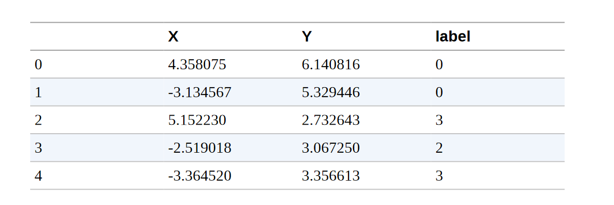

&emsp;&emsp;结果是一个具有相同数量训练样本的数组，但只有2个特征，而不是我们开始时的768个特征 让我们进一步研究一下压缩后的数据，并分别绘制每一类的点的密度：

```
fig, axes = plt.subplots(2, 3, figsize=(7,5)) 
axes = axes.flatten() 
cmaps = ["Greys", "Blues", "Oranges", "Reds", "Purples", "Greens"] 
labels = emotions["train"].features["label"].names 
for i, (label, cmap) in enumerate(zip(labels, cmaps)): 
	df_emb_sub = df_emb.query(f"label == {i}") 
	axes[i].hexbin(df_emb_sub["X"], df_emb_sub["Y"], cmap=cmap, gridsize=20, linewidths=(0,)) 
	axes[i].set_title(label) 		
    axes[i].set_xticks([]), axes[i].set_yticks([]) 
plt.tight_layout() 
plt.show()

```

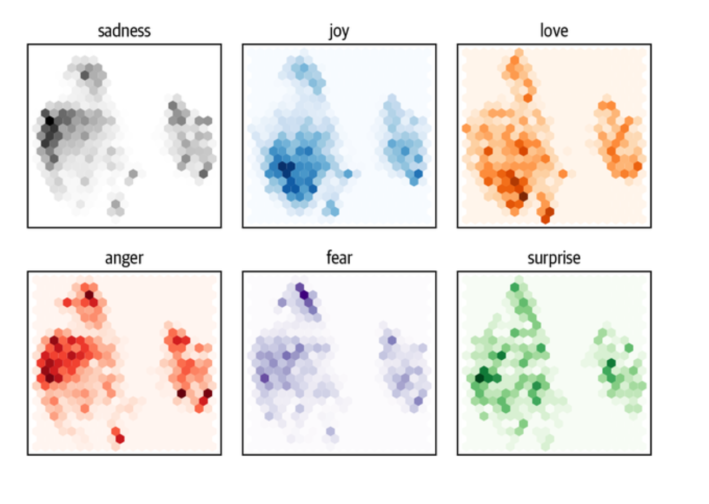

**注意事项**

&emsp;&emsp;这些只是对低维空间的投射。 一些类别的重叠并不意味着它们在原始空间中是不可分离的。 反之，如果它们在投影空间中是可分离的，它们在原始空间中也是可分离的。

&emsp;&emsp;从这个图中我们可以看到一些明显的模式。 诸如悲伤、愤怒和恐惧等负面情绪都占据了类似的区域，但分布略有不同。 另一方面，快乐和爱与负面情绪很好地分开，也共享一个类似的空间。 最后，惊喜散落一地。 虽然我们可能希望有一些分离，但这是无法保证的，因为模型没有经过训练，不知道这些情绪之间的区别。 它只是通过猜测文本中的屏蔽词来隐含地学习它们。

现在，我们已经对我们的数据集的特征有了一些了解，让我们最终在上面训练一个模型吧！


#### 训练一个简单的分类器


&emsp;&emsp;我们已经看到，隐藏的状态在各种情绪之间有些不同，尽管对其中的几个情绪来说没有明显的界限。 让我们用这些隐藏的状态用Scikit-learn来训练一个逻辑回归模型。 训练这样一个简单的模型是快速的，而且不需要GPU：

```
from sklearn.linear_model import LogisticRegression 
# We increase `max_iter` to guarantee convergence 
lr_clf = LogisticRegression(max_iter=3000) 
lr_clf.fit(X_train, y_train) 
lr_clf.score(X_valid, y_valid) 

0.633

```

&emsp;&emsp;看一下准确率，似乎我们的模型只是比随机的好一点--但由于我们处理的是一个不平衡的多图数据集，它实际上是明显好的。 我们可以通过与一个简单的基线进行比较来检查我们的模型是否有任何好处。 在Scikit-learn中，有一个DummyClassifier，可以用来建立一个具有简单启发式的分类器，比如总是选择多数人的类别或总是抽取一个随机的类别。 在这种情况下，表现最好的启发式方法是总是选择最频繁的类别，这产生了约35%的准确率：

```
from sklearn.dummy import DummyClassifier 
dummy_clf = DummyClassifier(strategy="most_frequent") 
dummy_clf.fit(X_train, y_train) 
dummy_clf.score(X_valid, y_valid) 


0.352

```

&emsp;&emsp;因此，我们带有DistilBERT嵌入的简单分类器明显优于我们的基线。 我们可以通过查看分类器的混淆矩阵来进一步研究模型的性能，它告诉我们真实标签和预测标签之间的关系：


```
from sklearn.metrics import ConfusionMatrixDisplay, confusion_matrix 
def plot_confusion_matrix(y_preds, y_true, labels): 
	cm = confusion_matrix(y_true, y_preds, normalize="true") fig, ax = plt.subplots(figsize=(6, 6)) 
	disp = ConfusionMatrixDisplay(confusion_matrix=cm, display_labels=labels) 
	disp.plot(cmap="Blues", values_format=".2f", ax=ax, colorbar=False) 
	plt.title("Normalized confusion matrix") 
	plt.show() 
y_preds = lr_clf.predict(X_valid) 
plot_confusion_matrix(y_preds, y_valid, labels)

```

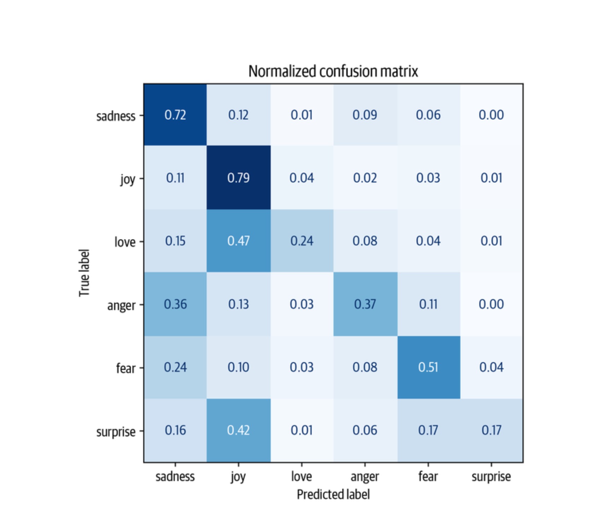

&emsp;&emsp;我们可以看到，愤怒和恐惧最常与悲伤相混淆，这与我们在可视化嵌入时的观察结果一致。 另外，爱和惊喜经常被误认为是快乐。

&emsp;&emsp;在下一节，我们将探讨微调方法，这将导致卓越的分类性能。 然而，需要注意的是，这样做需要更多的计算资源，如GPU，而这些资源在你的组织中可能并不存在。 在这样的情况下，基于特征的方法可以成为做传统机器学习和深度学习之间的一个很好的折中。


### 微调Transformers

&emsp;&emsp;现在让我们来探讨一下对Transformers进行端到端微调需要做些什么。 通过微调方法，我们不把隐藏状态作为固定的特征，而是像图2-6所示那样训练它们。 这要求分类头是可分的，这就是为什么这种方法通常使用神经网络进行分类。

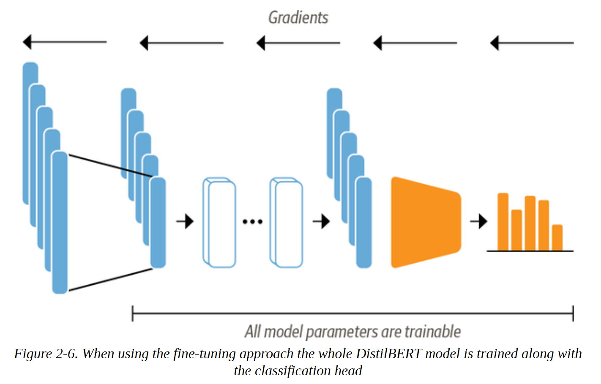

训练作为分类模型输入的隐藏状态将帮助我们避免使用可能不太适合分类任务的数据的问题。 相反，最初的隐藏状态在训练过程中进行调整，以减少模型损失，从而提高其性能。


我们将使用Transformers中的训练者API来简化训练循环。 让我们来看看我们需要建立一个的成分!

####  加载预训练模型

我们首先需要的是一个经过预训练的DistilBERT模型，就像我们在基于特征的方法中使用的那样。 唯一轻微的修改是，我们使用AutoModelForSequenceClassification模型而不是AutoModel。 不同的是，AutoModelForSequenceClassification模型在预训练的模型输出之上有一个分类头，可以很容易地用基础模型进行训练。 我们只需要指定该模型要预测多少个标签（在我们的例子中是六个），因为这决定了分类头的输出数量：

```
from transformers import AutoModelForSequenceClassification 
num_labels = 6 
model = (AutoModelForSequenceClassification .from_pretrained(model_ckpt, num_labels=num_labels) .to(device))

```

你会看到一个警告，模型的某些部分是随机初始化的。 这是正常的，因为分类头还没有被训练过。 下一步是定义我们在微调期间用来评估模型性能的指标。

#### 定义性能指标

为了在训练期间监测指标，我们需要为训练器定义一个compute_metrics()函数。 这个函数接收一个EvalPrediction对象（它是一个带有预测和label_ids属性的命名元组），需要返回一个字典，将每个度量的名称映射到它的值。 对于我们的应用，我们将计算F-score和模型的准确性，如下所示：

```
from sklearn.metrics import accuracy_score, f1_score 
def compute_metrics(pred): 
	labels = pred.label_ids 
	preds = pred.predictions.argmax(-1) 
	f1 = f1_score(labels, preds, average="weighted")
	acc = accuracy_score(labels, preds) 
	return {"accuracy": acc, "f1": f1}

```

在数据集和指标准备好之后，我们在定义训练者类之前，只需要处理最后两件事：

1. 登录我们在 Hugging face 模型仓库的账户。 这将使我们能够将我们的微调模型推送到我们在Hub上的账户，并与社区分享。
2.  定义训练运行的所有超参数。


我们将在下一节解决这些步骤。

#### 训练模型

如果你在Jupyter笔记本中运行这段代码，你可以用下面的辅助函数登录到Hub：


```
from huggingface_hub import notebook_login
notebook_login()

```

这将显示一个小部件，你可以在其中输入你的用户名和密码，或一个具有写入权限的访问令牌。 你可以在Hub文档中找到关于如何创建访问令牌的细节。 如果你在终端工作，你可以通过运行以下命令登录：

```
$ huggingface-cli login

```

为了定义训练参数，我们使用TrainingArguments类。 这个类存储了大量的信息，并让你对训练和评估进行细粒度的控制。 要指定的最重要的参数是output_dir，它是训练中所有工件的存储位置。 这里是TrainingArguments的一个例子，它的魅力在于：

```
from transformers import Trainer, TrainingArguments
batch_size = 64 
logging_steps = len(emotions_encoded["train"]) // batch_size 
model_name = f"{model_ckpt}-finetuned-emotion" 
training_args = TrainingArguments(output_dir=model_name, num_train_epochs=2, learning_rate=2e-5, 	 per_device_train_batch_size=batch_size, per_device_eval_batch_size=batch_size, weight_decay=0.01, evaluation_strategy="epoch", disable_tqdm=False, logging_steps=logging_steps, push_to_hub=True, log_level="error")

```

在这里，我们还设置了批次大小、学习率和epochs的数量，并指定在训练结束时加载最佳模型。 有了这最后的成分，我们就可以用训练器来实例化和微调我们的模型:

```
from transformers import Trainer 
trainer = Trainer(model=model, args=training_args, compute_metrics=compute_metrics, train_dataset=emotions_encoded["train"], eval_dataset=emotions_encoded["validation"], tokenizer=tokenizer) 
trainer.train();
```

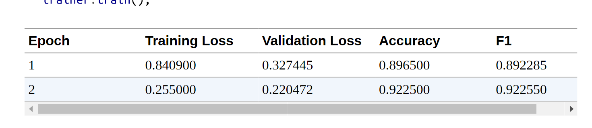

看一下日志，我们可以看到，我们的模型在验证集上的F-score大约为92%--这比基于特征的方法有了很大的改进！这就是我们的模型。

我们可以通过计算混淆矩阵来更详细地了解训练指标。 为了使混淆矩阵可视化，我们首先需要得到验证集上的预测结果。 Trainer类的predict()方法返回几个有用的对象，我们可以用来评估:


```
preds_output = trainer.predict(emotions_encoded["validation"] )
```

predict()方法的输出是一个PredictionOutput对象，它包含预测和标签_ids的数组，以及我们传递给训练器的指标。 例如，验证集的指标可按以下方式访问:

```
preds_output.metrics 

{'test_loss': 0.22047173976898193, 'test_accuracy': 0.9225, 'test_f1': 0.9225500751072866, 'test_runtime': 1.6357, 'test_samples_per_second': 1222.725, 'test_steps_per_second': 19.564}

```

它还包含每个类别的原始预测值。 我们可以使用np.argmax()对预测进行贪婪的解码。 这就产生了预测的标签，其格式与基于特征的方法中Scikit-learn模型所返回的标签相同:

```
y_preds = np.argmax(preds_output.predictions, axis=1)

```

有了预测结果，我们可以再次绘制混淆矩阵:

```
plot_confusion_matrix(y_preds, y_valid, labels)
```

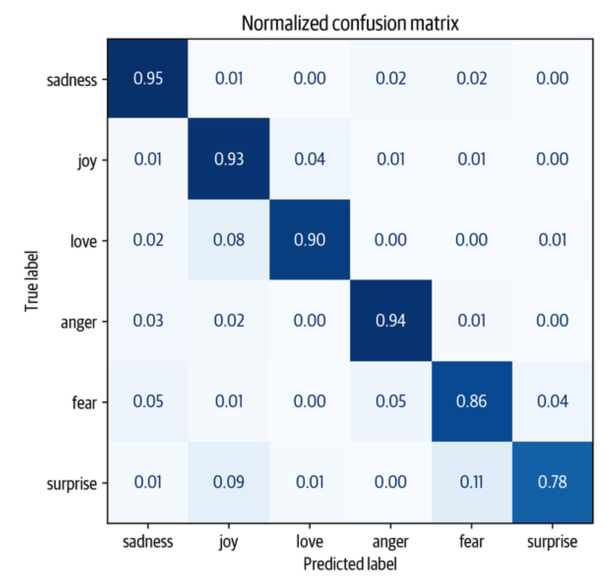

这更接近于理想的对角线混淆矩阵。 爱的类别仍然经常与快乐混淆，这似乎很自然。 惊喜也经常被误认为是快乐，或与恐惧混淆。 总的来说，该模型的表现似乎相当不错，但在我们收工之前，让我们更深入地了解一下我们的模型可能会出现的错误类型。


**用Keras进行微调**

如果你使用TensorFlow，也可以使用Keras API来微调你的模型。 与PyTorch API的主要区别是，没有Trainer类，因为Keras模型已经提供了一个内置的fit()方法。 为了看看这是如何工作的，让我们首先把DistilBERT加载为一个TensorFlow模型:

```
from transformers import TFAutoModelForSequenceClassification 
tf_model = (TFAutoModelForSequenceClassification .from_pretrained(model_ckpt, num_labels=num_labels))

```

接下来，我们将把我们的数据集转换成tf.data.Dataset格式。 因为我们已经对标记化的输入进行了填充，我们可以通过对emotions_encoded应用to_tf_dataset()方法来轻松完成这一转换:

```
# The column names to convert to TensorFlow tensors 
tokenizer_columns = tokenizer.model_input_names 
tf_train_dataset = emotions_encoded["train"].to_tf_dataset( columns=tokenizer_columns, label_cols=["label"], shuffle=True, batch_size=batch_size) 
tf_eval_dataset = emotions_encoded["validation"].to_tf_dataset( columns=tokenizer_columns, label_cols=["label"], shuffle=False, batch_size=batch_size)

```

在这里，我们也对训练集进行了洗牌，并为它和验证集定义了批次大小。 最后要做的是编译和训练模型:

```
import tensorflow as tf 
tf_model.compile( optimizer=tf.keras.optimizers.Adam(learning_rate=5e-5), loss=tf.keras.losses.SparseCategoricalCrossentropy(from_logits=True), metrics=tf.metrics.SparseCategoricalAccuracy())
tf_model.fit(tf_train_dataset, validation_data=tf_eval_dataset, epochs=2)

```

#### 错误分析

在继续前进之前，我们应该进一步调查我们的模型预测。 一个简单而强大的技术是按模型损失对验证样本进行排序。 当我们在向前传递过程中通过标签时，损失会被自动计算并返回。 这里有一个函数，返回损失和预测的标签：

```
from torch.nn.functional import cross_entropy 
def forward_pass_with_label(batch): # Place all input tensors on the same device as the model 
inputs = {k:v.to(device) for k,v in batch.items() if k in tokenizer.model_input_names} 
with torch.no_grad(): output = model(**inputs) 
	pred_label = torch.argmax(output.logits, axis=-1) 
	loss = cross_entropy(output.logits, batch["label"].to(device), reduction="none") 
	# Place outputs on CPU for compatibility with other dataset columns 
	return {"loss": loss.cpu().numpy(), "predicted_label": pred_label.cpu().numpy()}

```

再一次使用map()方法，我们可以应用这个函数来获得所有样本的损失:

```
# Convert our dataset back to PyTorch tensors 
emotions_encoded.set_format("torch", columns=["input_ids", "attention_mask", "label"]) # Compute loss values 
emotions_encoded["validation"] = emotions_encoded["validation"].map( forward_pass_with_label, batched=True, batch_size=16)
```

最后，我们用文本、损失和预测/真实标签创建一个DataFrame:

```
emotions_encoded.set_format("pandas") 
cols = ["text", "label", "predicted_label", "loss"] 
df_test = emotions_encoded["validation"][:][cols] df_test["label"] = df_test["label"].apply(label_int2str) df_test["predicted_label"] = (df_test["predicted_label"] .apply(label_int2str))

```

现在我们可以很容易地按损失的大小以升序或降序对emotions_encoded进行排序。 这项练习的目标是检测以下内容之一:

- 错误标签

  每个为数据添加标签的过程都可能存在缺陷。 注释者可能会犯错或产生分歧，而从其他特征推断出来的标签也可能是错误的。 如果自动注释数据很容易，那么我们就不需要一个模型来做这件事。 因此，有一些错误的标记的例子是正常的。 通过这种方法，我们可以迅速找到并纠正它们

- 数据集异常

  现实世界中的数据集总是有些凌乱。 在处理文本时，输入中的特殊字符或字符串会对模型的预测有很大影响。 检查模型最弱的预测可以帮助识别这样的特征，清理数据或注入类似的例子可以使模型更加强大。

我们先来看看损失最大的数据样本：

```
df_test.sort_values("loss", ascending=False).head(10)

```

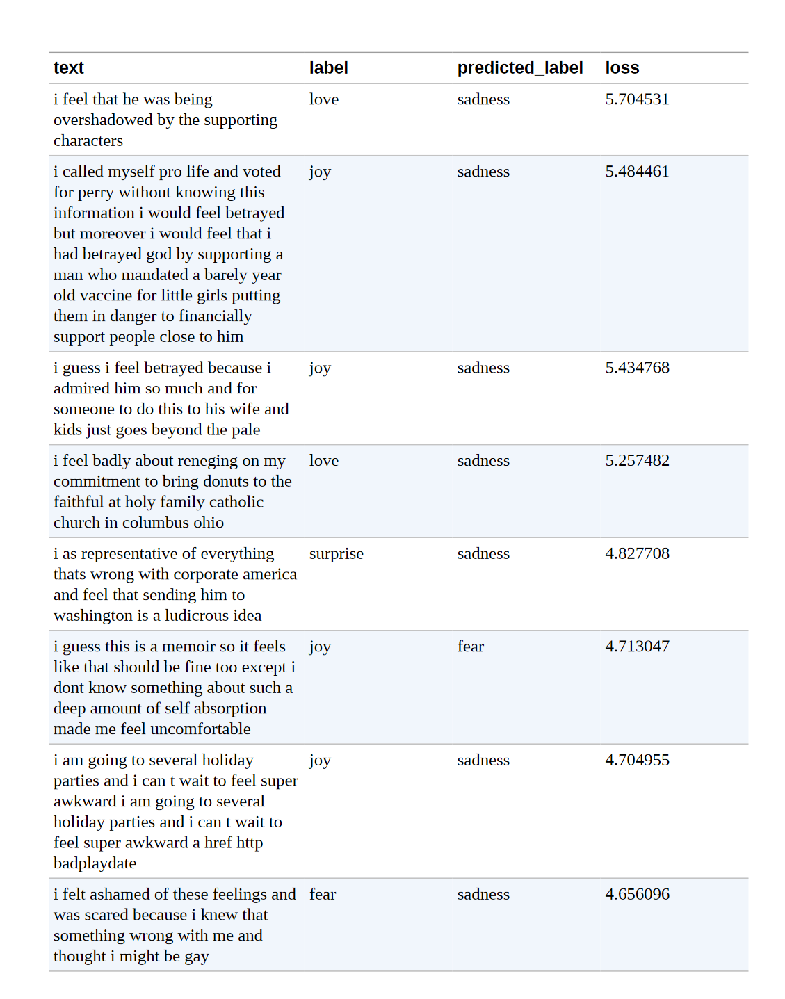

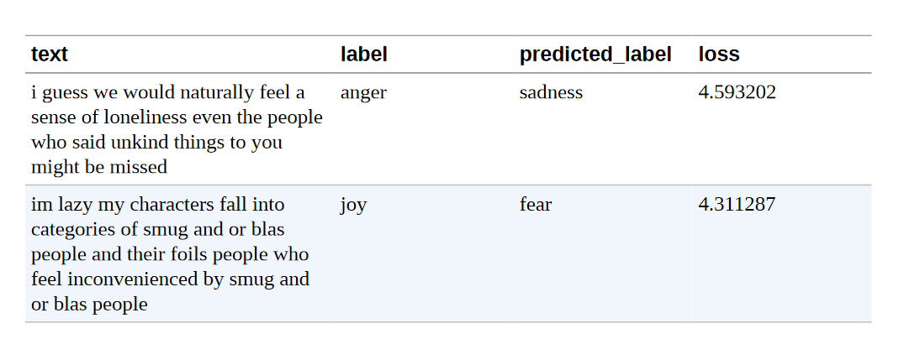

我们可以清楚地看到，该模型对一些标签的预测是错误的。 另一方面，似乎有相当多的例子没有明确的类别，这可能是错误的标签或需要一个完全新的类别。 特别是，joy 似乎被误标了好几次。 有了这些信息，我们就可以完善数据集，这往往可以带来与拥有更多数据或更大模型一样大的性能提升（或更多）

当观察损失最小的样本时，我们观察到，模型在预测sadness类时似乎最有信心。 深度学习模型特别善于寻找和利用捷径来达到预测的目的。 出于这个原因，我们也值得投入时间去研究模型最自信的例子，这样我们就可以确信模型没有不适当地利用文本的某些特征。 因此，我们也来看看损失最小的预测：

```
df_test.sort_values("loss", ascending=True).head(10)

```

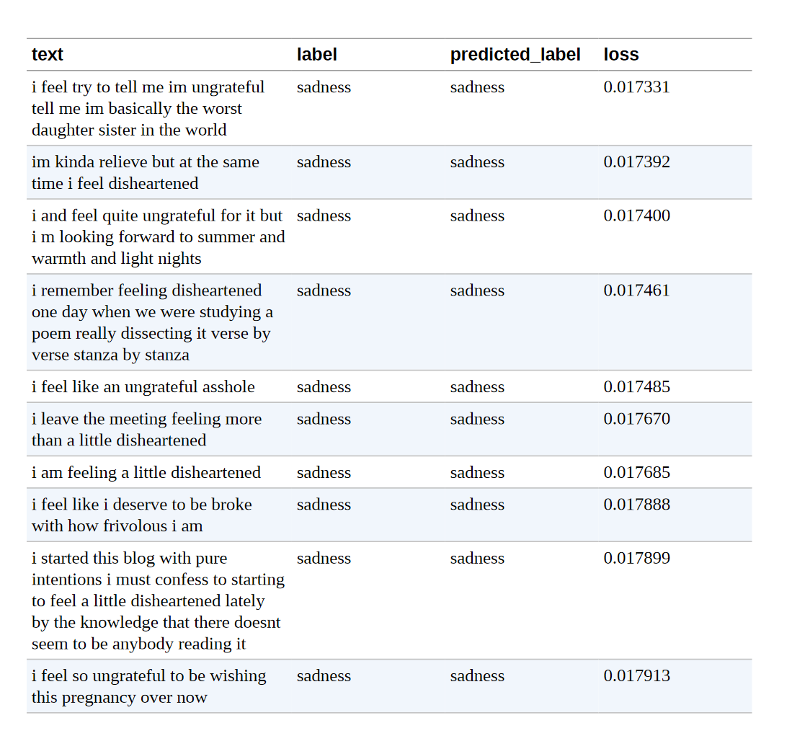

我们现在知道，Joy有时会被误标，模型对预测Sadness的标签最有信心。 有了这些信息，我们可以对我们的数据集进行有针对性的改进，同时也可以关注模型似乎非常有信心的那一类。

在为训练好的模型提供服务之前，最后一步是将其保存起来供以后使用。 变形金刚允许我们通过几个步骤实现这一目标，我们将在下一节向你展示。

#### 保存与分享模型

NLP社区从分享经过预训练和微调的模型中受益匪浅，每个人都可以通过Hugging Face Hub与他人分享他们的模型。 任何社区生成的模型都可以从模型仓库下载，就像我们下载DistilBERT模型一样。 有了Trainer API，保存和分享一个模型很简单：

```
trainer.push_to_hub(commit_message="Training completed!")

```

我们还可以使用微调后的模型对新推文进行预测。 由于我们已经将模型推送到Hub，我们现在可以用pipeline()函数来使用它，就像我们在第一章中做的那样。 首先，让我们加载管道：

```
from transformers import pipeline 
# Change `transformersbook` to your Hub username 
model_id = "transformersbook/distilbert-base-uncased-finetuned-emotion" classifier = pipeline("text-classification", model=model_id)
```

然后，让我们用一条推特样本来测试流水线：

```
custom_tweet = "I saw a movie today and it was really good." 
preds = classifier(custom_tweet, return_all_scores=True)

```

最后，我们可以将每个类别的概率绘制成条形图。 显然，该模型估计最可能的类别是快乐，考虑到这条推文，这似乎是合理的：

```
preds_df = pd.DataFrame(preds[0]) 
plt.bar(labels, 100 * preds_df["score"], color='C0') 
plt.title(f'"{custom_tweet}"') 
plt.ylabel("Class probability (%)") 
plt.show()

```

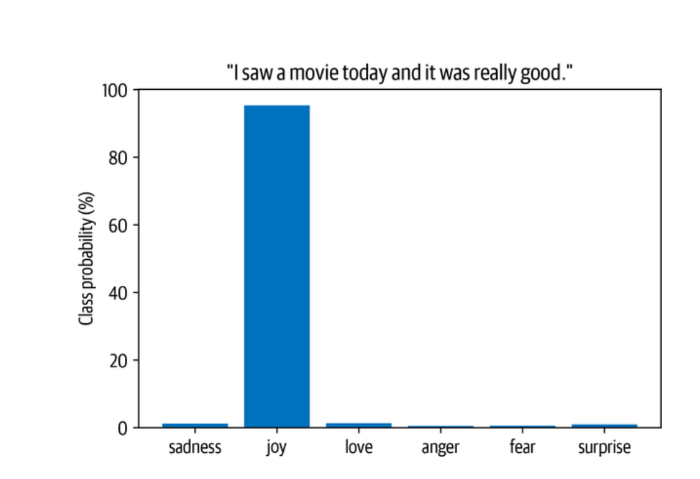

## 小节

恭喜你，你现在知道如何训练一个转化器模型来对推文中的情绪进行分类。 我们看到了两种基于特征和微调的互补性方法，并研究了它们的优点和缺点。

然而，这只是用Transformer模型建立一个真实世界应用的第一步，我们还有很多地方要做。 这里列出了你在NLP旅程中可能会遇到的挑战：

**我的老板希望我的模型昨天就能投入生产!** 

在大多数应用中，你的模型并不只是坐在某个地方积聚灰尘--你要确保它为预测提供服务！你要确保你的模型是为预测服务的。 当一个模型被推送到Hub时，一个推理端点被自动创建，可以用HTTP请求调用。 如果你想了解更多，我们建议你查看推理API的文档。

**我的用户想要更快的预测!** 

我们已经看到了解决这个问题的一种方法。 使用DistilBERT。 在第8章中，我们将深入研究知识蒸馏（DistilBERT的创建过程），以及其他加快变压器模型的技巧。 

**你的模型也能做X吗？** 

正如我们在本章中所暗示的，变压器的用途非常广泛。 在本书的其余部分，我们将探索一系列的任务，如问题回答和命名实体识别，都使用相同的基本架构。 我的文本没有一个是英文的! 事实证明，转化器也有多语言的种类，我们将在第4章中使用它们来同时处理几种语言。

**我没有任何标签!** 

如果可用的标签数据非常少，微调可能不是一个选项。 在第9章中，我们将探讨一些处理这种情况的技巧。 


现在我们已经看到了训练和共享一个Transformer所涉及的内容，在下一章中我们将探索从头开始实现我们自己的Transformer模型。
