# 第3章 剖析Transformer架构

在第2章中，我们看到了微调和评估一个Transformer所需要的东西。 现在让我们来看看它们在引擎盖下是如何工作的。 在本章中，我们将探讨Transformer模型的主要构件以及如何使用PyTorch实现它们。 我们还将提供关于如何在TensorFlow中做同样事情的指导。 我们将首先专注于建立注意力机制，然后添加必要组件，使Transformer编码器工作。 我们还将简单了解一下编码器和解码器模块之间的结构差异。 在本章结束时，你将能够自己实现一个简单的Transformer模型! 

虽然对Transformer架构有深刻的技术理解通常不是使用Transformer和为你的用例微调模型的必要条件，但对于理解和驾驭Transformer的限制以及在新领域使用它们是有帮助的。 

本章还介绍了Transformer的体系分类，以帮助你了解近年来出现的各种型号的Transformer。 在深入研究代码之前，让我们先概述一下启动Transformer革命的原始架构。

## Transformers 架构

正如我们在第一章中所看到的，最初的Transformer是基于encoder-decoder架构的，该架构被广泛用于机器翻译等任务，即把一串词从一种语言翻译成另一种语言。 该架构由两个部分组成：

**编码器**

将输入的标记序列转换为嵌入向量序列，通常称为隐藏状态或上下文。 

**解码器** 

使用编码器的隐藏状态来迭代生成一个标记的输出序列，每次一个标记。 

如图3-1所示，编码器和解码器本身是由几个构件组成的：

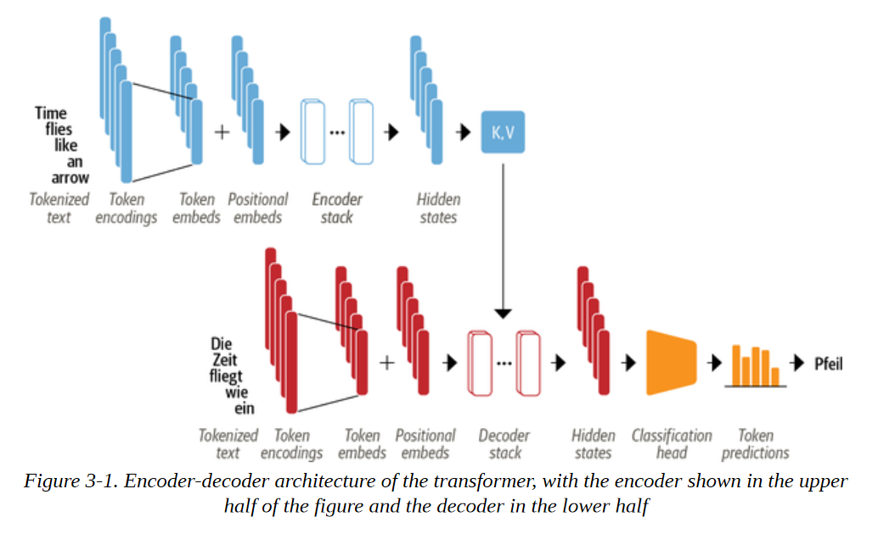

我们很快就会看到每个组件的细节，但我们已经可以在图3-1中看到一些描述Transformer架构的东西：

- 使用我们在第2章中遇到的技术，将输入的文本标记化并转换为标记嵌入。由于注意力机制不知道标记的相对位置，我们需要一种方法将一些关于标记位置的信息注入输入，以模拟文本的顺序性。因此 因此，标记嵌入与包含每个标记的位置信息的位置嵌入相结合。
- 编码器由一叠编码器层或 "块 "组成，这类似于计算机视觉中的卷积层的堆叠。解码器也是如此，它有自己的解码器层堆叠。
- 编码器的输出被送入每个解码层，然后解码器产生对序列中最可能的下一个符号的预测。这一步的输出再被反馈到解码器，以生成下一个标记，如此反复，直到达到一个特殊的序列结束（EOS）的标记。在图3-1的例子中，设想解码器已经预测了 "Die "和 "Zeit"。现在它得到了这两个词的输入，以及所有编码器的输出来预测下一个标记 "fliegt"。在下一个步骤中，解码器得到 "fliegt "作为额外的输入。我们重复这个过程，直到解码器预测到EOS标记或我们达到最大长度。

Transformers架构最初是为序列-序列任务（如机器翻译）设计的，但编码器和解码器模块很快就被改编为独立的模型。虽然有数百种不同的Transformers模型，但大多数属于三种类型之一:

**纯编码器** 
这些模型将输入的文本序列转换为丰富的数字表示，很适合于文本分类或命名实体识别等任务。BERT及其变种，如RoBERTa和DistilBERT，属于这一类架构。在这个架构中，为一个给定的标记计算的表征既取决于左边（标记之前）也取决于右边（标记之后）的上下文。这通常被称为双向注意。

**纯解码器**
给出一个文本提示，如 "谢谢你的午餐，我有一个...... "这些模型将通过迭代预测最可能的下一个词来自动完成序列。GPT模型家族就属于这一类。在这种结构中，为一个给定的标记计算的表征只取决于左边的语境。这通常被称为因果或自回归注意。
**编码器-解码器**
这些用于建模从一个文本序列到另一个序列的复杂映射；它们适用于机器翻译和总结任务。除了我们已经看到的结合了编码器和解码器的Transformer架构之外，BART和T5模型也属于这一类。


**注意事项**

在现实中，纯解码器与纯编码器架构之间的应用区别有点模糊不清。例如，像GPT系列中的纯解码器模型可以用于翻译等任务，这些任务通常被认为是序列到序列任务。同样，像BERT这样的纯编码器模型可以应用于通常与编码器-解码器或纯解码器模型有关的总结任务。


现在你对Transformer架构有了一个高层次的了解，让我们仔细看看编码器的内部工作原理。

## 编码器

正如我们前面所看到的，Transformers的编码器由许多相邻的编码器层堆叠而成。如图3-2所示，每个编码器层接收一连串的嵌入信息，并通过以下子层将其送入：

- **一个多头自注意力层**
- **适用于每个输入嵌入的全连接前馈层** 

每个编码器层的输出嵌入与输入的大小相同，我们很快就会看到，编码器栈的主要作用是 "更新 "输入嵌入，以产生编码序列中一些上下文信息的表示。例如，如果 "keynote "或 "phone "靠近 "apple "这个词，它将被更新为更像 "公司 "而不像 "水果"。


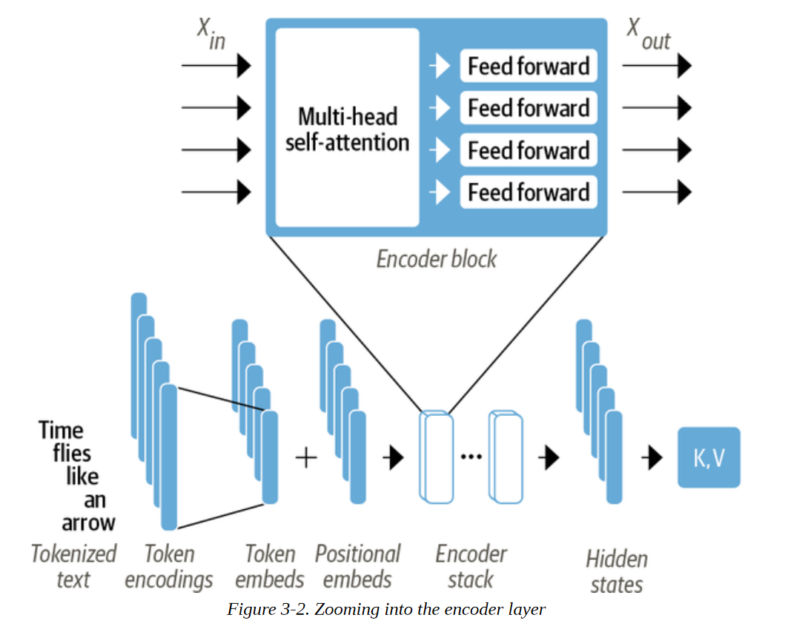

这些子层中的每一个也都使用了跳过连接和层规范化，这些都是有效训练深度神经网络的标准技巧。但要真正了解是什么让Transformers工作，我们必须更深入地了解。让我们从最重要的构建模块开始：自注意力力层。

###　 自注意力层

正如我们在第一章所讨论的，注意力是一种机制，它允许神经网络为序列中的每个元素分配不同的权重或 "注意力"。对于文本序列来说，这些元素是像我们在第二章中遇到的那些标记嵌入，其中每个标记被映射到某个固定维度的向量。例如，在BERT中，每个标记被表示为一个768维的向量。自注意力的 "自我 "部分指的是，这些权重是为同一集合中的所有隐藏状态计算的--例如，编码器的所有隐藏状态。相比之下，与递归模型相关的注意力机制涉及计算每个编码器隐藏状态与解码器隐藏状态在特定解码时间段的相关性。

自注意力的主要思想是，我们可以使用整个序列来计算每个嵌入的加权平均值，而不是对每个标记使用固定的嵌入。另一种表述方式是说，给定一连串的标记嵌入x1, ..., xn，自注意力力产生一连串的新嵌入x′1, ..., x′n，其中每个x′i是所有xj的线性组合：


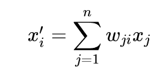

系数wji被称为注意力权重，并被归一化，使∑j wji=1。为了了解为什么平均化标记嵌入可能是一个好主意，考虑一下当你看到 "苍蝇 "这个词时，你会想到什么。你可能会想到恼人的昆虫，但如果给你更多的上下文，比如 "时间像箭一样飞逝"，那么你会意识到 "飞 "指的是动词。同样地，我们可以通过以不同的比例组合所有的标记嵌入来创建一个包含这种语境的 "苍蝇 "表示法，也许可以给 "时间 "和 "箭 "的标记嵌入分配一个较大的权重wji。以这种方式产生的嵌入被称为语境化嵌入，并且早于ELMo等语言模型中Transformers的发明。语言模型中的Transformers，如ELMo。图3-3是这个过程的示意图，我们说明了根据上下文，"苍蝇 "的两种不同表现形式是如何通过自注意力产生的。

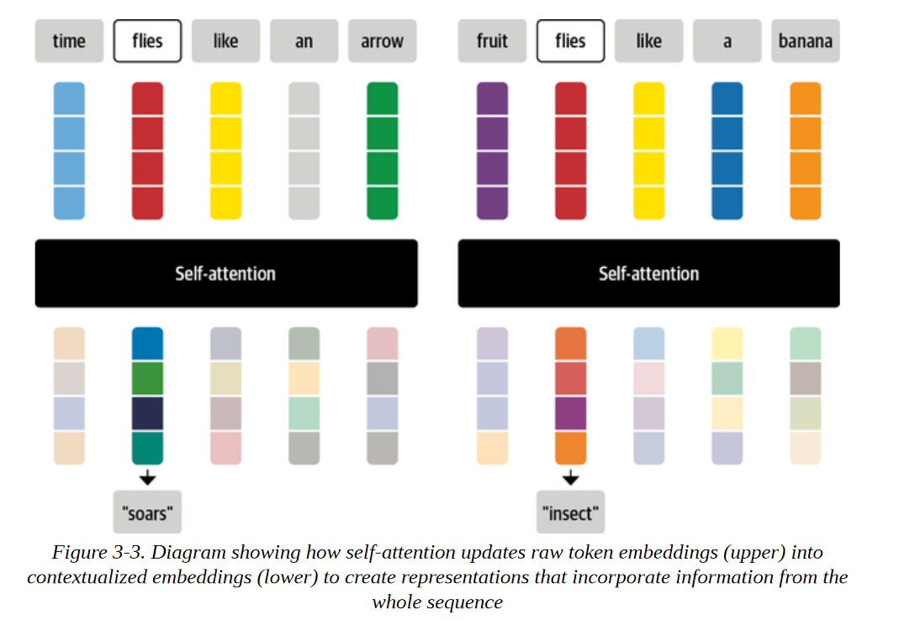

现在让我们来看看如何计算注意力的权重。

1. 将每个标记嵌入投射到三个向量中，称为查询、键和值。
2. 计算注意力分数。我们使用一个相似性函数来确定查询和关键向量之间的关系。正如其名 名称所示，缩放点积注意力的相似性函数是点积，使用嵌入的矩阵乘法有效计算。相似的查询和键将有一个大的点积，而那些没有多少共同点的查询和键将有很少或没有重合。这一步的输出被称为注意力分数，对于一个有n个输入标记的序列，有一个相应的n×n的注意力分数矩阵。
3. 计算注意权重。一般来说，点乘可以产生任意大的数字，这可能会破坏训练过程的稳定性。为了处理这个问题，首先将注意力分数乘以一个比例因子，使其方差正常化，然后用softmax进行归一化，以确保所有的列值相加为1。
4. 更新标记嵌入。一旦计算出注意力权重，我们就把它们与价值向量v1, ..., vn相乘，以获得嵌入x′i = ∑j wjivj的更新表示。

我们可以通过一个名为BertViz for Jupyter的灵巧的库将注意力权重的计算方式可视化。这个库提供了几个函数，可以用来将Transformers模型中的注意力的不同方面可视化。为了使注意力权重可视化，我们可以使用神经元_视图模块，它可以追踪权重的计算，以显示查询和关键向量是如何结合起来产生最终权重的。由于BertViz需要进入模型的注意力层，我们将用BertViz的模型类来实例化我们的BERT检查点，然后使用show()函数来生成特定编码器层和注意力头的交互式可视化。注意，你需要点击左边的 "+"来激活注意力的可视化:

```
from transformers import AutoTokenizer 
from bertviz.transformers_neuron_view import BertModel 
from bertviz.neuron_view import show 
model_ckpt = "bert-base-uncased" tokenizer = AutoTokenizer.from_pretrained(model_ckpt)
model = BertModel.from_pretrained(model_ckpt) 
text = "time flies like an arrow" 
show(model, "bert", tokenizer, text, display_mode="light", layer=0, head=8)

```

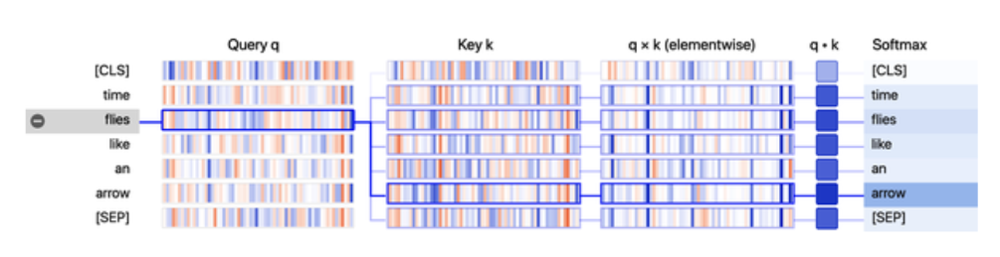

从可视化中，我们可以看到查询向量和关键向量的值被表示为垂直带，每个带的强度对应于幅度。连接线根据标记之间的注意力度进行加权，我们可以看到 "苍蝇 "的查询向量与 "箭头 "的关键向量有最强的重叠。

**揭开查询、键和值的神秘面纱** 
查询、键和值向量的概念在你第一次遇到它们的时候可能显得有点神秘。它们的名字是受信息检索系统的启发，但我们可以用一个简单的比喻来解释它们的意义。想象一下，你在超市里购买晚餐所需的所有材料。你有这道菜的食谱，每一种所需的原料都可以被认为是一个查询。当你扫描货架时，你看标签（键），并检查它们是否与你清单上的成分相匹配（相似性功能）。如果有匹配的，那么你就从货架上取走这个物品（值）。在这个比喻中，每一个与成分相匹配的标签，你只能得到杂货店中的一个物品。自注意力是一个更抽象和 "平滑 "的版本：超市里的每一个标签都与成分相匹配，其结果是每个键都与查询相匹配。因此，如果你的清单包括一打鸡蛋，那么你最终可能会抓到10个鸡蛋，一个煎蛋，和一个鸡翅。


让我们通过实现计算缩放点积注意的操作图来更详细地看看这个过程，如图3-4所示。

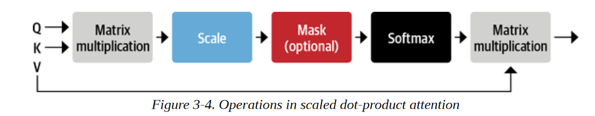

我们将在本章中使用PyTorch来实现Transformer架构，但TensorFlow中的步骤是类似的。我们在表3-1中提供了这两个框架中最重要的函数之间的映射。

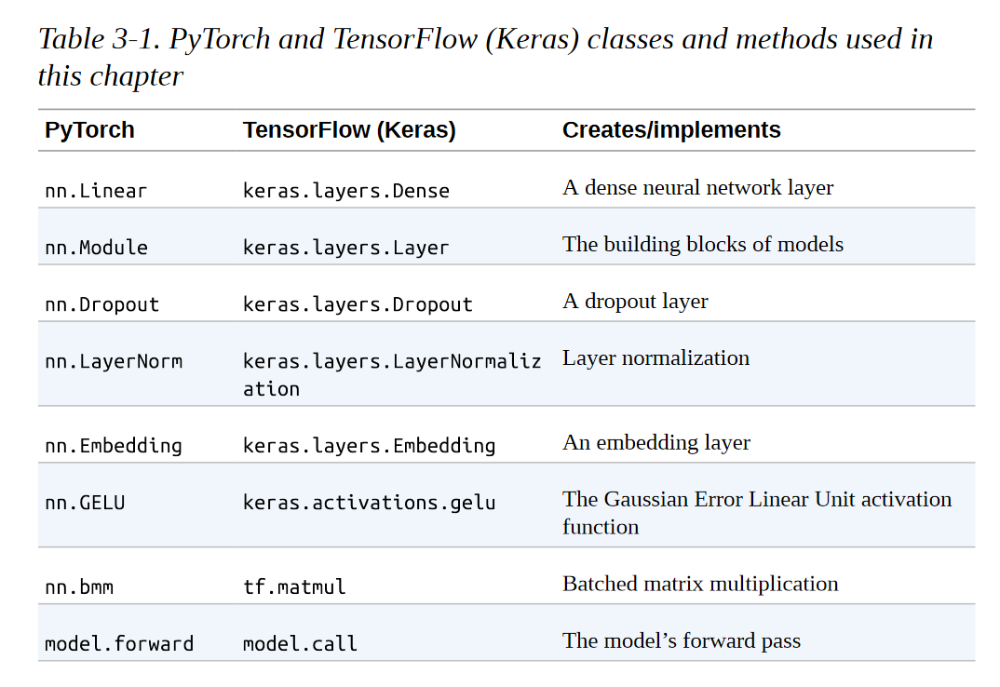

我们需要做的第一件事是对文本进行标记，所以让我们使用我们的标记器来提取输入的ID：

```
inputs = tokenizer(text, return_tensors="pt", add_special_tokens=False) 
inputs.input_ids tensor([[ 2051, 10029, 2066, 2019, 8612]])

```

正如我们在第二章中所看到的，句子中的每个标记都被映射到标记器词汇中的一个唯一的ID。为了保持简单，我们还通过设置add_special_tokens=False排除了[CLS]和[SEP]标记。接下来，我们需要创建一些密集嵌入。这里的密集意味着嵌入中的每个条目都包含一个非零值。相比之下，我们在第二章中看到的单热编码是稀疏的，因为除了一个条目外，所有条目都是零。在PyTorch中，我们可以通过使用torch.nn.Embedding层来做到这一点，该层作为每个输入ID的查询表：

```
from torch import nn 
from transformers import AutoConfig 
config = AutoConfig.from_pretrained(model_ckpt) 
token_emb = nn.Embedding(config.vocab_size, config.hidden_size) 
token_emb Embedding(30522, 768)

```

这里我们使用AutoConfig类来加载与bert-base-uncased检查点相关的config.json文件。在Transformers中，每个检查点都被分配了一个配置文件，它指定了各种超参数，如vocab_size和hidden_size，在我们的例子中，它告诉我们每个输入ID将被映射到存储在nn.Embedding中的30,522个嵌入向量之一，每个向量的大小为768。AutoConfig类还存储了额外的元数据，如标签名称，用于格式化模型的预测。

请注意，此时的标记嵌入是独立于其上下文的。这意味着同音异义词（拼写相同但含义不同的词），如前面例子中的 "苍蝇"，具有相同的表示。随后的注意力层的作用将是混合这些标记嵌入，以消除歧义，并将每个标记的表示与它的上下文内容联系起来。

现在我们有了查找表，我们可以通过输入ID来生成嵌入：

```
inputs_embeds = token_emb(inputs.input_ids) 
inputs_embeds.size() 
torch.Size([1, 5, 768])

```

这给了我们一个形状为[batch_size, seq_len, hidden_dim]的张量，就像我们在第二章看到的那样。我们将推迟位置编码，所以下一步是创建查询、键和值向量，并使用点乘作为相似性函数来计算注意分数：

```
import torch from math 
import sqrt 
query = key = value = inputs_embeds 
dim_k = key.size(-1) 
scores = torch.bmm(query, key.transpose(1,2)) / sqrt(dim_k) 
scores.size() 

torch.Size([1, 5, 5])

```

这就为该批次中的每个样本创建了一个5×5的注意力分数矩阵。我们稍后会看到，查询、键和值向量是通过对嵌入的独立权重矩阵WQ,K,V产生的，但现在为了简单起见，我们让它们保持相等。在缩放点积注意力中，点积被嵌入向量的大小所缩放，这样我们在训练中就不会得到太多的大数字，从而导致我们接下来要应用的softmax达到饱和。


**注意事项**

torch.bmm()函数执行了一个批量矩阵-矩阵乘积，简化了注意力分数的计算，其中查询和关键向量的形状为[batch_size, seq_len, hidden_dim]。如果我们忽略了批次维度，我们可以通过简单地转置钥匙张量来计算每个查询和钥匙向量之间的点乘，使其具有[hidden_dim, seq_len]的形状，然后使用矩阵乘积来收集[seq_len, seq_len]矩阵中所有的点乘。由于我们想独立地对批次中的所有序列做这件事，我们使用torch.bmm()，它需要两批矩阵并将第一批中的每个矩阵与第二批中的相应矩阵相乘。

现在让我们来应用softmax：

```
import torch.nn.functional as F 
weights = F.softmax(scores, dim=-1)
weights.sum(dim=-1) 

tensor([[1., 1., 1., 1., 1.]], grad_fn=<SumBackward1>)

```

最后一步是将注意力权重与数值相乘：

```
attn_outputs = torch.bmm(weights, value) 
attn_outputs.shape torch.Size([1, 5, 768])

```

就这样，我们已经完成了所有的步骤，实现了一个简化的自注意力力形式！注意，整个过程只是两个矩阵乘法和一个softmax。请注意，整个过程只是两个矩阵乘法和一个softmax，所以你可以把 "自注意力力 "看成是一种花哨的平均化形式。


让我们把这些步骤包成一个函数，我们以后可以使用：

```
def scaled_dot_product_attention(query, key, value): 
	dim_k = query.size(-1) 
	scores = torch.bmm(query, key.transpose(1, 2)) / sqrt(dim_k)
	weights = F.softmax(scores, dim=-1) 
	return torch.bmm(weights, value)

```

我们的注意力机制在查询和关键向量相等的情况下，会给上下文中相同的词分配一个非常大的分数，特别是给当前的词本身：查询与自身的点积总是1。但是在实践中，一个词的含义会被上下文中的互补词所告知，而不是相同的词--例如，"苍蝇 "的含义通过纳入 "时间 "和 "箭头 "的信息比另外提到的 "苍蝇 "更好定义。我们怎样才能促进这种行为呢？

让我们允许模型通过使用三种不同的线性投影将我们的初始标记向量投射到三个不同的空间，为查询、键和标记的值创建一组不同的向量。

## 多头注意力

在我们的简单例子中，我们只是 "按原样 "使用嵌入来计算注意力分数和权重，但这远远不是故事的全部。在实践中，自注意力力层对每个嵌入物进行了三个独立的线性转换，以生成查询、关键和价值向量。这些变换对嵌入进行投射，每个投射都有自己的一套可学习的参数，这使得自注意力层能够注意力序列的不同语义方面。

事实证明，拥有多组线性投射也是有益的，每组投射代表一个所谓的注意头。由此产生的多头注意层如图3-5所示。但为什么我们需要一个以上的注意头呢？原因是，一个头的softmax往往主要集中在相似性的一个方面。有了几个头，模型就可以同时注意力几个方面了。例如，一个头可以专注于主语与动词的互动，而另一个头则可以找到附近的形容词。显然，我们并没有将这些关系手工制作到模型中，它们完全是从数据中学习的。如果你熟悉计算机视觉模型，你可能会发现它与卷积神经网络中的过滤器很相似。其中一个过滤器负责检测人脸，另一个负责在图像中寻找汽车的车轮。

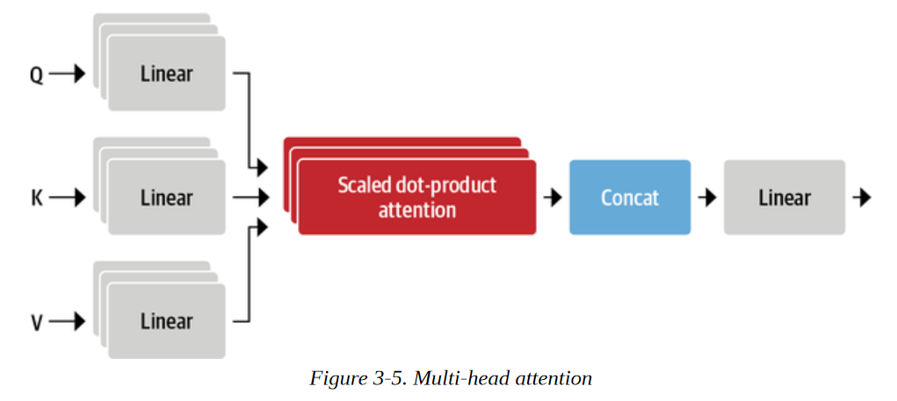

让我们来实现这个层，首先编码一个单一的注意力头：

```
class AttentionHead(nn.Module): 
	def __init__(self, embed_dim, head_dim): 
        super().__init__() 
        self.q = nn.Linear(embed_dim, head_dim) 
        self.k = nn.Linear(embed_dim, head_dim) 
        self.v = nn.Linear(embed_dim, head_dim) 
	def forward(self, hidden_state): 
		attn_outputs = scaled_dot_product_attention( self.q(hidden_state), self.k(hidden_state), self.v(hidden_state)) 
		return attn_outputs


```

在这里，我们初始化了三个独立的线性层，将矩阵乘法应用于嵌入向量，产生形状为[batch_size, seq_len, head_dim]的张量，其中head_dim是我们要投射的维数。虽然head_dim不一定要小于令牌的嵌入维数（embed_dim），但在实践中，它被选择为embed_dim的倍数，以便每个头的计算量是恒定的。例如，BERT有12个注意头，所以每个头的尺寸是768/12=64。

现在我们有了一个注意力头，我们可以把每个注意力头的输出串联起来，实现完整的多头注意力层：

```
class MultiHeadAttention(nn.Module): 
	def __init__(self, config): 
		super().__init__() 
		embed_dim = config.hidden_size 
		num_heads = config.num_attention_heads 
		head_dim = embed_dim // num_heads 
		self.heads = nn.ModuleList( [AttentionHead(embed_dim, head_dim) for _ in range(num_heads)] ) 
		self.output_linear = nn.Linear(embed_dim, embed_dim) 
	def forward(self, hidden_state): 
		x = torch.cat([h(hidden_state) for h in self.heads], dim=-1) 
		x = self.output_linear(x) 
		return x

```

请注意，注意力头的联合输出也被送入最后的线性层，以产生形状为[batch_size, seq_len, hidden_dim]的输出张量，适合下游的前馈网络。为了确认，让我们看看多头注意力层是否产生了我们输入的预期形状。在初始化MultiHeadAttention模块时，我们将先前从预训练的BERT模型中加载的配置传递给它。这确保我们使用与BERT相同的设置：

```
multihead_attn = MultiHeadAttention(config) 
attn_output = multihead_attn(inputs_embeds) 
attn_output.size() 

torch.Size([1, 5, 768] )

```

它是有效的! 为了总结这一节关于注意力的内容，让我们再次使用BertViz将 "苍蝇 "这个词的两种不同用法的注意力可视化。在这里，我们可以使用BertViz的head_view()函数，通过计算预训练的检查点的注意力并指出句子边界的位置：

```
from bertviz import head_view 
from transformers import AutoModel 
model = AutoModel.from_pretrained(model_ckpt, output_attentions=True) 
sentence_a = "time flies like an arrow" 
sentence_b = "fruit flies like a banana" 
viz_inputs = tokenizer(sentence_a, sentence_b, return_tensors='pt') 
attention = model(**viz_inputs).attentions 
sentence_b_start = (viz_inputs.token_type_ids == 0).sum(dim=1) 
tokens = tokenizer.convert_ids_to_tokens(viz_inputs.input_ids[0]) 
head_view(attention, tokens, sentence_b_start, heads=[8])

```

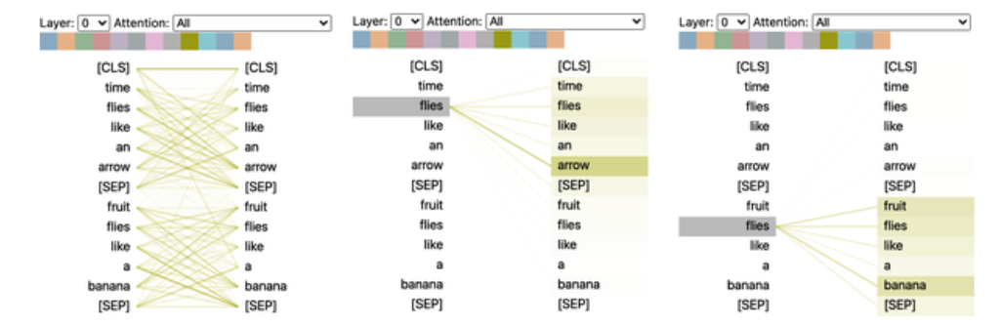

这个可视化图显示了注意力权重，它是连接嵌入被更新的标记（左边）和被注意力的每个词（右边）的线条。线条的强度表示注意力权重的强度，暗线代表接近1的值，暗线代表接近0的值。在这个例子中，输入由两个句子组成，[CLS]和[SEP]标记是我们在第二章中遇到的BERT的标记器中的特殊标记。从可视化中我们可以看到的一点是，在属于同一个句子的单词之间，注意力权重是最强的，这表明BERT可以告诉它应该注意力同一个句子中的单词。然而，对于 "苍蝇 "这个词，我们可以看到，BERT在第一个句子中认定 "arrow "是重要的，而在第二个句子中认定 "fruit "和 "banana "是重要的。这些注意权重使模型能够区分 "flies "作为动词或名词的使用，这取决于它出现的语境!

现在我们已经涵盖了注意力，让我们来看看如何实现编码器层的缺失部分：位置导向的前馈网络。


### 前馈层

编码器和解码器中的前馈子层只是一个简单的双层全连接神经网络，但有一个转折：它不是把整个嵌入序列作为一个单一的向量来处理，而是独立地处理每个嵌入物。由于这个原因，这个层通常被称为位置前馈层。你也可能看到它被称为核大小为1的单维卷积，通常由具有计算机视觉背景的人使用（例如，OpenAI的GPT代码库使用这种命名法）。文献中的一个经验法则是，第一层的隐藏大小是嵌入大小的四倍，最常使用的是GELU激活函数。这是大部分容量和记忆假设发生的地方，也是扩大模型规模时最常扩展的部分。我们可以将其作为一个简单的nn.Module来实现，如下:

```
class FeedForward(nn.Module): 
	def __init__(self, config): 
        super().__init__() 
        self.linear_1 = nn.Linear(config.hidden_size, config.intermediate_size) 
        self.linear_2 = nn.Linear(config.intermediate_size, config.hidden_size) 
        self.gelu = nn.GELU() 
        self.dropout = nn.Dropout(config.hidden_dropout_prob) 
	def forward(self, x): 
		x = self.linear_1(x) 
		x = self.gelu(x) 
		x = self.linear_2(x) 
		x = self.dropout(x) 
		return x

```

请注意，像nn.Linear这样的前馈层通常应用于一个（batch_size, input_dim）形状的张量，它独立地作用于批次维度的每个元素。实际上，除了最后一个维度，其他维度都是如此，所以当我们传递一个（batch_size, seq_len, hidden_dim）形状的张量时，该层会独立地应用于批和序列的所有标记嵌入，这正是我们想要的。让我们通过传递注意力输出来测试一下:

```
feed_forward = FeedForward(config) 
ff_outputs = feed_forward(attn_outputs) 
ff_outputs.size() 

torch.Size([1, 5, 768])

```

我们现在有了创建一个成熟的Transformers编码器层的所有要素 唯一要做的决定是在哪里放置跳过连接和层规范化。让我们来看看这对模型结构有什么影响。

### 添加层归一化（normalization）

如前所述，Transformer架构利用了层归一化和跳过连接。前者将批次中的每个输入归一化，使其具有零均值和统一方差。跳过连接将张量传递给模型的下一层，而不进行处理，并将其添加到处理后的张量中。当涉及到将层规范化放在Transformers的编码器或解码器层时，文献中主要有两种选择：

**层后归一化** 
这是Transformer论文中使用的安排；它将层规范化置于跳过连接之间。这种安排对于从头开始训练是很棘手的，因为梯度可能会出现偏差。出于这个原因，你会经常看到一个被称为学习率预热的概念，在训练过程中，学习率从一个小值逐渐增加到某个最大值。
**层预归一化**
这是在文献中发现的最常见的安排；它将层规范化放在跳过连接的跨度内。这在训练中往往更稳定，而且通常不需要任何学习率预热。

图3-6说明了这两种安排的区别：


我们将使用第二种安排，因此我们可以简单地将我们的积木粘在一起，如下所示：

```
class TransformerEncoderLayer(nn.Module): 
	def __init__(self, config): 
        super().__init__() 
        self.layer_norm_1 = nn.LayerNorm(config.hidden_size) 
        self.layer_norm_2 = nn.LayerNorm(config.hidden_size) 
        self.attention = MultiHeadAttention(config) 
        self.feed_forward = FeedForward(config) 
	def forward(self, x): 
		# Apply layer normalization and then copy input into query, key, valu
		hidden_state = self.layer_norm_1(x) 
		# Apply attention with a skip connection 
		x = x + self.attention(hidden_state) 
		# Apply feed-forward layer with a skip connection 
		x = x + self.feed_forward(self.layer_norm_2(x)) 
		return x

```

现在让我们用我们的输入嵌入来测试一下：

```
encoder_layer = TransformerEncoderLayer(config) 
inputs_embeds.shape, encoder_layer(inputs_embeds).size() 

(torch.Size([1, 5, 768]), torch.Size([1, 5, 768]))

```

我们现在已经从头开始实现了我们的第一个Transformers编码器层 然而，我们设置编码器层的方式有一个注意事项：它们对标记的位置是完全不变的。由于多头注意力层实际上是一个花哨的加权和，所以关于标记位置的信息就会丢失。

幸运的是，有一个简单的技巧可以使用位置嵌入来纳入位置信息。让我们来看一下。

### 位置嵌入

位置嵌入是基于一个简单但非常有效的想法：用一个排列在向量中的、与位置相关的数值模式来增强标记嵌入。如果该模式对每个位置都有特点，每个堆栈中的注意头和前馈层就能学会将位置信息纳入它们的转换中。

有几种方法可以实现这一点，最流行的方法之一是使用可学习的模式，特别是当预训练数据集足够大时。这与标记嵌入的工作方式完全相同，但使用位置索引而不是标记ID作为输入。通过这种方法，在预训练期间就可以学到一种有效的编码标记位置的方法。

让我们创建一个自定义的嵌入模块，它结合了一个标记嵌入层，将输入_ids投射到一个密集的隐藏状态，同时也结合了位置嵌入，对位置_ids做同样的处理。由此产生的嵌入是两个嵌入的简单总和：

```
class Embeddings(nn.Module): 
	def __init__(self, config): 
        super().__init__() 
        self.token_embeddings = nn.Embedding(config.vocab_size, config.hidden_size) 
        self.position_embeddings = nn.Embedding(config.max_position_embeddings, config.hidden_size) 
        self.layer_norm = nn.LayerNorm(config.hidden_size, eps=1e-12) 
        self.dropout = nn.Dropout() 
	def forward(self, input_ids): 
        # Create position IDs for input sequence 
        seq_length = input_ids.size(1) 
        position_ids = torch.arange(seq_length, dtype=torch.long).unsqueeze(0)
        # Create token and position embeddings 
        token_embeddings = self.token_embeddings(input_ids) 
        position_embeddings = self.position_embeddings(position_ids) 
        # Combine token and position embeddings 
        embeddings = token_embeddings + position_embeddings 
        embeddings = self.layer_norm(embeddings) 
        embeddings = self.dropout(embeddings) 
        return embeddings 
    embedding_layer = Embeddings(config) 
    embedding_layer(inputs.input_ids).size() 
    
    torch.Size([1, 5, 768])

```


我们看到，嵌入层现在为每个标记创建了一个单一的、密集的嵌入。

虽然可学习的位置嵌入很容易实现并被广泛使用，但也有一些替代方法。

**绝对位置表示法**

Transformers模型可以使用由调制的正弦和余弦信号组成的静态模式来编码标记的位置。在没有大量数据可用的情况下，这种方法效果特别好。

**相对位置表示法** 

虽然绝对位置很重要，但人们可以认为，在计算嵌入时，周围的标记是最重要的。相对位置表征遵循这一直觉，并对标记之间的相对位置进行编码。这不能通过在开始时引入一个新的相对嵌入层来建立，因为每个标记的相对嵌入都会发生变化，这取决于我们在序列中的哪个位置对其进行注意力。相反，注意机制本身被修改了，增加了考虑到标记之间相对位置的条款。像DeBERTa这样的模型就使用这样的表述。

现在，让我们把所有这些放在一起，建立完整的Transformers编码器，把嵌入和编码器层结合起来：

```
class TransformerEncoder(nn.Module): 
	def __init__(self, config): super().__init__() 
		self.embeddings = Embeddings(config) 
		self.layers = nn.ModuleList([TransformerEncoderLayer(config) for _ in range(config.num_hidden_layers)]) 
	def forward(self, x): x = self.embeddings(x) 
		for layer in self.layers: 
			x = lay
		return x
		

```

让我们检查一下编码器的输出形状:

```
encoder = TransformerEncoder(config) 
encoder(inputs.input_ids).size()

torch.Size([1, 5, 768])

```

我们可以看到，我们为批次中的每个标记得到一个隐藏状态。这种输出格式使得架构非常灵活，我们可以很容易地将其调整为各种应用，例如预测掩码语言建模中的缺失标记，或者预测问题回答中答案的开始和结束位置。在下一节中，我们将看到如何建立一个像我们在第二章中使用的分类器。

### 添加一个分类头

Transformers模型通常分为一个独立于任务的主体和一个特定于任务的头部。我们将在第四章看Transformers的设计模式时再次遇到这种模式。到目前为止，我们所建立的是主体，所以如果我们想建立一个文本分类器，我们需要在这个主体上附加一个分类头。我们对每个标记都有一个隐藏状态，但我们只需要做一个预测。有几种方案可以处理这个问题。传统上，这类模型中的第一个标记被用于预测，我们可以附加一个dropout和一个线性层来进行分类预测。下面的类扩展了现有的序列分类的编码器:

```
class TransformerForSequenceClassification(nn.Module): 
	def __init__(self, config): 
		super().__init__() 
		self.encoder = TransformerEncoder(config) 
		self.dropout = nn.Dropout(config.hidden_dropout_prob) 
		self.classifier = nn.Linear(config.hidden_size, config.num_labels) 
	def forward(self, x): 
		x = self.encoder(x)[:, 0, :] 
		# select hidden state of [CLS] token 
		x = self.dropout(x) 
		x = self.classifier(x) 
		return x
```

在初始化模型之前，我们需要定义我们想预测多少个类:

```
config.num_labels = 3 
encoder_classifier = TransformerForSequenceClassification(config) 
encoder_classifier(inputs.input_ids).size() 


torch.Size([1, 3])

```

这正是我们一直在寻找的东西。对于批次中的每个例子，我们在输出中得到了每个类别的非正常化对数。这对应于我们在第二章中用来检测推文中的情绪的BERT模型。

这就结束了我们对编码器的分析，以及我们如何将其与特定任务的头结合起来。现在让我们把注意力（双关语）投向解码器。

### 解码器

如图3-7所示，解码器和编码器的主要区别是，解码器有两个注意子层：


**屏蔽的多头自注意力层** 
确保我们在每个时间点产生的标记只基于过去的输出和当前被预测的标记。如果没有这一点，解码器在训练过程中可以通过简单地复制目标翻译来作弊；屏蔽输入确保这项任务不是轻而易举的。
**编码器-解码器注意层** 
对编码器堆栈的输出键和值向量进行多头注意力，解码器的中间表示作为查询。这样，编码器-解码器注意层就学会了如何将来自两个不同序列的标记联系起来，比如两种不同的语言。解码器可以访问每个块中的编码器键和值。

让我们来看看我们需要做出的修改，以便在我们的自注意力层中加入掩码，并将编码器-解码器注意层的实现作为一个家庭作业问题。掩蔽式自注意力的诀窍是引入一个掩蔽矩阵，在对角线的下方为1，上方为0 ：

```
seq_len = inputs.input_ids.size(-1) 
mask = torch.tril(torch.ones(seq_len, seq_len)).unsqueeze(0) 
mask[0]


tensor([
[1., 0., 0., 0., 0.], 
[1., 1., 0., 0., 0.], 
[1., 1., 1., 0., 0.], 
[1., 1., 1., 1., 0.], 
[1., 1., 1., 1., 1.]
])

```

这里我们使用了PyTorch的tril()函数来创建下三角矩阵。一旦我们有了这个掩码矩阵，我们就可以通过使用Tensor.masked_fill()将所有的0替换成负无穷来防止每个注意头偷看未来的令牌：

```
scores.masked_fill(mask == 0, -float("inf")) 

tensor([[
[26.8082, -inf, -inf, -inf, -inf], 
[-0.6981, 26.9043, -inf, -inf, -inf], 
[-2.3190, 1.2928, 27.8710, -inf, -inf], 
[-0.5897, 0.3497, -0.3807, 27.5488, -inf], 
[ 0.5275, 2.0493, -0.4869, 1.6100, 29.0893]]], grad_fn=<MaskedFillBackward0>)

```

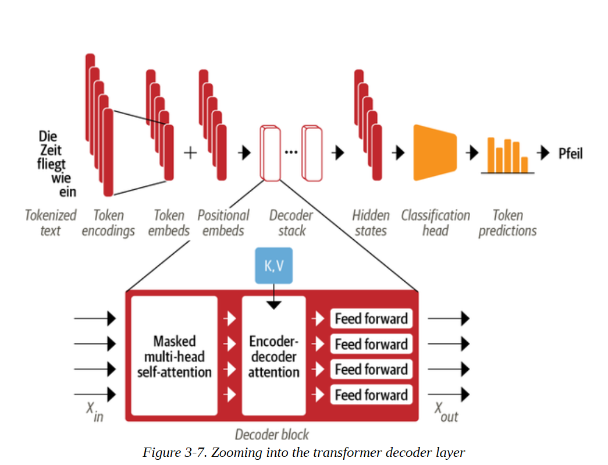

通过将上限值设置为负无穷大，我们保证一旦我们在分数上取得softmax，注意力权重都是零，因为e-∞=0（记得softmax是计算归一化指数的）。我们可以通过对本章前面实现的缩放点乘法注意力函数的一个小改动，轻松地将这种遮蔽行为包括在内：

```
def scaled_dot_product_attention(query, key, value, mask=None): 
	dim_k = query.size(-1) 
	scores = torch.bmm(query, key.transpose(1, 2)) / sqrt(dim_k) 
	if mask is not None: 
		scores = scores.masked_fill(mask == 0, float("-inf")) 
	weights = F.softmax(scores, dim=-1) 
	return weights.bmm(value)

```

从这里开始，建立解码层是一件很简单的事情；我们向读者指出Andrej Karpathy的minGPT的出色实现，以了解细节。

我们在这里给了你很多技术信息，但现在你应该对Transformer架构的每一块都有很好的理解。在我们继续为比文本分类更高级的任务建立模型之前，让我们回过头来看看不同的Transformer模型的情况以及它们之间的关系，以此来完善本章。

**揭开编码器-解码器注意力的神秘面纱** 

让我们来看看我们是否能对编码器-解码器注意力的奥秘做出一些解释。想象一下，你（解码器）在课堂上参加考试。你的任务是根据之前的单词（解码器输入）来预测下一个单词，这听起来很简单，但却非常难（你自己试试，预测本书中的一段话的下一个单词）。幸运的是，你的邻居（编码器）有完整的文本。不幸的是，他们是一个外国交换生，文本是他们的母语。狡猾的学生们，你们还是想出了一个办法来作弊。你画了一幅小漫画，说明你已经拥有的文本（Query），并把它给你的邻居。他们试着找出符合该描述的段落（Key），画一幅描述该段落后面的词的漫画（Value），然后把它传回给你。有了这个系统，你就能在考试中获胜。

## 见识  Transformers

正如你在本章中所看到的，Transformers模型有三种主要架构：编码器、解码器和编码器-解码器。早期Transformers模型的最初成功引发了模型开发的寒武纪爆炸，因为研究人员在不同规模和性质的数据集上建立模型，使用新的预训练目标，并调整架构以进一步提高性能。尽管模型的动物园仍在快速增长，但它们仍可分为这三类。

在这一节中，我们将对每个类中最重要的Transformers模型进行简要介绍。让我们先来看看Transformers的家族树。

### Transfomers 家族

随着时间的推移，三种主要架构中的每一种都经历了自己的演变。图3-8说明了这一点，它显示了几个最突出的模型和它们的后代。

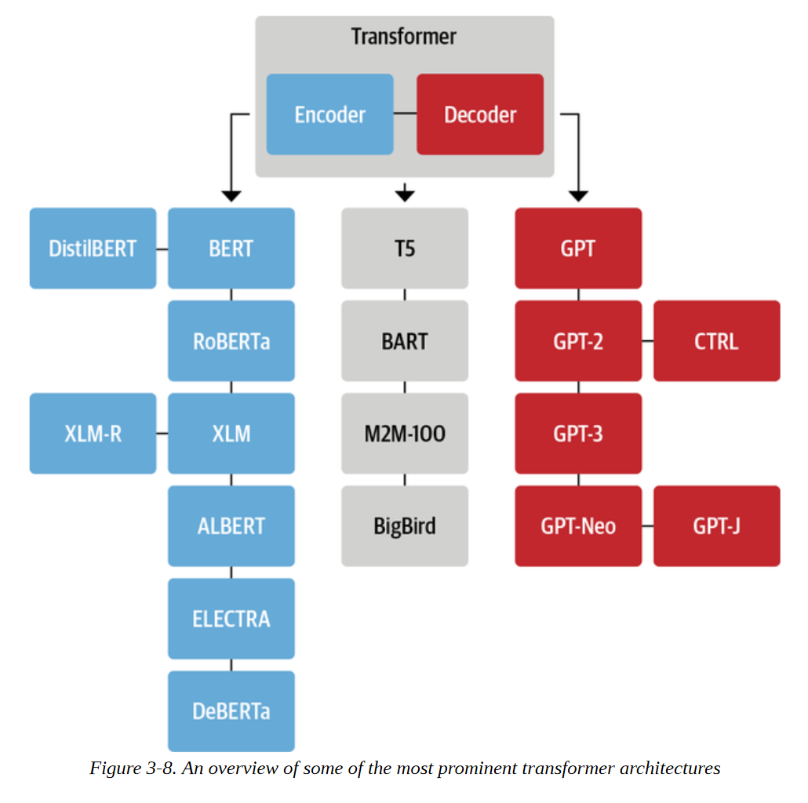

Transformers中包含了50多种不同的架构，这个家族树绝不是对所有存在的架构提供一个完整的概述：它只是强调了一些架构的里程碑。我们已经在本章中深入介绍了原始的Transformer架构，所以让我们仔细看看一些关键的后代，从编码器分支开始。

#### 编码器分支
第一个基于Transformer架构的纯编码器模型是BERT。在它发表的时候，它在流行的GLUE基准上的表现超过了所有最先进的模型，该基准在几个难度不同的任务中衡量自然语言理解（NLU）。随后，BERT的预训练目标和架构被调整，以进一步提高性能。在文本分类、命名实体识别和问题回答等NLU任务方面，仅有编码器的模型仍然在研究和工业界中占主导地位。让我们简单了解一下BERT模型及其变体。
 **BERT** 
BERT的预训练有两个目标，一是预测文本中的掩蔽标记，二是确定一个文本段落是否可能紧跟另一个文本段落。前一项任务称为掩蔽语言建模（MLM），后一项任务称为下一句话预测（NSP）。
**DistilBERT** 

虽然BERT提供了很好的结果，但它的规模可能使它在需要低延迟的环境中部署起来很麻烦。通过在预训练期间使用一种被称为知识提炼的技术，DistilBERT实现了BERT 97%的性能，同时使用的内存减少了40%，速度提高了60%。你可以在第8章中找到关于知识蒸馏的更多细节。

**RoBERTa**

BERT发布后的一项研究表明，通过修改预训练方案可以进一步提高其性能。RoBERTa的训练时间更长，在更大的批次上有更多的训练数据，而且它放弃了NSP任务。这些变化加在一起，与原来的BERT模型相比，大大改善了它的性能。
**XLM** 

在跨语种语言模型（XLM）的工作中，探讨了建立多语种模型的几个预训练目标，包括来自GPT类模型的自回归语言模型和来自BERT的MLM。此外，关于XLM预训练的论文作者还介绍了翻译语言模型（TLM），它是MLM对多语言输入的扩展。通过对这些预训练任务进行实验，他们在几个多语言NLU基准以及翻译任务上取得了最先进的结果。
**XLM-RoBERTa**

在XLM和RoBERTa的工作之后，XLM-RoBERTa或XLM-R模型通过大规模地扩大训练数据，将多语言预训练向前推进了一步。利用Common Crawl语料库，其开发者创建了一个拥有2.5TB文本的数据集；然后他们在这个数据集上用MLM训练了一个编码器。由于该数据集只包含没有平行文本（即翻译）的数据，XLM的TLM目标被放弃。这种方法在很大程度上战胜了XLM和多语种的BERT变体，特别是在低资源语言上。

**ALBERT** 

ALBERT模型引入了三个变化，以使编码器的结构更加有效。首先，它将令牌嵌入维度与隐藏维度解耦，从而使嵌入维度变小，从而节省参数，特别是当词汇量变大时。第二，所有层共享相同的参数，10 11 12 1
这就进一步减少了有效参数的数量。最后，NSP目标被替换为句子排序预测：模型需要预测两个连续句子的顺序是否被调换，而不是预测它们是否根本就属于一起。这些变化使得用更少的参数训练更大的模型成为可能，并在NLU任务上达到卓越的性能。
**ELECTRA** 

标准MLM预训练目标的一个局限性是，在每个训练步骤中，只有被掩盖的标记的表征被更新，而其他输入标记没有被更新。为了解决这个问题，ELECTRA使用了一种双模型的方法：第一个模型（通常是小的）像标准的遮蔽语言模型一样工作，并预测遮蔽的标记。第二个模型，称为鉴别器，然后的任务是预测第一个模型输出中的哪些标记最初是被掩盖的。因此，鉴别器需要对每个标记进行二元分类，这使得训练效率提高了30倍。对于下游任务，判别器像标准的BERT模型一样进行微调。

**DeBERTa** 

DeBERTa模型引入了两个架构变化。首先，每个标记被表示为两个向量：一个表示内容，另一个表示相对位置。通过将标记的内容与它们的相对位置分开，自注意力力层可以更好地模拟附近标记对的依赖性。另一方面，一个词的绝对位置也很重要，特别是对于解码来说。出于这个原因，在标记解码头的softmax层之前加入了一个绝对位置嵌入。DeBERTa是第一个在SuperGLUE基准测试中击败人类基线的模型（作为一个组合），SuperGLUE是GLUE的一个更难的版本，由几个子任务组成，用于衡量NLU的性能。

现在我们已经强调了一些主要的纯编码器架构，让我们来看看纯解码器的模型。

#### 解码器分支

Transformers解码器模型的进展在很大程度上是由OpenAI带头进行的。这些模型在预测序列中的下一个词方面非常出色，因此大多用于文本生成任务（详见第五章）。他们的进步是通过使用更大的数据集和将语言模型扩展到越来越大的规模来推动的。让我们来看看这些迷人的生成模型的演变。
**GPT** 

GPT的引入结合了NLP的两个关键想法：新颖高效的Transformers解码器架构，以及转移学习。在那个设置中，模型是通过根据以前的词来预测下一个词来进行预训练的。该模型在BookCorpus上进行了训练，并在分类等下游任务上取得了巨大的成果。
 **GPT-2** 

受简单和可扩展的预训练方法的成功启发，原始模型和训练集被放大以产生GPT-2。这个模型能够产生长序列的连贯文本。由于担心可能的误用，该模型以分阶段的方式发布，较小的模型先发布，完整的模型随后发布。
**CTRL** 

像GPT-2这样的模型可以继续一个输入序列（也叫提示）。然而，用户对生成序列的风格几乎没有控制权。条件Transformers语言（CTRL）模型通过在序列的开头添加 "控制标记 "来解决这个问题。序列的开头添加 "控制标记"。这些允许控制生成文本的风格，从而允许多样化的生成。

**GPT-3** 

在成功地将GPT扩展到GPT-2之后，对不同规模的语言模型的行为进行了彻底的分析，发现在计算、数据集大小、模型大小和语言模型的性能之间存在着简单的幂律。在这些见解的启发下，GPT-2被放大了100倍，产生了GPT-3，有1750亿个参数。除了能够生成令人印象深刻的现实文本段落外，该模型还表现出少量的学习能力：只要有几个新任务的例子，如将文本翻译成代码，该模型就能够在新的例子上完成任务。OpenAI没有将这个模型开源，但通过OpenAI的API提供了一个接口。
**GPT-Neo/GPT-J-6B** 

GPT-Neo和GPT-J-6B是由EleutherAI训练的类似于GPT的模型，EleutherAI是一个旨在重新创建和发布GPT-3规模模型的研究者集体。目前的模型是完整的1750亿个参数模型的较小变体，有13亿、27亿和60亿个参数，与OpenAI提供的较小的GPT-3模型相比，具有竞争力。

Transformers生命之树的最后一个分支是编码器-解码器模型。让我们来看看。

### 编码器-解码器分支

虽然使用单一的编码器或解码器堆栈来构建模型已经很普遍，但Transformer架构有几个编码器-解码器的变体，在NLGU和NLG领域都有新的应用：

**T5** 

T5模型通过将所有的NLU和NLG任务转换为文本到文本的任务来统一它们。所有的任务都被设定为序列到序列的任务，其中采用编码器-解码器架构是很自然的。例如，对于文本分类问题，这意味着文本被用作编码器的输入，而解码器必须将标签生成为正常文本，而不是一个类别。我们将在第六章中更详细地研究这个问题。T5架构使用原始的Transformer架构。使用大型抓取的C4数据集，通过将所有的任务转化为文本到文本的任务，用掩码语言建模以及SuperGLUE任务对模型进行预训练。拥有110亿个参数的最大模型在几个基准上产生了最先进的结果。

**BART** 

BART结合了BERT和GPT在编码器-解码器架构中的预训练程序。输入序列经历了几种可能的转换之一，从简单的掩蔽到句子排列、标记删除和文档旋转。这些修改后的输入通过编码器，而解码器则必须重建原始文本。这使得该模型更加灵活，因为它有可能用于NLU和NLG任务，并且在这两个方面都达到了最先进的性能水平。

**M2M-100**

传统上，一个翻译模型是为一个语言对和翻译方向建立的。当然，这并不能扩展到许多语言，此外，语言对之间可能存在共享知识，可以利用这些知识进行罕见语言之间的翻译。M2M-100是第一个可以在100种语言中的任何一种之间进行翻译的翻译模型。这允许在罕见和代表性不足的语言之间进行高质量的翻译。该模型使用前缀令牌（类似于特殊的[CLS]令牌）来表示源语言和目标语言。

**BigBird** 

Transformers模型的一个主要限制是最大的上下文大小，这是由于注意力机制的二次方级的内存要求。BigBird通过使用线性扩展的稀疏形式的注意力来解决这个问题。这使得上下文的规模可以从大多数BERT模型中的512个标记急剧扩展到BigBird中的4096个。这在需要保留长依赖关系的情况下特别有用，例如在文本总结中。

我们在本节中看到的所有模型的预训练检查点都可以在Hugging Face Hub上找到，并且可以用Transformers对你的使用情况进行微调，如前一章所述。

## 小结

在这一章中，我们从Transformer架构的核心开始，对自注意力力进行了深入的研究，随后我们添加了所有必要的部分来构建一个Transformer编码器模型。我们为标记和位置信息添加了嵌入层，我们建立了一个前馈层来补充注意力头，最后我们在模型主体上添加了一个分类头来进行预测。我们还看了一下Transformer架构的解码器方面，并在本章的最后概述了最重要的模型架构。现在你对基本原理有了更好的理解，让我们超越简单的分类，建立一个多语言的命名实体识别模型。
