# 第４章 多语言命名实体识别

&emsp;&emsp;到目前为止，在本书中我们已经应用了Transformers来解决英语语料的NLP任务，但如果你的文件是用希腊语、斯瓦希里语或克林贡语写的，你该怎么办？ 一种方法是在Hugging Face Hub上搜索合适的预训练语言模型，并在手头的任务上对其进行微调。 然而，这些预训练的模型往往只存在于像德语、俄语或普通话这样的 "高资源 "语言，这些语言有大量的网络文本可供预训练。 当你的语料库是多语言的时候，另一个常见的挑战出现了。 在产品化环境中维护多个单语模型对你和你的工程团队来说不会有任何乐趣。 

&emsp;&emsp;幸运的是，有一类多语言Transformers前来救援。 与BERT一样，这些模型使用屏蔽语言建模作为预训练目标，但它们是在一百多种语言的文本上联合训练的。 通过对多种语言的巨大语料库进行预训练，这些多语言Transformers能够实现零距离的跨语言转换。 这意味着，在一种语言上经过微调的模型可以应用于其他语言，而不需要任何进一步的训练! 这也使得这些模型非常适合于 "语码转换"，即说话者在一次对话中交替使用两种或更多的语言或方言。

 &emsp;&emsp;在本章中，我们将探讨如何对一个名为XLM-RoBERTa的单一Transformers模型（在第三章中介绍）进行微调，以便在几种语言中进行命名实体识别（NER）。 正如我们在第一章中所看到的，NER是一项常见的NLP任务，用于识别文本中的实体，如人物、组织或地点。 这些实体可用于各种应用，如从公司文件中获得洞察力，提高搜索引擎的质量，或只是从语料库中建立一个结构化数据库。

在本章中，我们假设我们要为一个位于瑞士的客户进行NER，那里有四种国家语言（英语通常作为它们之间的桥梁）。 我们首先要为这个问题获得一个合适的多语言语料库。

**注意事项**

零样本迁移或零样本学习通常是指在一组标签上训练一个模型，然后在另一组标签上对其进行评估的任务。 在Transformers的背景下，零样本学习也可以指像GPT-3这样的语言模型在下游任务上被评估，而它甚至没有被微调过的情况。


## 数据集

在本章中，我们将使用多语言编码器的跨语言TRansfer评估（XTREME）基准的一个子集，称为WikiANN或PAN-X。 该数据集由多种语言的维基百科文章组成，包括瑞士最常用的四种语言。 德语（62.9%）、法语（22.9%）、意大利语（8.4%）和英语（5.9%）。 每篇文章都用LOC（地点）、PER（人物）和ORG（组织）标签以 "内-外-内"（IOB2）的格式进行了注释。 在这种格式中，B-前缀表示一个实体的开始，而属于同一实体的连续标记被赋予I-前缀。 一个O标记表示该标记不属于任何实体。 例如，下面这句话：

```
Jeff Dean is a computer scientist at Google in California would be labeled in IOB2 format as shown in Table 4-1.

```

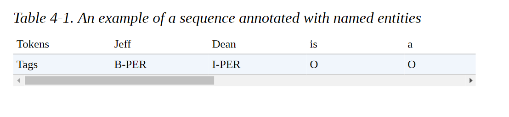

要在XTREME中加载PAN-X子集之一，我们需要知道哪种数据集配置要传递给load_dataset()函数。 每当你处理一个有多个域的数据集时，你可以使用get_dataset_config_names()函数来找出哪些子集可用：

```
from datasets import get_dataset_config_names 
xtreme_subsets = get_dataset_config_names("xtreme") 
print(f"XTREME has {len(xtreme_subsets)} configurations") 

XTREME has 183 configurations

```

哇，那是一个很大的配置! 让我们缩小搜索范围，只寻找以 "PAN "开头的配置：

```
panx_subsets = [s for s in xtreme_subsets if s.startswith("PAN")]
panx_subsets[:3] ['PAN-X.af', 'PAN-X.ar', 'PAN-X.bg']

```

好了，看来我们已经确定了PAN-X子集的语法。 每个人都有一个两个字母的后缀，似乎是一个ISO 639-1语言代码。 这意味着，为了加载德语语料库，我们将de代码传递给load_dataset()的name参数，如下所示：

```
from datasets import load_dataset 
load_dataset("xtreme", name="PAN-X.de")

```

为了制作一个真实的瑞士语料库，我们将根据口语比例对PAN-X的德语（de）、法语（fr）、意大利语（it）和英语（en）语料库进行采样。 这将造成语言的不平衡，这在现实世界的数据集中是非常常见的，由于缺乏精通该语言的领域专家，获取少数语言的标注实例可能会很昂贵。 这个不平衡的数据集将模拟多语言应用工作中的常见情况，我们将看到我们如何建立一个对所有语言都有效的模型。

为了跟踪每一种语言，让我们创建一个Python defaultdict，将语言代码作为键，将DatasetDict类型的PAN-X语料库作为值:

```
from collections import defaultdict 
from datasets import DatasetDict 
langs = ["de", "fr", "it", "en"] 
fracs = [0.629, 0.229, 0.084, 0.059] 
# Return a DatasetDict if a key doesn't exist 
panx_ch = defaultdict(DatasetDict) 
for lang, frac in zip(langs, fracs): 
	# Load monolingual corpus 
	ds = load_dataset("xtreme", name=f"PAN-X.{lang}") 
	# Shuffle and downsample each split according to spoken proportion 
	for split in ds: 
		panx_ch[lang][split] = ( ds[split] .shuffle(seed=0) .select(range(int(frac * ds[split].num_rows))))

```

在这里，我们使用shuffle()方法来确保我们不会意外地偏离我们的数据集拆分，而select()允许我们根据fracs中的值对每个语料库进行降样。 让我们通过访问Dataset.num_rows属性来看看我们在训练集中每个语言有多少个例子:

```
import pandas as pd 
pd.DataFrame({lang: [panx_ch[lang]["train"].num_rows] for lang in langs}, index=["Number of training examples"])

```

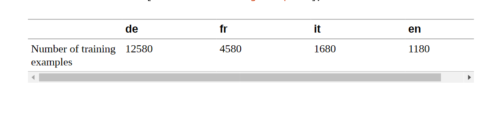

根据设计，我们在德语中的例子比其他所有语言的总和还要多，所以我们将以德语为起点，对法语、意大利语和英语进行Zeroshot跨语言转移。 让我们检查一下德语语料库中的一个例子:

```
element = panx_ch["de"]["train"][0] 
for key, value in element.items(): 
	print(f"{key}: {value}") 

langs: ['de', 'de', 'de', 'de', 'de', 'de', 'de', 'de', 'de', 'de', 'de', 'de'] ner_tags: [0, 0, 0, 0, 5, 6, 0, 0, 5, 5, 6, 0] tokens: ['2.000', 'Einwohnern', 'an', 'der', 'Danziger', 'Bucht', 'in', 'der', 'polnischen', 'Woiwodschaft', 'Pommern', '.']

```

与我们之前遇到的数据集对象一样，我们的例子中的键对应于Arrow表中的列名，而值则表示每一列中的条目。 特别是，我们看到ner_tags列对应于每个实体与一个类ID的映射。 这对人的眼睛来说有点神秘，所以让我们用熟悉的LOC、PER和ORG标签创建一个新列。 要做到这一点，首先要注意的是，我们的数据集对象有一个特征属性，指定与每一列相关的基础数据类型:

```
for key, value in panx_ch["de"]["train"].features.items(): 
	print(f"{key}: {value}") 

tokens: Sequence(feature=Value(dtype='string', id=None), length=-1, id=None) ner_tags: Sequence(feature=ClassLabel(num_classes=7, names=['O', 'B-PER', 'I-PER', 'B-ORG', 'I-ORG', 'B-LOC', 'I-LOC'], names_file=None, id=None), length=-1, id=None) langs: Sequence(feature=Value(dtype='string', id=None), length=-1, id=None)

```

序列类指定该字段包含一个特征列表，在ner_tags的情况下，它对应于ClassLabel特征列表。 让我们从训练集中挑出这个特征，如下:

```
tags = panx_ch["de"]["train"].features["ner_tags"].feature 
print(tags) 

ClassLabel(num_classes=7, names=['O', 'B-PER', 'I-PER', 'B-ORG', 'I-ORG', 'B-LOC', 'I-LOC'], names_file=None, id=None)

```

我们可以使用第二章中遇到的ClassLabel.int2str()方法，在我们的训练集中为每个标签创建一个带有类名的新列。 我们将使用map()方法返回一个dict，其键对应于新的列名，其值是一个类名的列表:

```
def create_tag_names(batch): 
	return {"ner_tags_str": [tags.int2str(idx) for idx in batch["ner_tags"]]} 
panx_de = panx_ch["de"].map(create_tag_names)

```

现在我们有了人类可读格式的标签，让我们看看训练集中第一个例子的标记和标签是如何对齐的:

```
de_example = panx_de["train"][0] 
pd.DataFrame([de_example["tokens"], de_example["ner_tags_str"]], ['Tokens', 'Tags'])

```

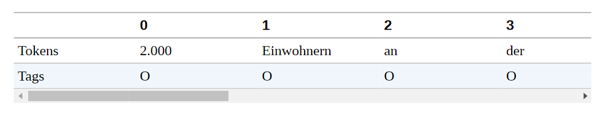

LOC标签的存在是有意义的，因为句子 "2,000 Einwohnern an der Danziger Bucht in der polnischen Woiwodschaft Pommern "在英语中是指 "波兰波美拉尼亚省格但斯克湾的2,000名居民"，而格但斯克湾是波罗的海的一个海湾，而 "voivodeship "对应的是波兰的一个州。

作为快速检查，我们没有在标签中出现任何不寻常的不平衡，让我们计算每个实体在每个子集中的频率:


```
from collections import Counter 
split2freqs = defaultdict(Counter) 
for split, dataset in panx_de.items(): 
	for row in dataset["ner_tags_str"]: 
		for tag in row: 
			if tag.startswith("B"): 
				tag_type = tag.split("-")[1] 
				split2freqs[split][tag_type] += 1 

pd.DataFrame.from_dict(split2freqs, orient="index")

```

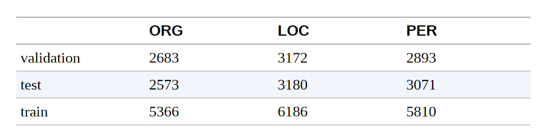

这看起来不错--PER、LOC和ORG频率的分布在每个分组中大致相同，因此验证集和测试集应该能够很好地衡量我们的NER标记器的概括能力。 接下来，让我们看看几个流行的多语言Transformers，以及如何调整它们来处理我们的NER任务。

## 多语言Transformers

多语言Transformers涉及类似于单语言Transformers的架构和训练程序，只是用于预训练的语料库由多种语言的文件组成。 这种方法的一个显著特点是，尽管没有收到区分语言的明确信息，但所产生的语言表征能够在各种下游任务中很好地跨语言进行概括。 在某些情况下，这种进行跨语言转移的能力可以产生与单语言模型相竞争的结果，这就规避了为每一种语言训练一个模型的需要。


为了衡量NER的跨语言转移的进展，CoNLL2002和CoNLL-2003数据集通常被用作英语、荷兰语、西班牙语和德语的基准。 这个基准由新闻文章组成，其标注的LOC、PER和ORG类别与PAN-X相同，但它包含一个额外的MISC标签，用于标注不属于前三组的杂项实体。 多语言Transformers模型通常以三种不同的方式进行评估:

**en** 
在英语训练数据上进行微调，然后在每种语言的测试集中进行评估。 

**every**
 在单语测试数据上进行微调和评估，以衡量perlanguage的性能。 

**all**

在所有的训练数据上进行微调，在每种语言的测试集上进行评估。

我们将对我们的NER任务采取类似的评估策略，但首先我们需要选择一个模型来评估。 最早的多语言Transformers之一是mBERT，它使用与BERT相同的架构和预训练目标，但在预训练语料库中加入了许多语言的维基百科文章。 从那时起，mBERT已经被XLM-RoBERTa（简称XLM-R）所取代，所以这就是我们在本章要考虑的模型。

正如我们在第3章中所看到的，XLM-R只使用MLM作为100种语言的预训练目标，但与它的前辈相比，它的预训练语料库的规模巨大，因此而与众不同。 每种语言的维基百科转储和2.5TB的网络通用抓取数据。 这个语料库比早期模型所使用的语料库要大几个数量级，并为像缅甸语和斯瓦希里语这样只有少量维基百科文章的低资源语言提供了显著的信号提升。

该模型名称中的RoBERTa部分是指预训练方法与单语RoBERTa模型相同。

RoBERTa的开发者对BERT的几个方面进行了改进，特别是完全取消了下一句话的预测任务。 XLM-R还放弃了XLM中使用的语言嵌入，使用SentencePiece直接对原始文本进行标记。 除了多语言性质，XLM-R和RoBERTa之间的一个显著区别是各自词汇表的规模。 250,000个标记对55,000个!

XLM-R是多语言NLU任务的最佳选择。 在下一节中，我们将探讨它如何在多种语言中有效地进行标记化。

## 标记化详解 （tokenization)

XLM-R没有使用WordPiece标记器，而是使用一个名为SentencePiece的标记器，该标记器是在所有一百种语言的原始文本上训练出来的。 为了感受一下SentencePiece与WordPiece的比较，让我们以通常的方式用变形金刚加载BERT和XLM-R标记器:

```
from transformers import AutoTokenizer 
bert_model_name = "bert-base-cased" 
xlmr_model_name = "xlm-roberta-base" 
bert_tokenizer = AutoTokenizer.from_pretrained(bert_model_name) 
xlmr_tokenizer = AutoTokenizer.from_pretrained(xlmr_model_name)

```

通过对一小段文字的编码，我们也可以检索到每个模型在预训练时使用的特殊标记:

```
text = "Jack Sparrow loves New York!" 
bert_tokens = bert_tokenizer(text).tokens() 
xlmr_tokens = xlmr_tokenizer(text).tokens()

```

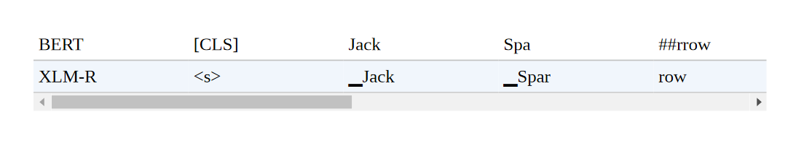

这里我们看到，XLM-R使用<s>和<s>来表示一个序列的开始和结束，而不是BERT用于句子分类任务的[CLS]和[SEP]标记。 这些令牌是在标记化的最后阶段添加的，我们接下来会看到。

### 标记器流水线

到目前为止，我们已经将标记化作为一个单一的操作，将字符串转换为我们可以通过模型传递的整数。 这并不完全准确，如果我们仔细观察，可以发现它实际上是一个完整的处理流水线，通常由四个步骤组成，如图4-1所示。


让我们仔细看看每个处理步骤，并通过 "杰克-斯派洛爱纽约！"这个例子说明它们的效果：


**数据规范化**

这一步对应于你对原始字符串进行的一系列操作，以使其 "更干净"。 Unicode规范化是另一种常见的规范化操作，由许多标记器应用，以处理同一字符经常存在各种写法的事实。 这可以使 "相同 "字符串的两个版本（即具有相同的抽象字符序列）看起来不同。 像NFC、NFD、NFKC和NFKD这样的Unicode规范化方案用标准形式取代了书写同一字符的各种方式。 规范化的另一个例子是小写字母。 如果预期模型只接受和使用小写字母，那么可以用这种技术来减少它所需要的词汇量的大小。 经过规范化处理后，我们的例子字符串将看起来像 "Jack Sparrow loves new york!"。

**预标记化**

这一步将文本分割成更小的对象，为训练结束时的标记提供一个上限。 一个好的方法是，预编码器将把你的文本分成 "词"，而你的最终标记将是这些词的一部分。 对于允许这样做的语言（英语、德语和许多印欧语系语言），字符串通常可以在空白处和标点符号上被分割成单词。 例如，这一步可能会改变我们的["jack", "sparrow", "loves", "new", "york", "！"]。 然后，在流水线的下一个步骤中，这些词被更简单地用字节对编码（BPE）或单字算法分割成子字。 然而，分割成 "字 "并不总是一个微不足道的确定操作，甚至不是一个有意义的操作。 例如，在中文、日文或韩文等语言中，在语义单位（如印欧语词）中对符号进行分组可以是一种非确定性的操作，有几个同样有效的分组。 在这种情况下，最好不要对文本进行预编码，而是使用特定的语言库进行预编码。

**标记器模型**

一旦输入文本被规范化和预标记化，标记化器就会在单词上应用一个子词分割模型。这是流水线的一部分，需要在你的语料库上进行训练（如果你使用的是预训练的标记器，则是已经训练过的）。该模型的作用是将词分成子词，以减少词汇量的大小，并试图减少词汇外标记的数量。存在几种子词标记化算法，包括BPE、Unigram和WordPiece。例如，我们运行的例子在应用标记化模型后可能看起来像[jack, spa, rrow, loves, new, york, !] 。请注意，此时我们不再有一个字符串的列表，而是一个整数的列表（输入ID）；为了保持这个例子的说明性，我们保留了单词，但去掉了引号以表示转换。

**后处理**

这是标记化流水线的最后一步，在这一步中，可以对标记列表进行一些额外的转换--例如，在输入的标记索引序列的开头或结尾添加特殊标记。例如，一个BERT风格的标记器会添加分类和分隔符。[CLS, jack, spa, rrow, loves, new, york, !, SEP]。这个序列（请记住，这将是一个整数序列，而不是你在这里看到的标记）然后可以被送入模型。


回到我们对XLM-R和BERT的比较，我们现在明白SentencePiece在后处理步骤中添加了<s>和<s>，而不是[CLS]和[SEP]（作为惯例，我们将在图形说明中继续使用[CLS]和[SEP]）。让我们回到SentencePiece标记器，看看它的特殊之处。

### SentencePiece标记器

SentencePiece标记器是基于一种称为Unigram的子词分割，并将每个输入文本编码为Unicode字符序列。这最后一个特点对多语言语料库特别有用，因为它允许SentencePiece对口音、标点符号以及许多语言（如日语）没有空白字符的事实不加考虑。SentencePiece的另一个特点是空白字符被分配到Unicode符号U+2581，即▁字符，也叫下四分之一块字符。这使得SentencePiece能够在没有歧义的情况下对一个序列进行去标记，而不需要依赖特定语言的预标记器。例如，在我们上一节的例子中，我们可以看到WordPiece丢失了 "York "和"！"之间没有空白的信息。相比之下，SentencePiece保留了标记化文本中的空白，因此我们可以毫无歧义地转换回原始文本：

```
"".join(xlmr_tokens).replace(u"\u2581", " ")
'<s> Jack Sparrow loves New York!</s>'


```

现在我们了解了SentencePiece的工作原理，让我们看看如何将我们的简单例子编码成适合NER的形式。首先要做的是给预训练的模型加载一个标记分类头。但我们不是直接从Transformers中加载这个头，而是自己建立它! 通过深入研究Transformers API，我们只需几个步骤就可以做到这一点。


## 命名实体识别的Transformers

在第2章中，我们看到，对于文本分类，BERT使用特殊的[CLS]标记来表示整个文本序列。然后，该表示法通过一个全连接或dense层来输出所有离散标签值的分布，如图4-2所示。

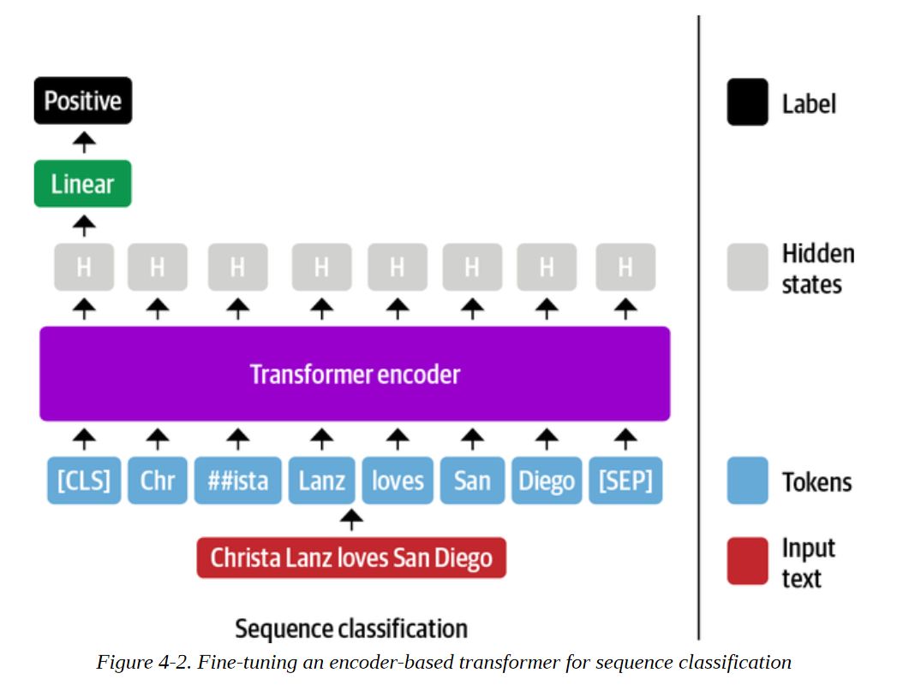

BERT和其他仅有编码器的变换器对NER采取了类似的方法，只是每个单独的输入标记的表示被送入同一个全连接层以输出标记的实体。由于这个原因，NER经常被看作是一个标记分类任务。这个过程看起来像图4-3中的图表。

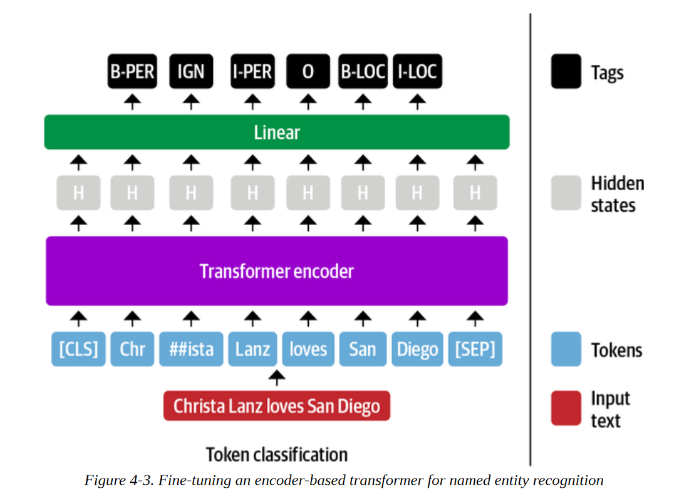

到目前为止，情况还不错，但是在标记分类任务中，我们应该如何处理子词呢？例如，图4-3中的名字 "Christa "被标记为子词 "Chr "和 "##ista"，那么哪一个子词应该被赋予B-PER标签呢？

在BERT的论文中，作者将这个标签分配给了第一个子词（在我们的例子中是 "Chr"），而忽略了后面的子词（"##ista"）。这就是我们在这里采用的惯例，我们将用IGN来表示被忽略的子词。我们以后可以在后处理步骤中轻松地将第一个子词的预测标签传播到后面的子词。我们可以 也可以选择通过给它分配一个B-LOC标签的副本来包括 "##ista "子词的表示，但这违反了IOB2的格式。

幸运的是，我们在BERT中看到的所有架构方面都延续到了XLM-R，因为它的架构是基于RoBERTa的，与BERT完全相同。接下来我们将看到Transformers是如何通过微小的修改来支持许多其他任务的。

## Transformers 模型类的剖析

Transformers 是围绕每个架构和任务的专用类来组织的。与不同任务相关的模型类是根据<ModelName>For<Task>惯例命名的，当使用AutoModel类时，则是AutoModelFor<Task>。

然而，这种方法有其局限性，为了激励深入了解Transformer API，请考虑以下情况。假设你有一个很好的想法，用一个Transformers 模型来解决一个你想了很久的NLP问题。因此，你安排了一次与老板的会议，并通过一个艺术性的PowerPoint演示文稿，推销说如果你能最终解决这个问题，就能增加你部门的收入。你丰富多彩的演示和对利润的谈论给你留下了深刻印象，你的老板慷慨地同意给你一个星期的时间来建立一个概念验证。对结果感到满意，你马上开始工作。你启动了你的GPU并打开了一个笔记本。你执行从transformers导入BertForTaskXY（注意，TaskXY是你想解决的假想任务），当可怕的红色充满你的屏幕时，你的脸色一下子变了。ImportError: cannot import name BertForTaskXY. 哦，不，没有适合你的用例的BERT模型! 如果你必须自己实现整个模型，你怎么能在一周内完成这个项目呢！？你甚至应该从哪里开始？

不要惊慌! Transformers 的设计是为了使你能够为你的特定使用情况轻松地扩展现有的模型。你可以从预训练的模型中加载权重，并且你可以访问特定任务的辅助函数。这让你可以用很少的开销为特定目标建立自定义模型。在本节中，我们将看到我们如何实现我们自己的自定义模型。

### 主体和头部

使得Transformers 如此多才多艺的主要概念是将架构分成主体和头部（正如我们在第一章中看到的）。我们已经看到，当我们从预训练任务切换到下游任务时，我们需要将模型的最后一层替换成适合该任务的一层。这最后一层被称为模型头；它是特定任务的部分。模型的其余部分被称为主体；它包括与任务无关的标记嵌入和Transformers层。这种结构也反映在Transformers代码中：模型的主体由BertModel或GPT2Model这样的类来实现，它返回最后一层的隐藏状态。特定任务的模型，如BertForMaskedLM或BertForSequenceClassification使用基础模型，并在隐藏状态的基础上添加必要的头，如图4-4所示。

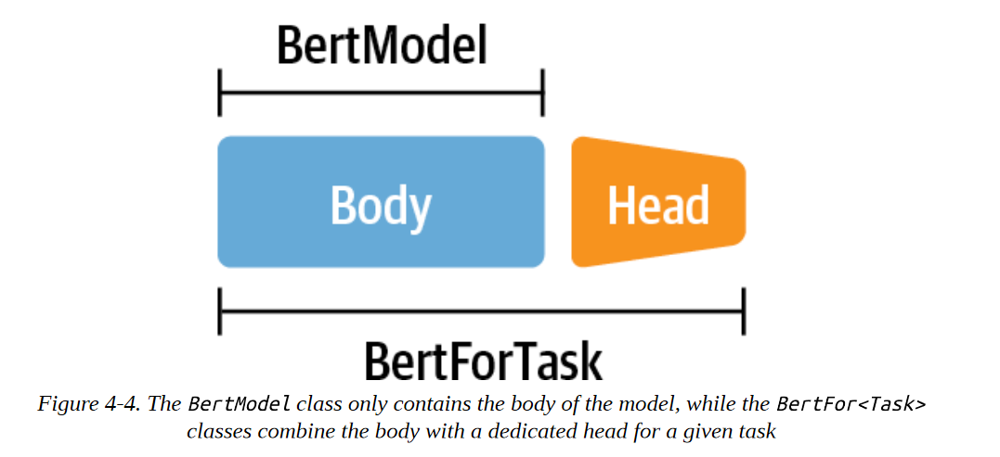

正如我们接下来要看到的，这种主体和头部的分离使我们能够为任何任务建立一个定制的头，并将其安装在一个预训练的模型之上即可。

### 为标记分类创建一个自定义模型

让我们经历一下为XLM-R建立一个自定义的标记分类头的练习。由于XLM-R使用与RoBERTa相同的模型架构，我们将使用RoBERTa作为基础模型，但用XLM-R的特定设置进行增强。请注意，这是一个教育性练习，向你展示如何为你自己的任务建立一个自定义模型。对于标记分类，XLMRobertaForTokenClassification类已经存在，你可以从Transformers导入。如果你愿意，你可以跳到下一节，直接使用那个。

为了开始工作，我们需要一个数据结构来表示我们的XLM-R NER标记器。首先，我们需要一个配置对象来初始化模型，以及一个forward()函数来生成输出。让我们继续建立我们的XLM-R类，用于标记分类：

```
import torch.nn as nn from transformers
import XLMRobertaConfig from transformers.modeling_outputs
import TokenClassifierOutput from transformers.models.roberta.modeling_roberta
import RobertaModel from transformers.models.roberta.modeling_roberta
import RobertaPreTrainedModel 
class XLMRobertaForTokenClassification( RobertaPreTrainedModel): config_class = XLMRobertaConfig 
	def __init__(self, config): 
        super().__init__(config) self.num_labels = config.num_labels# Load model body 
        self.roberta = RobertaModel( config, add_pooling_layer = False)
        # Set up token classification head 
        self.dropout = nn.Dropout(config.hidden_dropout_prob) 
        self.classifier = nn.Linear(config.hidden_size, config.num_labels)
        # Load and initialize weights 
        self.init_weights() 
    def forward(self, input_ids = None, attention_mask = None, token_type_ids = None, labels = None, ** kwargs): 
        #Use model body to get encoder representations 
        outputs = self.roberta(input_ids, attention_mask = attention_mask,token_type_ids = token_type_ids, * * kwargs)
    	# Apply classifier to encoder representation 
    	sequence_output =  self.dropout(outputs[0]) 
    	logits = self.classifier( sequence_output)
    	# Calculate losses 
    	loss = None
		if labels is not None: 
			loss_fct = nn.CrossEntropyLoss() loss =
	    	loss_fct(logits.view(-1, self.num_labels), labels.view(-1))# Return model output object
		return TokenClassifierOutput(loss = loss, logits = logits, hidden_states = outputs.hidden_states, attentions =  outputs.attentions)
```

config_class确保我们在初始化一个新模型时使用标准的XLM-R设置。如果你想改变默认参数，你可以通过覆盖配置中的默认设置来实现。通过super()方法，我们调用RobertaPreTrainedModel类的初始化函数。这个抽象类处理初始化或加载预训练的权重。然后我们加载我们的模型主体，也就是RobertaModel，并用我们自己的分类头来扩展它，包括一个dropout和一个标准前馈层。注意，我们设置add_pooling_layer=False，以确保所有的隐藏状态都被返回，而不仅仅是与[CLS]标记相关的一个。最后，我们通过调用从RobertaPreTrainedModel继承的init_weights()方法来初始化所有权重，该方法将加载模型主体的预训练权重，并随机初始化我们标记分类头的权重。


唯一要做的就是用forward()方法定义模型在前向传递中应该做什么。在前向传递过程中，数据首先通过模型主体被输入。有许多输入变量，但我们现在唯一需要的是input_ids 和 attention_mask。隐藏状态是模型主体输出的一部分，然后通过dropout和分类层进行反馈。如果我们在前向传递中也提供标签，我们可以直接计算损失。如果有一个注意力掩码，我们需要多做一点工作，以确保我们只计算未掩码的标记的损失。最后，我们将所有的输出包在一个TokenClassifierOutput对象中，允许我们访问前几章中熟悉的命名元组中的元素。

通过实现一个简单类的两个函数，我们就可以建立我们自己的自定义Transformers模型。由于我们继承了PreTrainedModel，我们可以立即获得所有有用的Transformer工具，比如from_pretrained()! 让我们来看看我们如何将预训练的权重加载到我们的自定义模型中。

### 加载一个自定义模型

现在我们准备加载我们的标记分类模型。我们需要在模型名称之外提供一些额外的信息，包括我们将用于标记每个实体的标签，以及每个标签与ID的映射，反之亦然。所有这些信息都可以从我们的tags变量中得到，作为一个ClassLabel对象，它有一个names属性，我们可以用它来导出映射。

```
index2tag = {idx: tag for idx, tag in enumerate(tags.names)} 
tag2index = {tag: idx for idx, tag in enumerate(tags.names)}

```

我们将把这些映射和tags.num_classes属性存储在我们在第三章遇到的AutoConfig对象中。向from_pretrained()方法传递关键字参数会覆盖默认值:


```
from transformers import AutoConfig 
xlmr_config = AutoConfig.from_pretrained(xlmr_model_name, num_labels=tags.num_classes, id2label=index2tag, label2id=tag2index)

```

AutoConfig类包含了一个模型的架构蓝图。当我们用AutoModel.from_pretrained(model_ckpt)加载一个模型时，与该模型相关的配置文件会自动下载。然而，如果我们想修改诸如 类或标签名称，那么我们可以先用我们想定制的参数加载配置。

现在，我们可以像往常一样用带有额外配置参数的from_pretrained()函数加载模型权重。注意，我们没有在我们的自定义模型类中实现加载预训练的权重；我们通过继承RobertaPreTrainedModel免费获得这个功能：

```
import torch device = torch.device("cuda" if torch.cuda.is_available() else "cpu") 
xlmr_model = (XLMRobertaForTokenClassification .from_pretrained(xlmr_model_name, config=xlmr_config) .to(device))

```

作为一个快速检查，我们已经正确地初始化了标记器和模型，让我们在已知实体的小序列上测试预测：

```
input_ids = xlmr_tokenizer.encode(text, return_tensors="pt") 
pd.DataFrame([xlmr_tokens, input_ids[0].numpy()], index=["Tokens", "Input IDs"])

```

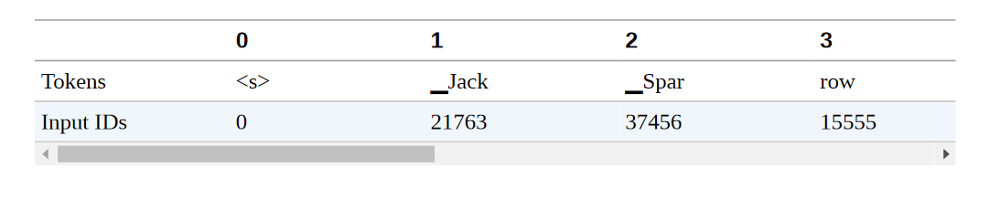

正如你在这里看到的，开始<s>和结束</s>标记分别被赋予0和2的ID。

最后，我们需要将输入传递给模型，并通过获取argmax来提取预测，以获得每个标记最可能的类别：


```
outputs = xlmr_model(input_ids.to(device)).logits 
predictions = torch.argmax(outputs, dim=-1) 
print(f"Number of tokens in sequence: {len(xlmr_tokens)}") 
print(f"Shape of outputs: {outputs.shape}") 

Number of tokens in sequence: 10 
Shape of outputs: torch.Size([1, 10, 7])

```

这里我们看到对数的形状是[batch_size, num_tokens, num_tags]，每个标记在七个可能的NER标记中都有一个对数。通过对序列的枚举，我们可以很快看到预训练模型的预测：

```
preds = [tags.names[p] for p in predictions[0].cpu().numpy()] 
pd.DataFrame([xlmr_tokens, preds], index=["Tokens", "Tags"])

```

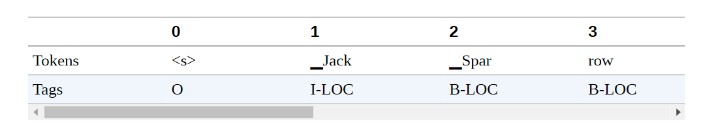

不出所料，我们的随机权重的标记分类层还有很多不足之处；让我们在一些标记的数据上进行微调，使其变得更好！在这之前，让我们把前面的步骤封装在以后使用的辅助函数中。在这样做之前，让我们把前面的步骤打包成一个辅助函数，供以后使用：

```
def tag_text(text, tags, model, tokenizer):
	# Get tokens with special characters 
	tokens = tokenizer(text).tokens() 
	# Encode the sequence into IDs 
	input_ids = xlmr_tokenizer(text, return_tensors="pt").input_ids.to(device) 
	# Get predictions as distribution over 7 possible classes 
	outputs = model(inputs)[0] 
	# Take argmax to get most likely class per token 
	predictions = torch.argmax(outputs, dim=2) 
	# Convert to DataFrame 
	preds = [tags.names[p] for p in predictions[0].cpu().numpy()] 
	return pd.DataFrame([tokens, preds], index=["Tokens", "Tags"])

```

在我们训练模型之前，我们还需要对输入进行标记化，并准备好标签。我们接下来会做这个。

### 将文本标记化以用于NER

现在我们已经确定标记器和模型可以对单个例子进行编码，我们的下一步是对整个数据集进行标记，以便我们可以将其传递给XLM-R模型进行微调。正如我们在第二章中所看到的，Datasets提供了一种快速的方法，用map()操作对数据集对象进行标记化。要实现这一点，请回忆一下，我们首先需要定义一个具有最小签名的函数：

```
function(examples: Dict[str, List]) -> Dict[str, List]

```

其中examples相当于数据集的一个片断，例如panx_de['train'][:10]。由于XLM-R标记器为模型的输入返回了输入ID，我们只需要用注意力掩码和标签ID来增加这些信息，这些标签编码了与每个NER标记相关的标记信息。

按照Transformers文档中的方法，让我们看看这在我们的单一德语例子中是如何工作的，首先收集单词和标签作为普通列表：

```
words, labels = de_example["tokens"], de_example["ner_tags"]

```

接下来，我们对每个词进行标记，并使用is_split_into_words参数来告诉标记器，我们的输入序列已经被分割成单词：

```
tokenized_input = xlmr_tokenizer(de_example["tokens"], is_split_into_words=True) 
tokens = xlmr_tokenizer.convert_ids_to_tokens(tokenized_input["input_ids"]) 
pd.DataFrame([tokens], index=["Tokens"])

```

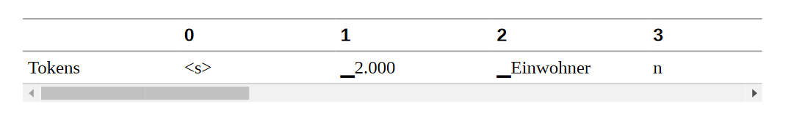

在这个例子中，我们可以看到标记器将 "Einwohnern "分成两个子词，"▁Einwohner "和 "n"。由于我们遵循的惯例是只有"▁Einwohner "应该与B-LOC标签相关联，我们需要一种方法来掩盖第一个子词之后的子词表示。幸运的是，tokenized_input是一个包含word_ids()函数的类，可以帮助我们实现这个目标：

```
word_ids = tokenized_input.word_ids() 
pd.DataFrame([tokens, word_ids], index=["Tokens", "Word IDs"])

```

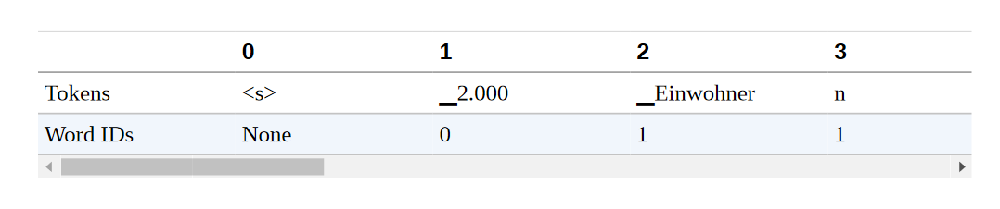

在这里我们可以看到，word_ids已经将每个子词映射到单词序列中的相应索引，所以第一个子词"▁2.000 "被分配到索引0，而"▁Einwohner "和 "n "被分配到索引1（因为 "Einwohnern "是单词中的第二个单词）。我们还可以看到，像<s>和<s>这样的特殊标记被映射为无。让我们把-100设为这些特殊标记和我们希望在训练中屏蔽的子词的标签：

```
previous_word_idx = None 
label_ids = [] 
for word_idx in word_ids: 
	if word_idx is None or word_idx == previous_word_idx: 
		label_ids.append(-100) 
	elif word_idx != previous_word_idx: 
		label_ids.append(labels[word_idx]) 
	previous_word_idx = word_idx 
labels = [index2tag[l] if l != -100 else "IGN" for l in label_ids] 
index = ["Tokens", "Word IDs", "Label IDs", "Labels"] 
pd.DataFrame([tokens, word_ids, label_ids, labels], index=index)

```

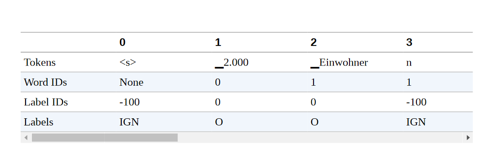

**注意事项**

为什么我们选择-100作为屏蔽子词表示的ID？原因是在PyTorch中，交叉熵损失类torch.nn.CrossEntropyLoss有一个名为ignore_index的属性，其值为-100。这个指数在训练过程中会被忽略，所以我们可以用它来忽略与连续子词相关的标记。

就这样了 我们可以清楚地看到标签ID是如何与标记对齐的，所以让我们通过定义一个包含所有逻辑的单一函数，将其扩展到整个数据集：

```
def tokenize_and_align_labels(examples): 
	tokenized_inputs = xlmr_tokenizer(examples["tokens"], truncation=True, is_split_into_words=True) 
	labels = [] 
	for idx, label in enumerate(examples["ner_tags"]): 
		word_ids = tokenized_inputs.word_ids(batch_index=idx) 
		previous_word_idx = None label_ids = [] 
		for word_idx in word_ids: 
			if word_idx is None or word_idx == previous_word_idx: 
				label_ids.append(-100) 
			else: 
				label_ids.append(label[word_idx]) 
			previous_word_idx = word_idx 
		labels.append(label_ids) 
	tokenized_inputs["labels"] = labels 
	return tokenized_inputs
```

我们现在有了对每个分裂进行编码所需的所有成分，所以让我们写一个我们可以迭代的函数：

```
def encode_panx_dataset(corpus): 
	return corpus.map(tokenize_and_align_labels, batched=True, remove_columns=['langs', 'ner_tags', 'tokens'])

```

将这个函数应用于DatasetDict对象，我们就可以得到每个分割的编码数据集对象。让我们用它来对我们的德语语料库进行编码：

```
panx_de_encoded = encode_panx_dataset(panx_ch["de"])

```

现在我们有一个模型和一个数据集，我们需要定义一个性能指标。

## 性能评估

评估NER模型与评估文本分类模型类似，通常报告精度、召回率和F-score的结果。唯一的微妙之处在于，一个实体的所有单词都需要被正确预测，这样才能算作正确的预测。幸运的是，有一个叫seqeval的漂亮库，是为这类任务设计的。例如，给定一些占位的NER标签和模型预测，我们可以通过seqeval的classification_report()函数来计算度量：

```
from seqeval.metrics import classification_report 
y_true = [["O", "O", "O", "B-MISC", "I-MISC", "I-MISC", "O"], ["B-PER", "I-PER", "O"]] 
y_pred = [["O", "O", "B-MISC", "I-MISC", "I-MISC", "I-MISC", "O"], ["B-PER", "I-PER", "O"]] 
print(classification_report(y_true, y_pred))

```

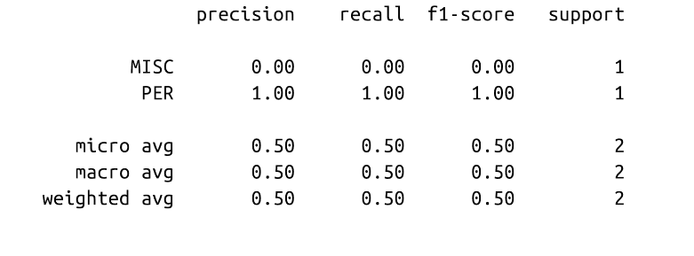

正如我们所看到的，seqeval期望预测和标签为列表，每个列表对应于我们验证集或测试集中的一个例子。为了在训练过程中整合这些指标，我们需要一个函数来获取模型的输出并将其转换为seqeval所期望的列表。下面的函数通过确保我们忽略与后续子词相关的标签ID来完成这个任务：

```
import numpy as np 
def align_predictions(predictions, label_ids): 
	preds = np.argmax(predictions, axis=2) 
	batch_size, seq_len = preds.shape 
	labels_list, preds_list = [], [] 
	for batch_idx in range(batch_size): 
		example_labels, example_preds = [], [] 
		for seq_idx in range(seq_len): 
		# Ignore label IDs = -100 
		if label_ids[batch_idx, seq_idx] != -100: 
			example_labels.append(index2tag[label_ids[batch_idx] [seq_idx]]) 
			example_preds.append(index2tag[preds[batch_idx][seq_idx]]) 
		labels_list.append(example_labels) 
		preds_list.append(example_preds) 
	return preds_list, labels_list

```

有了性能指标，我们就可以开始实际训练模型了。

## 微调 XLM-RoBERTa

我们现在有了对我们的模型进行微调的所有材料！我们的第一个策略是在PAN-X的德语子集上对我们的基本模型进行微调，然后评估它在法语和意大利语上的零散跨语言表现。我们的第一个策略是在PAN-X的德语子集上微调我们的基础模型，然后评估它在法语、意大利语和英语上的零起点跨语言性能。像往常一样，我们将使用变形金刚训练器来处理我们的训练循环，所以首先我们需要使用TrainingArguments类来定义训练属性：

```
from transformers import TrainingArguments 
num_epochs = 3 
batch_size = 24 
logging_steps = len(panx_de_encoded["train"]) // batch_size 
model_name = f"{xlmr_model_name}-finetuned-panx-de" 
training_args = TrainingArguments( output_dir=model_name, log_level="error", num_train_epochs=num_epochs, per_device_train_batch_size=batch_size, per_device_eval_batch_size=batch_size, evaluation_strategy="epoch", save_steps=1e6, weight_decay=0.01, disable_tqdm=False, logging_steps=logging_steps, push_to_hub=True)

```

在这里，我们在每个历时结束时评估模型在验证集上的预测，调整权重衰减，并将save_steps设置为一个大数字，以禁用检查点，从而加快训练速度。

这也是确保我们登录到Hugging Face Hub的一个好时机（如果你在终端工作，你可以执行huggingface-cli login命令）。

```
from huggingface_hub 
import notebook_login notebook_login()

```

我们还需要告诉Trainer如何在验证集上计算指标，所以在这里我们可以使用之前定义的align_predictions()函数，以seqeval需要的格式提取预测和标签，以计算F-score：

```
from seqeval.metrics import f1_score 
def compute_metrics(eval_pred): 
	y_pred, y_true = align_predictions(eval_pred.predictions, eval_pred.label_ids)
    return {"f1": f1_score(y_true, y_pred)}

```

最后一步是定义一个数据整理器，这样我们就可以把每个输入序列填充到一个批次的最大序列长度。Transformers提供了一个 专用于标记分类的数据整理器，它将与输入一起填充标签。

```
from transformers import DataCollatorForTokenClassification 
data_collator = DataCollatorForTokenClassification(xlmr_tokenizer)

```

填充标签是必要的，因为与文本分类任务不同，标签也是序列。这里的一个重要细节是，标签序列被填充了-100的值，正如我们所看到的，PyTorch损失函数会忽略这个值。

我们将在本章中训练几个模型，所以我们将通过创建model_init()方法来避免为每个训练者初始化一个新的模型。这个方法会加载一个未训练过的模型，并在调用train()的开始阶段被调用:

```
def model_init(): 
	return (XLMRobertaForTokenClassification .from_pretrained(xlmr_model_name, config=xlmr_config) .to(device))

```

现在我们可以将所有这些信息连同编码的数据集一起传递给Trainer:

```
from transformers import Trainer 
trainer = Trainer(model_init=model_init, args=training_args, data_collator=data_collator, compute_metrics=compute_metrics, train_dataset=panx_de_encoded["train"], eval_dataset=panx_de_encoded["validation"], tokenizer=xlmr_tokenizer)

```

然后按如下方式运行训练循环，并将最终模型推送给Hub:

```
trainer.train() trainer.push_to_hub(commit_message="Training completed!")

```

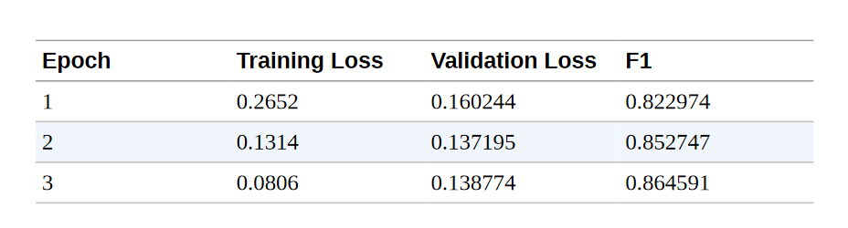

这些F1分数对于一个NER模型来说是相当不错的。为了确认我们的模型按预期工作，让我们在我们的简单例子的德语翻译上测试它:

```
text_de = "Jeff Dean ist ein Informatiker bei Google in Kalifornien" 
tag_text(text_de, tags, trainer.model, xlmr_tokenizer)

```

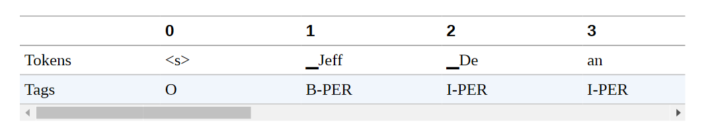

它是有效的! 但是，我们永远不应该根据一个单一的例子而对性能过于自信。相反，我们应该对模型的错误进行适当和彻底的调查。在下一节中，我们将探讨如何在NER任务中做到这一点。

## 错误分析

在我们深入研究XLM-R的多语言方面之前，让我们花点时间调查一下我们模型的错误。正如我们在第二章中所看到的，在训练和调试变换器（以及一般的机器学习模型）时，对你的模型进行彻底的错误分析是最重要的方面之一。有几种失败模式，在这些模式下，可能看起来模型表现良好，而实际上它有一些严重的缺陷。训练可能失败的例子包括：

- 我们可能不小心掩盖了太多的标记，也掩盖了一些我们的标签，从而得到一个真正有希望的损失下降。

- compute_metrics()函数可能有一个错误，高估了真实的性能。

- 我们可能会把NER中的零类或O类实体作为一个正常的类，这将严重歪曲准确率和F-score，因为它是大多数人的类，差距很大。

当模型的表现比预期的要差得多时，查看错误可以产生有用的见解，并揭示出仅通过查看代码很难发现的错误。而且，即使模型表现良好，代码中没有错误，错误分析仍然是了解模型的优点和缺点的有用工具。当我们在生产环境中部署模型时，这些方面我们始终需要牢记。

对于我们的分析，我们将再次使用我们所掌握的最强大的工具之一，那就是查看损失最大的验证例子。我们可以重新使用我们在第二章中为分析序列分类模型而建立的大部分函数，但是我们现在要计算样本序列中每个标记的损失。

让我们定义一个我们可以应用于验证集的方法：

```
from torch.nn.functional import cross_entropy 
def forward_pass_with_label(batch): 
	# Convert dict of lists to list of dicts suitable for data collator 
	features = [dict(zip(batch, t)) for t in zip(*batch.values())] 
	# Pad inputs and labels and put all tensors on device 
	batch = data_collator(features) 
	input_ids = batch["input_ids"].to(device) 
	attention_mask = batch["attention_mask"].to(device) 
	labels = batch["labels"].to(device) 
	with torch.no_grad(): 
		# Pass data through model 
		output = trainer.model(input_ids, attention_mask) 
		# logit.size: [batch_size, sequence_length, classes] 
		# Predict class with largest logit value on classes axis 
		predicted_label = torch.argmax(output.logits, axis=-1).cpu().numpy() 
	# Calculate loss per token after flattening batch dimension with view 
	loss = cross_entropy(output.logits.view(-1, 7), labels.view(-1), reduction="none")
    # Unflatten batch dimension and convert to numpy array
	loss = loss.view(len(input_ids), -1).cpu().numpy() 
	return {"loss":loss, "predicted_label": predicted_label}

```

现在我们可以使用map()将这个函数应用于整个验证集，并将所有的数据加载到一个DataFrame中进行进一步分析：

```
valid_set = panx_de_encoded["validation"] 
valid_set = valid_set.map(forward_pass_with_label, batched=True, batch_size=32) 
df = valid_set.to_pandas()

```

代币和标签仍然是用它们的ID编码的，所以让我们把代币和标签映射回字符串，以便更容易阅读结果。对于标签为-100的填充代币，我们分配一个特殊的标签，即IGN，这样我们就可以在以后过滤它们。我们还通过将损失和预测标签字段截断到输入的长度来摆脱所有的填充物：

```
index2tag[-100] = "IGN" 
df["input_tokens"] = df["input_ids"].apply( lambda x: xlmr_tokenizer.convert_ids_to_tokens(x)) 
df["predicted_label"] = df["predicted_label"].apply( lambda x: [index2tag[i] for i in x]) 
df["labels"] = df["labels"].apply( lambda x: [index2tag[i] for i in x]) 
df['loss'] = df.apply( lambda x: x['loss'][:len(x['input_ids'])], axis=1) 
df['predicted_label'] = df.apply( lambda x: x['predicted_label'][:len(x['input_ids'])], axis=1) 
df.head(1)

```

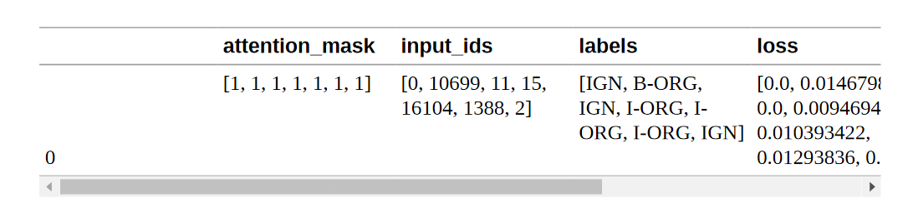

每一列包含每个样本的标记、标签、预测标签等的列表。让我们通过拆开这些列表来逐一看看这些标记。这些列表。pandas.Series.explode()函数允许我们在一行中完全做到这一点，它为原始行列表中的每个元素创建一个行。由于一行中的所有列表都有相同的长度，我们可以对所有列进行并行处理。我们还放弃了我们命名为IGN的填充代币，因为它们的损失反正是零。最后，我们将损失（仍然是numpy.Array对象）转换成标准的浮点数：

```
df_tokens = df.apply(pd.Series.explode) 
df_tokens = df_tokens.query("labels != 'IGN'") 
df_tokens["loss"] = df_tokens["loss"].astype(float).round(2) 
df_tokens.head(7)

```

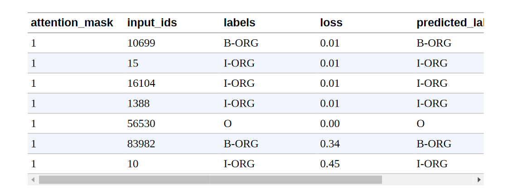

有了这种形式的数据，我们现在可以按输入标记进行分组，并用计数、平均值和总和对每个标记的损失进行汇总。最后，我们根据损失的总和对汇总的数据进行排序，看看哪些标记在验证集中积累了最多的损失：

```
( 
df_tokens.groupby("input_tokens")[["loss"]] 
.agg(["count", "mean", "sum"]) 
.droplevel(level=0, axis=1) 
# Get rid of multi-level columns 
.sort_values(by="sum", ascending=False) 
.reset_index() 
.round(2) 
.head(10) 
.T 
)

```

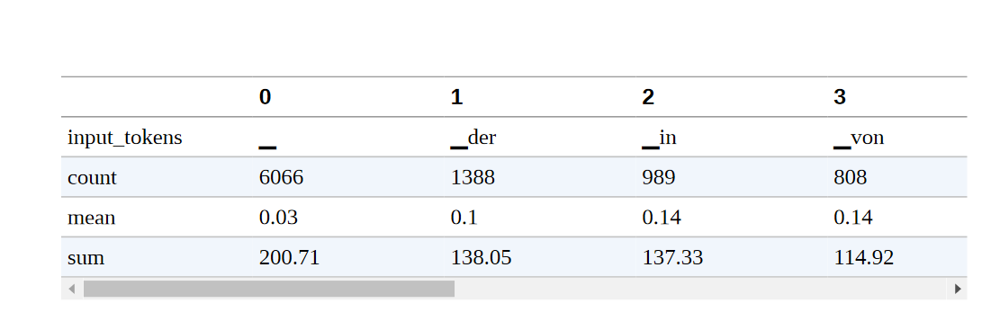

我们可以在这个列表中观察到几种模式。

- 空白符号的总损失最高，这并不令人惊讶，因为它也是列表中最常见的符号。然而，它的平均损失要比列表中的其他标记低得多。这意味着模型对它的分类并不费力。

- 像 "in"、"von"、"der "和 "und "这样的词出现得相对频繁。它们经常与命名的实体一起出现，有时是它们的一部分，这解释了为什么模型可能会把它们混在一起。

- 括号、斜线和单词开头的大写字母比较少见，但其平均损失相对较高。我们将进一步调查它们。

  

  我们还可以对标签ID进行分组，看看每一类的损失：

  

```
( 
df_tokens.groupby("labels")[["loss"]] 
.agg(["count", "mean", "sum"]) 
.droplevel(level=0, axis=1) 
.sort_values(by="mean", ascending=False) 
.reset_index() 
.round(2) 
.T 
)

```

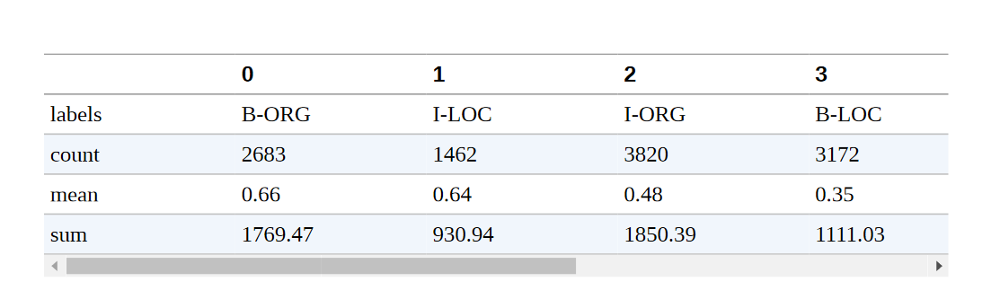

我们看到，B-ORG的平均损失最高，这意味着确定一个组织的开始对我们的模型构成了挑战。

我们可以通过绘制标记分类的混淆矩阵来进一步分解，我们看到一个组织的开始经常与随后的I-ORG标记相混淆:

```
from sklearn.metrics import ConfusionMatrixDisplay, confusion_matrix 
def plot_confusion_matrix(y_preds, y_true, labels): 
	cm = confusion_matrix(y_true, y_preds, normalize="true") 
	fig, ax = plt.subplots(figsize=(6, 6)) 
	disp = ConfusionMatrixDisplay(confusion_matrix=cm, display_labels=labels) 
	disp.plot(cmap="Blues", values_format=".2f", ax=ax, colorbar=False) 
	plt.title("Normalized confusion matrix") 
	plt.show() 
plot_confusion_matrix(df_tokens["labels"], df_tokens["predicted_label"], tags.names

```

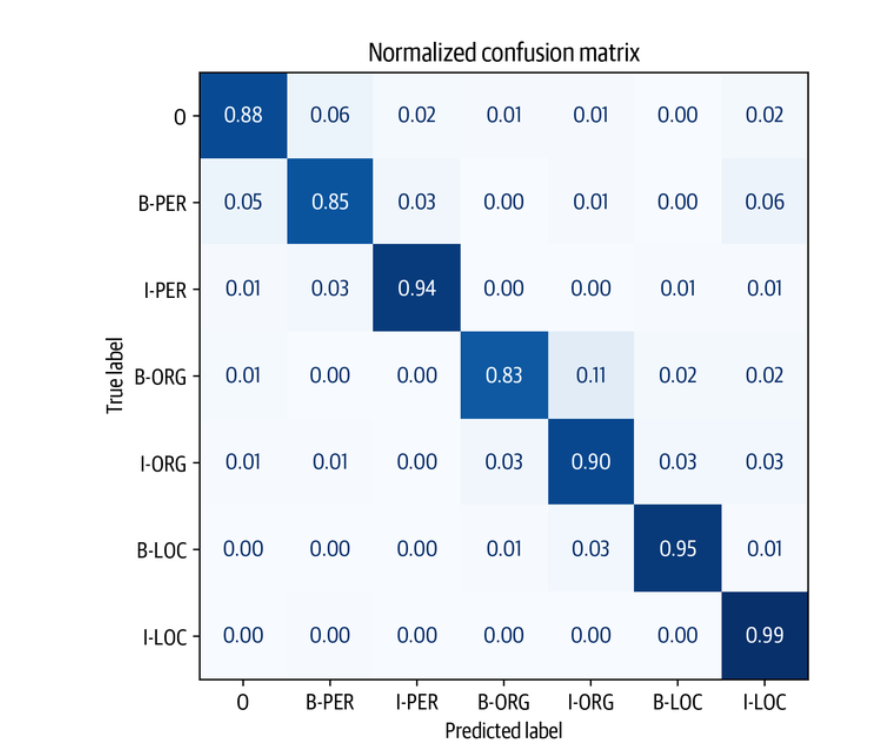

从图中我们可以看出，我们的模型倾向于混淆B-ORG和IORG实体最多。除此之外，它在对其余实体进行分类时表现得相当好，这一点从混淆矩阵的近对角线性质可以看出。

现在我们已经检查了标记水平上的错误，让我们继续看一下具有高损失的序列。在这个计算中，我们将重新审视我们的 "未爆炸 "数据框架，通过对每个标记的损失进行加总来计算总损失。要做到这一点，首先让我们写一个函数，帮助我们显示带有标签和损失的标记序列。

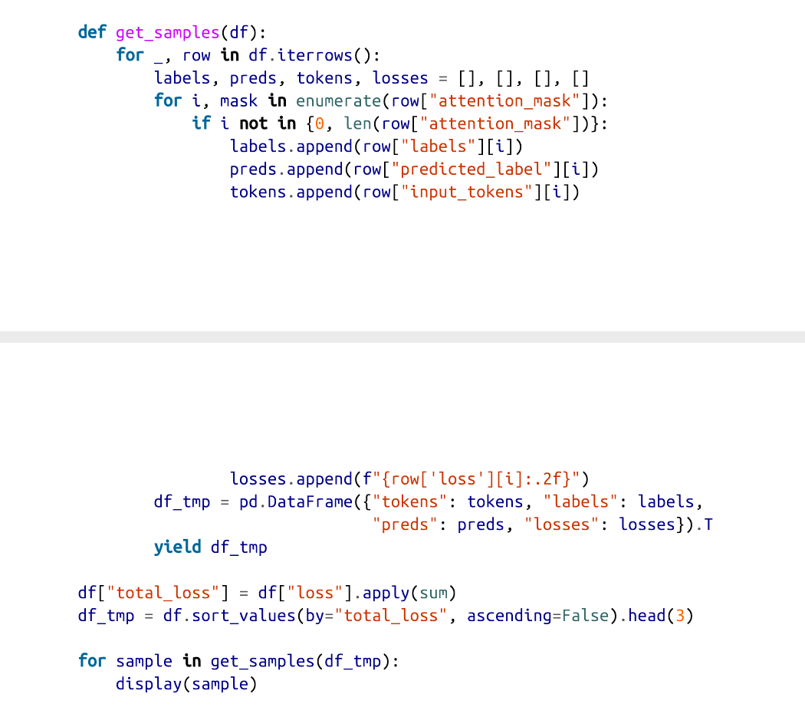


很明显，这些样本的标签有问题；例如，联合国和中非共和国分别被标为一个人！这是不对的。同时，第一个例子中的 "8.Juli "被标记为一个组织。事实证明，PAN-X数据集的注释是通过一个自动过程产生的。这样的注释通常被称为 "银质标准"（与人类生成的注释的 "黄金标准 "形成对比），而且毫不奇怪，有些情况下，自动方法未能产生合理的标签。事实上，这样的失败模式并不是自动方法所独有的；即使人类仔细地注释数据，当注释者的注意力减退或者他们只是误解了句子，也会发生错误。

我们先前注意到的另一件事是，括号和斜线的损失相对较高。让我们来看看几个带有开头小括号的序列的例子:

```
df_tmp = df.loc[df["input_tokens"].apply(lambda x: u"\u2581(" in x)].head(2) 
for sample in get_samples(df_tmp): 
	display(sample)

```

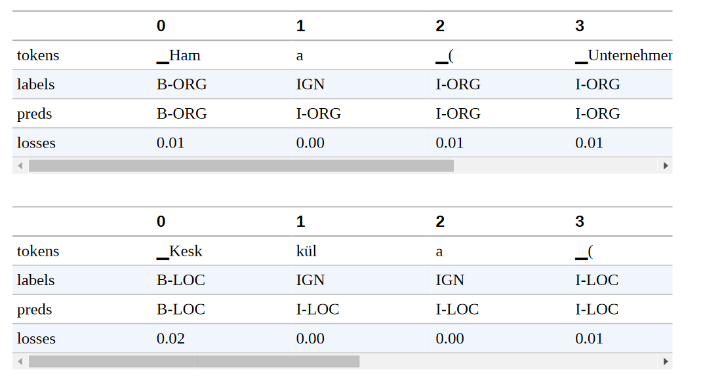

一般来说，我们不会把括号及其内容作为命名实体的一部分，但这似乎是自动提取注释文件的方式。在其他的例子中，括号里包含了一个地理规范。虽然这确实也是一个位置，但我们可能希望在注释中把它与原始位置断开。这个数据集由不同语言的维基百科文章组成，文章标题经常在括号中包含某种解释。例如，在第一个例子中，括号里的文字表明Hama是一个 "Unternehmen"，即英文中的公司。当我们推出这个模型时，这些细节是很重要的，因为它们可能对模型所在的整个管道的下游性能产生影响。

通过一个相对简单的分析，我们已经发现了我们的模型和数据集的一些弱点。在一个真实的用例中，我们会反复进行这个步骤，清理数据集，重新训练模型，分析新的错误，直到我们对性能感到满意。

在这里，我们分析了单一语言的错误，但我们也对跨语言的性能感兴趣。在下一节中，我们将进行一些实验，看看XLM-R的跨语言转移的效果如何。

## 跨语言迁移

现在我们已经在德语上对XLM-R进行了微调，我们可以通过Trainer的predict()方法来评估它转移到其他语言的能力。由于我们计划评估多种语言，让我们创建一个简单的函数，为我们做这件事：

```
def get_f1_score(trainer, dataset): 
	return trainer.predict(dataset).metrics["test_f1"]

```

我们可以用这个函数来检查测试集的性能，并在一个dict中记录我们的分数：

```
f1_scores = defaultdict(dict) 
f1_scores["de"]["de"] = get_f1_score(trainer, panx_de_encoded["test"]) 
print(f"F1-score of [de] model on [de] dataset: {f1_scores['de']['de']:.3f}")

F1-score of [de] model on [de] dataset: 0.868

```

对于一个NER任务来说，这些结果相当不错。我们的指标在85%左右，我们可以看到该模型在ORG实体上似乎最吃力，可能是因为这些实体在训练数据中最不常见，而且许多组织名称在XLM-R的词汇中很罕见。其他语言的情况如何？为了热身，让我们看看我们在德语上微调的模型在法语上的表现如何：

```
text_fr = "Jeff Dean est informaticien chez Google en Californie" 
tag_text(text_fr, tags, trainer.model, xlmr_tokenizer)

```

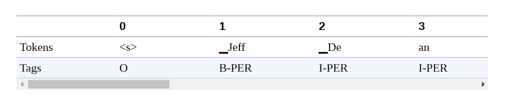

还不错! 虽然这两种语言的名称和组织都是一样的，但该模型确实能够正确标记 "Kalifornien "的法语翻译。接下来，让我们通过编写一个简单的函数来量化我们的德语模型在整个法语测试集上的表现，该函数对数据集进行编码并生成分类报告：

```
def evaluate_lang_performance(lang, trainer):
	panx_ds = encode_panx_dataset(panx_ch[lang]) 
	return get_f1_score(trainer, panx_ds["test"]) 
f1_scores["de"]["fr"] = evaluate_lang_performance("fr", trainer) 
print(f"F1-score of [de] model on [fr] dataset: {f1_scores['de']['fr']:.3f}") 

F1-score of [de] model on [fr] dataset: 0.714

```

虽然我们看到微观平均指标下降了约15分，但请记住，我们的模型还没有看到一个贴有标签的法语例子！一般来说，性能的下降与语言之间的 "距离 "有关。一般来说，性能下降的大小与语言之间的 "距离 "有关。虽然德语和法语被归类为印欧语系，但从技术上讲，它们属于不同的语系。分别是日耳曼语和罗曼语。


接下来，让我们评估一下在意大利语上的表现。由于意大利语也是一种罗曼语，我们期望得到一个与法语类似的结果:

```
f1_scores["de"]["it"] = evaluate_lang_performance("it", trainer) 
print(f"F1-score of [de] model on [it] dataset: {f1_scores['de']['it']:.3f}") 

F1-score of [de] model on [it] dataset: 0.692

```

事实上，我们的期望得到了F-scores的证实。最后，让我们来看看英语的表现，它属于日耳曼语系的语言:

```
f1_scores["de"]["en"] = evaluate_lang_performance("en", trainer) 
print(f"F1-score of [de] model on [en] dataset: {f1_scores['de']['en']:.3f}") 

F1-score of [de] model on [en] dataset: 0.589

```

令人惊讶的是，我们的模型在英语上的表现最差，尽管我们可能直观地期望德语比法语更类似于英语。在对德语进行了微调并对法语和英语进行了零点转移之后，接下来让我们看看什么时候直接对目标语言进行微调是有意义的。

### 何时零样本迁移才有意义？

到目前为止，我们已经看到，在德语语料库上对XLM-R进行微调，可以得到85%左右的F-score，而且不需要任何额外的训练，该模型就能够在我们的语料库中的其他语言上取得适度的表现。问题是，这些结果有多好，它们与在单语语料库上微调的XLM-R模型相比如何？

在本节中，我们将通过在越来越大的训练集上对XLM-R进行微调，来探索法语语料库的这个问题。通过这种方式跟踪性能，我们可以确定在哪一点上零点跨语言转移更有优势，这在实践中对指导关于是否收集更多标记数据的决定很有用。

为了简单起见，我们将保持对德语语料库进行微调时的超参数，只是我们将调整TrainingArguments的logging_steps参数，以考虑到训练集规模的变化。我们可以用一个简单的函数把这一切包起来，该函数接收一个对应于单语语料库的DatasetDict对象，通过num_samples对其进行降样，并对XLM-R进行微调，以返回最佳历时的度量：

```
def train_on_subset(dataset, num_samples): 
	train_ds = dataset["train"].shuffle(seed=42).select(range(num_samples)) 
	valid_ds = dataset["validation"] 
	test_ds = dataset["test"] training_args.logging_steps = len(train_ds) // batch_size 
	trainer = Trainer(model_init=model_init, args=training_args, data_collator=data_collator, compute_metrics=compute_metrics, train_dataset=train_ds, eval_dataset=valid_ds, tokenizer=xlmr_tokenizer) 
	trainer.train() 
	if training_args.push_to_hub: 
		trainer.push_to_hub(commit_message="Training completed!") 
	f1_score = get_f1_score(trainer, test_ds) 
	return pd.DataFrame.from_dict( {"num_samples": [len(train_ds)], "f1_score": [f1_score]})

```

正如我们对德语语料库的微调一样，我们也需要将法语语料库编码为输入ID、注意力掩码和标签ID：

```
panx_fr_encoded = encode_panx_dataset(panx_ch["fr"])

```

接下来，让我们通过在250个例子的小型训练集上运行来检查我们的函数是否有效：

```
training_args.push_to_hub = False 
metrics_df = train_on_subset(panx_fr_encoded, 250) 

metrics_df

```

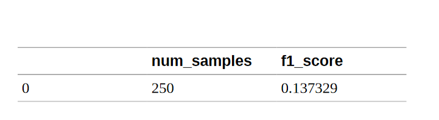

我们可以看到，在只有250个例子的情况下，法语的微调在很大程度上低于德语的零枪转移。现在让我们把训练集的大小增加到500、1000、2000和4000个例子，以了解性能的提高：

```
for num_samples in [500, 1000, 2000, 4000]: 
	metrics_df = metrics_df.append( train_on_subset(panx_fr_encoded, num_samples), ignore_index=True)

```

我们可以通过绘制测试集上的F-scores作为增加训练集大小的函数，来比较法语样本的微调与德语的零点跨语言转移之间的比较：

```
fig, ax = plt.subplots() 
ax.axhline(f1_scores["de"]["fr"], ls="--", color="r") 
metrics_df.set_index("num_samples").plot(ax=ax) 
plt.legend(["Zero-shot from de", "Fine-tuned on fr"], loc="lower right") plt.ylim((0, 1)) 
plt.xlabel("Number of Training Samples") 
plt.ylabel("F1 Score") 
plt.show()

```

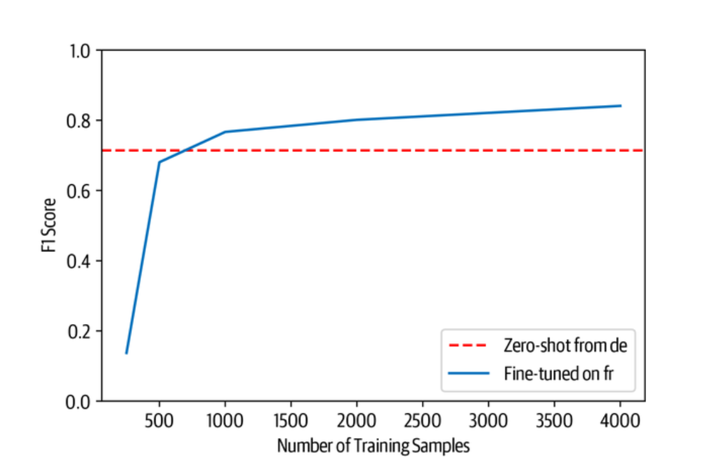

从图中我们可以看到，在大约750个训练实例之前，零点转移一直是有竞争力的，在这之后，对法语的微调达到了与我们对德语微调时类似的性能水平。然而，这个结果是不容忽视的。根据我们的经验，让领域专家给几百个文档贴上标签的成本很高，特别是对NER来说，贴标签的过程很细而且很耗时。

我们可以尝试最后一种技术来评估多语言学习：同时对多种语言进行微调！让我们来看看如何进行微调。让我们来看看我们如何做到这一点。

### 一次性对多种语言进行微调

到目前为止，我们已经看到，从德语到法语或意大利语的零拍跨语言转移产生了约15点的性能下降。缓解这种情况的一个方法是同时对多种语言进行微调。为了看看我们能得到什么类型的收益，让我们首先使用 concatenate_datasets()函数，将德语和法语语料库连接起来：

```
from datasets import concatenate_datasets 
def concatenate_splits(corpora): 
	multi_corpus = DatasetDict() 
	for split in corpora[0].keys(): 
		multi_corpus[split] = concatenate_datasets( [corpus[split] for corpus in corpora]).shuffle(seed=42) 
	return multi_corpus 
panx_de_fr_encoded = concatenate_splits([panx_de_encoded, panx_fr_encoded])

```

对于训练，我们将再次使用前几节的超参数，因此我们可以简单地更新训练器中的记录步骤、模型和数据集：

```
training_args.logging_steps = len(panx_de_fr_encoded["train"]) // batch_size 
training_args.push_to_hub = True 
training_args.output_dir = "xlm-roberta-base-finetuned-panx-de-fr" 
trainer = Trainer(model_init=model_init, args=training_args, data_collator=data_collator, compute_metrics=compute_metrics, tokenizer=xlmr_tokenizer, train_dataset=panx_de_fr_encoded["train"], eval_dataset=panx_de_fr_encoded["validation"])
trainer.train() 
trainer.push_to_hub(commit_message="Training completed!")

```

让我们来看看该模型在每种语言的测试集上的表现：

```
for lang in langs: 
	f1 = evaluate_lang_performance(lang, trainer) 
	print(f"F1-score of [de-fr] model on [{lang}] dataset: {f1:.3f}") 


 F1-score of [de-fr] model on [de] dataset: 0.866 
 F1-score of [de-fr] model on [fr] dataset: 0.868 
 F1-score of [de-fr] model on [it] dataset: 0.815 
 F1-score of [de-fr] model on [en] dataset: 0.677

```

它在法语分词上的表现比以前好得多，与德语测试集上的表现相当。有趣的是，它在意大利语和英语部分的表现也提高了大约10个百分点。因此，即使增加另一种语言的训练数据，也能提高该模型在未见过的语言上的表现。

让我们通过比较在每种语言上的微调和在所有语料库上的多语言学习的性能来完成我们的分析。由于我们已经对德语语料库进行了微调，我们可以用train_on_subset()函数对其余语言进行微调，num_samples等于训练集的例子数量。

```
corpora = [panx_de_encoded] 
# Exclude German from iteration 
for lang in langs[1:]: 
	training_args.output_dir = f"xlm-roberta-base-finetuned-panx-{lang}" 
	# Fine-tune on monolingual corpus 
	ds_encoded = encode_panx_dataset(panx_ch[lang]) 
	metrics = train_on_subset(ds_encoded, ds_encoded["train"].num_rows) 
	# Collect F1-scores in common dict 
	f1_scores[lang][lang] = metrics["f1_score"][0]
	# Add monolingual corpus to list of corpora to concatenate 
	corpora.append(ds_encoded)

```

现在我们已经对每种语言的语料库进行了微调，下一步是将所有的分片串联起来，创建一个所有四种语言的多语言语料库。与之前的德语和法语分析一样，我们可以使用concatenate_splits()函数来为我们在上一步生成的语料库列表上完成这一步骤：

```
corpora_encoded = concatenate_splits(corpora)

```

现在我们有了我们的多语言语料库，我们用训练器运行熟悉的步骤：

```
training_args.logging_steps = len(corpora_encoded["train"]) // batch_size 
training_args.output_dir = "xlm-roberta-base-finetuned-panx-all"
trainer = Trainer(model_init=model_init, args=training_args, data_collator=data_collator, compute_metrics=compute_metrics, tokenizer=xlmr_tokenizer, train_dataset=corpora_encoded["train"], eval_dataset=corpora_encoded["validation"]) 
trainer.train() 
trainer.push_to_hub(commit_message="Training completed!")

```

最后一步是在每种语言的测试集上生成训练器的预测结果。这将使我们深入了解多语言学习的真正效果。我们将在f1_scores字典中收集F-scores，然后创建一个DataFrame，总结我们多语言实验的主要结果:

```
for idx, lang in enumerate(langs): 
	f1_scores["all"][lang] = get_f1_score(trainer, corpora[idx]["test"]) 
scores_data = {"de": f1_scores["de"], "each": {lang: f1_scores[lang][lang] for lang in langs}, "all": f1_scores["all"]} 
f1_scores_df = pd.DataFrame(scores_data).T.round(4) 
f1_scores_df.rename_axis(index="Fine-tune on", columns="Evaluated on", inplace=True)

f1_scores_df

```

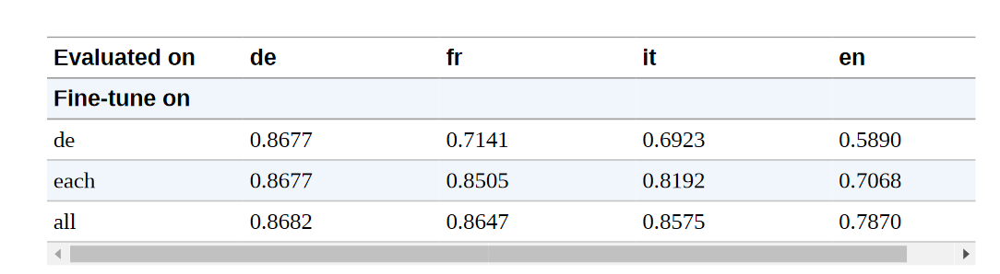

从这些结果中，我们可以得出一些一般性的结论。

- 多语言学习可以带来显著的性能提升，尤其是当跨语言转移的低资源语言属于类似的语言家族时。在我们的实验中，我们可以看到德语、法语和意大利语在所有类别中都取得了相似的表现，这表明这些语言之间的相似度要高于英语。
- 作为一个一般的策略，把注意力集中在语言家族内的跨语言转移是一个好主意，特别是在处理像日语这样的不同文字时。

## 与模型小工具互动

在这一章中，我们已经推送了很多微调过的模型到 Hub 上。尽管我们可以使用 pipeline() 函数在我们的本地机器上与它们进行交互，但 Hub 提供了非常适合这种工作流程的部件。图4-5是我们的transformersbook/xlm-roberta-base-finetuned-panx-all检查点的一个例子，你可以看到它在识别一个德语文本的所有实体方面做得很好。

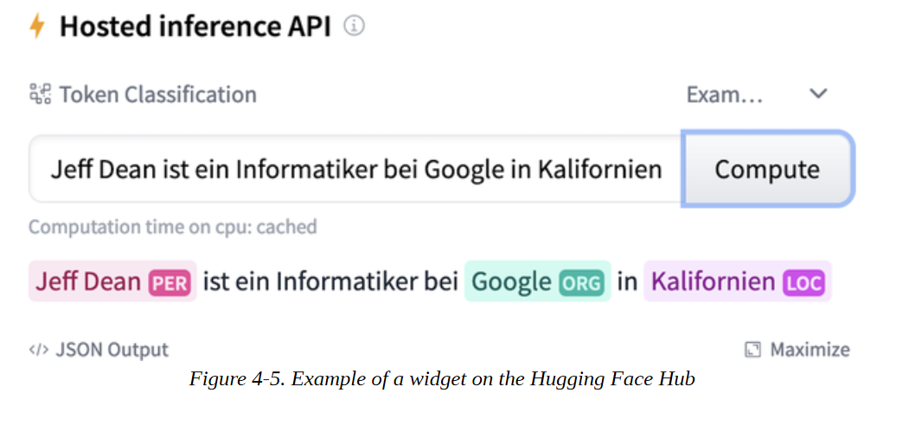

## 小结

在本章中，我们看到了如何使用一个在100种语言上预训练过的单一Transformers来处理一个多语言语料库的NLP任务: XLM-R。尽管我们能够证明，当只有少量的标记例子可供微调时，从德语到法语的跨语言转换是有竞争力的，但如果目标语言与基础模型被微调的语言有很大不同，或者不是预训练时使用的100种语言之一，这种良好的性能通常就不会出现。最近的建议，如MAD-X，正是为这些低资源的情况而设计的，由于MAD-X是建立在Transformers之上的，你可以很容易地调整本章的代码来使用它。

到目前为止，我们看了两个任务：序列分类和标记分类。这两个任务都属于自然语言理解的范畴，即把文本合成为预测。在下一章中，我们将首次看到文本生成，在这里，不仅输入内容是文本，模型的输出也是文本。
