# 第6章 文本摘要

在某一时刻，你可能需要对一份文件进行摘要，无论是研究文章、财务收益报告，还是一连串的电子邮件。如果你仔细想想，这需要一系列的能力，比如理解长篇大论，对内容进行推理，并制作出流畅的文本，将原始文件的主要议题纳入其中。此外，准确地摘要一篇新闻文章与摘要一份法律合同有很大的不同，所以能够做到这一点需要有复杂的领域概括能力。由于这些原因，文本摘要对于神经语言模型，包括Transformers来说是一项困难的任务。尽管有这些挑战，文本摘要还是为领域专家提供了大幅加快工作流程的前景，并被企业用来浓缩内部知识、摘要合同、为社交媒体发布自动生成内容等等。

为了帮助你了解其中的挑战，本章将探讨我们如何利用预训练的Transformers来摘要文档。摘要是一个经典的序列到序列（seq2seq）任务，有一个输入文本和一个目标文本。正如我们在第1章中所看到的，这正是编码器-解码器Transformers的优势所在。

在这一章中，我们将建立自己的编码器-解码器模型，将几个人之间的对话浓缩成一个简洁的摘要。但在这之前，让我们先来看看摘要的典型数据集之一：CNN/DailyMail语料库。

## CNN/DailyMail 数据集

CNN/DailyMail数据集由大约300,000对新闻文章及其相应的摘要组成，这些摘要由CNN和DailyMail在其文章中附加的要点组成。该数据集的一个重要方面是，摘要是抽象的，而不是摘录的，这意味着它们由新的句子而不是简单的摘录组成。该数据集可在Hub上找到；我们将使用3.0.0版本，这是一个为摘要而设置的非匿名版本。我们可以用类似于分割的方式来选择版本，我们在第四章中看到，用版本关键词来选择。因此，让我们潜入其中，看一看：

```
from datasets import load_dataset 
dataset = load_dataset("cnn_dailymail", version="3.0.0")
print(f"Features: {dataset['train'].column_names}") 

Features: ['article', 'highlights', 'id']

```

该数据集有三列：文章，其中包含新闻文章，亮点与摘要，以及唯一标识每篇文章的ID。我们来看看一篇文章的摘录：

```
sample = dataset["train"][1] 
print(f""" Article (excerpt of 500 characters, total length: {len(sample["article"])}): """) 
print(sample["article"][:500]) print(f'\nSummary (length: {len(sample["highlights"])}):')
print(sample["highlights"])

Article (excerpt of 500 characters, total length: 3192): 

(CNN) -- Usain Bolt rounded off the world championships Sunday by claiming his third gold in Moscow as he anchored Jamaica to victory in the men's 4x100m relay. The fastest man in the world charged clear of United States rival Justin Gatlin as the Jamaican quartet of Nesta Carter, Kemar Bailey-Cole, Nickel Ashmeade and Bolt won in 37.36 seconds. The U.S finished second in 37.56 seconds with Canada taking the bronze after Britain were disqualified for a faulty handover. The 26-year-old Bolt has n 

Summary (length: 180):

Usain Bolt wins third gold of world championship . Anchors Jamaica to 4x100m relay victory . Eighth gold at the championships for Bolt . Jamaica double up in women's 4x100m relay .

```

我们看到，与目标摘要相比，文章可能非常长；在这个特定的案例中，差异是17倍。长文章对大多数Transformers模型构成了挑战，因为上下文的大小通常被限制在1000个左右，这相当于几个段落的文字。处理这个问题的标准但粗略的方法是简单地截断超出模型上下文规模的文本。显然，在文本的结尾处可能会有重要的摘要信息，但是现在我们需要忍受模型结构的这种限制。


## 文本摘要流水线

让我们先从质量上看一下前面的例子的输出，看看几个最流行的Transformers模型在摘要上的表现。尽管我们要探索的模型架构有不同的最大输入规模，但我们把输入文本限制为2000个字符，以便所有模型都有相同的输入，从而使输出更具有可比性：

```
sample_text = dataset["train"][1]["article"][:2000] 
# We'll collect the generated summaries of each model in a dictionary 
summaries = {}

```

摘要中的一个惯例是用一个换行来分隔摘要句子。我们可以在每个句号之后添加一个换行符，但是对于像 "U.S. "或 "U.N. "这样的字符串，这种简单的启发式方法会失败。自然语言工具包（NLTK）软件包包括一个更复杂的算法，可以从缩写中出现的标点符号中区分出句子的结束：

```
import nltk from nltk.tokenize import sent_tokenize
nltk.download("punkt") 
string = "The U.S. are a country. The U.N. is an organization." 
sent_tokenize(string)

['The U.S. are a country.', 'The U.N. is an organization.']

```

**警告**

在下面的章节中，我们将加载几个大型模型。如果你的内存用完了，你可以用较小的模型（如 "gpt"、"t5small"）来替换大型模型，或者跳过本节，跳到 "在CNN/DailyMail数据集上评估PEGASUS"。

### 文本摘要流水线

文本摘要新闻文章的一个常见基线是简单地提取文章的前三句。有了NLTK的句子标记器，我们可以很容易地实现这样一个基线：

```
def three_sentence_summary(text): 
	return "\n".join(sent_tokenize(text)[:3]) 
summaries["baseline"] = three_sentence_summary(sample_text)

```

**GPT-2**


我们已经在第5章中看到GPT-2如何在给定的提示下生成文本。该模型的一个令人惊讶的特点是，我们也可以用它来生成摘要，只需在输入文本的末尾加上 "TL;DR"。"TL;DR"（太长了；没看懂）的表达方式在Reddit等平台上经常被用来表示一个长帖子的简短版本。我们将通过使用Transformers中的pipeline()函数重新创建原始论文的程序来开始我们的文本摘要实验。我们创建一个文本生成流水线并加载大型GPT-2模型：

```
from transformers import pipeline, set_seed 
set_seed(42) 
pipe = pipeline("text-generation", model="gpt2-xl") 
gpt2_query = sample_text + "\nTL;DR:\n" 
pipe_out = pipe(gpt2_query, max_length=512, clean_up_tokenization_spaces=True)

summaries["gpt2"] = "\n".join( sent_tokenize(pipe_out[0]["generated_text"][len(gpt2_query) :]))

```

在这里，我们只是通过对输入的查询进行切片来存储生成的文本的摘要，并将结果保存在Python字典中，供以后比较。

**T5**

接下来我们来试试T5转化器。正如我们在第三章中所看到的，这个模型的开发者对NLP中的迁移学习进行了全面的研究，发现他们可以通过将所有任务制定为文本到文本的任务来创建一个通用的转化器架构。T5模型是在无监督数据（重建被掩盖的词）和监督数据的混合体上进行训练的，包括文本摘要在内的几个任务。因此，这些模型可以直接用于执行文本摘要，而不需要通过使用预训练期间的相同提示进行微调。在这个框架中，模型文本摘要文档的输入格式是 "summaryize: <ARTICLE>"，而对于翻译来说，它看起来像 "把英语翻译成德语：<TEXT>"。如图6-1所示，这使得T5的功能非常全面，可以用一个模型解决很多任务。

我们可以用pipeline()函数直接加载T5进行文本摘要，它还负责以文本到文本的格式对输入进行格式化，所以我们不需要在输入前加上 "summaryize"。

```
pipe = pipeline("summarization", model="t5-large") 
pipe_out = pipe(sample_text) 
summaries["t5"] = "\n".join(sent_tokenize(pipe_out[0]["summary_text"]))

```

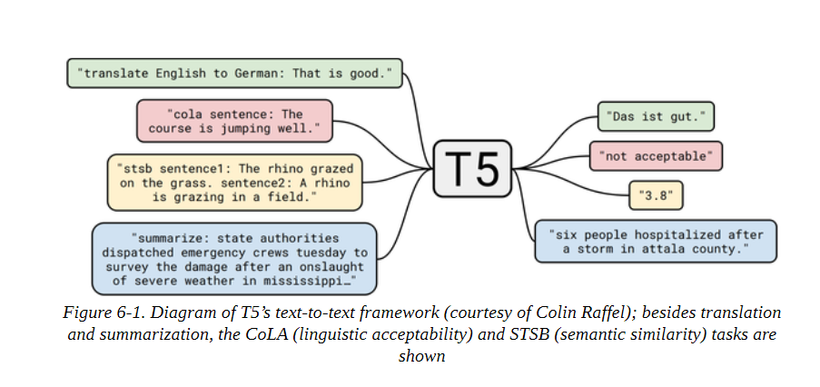

**BART**

BART也使用编码器-解码器结构，并被训练为重建被破坏的输入。它结合了BERT和GPT-2的预训练方案。我们将使用facebook/bart-large-ccn 模型，它已经在CNN/DailyMail数据集上进行了专门的微调:


```
pipe = pipeline("summarization", model="facebook/bart-large-cnn") 
pipe_out = pipe(sample_text) 
summaries["bart"] = "\n".join(sent_tokenize(pipe_out[0]["summary_text"]))

```

**PEGASUS**

与BART一样，PEGASUS是一个编码器-解码器转化器。如图6-2所示，它的预训练目标是预测多句子文本中的遮蔽句子。作者认为，预训练目标越接近下游任务，其效果就越好。为了找到一个比一般语言建模更接近文本摘要的预训练目标，他们在一个非常大的语料库中自动识别了包含其周围段落大部分内容的句子（使用文本摘要评价指标作为内容重叠的启发式方法），并预训练了PEGASUS模型来重建这些句子，从而获得了一个最先进的文本摘要模型。


这个模型对换行符有一个特殊的标记，这就是为什么我们不需要send_tokenize()函数:

```
pipe = pipeline("summarization", model="google/pegasus-cnn_dailymail") 
pipe_out = pipe(sample_text) 
summaries["pegasus"] = pipe_out[0]["summary_text"].replace(" .<n>", ".\n")

```

## 比较不同的摘要

现在，我们已经用四个不同的模型生成了摘要，让我们来比较一下结果。请记住，一个模型根本没有在数据集上训练过（GPT-2），一个模型在这个任务中进行了微调（T5），两个模型专门在这个任务中进行了微调（BART和PEGASUS）。让我们来看看这些模型所产生的文本摘要:

```
print("GROUND TRUTH") 
print(dataset["train"][1]["highlights"]) 
print("") 
for model_name in summaries: 
	print(model_name.upper()) 
	print(summaries[model_name]) 
	print("")
	
GROUND TRUTH 
Usain Bolt wins third gold of world championship . Anchors Jamaica to 4x100m relay victory . Eighth gold at the championships for Bolt . Jamaica double up in women's 4x100m relay . 

BASELINE 

(CNN) -- Usain Bolt rounded off the world championships Sunday by claiming his third gold in Moscow as he anchored Jamaica to victory in the men's 4x100m relay. The fastest man in the world charged clear of United States rival Justin Gatlin as the Jamaican quartet of Nesta Carter, Kemar Bailey-Cole, Nickel Ashmeade and Bolt won in 37.36 seconds. The U.S finished second in 37.56 seconds with Canada taking the bronze after Britain were disqualified for a faulty handover. 

GPT2 
Nesta, the fastest man in the world. Gatlin, the most successful Olympian ever. Kemar, a Jamaican legend. Shelly-Ann, the fastest woman ever. Bolt, the world's greatest athlete. The team sport of pole vaulting 
T5 

usain bolt wins his third gold medal of the world championships in the men's 4x100m relay . the 26-year-old anchored Jamaica to victory in the event in the Russian capital . he has now collected eight gold medals at the championships, equaling the record . BART Usain Bolt wins his third gold of the world championships in Moscow. Bolt anchors Jamaica to victory in the men's 4x100m relay. The 26-year-old has now won eight gold medals at world championships. Jamaica's women also win gold in the relay, beating France in the process. PEGASUS Usain Bolt wins third gold of world championships. Anchors Jamaica to victory in men's 4x100m relay. Eighth gold at the championships for Bolt. Jamaica also win women's 4x100m relay .

```

通过观察模型输出，我们注意到的第一件事是，GPT-2生成的摘要与其他的摘要有很大的不同。它不是给出文本的摘要，而是对人物进行文本摘要。通常情况下，GPT-2模型会产生 "幻觉 "或编造事实，因为它没有被明确地训练为生成真实的摘要。例如，在写作时，内斯塔不是世界上最快的人，而是坐在第九位。将其他三个模型的文本摘要与地面真相相比较，我们看到有显著的重叠，其中PEGASUS的输出结果最惊人地相似。

现在我们已经检查了几个模型，让我们试着决定在生产环境中使用哪一个。所有四个模型似乎都提供了定性的合理结果，我们可以再产生一些例子来帮助我们决定。然而，这并不是一个确定最佳模型的系统性方法！我们可以定义一个衡量标准。理想情况下，我们会定义一个指标，在一些基准数据集上对所有模型进行测量，然后选择性能最好的一个。但是你如何为文本生成定义一个指标呢？我们所看到的标准指标，如准确率、召回率和精确度，并不容易应用于这项任务。对于每个由人类写的 "黄金标准 "摘要，其他几十个有同义词、转述或稍微不同的事实表述方式的摘要也可能是可以接受的。

在下一节中，我们将看看一些已经开发出来的用于衡量生成文本质量的常见指标。

## 衡量生成的文本的质量

好的评估指标很重要，因为我们不仅在训练模型时使用它们来衡量模型的性能，而且在以后的生产中也使用它们。如果我们有不好的指标，我们可能对模型的退化视而不见，如果它们与商业目标不一致，我们可能不会创造任何价值。

衡量文本生成任务的性能并不像标准分类任务那样容易，例如情感分析或命名实体识别。以翻译为例，给定一个英语句子，如 "I love dogs!"，并将其翻译成西班牙语，可能有多种有效的可能性，如 "¡Me encantan los perros!"或 "¡Me gustan los perros! 简单地检查与参考译文的精确匹配并不是最佳选择；即使是人类也会在这样的衡量标准上表现不佳，因为我们每个人写出的文字都略有不同（甚至是我们自己，这取决于一天或一年中的不同时间！）。幸运的是，有一些替代方法。

两个最常见的用于评估生成文本的指标是BLEU和ROUGE。让我们来看看它们是如何定义的。

**BLEU**

BLEU的概念很简单：我们不是看生成的文本中有多少个标记与参考文本的标记完全一致，而是看单词或n-grams。BLEU是一个基于精度的指标，这意味着当我们比较两个文本时，我们计算生成文本中出现在参考文本中的词的数量，并将其除以参考文本的长度。

然而，这种虚无缥缈的精度有一个问题。假设生成的文本只是不断地重复同一个词，而这个词也出现在参考文献中。如果它重复的次数与参考文献的长度一样多，那么我们就得到了完美的精度！这就是为什么我们要把参考文献的长度作为衡量标准。由于这个原因，BLEU论文的作者引入了一个小的修改：一个词只计算它在参考文献中出现的次数。为了说明这一点，假设我们有参考文本 "the cat is on the mat "和生成文本 "the the the the the"。

从这个简单的例子中，我们可以计算出如下的精度值:

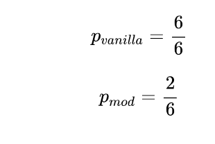

我们可以看到，简单的修正已经产生了一个更合理的值。现在让我们扩展一下，不仅要看单字，还要看n-grams。假设我们有一个生成的句子，snt，我们想和一个参考句子，snt′进行比较。我们提取所有可能的n度的n-grams，并进行核算，以获得精度pn:

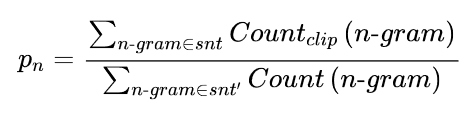

为了避免奖励重复的世代，分子中的计数被剪掉了。这意味着，一个ngram的出现次数以它在参考句中出现的次数为上限。还要注意的是，在这个公式中，句子的定义不是很严格，如果你有一个跨越多个句子的生成文本，你会把它当作一个句子。

一般来说，在我们想要评估的测试集中有不止一个样本，所以我们需要通过对语料库C中的所有样本进行求和来稍微扩展这个方程:

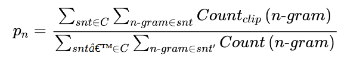

我们就快到了。由于我们不是在看召回率，所有生成的短而精确的序列与长的句子相比都有好处。因此，精度得分有利于短的生成。为了弥补这一点，BLEU的作者引入了一个额外的术语，即简洁性惩罚:


通过取最小值，我们确保这个惩罚永远不会超过1，而且当生成的文本lgen的长度小于参考文本lref时，指数项会变得指数级小。在这一点上，你可能会问，为什么我们不直接使用类似F-score的东西来考虑召回率呢？答案是，在翻译数据集中通常有多个参考句子，而不是只有一个，所以如果我们也衡量召回率，我们就会激励那些使用所有参考句子的翻译。因此，最好是在翻译中寻找高精确度，并确保翻译和参考文献有相似的长度。

最后，我们可以把所有东西放在一起，得到BLEU分数的方程式:

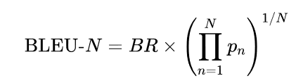

最后一项是修改后的精度的几何平均值，直到n-gram N。在实践中，BLEU-4得分经常被报告。然而，你可能已经看到这个指标有很多局限性；例如，它没有考虑到同义词，而且在推导过程中的许多步骤似乎是临时的、相当脆弱的启发式方法。你可以在Rachel Tatman的博文[《评估NLP中的文本输出：BLEU由你自己承担风险》](https://towardsdatascience.com/evaluating-text-output-in-nlp-bleu-at-your-own-risk-e8609665a213?gi=a55b8870dca5)中找到关于BLEU缺陷的精彩阐述。


总的来说，文本生成领域仍在寻找更好的评价指标，而找到克服BLEU等指标局限性的方法是一个活跃的研究领域。BLEU指标的另一个弱点是，它期望文本已经被标记化。如果没有使用完全相同的文本标记化方法，这可能会导致不同的结果。SacreBLEU指标通过将标记化步骤内部化来解决这个问题；由于这个原因，它是基准测试的首选指标。

我们现在已经研究了一些理论，但我们真正想做的是计算一些生成文本的分数。这是否意味着我们需要在Python中实现所有这些逻辑？不用担心，Datasets也提供了度量标准！加载度量标准的工作方式与加载文本一样。加载度量的工作方式与加载数据集一样。

```
from datasets import load_metric 
bleu_metric = load_metric("sacrebleu")

```

bleu_metric对象是Metric类的一个实例，其工作方式类似于一个聚合器：你可以通过add()添加单个实例，或者通过add_batch()添加整个批次。一旦你添加了所有你需要评估的样本，你就可以调用compute()，然后计算出度量。这将返回一个包含若干数值的字典，例如每个n-gram的精度、长度惩罚以及最终的BLEU分数。让我们来看看之前的例子：

```
import pandas as pd 
import numpy as np 
bleu_metric.add( prediction="the the the the the the", reference=["the cat is on the mat"]) 
results = bleu_metric.compute(smooth_method="floor", smooth_value=0) 
results["precisions"] = [np.round(p, 2) for p in results["precisions"]] 
pd.DataFrame.from_dict(results, orient="index", columns=["Value"])

```

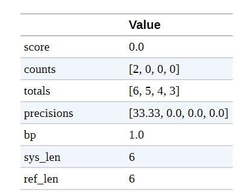

**注意事项**

如果有多个参考译文，BLEU得分也是有效的。这就是为什么参考文献是以列表形式传递的。为了使指标对ngrams中的零计数更加平滑 ，BLEU集成了修改精度计算的方法。一种方法是在分子中加入一个常数（解决分母为零）。这样，一个缺失的n-gram就不会导致分数自动归零。为了解释这些数值，我们通过设置smooth_value=0来关闭它。


我们可以看到1-gram的精度确实是2/6，而2/3/4-gram的精度都是0。（关于单个指标的更多信息，如counts和bp，见SacreBLEU库）。这意味着几何平均数为零，因此BLEU分数也为零。让我们看一下另一个预测几乎正确的例子：

```
bleu_metric.add( prediction="the cat is on mat", reference=["the cat is on the mat"])
results = bleu_metric.compute(smooth_method="floor", smooth_value=0) 
results["precisions"] = [np.round(p, 2)for p in results["precisions"]] 
pd.DataFrame.from_dict(results, orient="index", columns=["Value"])

```

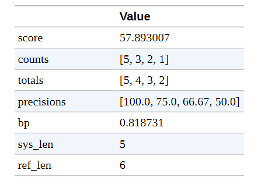

我们观察到，精度分数要好得多。预测中的1-词组都是匹配的，只有在精度分数中我们才看到有什么不对劲。对于4-gram来说，只有两个候选词，["the", "cat", "is", "on"]和["cat", "is", "on", "mat"]，其中最后一个词不匹配，因此精度为0.5。

BLEU分数被广泛用于评估文本，特别是在机器翻译中，因为精确的翻译通常比包括所有可能和适当的词的翻译更受青睐。

还有其他一些应用，如文本摘要，情况则不同。在那里，我们希望生成的文本中包含所有的重要信息，所以我们倾向于高召回率。这就是通常使用ROUGE分数的地方。

**ROUGE**

ROUGE分数是专门为文本摘要等应用而开发的，在这些应用中，高召回率比精确率更重要。该方法与BLEU分数非常相似，我们查看不同的n-grams，并比较它们在生成文本和参考文本中的出现率。不同的是，在ROUGE中，我们检查参考文本中有多少个ngrams也出现在生成的文本中。对于BLEU，我们看的是生成文本中有多少个n-grams出现在参考文本中，因此我们可以重新使用精度公式，并稍作修改，将参考n-grams在生成文本中的出现次数计入分母:

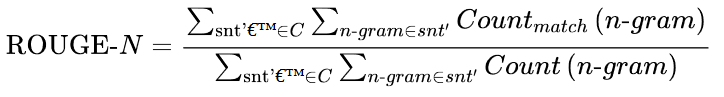

这就是ROUGE的最初提议。随后，研究人员发现，完全去除精度会产生强烈的负面效应。回到没有剪切计数的BLEU公式，我们也可以测量精度，然后我们可以将精度和召回率的ROUGE分数合并到调和平均数中，得到一个F-score。这个分数是现今通常报告的ROUGE的指标。

在ROUGE中，有一个单独的分数来衡量最长的共同子串（LCS），称为ROUGE-L。LCS可以为任何一对字符串计算。例如，"abab "的LCS和它的长度是2。如果我们想在两个样本之间比较这个值，我们需要以某种方式使其正常化，因为否则的话，一个较长的文本将处于优势地位。为了实现这一点，ROUGE的发明者想出了一个类似于F-score的方案，其中LCS被归一化为参考和生成文本的长度，然后这两个归一化的分数被混合在一起:

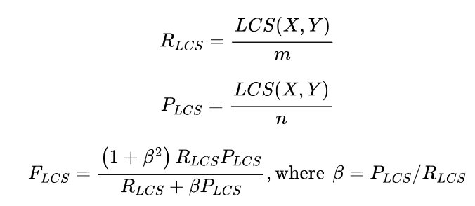

这样一来，LCS的得分就被适当地规范化了，可以在不同的样本之间进行比较。在Datasets的实现中，计算了两种不同的ROUGE：一种是计算每个句子的得分并对摘要进行平均（ROUGE-L），另一种是直接对整个摘要进行计算（ROUGE-Lsum）。

我们可以按以下方式加载指标：


```
rouge_metric = load_metric("rouge")

```

我们已经用GPT-2和其他模型生成了一组摘要，现在我们有一个指标来系统地比较这些摘要。让我们将ROUGE得分应用于所有模型生成的摘要：

```
reference = dataset["train"][1]["highlights"] 
records = [] 
rouge_names = ["rouge1", "rouge2", "rougeL", "rougeLsum"] 
for model_name in summaries: 
	rouge_metric.add(prediction=summaries[model_name], reference=reference) 
	score = rouge_metric.compute() 
	rouge_dict = dict((rn, score[rn].mid.fmeasure) for rn in rouge_names)
	records.append(rouge_dict) 
pd.DataFrame.from_records(records, index=summaries.keys())

```

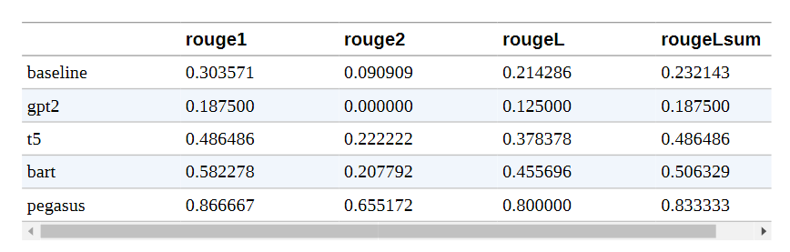

**注意事顶**

数据集库中的ROUGE指标还可以计算置信区间（默认为第5和第95百分位数）。平均值被存储在属性mid中，区间可以用low和high来检索。

这些结果显然不是很可靠，因为我们只看了一个样本，但我们可以比较这一个例子的文本摘要质量。该表证实了我们的观察，即在我们考虑的模型中，GPT-2的表现最差。这并不奇怪，因为它是这组模型中唯一没有被明确训练为文本摘要的模型。然而，令人吃惊的是，与拥有10亿个参数的转换模型相比，简单的前三句基线并没有表现得太差！PEGASUS和BART的表现也是如此。PEGASUS和BART是总体上最好的模型（ROUGE分数越高越好），但T5在ROUGE-1和LCS分数上略胜一筹。这些结果使T5和PEGASUS成为最好的模型，但同样应该谨慎对待这些结果，因为我们只在一个例子上评估了这些模型。看看PEGASUS论文中的结果，我们预计PEGASUS在CNN/DailyMail数据集上的表现会优于T5。

让我们看看我们是否能用PEGASUS重现这些结果。

## 在CNN/DailyMail数据集上对PEGASUS进行评估

现在，我们已经具备了正确评估该模型的所有条件：我们有一个带有CNN/DailyMail测试集的数据集，我们有一个带有ROUGE的衡量标准，我们有一个文本摘要模型。我们只需要把这些碎片放在一起。让我们首先评估一下三句话基线的性能：

```
def evaluate_summaries_baseline(dataset, metric, column_text="article", 			column_summary="highlights"): 
    summaries = [three_sentence_summary(text) for text in dataset[column_text]] 
    metric.add_batch(predictions=summaries, references=dataset[column_summary]) 
    score = metric.compute() 
    return score

```

现在我们将把这个函数应用于数据的一个子集。由于CNN/DailyMail数据集的测试部分包括大约10,000个样本，为所有这些文章生成摘要需要大量时间。回顾第五章，每一个生成的标记都需要通过模型进行前向传递；因此，为每个样本生成100个标记就需要100万次前向传递，如果我们使用波束搜索，这个数字还要乘以波束的数量。为了保持相对较快的计算速度，我们将对测试集进行子采样，在1000个样本上运行评估。这应该会给我们一个更稳定的分数估计，同时在单个GPU上对PEGASUS模型完成的时间不到一小时：

```
est_sampled = dataset["test"].shuffle(seed=42).select(range(1000)) 
score = evaluate_summaries_baseline(test_sampled, rouge_metric) 
rouge_dict = dict((rn, score[rn].mid.fmeasure) for rn in rouge_names) pd.DataFrame.from_dict(rouge_dict, orient="index", columns=["baseline"]).T

```

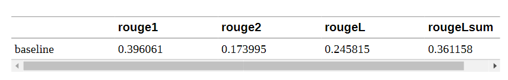

分数大多比前一个例子差，但仍然比GPT-2取得的分数好！这就是为什么我们要用GPT-2来评价PEGASUS模型。现在让我们实现同样的评价函数来评价PEGASUS模型：

```
from tqdm import tqdm import torch 
device = "cuda" if torch.cuda.is_available() else "cpu" 
def chunks(list_of_elements, batch_size): 
	"""Yield successive batch-sized chunks from list_of_elements.""" 
	for i in range(0, len(list_of_elements), batch_size): 
	yield list_of_elements[i : i + batch_size] 
def evaluate_summaries_pegasus(dataset, metric, model, tokenizer, batch_size=16, device=device, column_text="article", column_summary="highlights"): 
	article_batches = list(chunks(dataset[column_text], batch_size)) 
	target_batches = list(chunks(dataset[column_summary], batch_size)) 
	for article_batch, target_batch in tqdm( zip(article_batches, target_batches), total=len(article_batches)): 
		inputs = tokenizer(article_batch, max_length=1024, truncation=True, padding="max_length", return_tensors="pt") 
		summaries = model.generate(input_ids=inputs["input_ids"].to(device), attention_mask=inputs["attention_mask"].to(device), length_penalty=0.8, num_beams=8, max_length=128) 
		decoded_summaries = [tokenizer.decode(s, skip_special_tokens=True, clean_up_tokenization_spaces=True) for s in summaries] 
		decoded_summaries = [d.replace("<n>", " ") for d in decoded_summaries] 
		metric.add_batch(predictions=decoded_summaries, references=target_batch) 
	score = metric.compute() 
	return score

```

让我们来解读一下这个评估代码。首先，我们把数据集分成较小的批次，以便我们可以同时处理。然后，对于每个批次，我们对输入的文章进行标记，并将其送入generate()函数，以使用波束搜索产生摘要。我们使用与论文中提出的相同的生成参数。新的长度惩罚参数确保模型不会产生过长的序列。最后，我们对生成的文本进行解码，替换<n>标记，并将解码后的文本与参考文献一起添加到指标中。最后，我们计算并返回ROUGE的分数。现在让我们用用于seq2seq生成任务的AutoModelForSeq2SeqLM类再次加载模型，并评估它：

```
from transformers import AutoModelForSeq2SeqLM, AutoTokenizer 
model_ckpt = "google/pegasus-cnn_dailymail" 
tokenizer = AutoTokenizer.from_pretrained(model_ckpt) 
model = AutoModelForSeq2SeqLM.from_pretrained(model_ckpt).to(device) 
score = evaluate_summaries_pegasus(test_sampled, rouge_metric, model, tokenizer, batch_size=8) 
rouge_dict = dict((rn, score[rn].mid.fmeasure) for rn in rouge_names) 
pd.DataFrame(rouge_dict, index=["pegasus"])

```

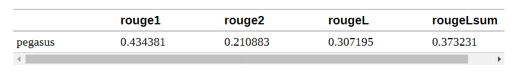

这些数字与公布的结果非常接近。这里需要注意的一点是，损失和每个标记的准确性在一定程度上与ROUGE分数脱钩。损失是独立于解码策略的，而ROUGE分数是强耦合的。

由于ROUGE和BLEU与人类判断的相关性比损失或准确率要好，所以在建立文本生成模型时，我们应该关注它们并仔细探索和选择解码策略。然而，这些指标远非完美，人们也应该始终考虑人类的判断。

现在我们已经有了一个评估函数，是时候训练我们自己的文本摘要模型了。

## 训练一个摘要模型

我们已经研究了很多关于文本摘要和评估的细节，所以让我们把这些用于训练一个自定义的文本摘要模型吧 在我们的应用中，我们将使用三星开发的SAMSum数据集，该数据集由一系列的对话和简短的摘要组成。在企业环境中，这些对话可能代表了客户和支持中心之间的互动，因此，生成准确的摘要可以帮助改善客户服务，并检测客户请求中的共同模式。让我们加载它并看看一个例子：

```
dataset_samsum = load_dataset("samsum") 
split_lengths = [len(dataset_samsum[split])for split in dataset_samsum] 
print(f"Split lengths: {split_lengths}") 
print(f"Features: {dataset_samsum['train'].column_names}") 
print("\nDialogue:") 
print(dataset_samsum["test"][0]["dialogue"]) 
print("\nSummary:") 
print(dataset_samsum["test"][0]["summary"])


Split lengths: [14732, 819, 818] 
Features: ['id', 'dialogue', 'summary'] 
Dialogue: Hannah: Hey, do you have Betty's number? 
Amanda: Lemme check 
Hannah: <file_gif> 
Amanda: Sorry, can't find it. 
Amanda: Ask Larry 
Amanda: He called her last time we were at the park together 
Hannah: I don't know him well 
Hannah: <file_gif> Amanda: Don't be shy, he's very nice 
Hannah: If you say so.. 
Hannah: I'd rather you texted him 
Amanda: Just text him 
Hannah: Urgh.. Alright 
Hannah: Bye 
Amanda: Bye bye 
Summary: Hannah needs Betty's number but Amanda doesn't have it. She needs to contact Larry.

```

对话看起来就像你期望通过短信或WhatsApp进行的聊天一样，包括表情符号和GIF的占位符。对话字段包含全文，摘要包含文本摘要的对话。在CNN/DailyMail数据集上微调的模型能处理这个问题吗？让我们拭目以待!

### 在SAMSum上对PEGASUS进行评估

首先，我们将用PEGASUS运行同样的文本摘要流水线，看看输出是什么样子的。我们可以重新使用我们用于生成CNN/DailyMail摘要的代码：

```
pipe_out = pipe(dataset_samsum["test"][0]["dialogue"]) 
print("Summary:") 
print(pipe_out[0]["summary_text"].replace(" .<n>", ".\n")) 

Summary: 
Amanda: Ask Larry 
Amanda: He called her last time we were at the park together. 
Hannah: I'd rather you texted him. 
Amanda: Just text him .

```

我们可以看到，该模型大多试图通过提取对话中的关键句子来进行文本摘要。这在CNN/DailyMail数据集上可能效果相对较好，但SAMSum中的文本摘要更加抽象。让我们通过在测试集上运行完整的ROUGE评估来确认这一点:

```
score = evaluate_summaries_pegasus(dataset_samsum["test"], rouge_metric, model, tokenizer, column_text="dialogue", column_summary="summary", batch_size=8) 

rouge_dict = dict((rn, score[rn].mid.fmeasure) for rn in rouge_names) pd.DataFrame(rouge_dict, index=["pegasus"])

```

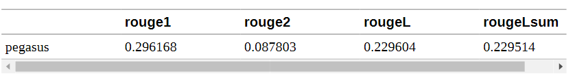

嗯，结果不是很好，但这并不意外，因为我们已经远离了CNN/DailyMail的数据分布。尽管如此，在训练前设置评估流水线有两个好处：我们可以直接用指标来衡量训练的成功与否，而且我们有一个好的基线。在我们的数据集上对模型进行微调，应该会使ROUGE指标立即得到改善，如果不是这样，我们就知道我们的训练循环出了问题。

### 微调PEGASUS

在我们处理数据进行训练之前，让我们快速看一下输入和输出的长度分布:

```
d_len = [len(tokenizer.encode(s)) for s in dataset_samsum["train"] ["dialogue"]] 
s_len = [len(tokenizer.encode(s)) for s in dataset_samsum["train"]["summary"]] 
fig, axes = plt.subplots(1, 2, figsize=(10, 3.5), sharey=True)
axes[0].hist(d_len, bins=20, color="C0", edgecolor="C0") 
axes[0].set_title("Dialogue Token Length") 
axes[0].set_xlabel("Length") 
axes[0].set_ylabel("Count") 
axes[1].hist(s_len, bins=20, color="C0", edgecolor="C0") 
axes[1].set_title("Summary Token Length") 
axes[1].set_xlabel("Length") plt.tight_layout() 

plt.show()

```

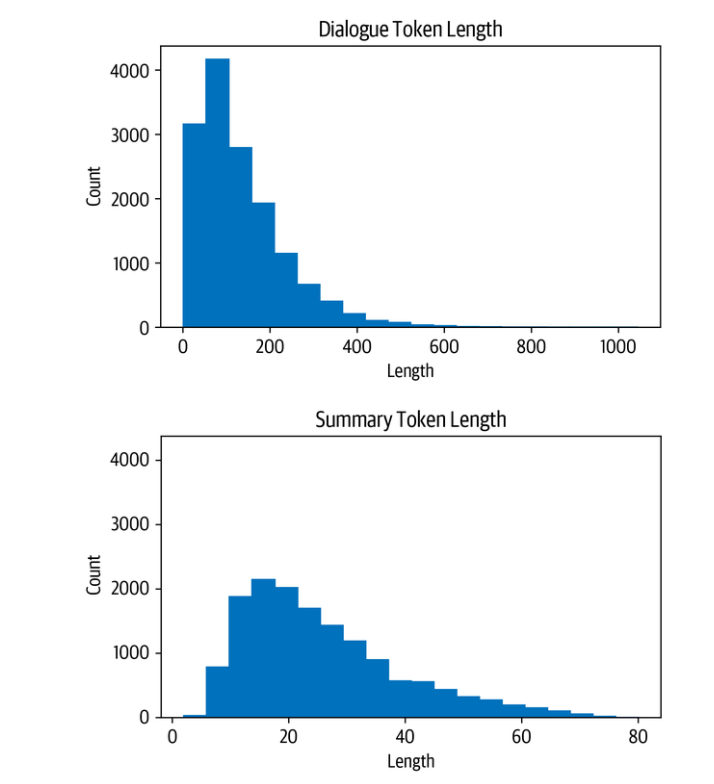

我们看到，大多数对话比CNN/DailyMail的文章短得多，每个对话有100-200个标记。同样，摘要也短得多，大约有20-40个符号（一条推文的平均长度）。

让我们在为训练者建立数据整理器时牢记这些意见。首先，我们需要对数据集进行标记。现在，我们将对话和摘要的最大长度分别设置为1024和128:

```
def convert_examples_to_features(example_batch): 
	input_encodings = tokenizer(example_batch["dialogue"], max_length=1024, truncation=True) 
	with tokenizer.as_target_tokenizer(): 
		target_encodings = tokenizer(example_batch["summary"], max_length=128, truncation=True) 
	return {"input_ids": input_encodings["input_ids"], "attention_mask": input_encodings["attention_mask"], "labels": target_encodings["input_ids"]} 
dataset_samsum_pt = dataset_samsum.map(convert_examples_to_features, batched=True) 
columns = ["input_ids", "labels", "attention_mask"] 
dataset_samsum_pt.set_format(type="torch", columns=columns)

```

使用标记化步骤的一个新东西是tokenizer.as_target_tokenizer()上下文。有些模型在解码器输入中需要特殊的标记，所以区分编码器和解码器输入的标记很重要。在with语句（称为上下文管理器）中，标记器知道它正在为解码器进行标记，并可以相应地处理序列。

现在，我们需要创建数据整理器。这个函数在训练器中被调用，就在批处理被送入模型之前。在大多数情况下，我们可以使用默认的整理器，它从批次中收集所有的张量并简单地堆叠起来。对于文本摘要任务，我们不仅需要堆叠输入，还需要在解码器一侧准备目标。PEGASUS是一个编码器-解码器转化器，因此具有经典的seq2seq架构。在seq2seq设置中，一个常见的方法是在解码器中应用 "教师强制"。在这种策略下，解码器收到的输入标记（如GPT-2等纯解码器模型），除了编码器的输出外，还包括移一的标签；因此，在对下一个标记进行预测时，解码器得到移一的基础事实作为输入，如下表所示:

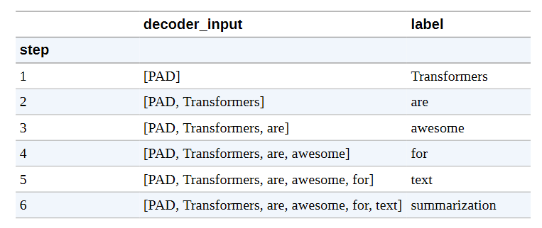

我们将其移位，使解码器只看到以前的地面真实标签，而不是现在或未来的标签。仅仅移位就足够了，因为解码器有掩蔽的自我注意力，可以掩蔽现在和未来的所有输入。

因此，当我们准备我们的批次时，我们通过将标签向右移动一个来设置解码器的输入。之后，我们确保标签中的填充标记被损失函数忽略，将它们设置为-100。不过，我们实际上不需要手动做这些，因为DataCollatorForSeq2Seq来拯救我们，为我们处理所有这些步骤:

```
from transformers import DataCollatorForSeq2Seq 
seq2seq_data_collator = DataCollatorForSeq2Seq(tokenizer, model=model) 

#然后，像往常一样，我们为训练设置了一个TrainingArguments:

from transformers import TrainingArguments, Trainer 
training_args = TrainingArguments( output_dir='pegasus-samsum', num_train_epochs=1, warmup_steps=500, per_device_train_batch_size=1, per_device_eval_batch_size=1, weight_decay=0.01, logging_steps=10, push_to_hub=True,
evaluation_strategy='steps', eval_steps=500, save_steps=1e6, gradient_accumulation_steps=16)

```

有一点与之前的设置不同，那就是新的参数，gradient_accumulation_steps。由于模型相当大，我们不得不将批次大小设置为1。然而，批次大小太小会损害收敛性。为了解决这个问题，我们可以使用一种叫做梯度累积的巧妙技术。顾名思义，我们不是一次性计算全部批次的梯度，而是做较小的批次，然后聚集梯度。当我们聚集了足够多的梯度，我们就运行优化步骤。当然，这比一次性完成要慢一些，但它为我们节省了大量的GPU内存。

现在让我们确保我们已经登录到Hugging Face，这样我们就可以在训练后将模型推送到Hub:

```
from huggingface_hub import notebook_login 
notebook_login()

```

现在我们已经有了初始化训练器所需的一切，包括模型、标记器、训练参数和数据整理器，以及训练和评估集:

```
trainer = Trainer(model=model, args=training_args, tokenizer=tokenizer, data_collator=seq2seq_data_collator, train_dataset=dataset_samsum_pt["train"], eval_dataset=dataset_samsum_pt["validation"])

```

我们已经准备好进行训练了。训练结束后，我们可以直接在测试集上运行评估函数，看看模型的表现如何:

```
trainer.train() 
score = evaluate_summaries_pegasus( dataset_samsum["test"], rouge_metric, trainer.model, tokenizer, batch_size=2, column_text="dialogue", column_summary="summary") 
rouge_dict = dict((rn, score[rn].mid.fmeasure) for rn in rouge_names) pd.DataFrame(rouge_dict, index=[f"pegasus"])

```

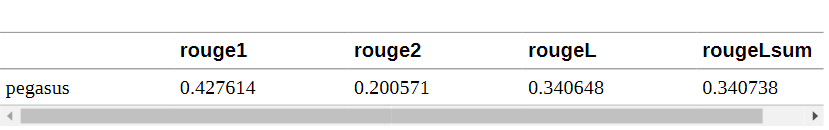

我们看到，ROUGE的分数比没有微调的模型有了很大的提高，所以即使之前的模型也是为文本摘要而训练的，但它并没有很好地适应新的领域。让我们把我们的模型推到Hub上:

```
trainer.push_to_hub("Training complete!")

```

在下一节，我们将使用该模型为我们生成一些文本摘要。

**小技巧**

你也可以作为训练循环的一部分评估生成情况：使用TrainingArguments的扩展，称为Seq2SeqTrainingArguments，并指定predict_with_generate=True。将其传递给名为Seq2SeqTrainer的专用训练器，然后使用generate()函数而不是模型的正向传递来创建用于评估的预测。试一试吧!

### 生成对话摘要

从损失和ROUGE分数来看，该模型似乎比只在CNN/DailyMail上训练的原始模型有明显的改进。让我们看看在测试集的一个样本上产生的文本摘要是什么样子的：

```
gen_kwargs = {"length_penalty": 0.8, "num_beams":8, "max_length": 128} 
sample_text = dataset_samsum["test"][0]["dialogue"] 
reference = dataset_samsum["test"][0]["summary"] 
pipe = pipeline("summarization", model="transformersbook/pegasus-samsum") print("Dialogue:") 
print(sample_text) 
print("\nReference Summary:") 
print(reference) 
print("\nModel Summary:") 
print(pipe(sample_text, **gen_kwargs)[0]["summary_text"])

Dialogue: 
Hannah: Hey, do you have Betty's number? 
Amanda: Lemme check Hannah: <file_gif> 
Amanda: Sorry, can't find it. Amanda: Ask Larry 
Amanda: He called her last time we were at the park together Hannah: I don't know him well Hannah: <file_gif> 
Amanda: Don't be shy, he's very nice 
Hannah: If you say so.. 
Hannah: I'd rather you texted him 
Amanda: Just text him 
Hannah: Urgh.. Alright 
Hannah: Bye 
Amanda: Bye bye Reference 
Summary: Hannah needs Betty's number but Amanda doesn't have it. She needs to contact Larry. Model 
Summary: Amanda can't find Betty's number. Larry called Betty last time they were at the park together. Hannah wants Amanda to text Larry instead of calling Betty.

```

这看起来更像参考文献的摘要。似乎该模型已经学会了将对话综合成一个摘要，而不只是提取段落。现在，最终的测试：该模型在自定义输入上的效果如何？

```
custom_dialogue = """\ Thom: Hi guys, have you heard of transformers? Lewis: Yes, I used them recently! Leandro: Indeed, there is a great library by Hugging Face. Thom: I know, I helped build it ;) Lewis: Cool, maybe we should write a book about it. What do you think? Leandro: Great idea, how hard can it be?! Thom: I am in! Lewis: Awesome, let's do it together! """ 
print(pipe(custom_dialogue, **gen_kwargs)[0]["summary_text"]）

Thom, Lewis and Leandro are going to write a book about transformers. Thom helped build a library by Hugging Face. They are going to do it together.

```

生成的自定义对话的摘要是有意义的。它很好地总结了讨论中所有的人都想一起写书，而不是简单地提取单句。例如，它将第三和第四句话综合成一个逻辑组合。

## 结论 

与其他可以被定义为分类任务的任务相比，文本摘要带来了一些独特的挑战，比如情感分析、命名实体识别或问题回答。传统的衡量标准，如准确度，并不能反映出生成文本的质量。正如我们所看到的，BLEU和ROUGE指标可以更好地评估生成的文本；然而，人类的判断仍然是最好的衡量标准。

在使用文本摘要模型时，一个常见的问题是我们如何在文本比模型的上下文长度长的情况下摘要文件。不幸的是，没有单一的策略来解决这个问题，到目前为止，这仍然是一个开放和活跃的研究问题。例如，OpenAI最近的工作显示了如何通过将其递归地应用于长文档并在循环中使用人类反馈来扩大文本摘要。

在下一章中，我们将研究问题回答，也就是根据文本段落为问题提供答案的任务。与文本摘要不同的是，对于这项任务，存在着处理长文档或许多文档的良好策略，我们将向你展示如何将问题回答扩展到成千上万的文档。
