# 第8章  优化Transformers性能

在前面的章节中，你已经看到了如何对Transformers进行微调以在广泛的任务上产生巨大的结果。然而，在许多情况下，仅有准确度（或任何你要优化的指标）是不够的；如果你的先进模型太慢或太大，无法满足你的应用的业务需求，那么它就没有什么用。一个明显的替代方案是训练一个更快更紧凑的模型，但模型容量的减少往往伴随着性能的下降。那么，当你需要一个快速、紧凑而又高度精确的模型时，你能做些什么呢？

在这一章中，我们将探讨四种互补的技术，这些技术可以用来加快预测速度，并减少Transformers模型的内存占用：知识蒸馏、量化、剪枝，以及用开放神经网络交换（ONNX）格式和ONNXRuntime（ORT）进行图的优化。我们还将看到这些技术中的一些是如何结合起来产生显著的性能提升的。例如，这就是Roblox工程团队在他们的文章[《我们如何扩大Bert的规模以在CPU上提供超过10亿次的每日请求》](https://databricks.com/it/session_na21/how-we-scaled-bert-to-serve-1-billion-daily-requests-on-cpu)中采取的方法，如图8-1所示，他们发现结合知识蒸馏和量化使他们的BERT分类器的延迟和吞吐量提高了30倍以上。

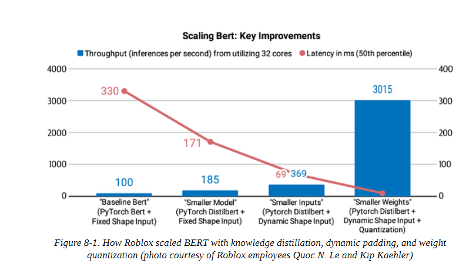

为了说明与每种技术相关的好处和权衡，我们将使用意图检测作为案例研究；这是基于文本的助手的一个重要组成部分，低延迟对于实时保持对话至关重要。在这一过程中，你将学习如何创建自定义训练器，执行有效的超参数搜索，并获得使用Transformers实现尖端研究的感觉。让我们开始吧!

## 作为案例研究的意图检测

假设我们试图为我们公司的呼叫中心建立一个基于文本的助理，这样客户就可以查询他们的账户余额或进行预订，而不需要与人类客服交谈。为了理解客户的目标，我们的助理将需要能够把各种各样的自然语言文本分类为一组预定义的行动或意图。例如，一个客户可能会发送一条关于即将到来的旅行的信息，如下所示：

Hey, I’d like to rent a vehicle from Nov 1st to Nov 15th in Paris and I need a 15 passenger van

而我们的意图分类器可以自动将其归类为汽车租赁的意图，然后触发一个行动和响应。为了在生产环境中保持稳健，我们的分类器还需要能够处理范围外的查询，即客户提出的查询不属于任何预定义的意图，系统应该产生一个后备响应。例如，在图8-2所示的第二种情况下，一个顾客问了一个关于体育的问题（这超出了范围），文本助理错误地将其归类为已知的范围内意图之一，并返回发薪日响应。在第三种情况下，文本助理已经被训练成可以检测出范围外的查询（通常被标记为一个单独的类别），并告知客户它可以回答哪些问题。

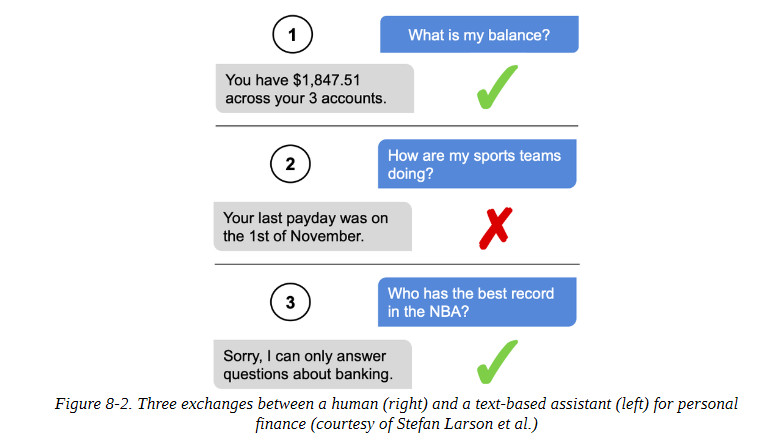

作为一个基准，我们对一个基于BERT的模型进行了微调，该模型在CLINC150数据集上达到了约94%的准确性。这个数据集包括22,500个范围内的查询，涉及150个意图和10个领域，如银行和旅游，还包括1,200个范围外的查询，属于一个 oos 意图类。在实践中，我们也会收集我们自己的内部数据集，但使用公共数据是一个快速迭代和产生初步结果的好方法。

为了开始，让我们从Hugging Face Hub下载我们的微调模型，并将其包裹在一个用于文本分类的管道中:

```
from transformers import pipeline
bert_ckpt = "transformersbook/bert-base-uncased-finetuned-clinc"
pipe = pipeline("text-classification", model=bert_ckpt)

```

现在我们有了一个管道，我们可以通过一个查询来从模型中获得预测的意图和信心分数:

```
query = """Hey, I'd like to rent a vehicle from Nov 1st to Nov 15th in Paris and I need a 15 passenger van""" 

pipe(query) 

[{'label': 'car_rental', 'score': 0.549003541469574}]

```

很好，租车的意图是有意义的。现在让我们来看看创建一个基准，我们可以用它来评估我们的基线模型的性能。

## 创建一个性能基准

像其他机器学习模型一样，在生产环境中部署转化器涉及到几个约束条件之间的权衡，最常见的是:

**模型性能** 

我们的模型在精心设计的反映生产数据的测试集上的表现如何？当出错的成本很大时（最好在循环中用人来缓解），或者当我们需要在数百万个例子上运行推理时，模型指标的小改进可以转化为总体上的大收益时，这一点就特别重要。

**延迟**

我们的模型能以多快的速度提供预测结果？在处理大量流量的实时环境中，我们通常关心延迟问题，比如Stack Overflow需要一个分类器来快速检测网站上不受欢迎的评论。

**内存**

 我们如何部署像GPT-2或T5这样需要数千兆字节的磁盘存储和内存的十亿参数模型？内存在移动或边缘设备中发挥着特别重要的作用。在移动或边缘设备中起着特别重要的作用，因为在这些设备中，模型必须在没有强大的云服务器的情况下产生预测结果。

如果不解决这些限制，可能会对你的应用程序的用户体验产生负面影响。更常见的是，它可能会导致运行昂贵的云服务器的成本膨胀，而这些服务器可能只需要处理几个请求。为了探索如何用各种压缩技术来优化这些限制，让我们开始创建一个简单的基准，以衡量给定管道和测试集的每个数量。我们所需要的骨架由下面的类提供：

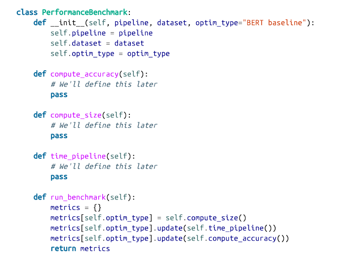

我们定义了一个optim_type参数，以记录本章要讲到的不同的优化技术。我们将使用run_benchmark()方法在一个字典中收集所有的指标，其键值由optim_type给出。


现在，让我们通过计算测试集上的模型准确度，来给这个类的骨头加点肉。首先，我们需要一些数据来进行测试，所以让我们下载CLINC150数据集，该数据集被用来微调我们的基线模型。我们可以从数据集中心获得该数据集，具体如下：

```
from datasets import load_dataset 
clinc = load_dataset("clinc_oos", "plus")

```

这里，加号配置指的是包含范围外的训练实例的子集。CLINC150数据集中的每个例子都由文本栏中的查询和其相应的意图组成。我们将使用测试集来衡量我们的模型，所以我们来看看数据集的一个例子：

```
sample = clinc["test"][42] 
sample 
{'intent': 133, 'text': 'transfer $100 from my checking to saving account'}

```

意图是以ID的形式提供的，但我们可以通过访问数据集的特征属性，很容易地获得对字符串的映射（反之亦然）：

```
intents = clinc["test"].features["intent"] 
intents.int2str(sample["intent"]) 
'transfer'

```

现在我们已经对CLINC150数据集的内容有了基本的了解，让我们来实现PerformanceBenchmark的compute_accuracy()方法。由于该数据集在各意向类之间是平衡的，我们将使用准确性作为我们的度量标准。我们可以用Datasets来加载这个度量，如下所示：

```
from datasets import load_metric 
accuracy_score = load_metric("accuracy")

```

准确度指标希望预测和参考（即基础事实标签）都是整数。我们可以使用管道从文本字段中提取预测值，然后使用intents对象的str2int()方法将每个预测值映射到其对应的ID。下面的代码在返回数据集的准确性之前，将所有的预测和标签收集到列表中。让我们也把它添加到我们的PerformanceBenchmark类中：

```
def compute_accuracy(self): 
	"""This overrides the PerformanceBenchmark.compute_accuracy() method""" 
	preds, labels = [], [] 
	for example in self.dataset: 
		pred = self.pipeline(example["text"])[0]["label"] 
		label = example["intent"] 
		preds.append(intents.str2int(pred)) 
		labels.append(label)
        accuracy = accuracy_score.compute(predictions=preds, references=labels) 
        print(f"Accuracy on test set - {accuracy['accuracy']:.3f}") 
     return accuracy PerformanceBenchmark.compute_accuracy = compute_accuracy

```

接下来，让我们通过使用PyTorch的torch.save()函数来计算我们模型的大小，将模型序列化到磁盘上。在引擎盖下，torch.save()使用Python的pickle模块，可以用来保存从模型到张量到普通Python对象的任何东西。在PyTorch中，推荐的保存模型的方法是使用它的state_dict，这是一个Python字典，它将模型中的每一层映射到它的可学习参数（即权重和偏差）。让我们看看我们的基线模型的state_dict中存储了什么：

```
list(pipe.model.state_dict().items())[42] 

('bert.encoder.layer.2.attention.self.value.weight', 

tensor([[-1.0526e-02, -3.2215e-02, 2.2097e-02, ..., -6.0953e-03, 4.6521e-03, 2.9844e-02], [-1.4964e-02, -1.0915e-02, 5.2396e-04, ..., 3.2047e-05, -2.6890e-02, -2.1943e-02], [-2.9640e-02, -3.7842e-03, -1.2582e-02, ..., -1.0917e-02, 3.1152e-02, -9.7786e-03], ..., [-1.5116e-02, -3.3226e-02, 4.2063e-02, ..., -5.2652e-03, 1.1093e-02, 2.9703e-03], [-3.6809e-02, 5.6848e-02, -2.6544e-02, ..., -4.0114e-02,
6.7487e-03, 1.0511e-03], [-2.4961e-02, 1.4747e-03, -5.4271e-02, ..., 2.0004e-02, 2.3981e-02, -4.2880e-02]]))

```

我们可以清楚地看到，每个键/值对都对应于BERT中的一个特定层和张量。因此，如果我们将我们的模型保存为：

```
torch.save(pipe.model.state_dict(), "model.pt")

```

然后我们可以使用 Python 的 pathlib 模块中的 Path.stat() 函数来获得底层文件的信息。特别是，Path("model.pt").stat().st_size将给我们提供模型的字节数。让我们把这些都放在 compute_size() 函数中，并把它添加到 PerformanceBenchmark 中：

```
import torch 
from pathlib import Path 
def compute_size(self): 
	"""This overrides the PerformanceBenchmark.compute_size() method""" 
	state_dict = self.pipeline.model.state_dict() 
	tmp_path = Path("model.pt") 
	torch.save(state_dict, tmp_path) 
	# Calculate size in megabytes
    size_mb = Path(tmp_path).stat().st_size / (1024 * 1024) 
    # Delete temporary file
    tmp_path.unlink() 
    print(f"Model size (MB) - {size_mb:.2f}")
    return {"size_mb": size_mb} 
 
 PerformanceBenchmark.compute_size = compute_size

```

最后，让我们实现time_pipeline()函数，这样我们就可以为每个查询的平均延迟计时。对于这个应用，延迟是指将文本查询送入管道并从模型中返回预测意图所需的时间。在引擎盖下，管道还对文本进行标记，但这比生成预测要快一千倍左右，因此对整体延迟的贡献可以忽略不计。测量一个代码片段的执行时间的简单方法是使用Python的时间模块中的perf_counter()函数。这个函数比time.time()函数有更好的时间分辨率，很适合于获得精确的结果。

我们可以使用perf_counter()对我们的管道进行计时，通过传递我们的测试查询并计算开始和结束之间的时间差（以毫秒计）：

```
from time import perf_counter 
for _ in range(3): 
	start_time = perf_counter() 
	_ = pipe(query) 
	latency = perf_counter() - start_time 
	print(f"Latency (ms) - {1000 * latency:.3f}") 
	
Latency (ms) - 85.367 
Latency (ms) - 85.241 
Latency (ms) - 87.275

```

这些结果在延迟方面表现出相当大的差异，并且表明，每次我们运行代码时，通过流水线的单次计时都会产生巨大的不同结果。因此，我们将收集多次运行的延迟，然后使用所得到的分布来计算平均值和标准差，这将给我们一个关于数值分布的概念。下面的代码做了我们需要的事情，并包括一个阶段，在执行实际的定时运行之前对CPU进行预热：

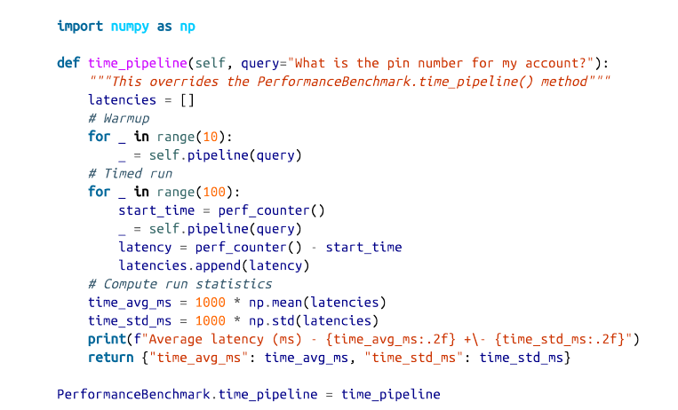

为了简单起见，我们将使用相同的查询值对我们所有的模型进行基准测试。一般来说，延迟将取决于查询的长度，一个好的做法是用生产环境中可能遇到的查询来为你的模型做基准。

现在，我们的PerformanceBenchmark类已经完成了，让我们给它一个机会吧 让我们从BERT基线的基准测试开始。对于基线模型，我们只需要传递管道和我们希望执行基准测试的数据集。我们将在perf_metrics字典中收集结果，以跟踪每个模型的性能：

```
pb = PerformanceBenchmark(pipe, clinc["test"]) 
perf_metrics = pb.run_benchmark() 

Model size (MB) - 418.16 
Average latency (ms) - 54.20 +\- 1.91 
Accuracy on test set - 0.867

```

现在我们有了一个参考点，让我们来看看我们的第一个压缩技术：知识蒸馏。

**注意事项**

平均延迟值会因你在什么类型的硬件上运行而有所不同。例如，你通常可以通过在GPU上运行推理获得更好的性能，因为它可以进行批处理。就本章而言，重要的是模型之间延迟的相对差异。一旦我们确定了表现最好的模型，我们就可以根据需要探索不同的后端来减少绝对延迟。


## 通过知识蒸馏使模型变得更小

知识蒸馏是一种通用的方法，用于训练一个较小的学生模型来模仿一个较慢的、较大的、但表现较好的教师模型的行为。它最初于2006年在集合模型的背景下被引入，后来在2015年的一篇著名论文中得到普及，该论文将该方法推广到深度神经网络，并将其应用于图像分类和自动语音识别。

鉴于参数数量不断增加的语言模型的预训练趋势（在撰写本文时，最大的语言模型有超过一万亿个参数），知识蒸馏也成为一种流行的策略，以压缩这些巨大的模型，使其更适合于构建实际应用。

### 用于微调的知识蒸馏

那么，在训练过程中，知识究竟是如何 "提炼 "或从教师模型转移到学生模型身上的呢？对于像微调这样的监督任务，主要的想法是用来自教师模型的 "软概率 "分布来增加真实标签，为学生模型提供补充信息，使其从中学习。例如，如果我们以BERT为基础的分类器为多个意图分配了高概率，那么这可能是一个迹象，表明这些意图在特征空间中彼此接近。通过训练学生模型模仿这些概率，我们的目标是提炼出教师模型所学到的一些 "黑暗知识"--也就是说，这些知识是无法从标签中获得的。

在数学上，其工作方式如下。假设我们将一个输入序列x送入教师模型，生成一个对数z(x)=[ z1 (x), ..., zN (x)] 的向量。我们可以通过应用一个softmax函数将这些对数转换成概率：

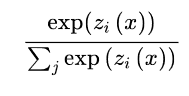

但这并不是我们想要的，因为在很多情况下，教师模型会给一个班级分配很高的概率，而其他班级的概率都接近于零。当这种情况发生时，教师模型除了提供基本事实标签外，并没有提供多少额外的信息，所以我们在应用softmax之前，通过用温度超参数T对对数进行缩放来 "软化 "概率：

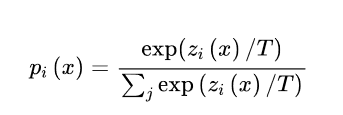

如图8-3所示，较高的T值会产生一个较软的类的概率分布，并揭示出更多关于教师模型为每个训练实例所学的决策边界的信息。当T=1时，我们恢复了原始的softmax分布。

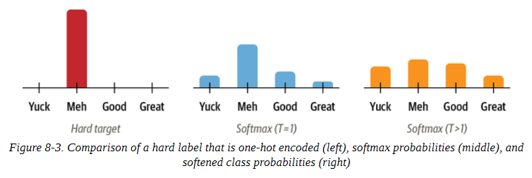

由于学生模型也产生了自己的软化概率qi (x)，我们可以使用Kullback-Leibler (KL)散度来衡量两个概率分布之间的差异：

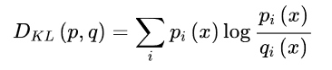

通过KL散度，我们可以计算出当我们用学生模型来近似教师模型的概率分布时有多少损失。这使我们能够定义知识蒸馏的损失：

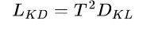

其中T^2是一个归一化系数，以考虑到软标签产生的梯度的大小以1/(T^2)为尺度的事实。对于分类任务，学生模型损失是蒸馏损失与通常的地面真实标签的交叉熵损失LCE的加权平均。

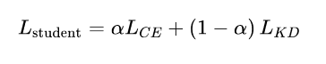

其中，α是一个超参数，控制每个损失的相对强度。整个过程的示意图见图8-4；在推理时温度被设置为1，以恢复标准的softmax概率。

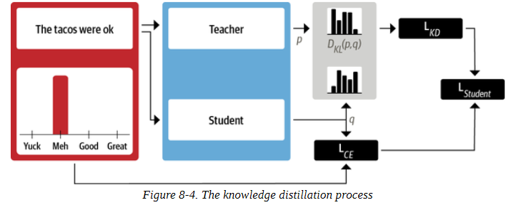

### 用于预训练的知识蒸馏

知识蒸馏也可以在预训练期间用于创建一个通用的学生模型，随后可以在下游任务中进行微调。在这种情况下，教师模型是一个预训练的语言模型，如BERT，它将其关于掩蔽语言建模的知识转移到学生模型身上。例如，在DistilBERT论文中，掩蔽语言建模损失Lmlm被增加了一个来自知识蒸馏的术语和一个余弦嵌入损失Lcos = 1 - cos (hs, ht)，以调整教师模型和学生模型之间隐藏状态向量的方向:

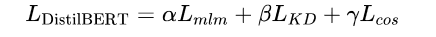

既然我们已经有了一个微调的BERT基础模型，让我们看看如何利用知识蒸馏来微调一个更小更快的模型。要做到这一点，我们需要一种方法，用LKD项来增加交叉熵损失。幸运的是，我们可以通过创建我们自己的训练器来做到这一点!

### 创建一个知识蒸馏训练器

为了实现知识蒸馏，我们需要向训练器基类添加一些东西:

- 新的超参数α和T，控制蒸馏损失的相对权重和标签的概率分布的平滑程度。

- 微调的教师模型，在我们的例子中是BERT-base。

- 一个新的损失函数，结合交叉熵损失和知识蒸馏损失

添加新的超参数是非常简单的，因为我们只需要将TrainingArguments子类化，并将其作为新的属性:

```
from transformers import TrainingArguments 
class DistillationTrainingArguments(TrainingArguments): 
	def __init__(self, *args, alpha=0.5, temperature=2.0, **kwargs): 
		super().__init__(*args, **kwargs) 
		self.alpha = alpha
        self.temperature = temperature

```

对于训练器本身，我们需要一个新的损失函数。实现的方法是子类化训练器并重写compute_loss()方法以包括知识蒸馏损失项Lkd :

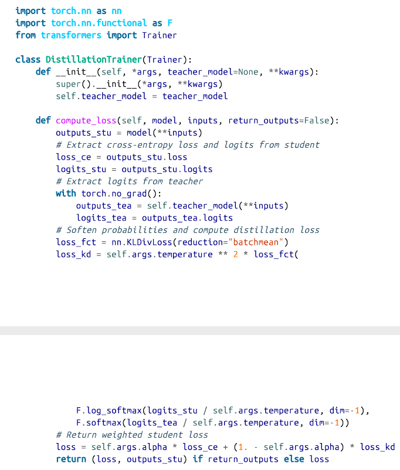

让我们来解读一下这段代码。当我们实例化DistillationTrainer时，我们传递一个teacher_model参数，其中包含一个已经在我们的任务中进行了微调的教师模型。接下来，在compute_loss()方法中，我们从学生模型和教师模型那里提取对数，用温度对其进行缩放，然后用softmax对其进行归一化处理，再将其传递给PyTorch的nn.KLDivLoss()函数以计算KL分歧。nn.KLDivLoss()的一个怪癖是，它希望输入是对数概率的形式，而标签是正态概率。这就是为什么我们使用F.log_softmax()函数来规范学生模型的对数，而教师模型的对数则用标准的softmax转换为概率。nn.KLDivLoss()中的reduction=batchmean参数指定我们在批次维度上平均损失。


**小技巧**

你也可以用变形器库的Keras API来进行知识蒸馏。要做到这一点，你需要实现一个自定义的Distiller类，重写tf.keras.Model()的train_step()、test_step()和compile() 方法。关于如何做到这一点，请参见Keras文档中的一个例子。

### 选择好的学生模型初始化方案

现在我们有了自定义训练器，你可能会有的第一个问题是，我们应该为学生模型选择哪种预训练的语言模型？一般来说，我们应该为学生模型挑选一个较小的模型以减少延迟和内存占用。文献中一个很好的经验法则是，当教师模型和学生模型的模型类型相同时，知识蒸馏的效果最好。一个可能的原因是，不同的模型类型，例如BERT和RoBERTa，可以有不同的输出嵌入空间，这阻碍了学生模型模仿教师模型的能力。在我们的案例研究中，教师模型是BERT，所以DistilBERT是一个自然的候选者来初始化学生模型，因为它的参数少了40%，并且已经被证明在下游任务中取得了强大的结果。

首先，我们需要对我们的查询进行标记和编码，所以让我们从DistilBERT实例化标记器，并创建一个简单的tokenize_text()函数来处理预处理工作：

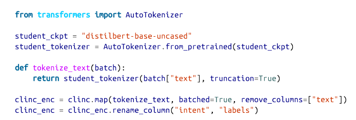

这里我们删除了文本栏，因为我们不再需要它，我们还将意图栏改名为标签，这样它就可以被训练器自动检测到。

现在我们已经处理了我们的文本，我们需要做的下一件事是为我们的DistillationTrainer定义超参数和compute_metrics()函数。我们还将把我们所有的模型推送到Hugging Face Hub，所以让我们开始登录我们的账户：

```
from huggingface_hub import 
notebook_login notebook_login()

```

接下来，我们将定义训练期间要跟踪的指标。正如我们在性能基准中所做的那样，我们将使用准确性作为主要指标。这意味着我们可以在DistillationTrainer中包含的compute_metrics()函数中重复使用我们的准确度_score()函数：

```
def compute_metrics(pred): 
	predictions, labels = pred 
	predictions = np.argmax(predictions, axis=1) 
	return accuracy_score.compute(predictions=predictions, references=labels)

```

在这个函数中，来自序列建模头的预测是以对数的形式出现的，所以我们使用np.argmax()函数来找到最有把握的类别预测，并与地面真实标签进行比较。

接下来我们需要定义训练参数。为了热身，我们将设置α=1，看看DistilBERT在没有来自教师模型的任何信号的情况下的表现如何。然后我们将把我们的微调模型推送到一个名为distilbertbase-uncased-finetuned-clinc的新存储库，所以我们只需要在DistillationTrainingArguments的output_dir参数中指定：

```
batch_size = 48 
finetuned_ckpt = "distilbert-base-uncased-finetuned-clinc" 
student_training_args = DistillationTrainingArguments( output_dir=finetuned_ckpt, evaluation_strategy = "epoch", num_train_epochs=5, learning_rate=2e-5, per_device_train_batch_size=batch_size, per_device_eval_batch_size=batch_size, alpha=1, weight_decay=0.01, push_to_hub=True)

```

我们还调整了一些默认的超参数值，比如历时数、权重衰减和学习率。接下来要做的事情是初始化一个学生模型。由于我们将使用训练器进行多次运行，我们将创建一个student_init()函数来初始化每个新运行的模型。当我们把这个函数传递给DistillationTrainer时，这将确保我们每次调用train()方法时都初始化一个新的模型。

我们还需要做的一件事是向学生模型提供每个意图和标签ID之间的映射。这些映射可以从我们在管道中下载的BERT-base模型中获得：

```
id2label = pipe.model.config.id2label 
label2id = pipe.model.config.label2id

```

有了这些映射，我们现在可以用我们在第三章和第四章中遇到的AutoConfig类帽子来创建一个自定义的模型配置。让我们用它来为我们的学生模型创建一个配置，其中包括标签映射的信息：

```
from transformers import AutoConfig 
num_labels = intents.num_classes 
student_config = (AutoConfig .from_pretrained(student_ckpt, num_labels=num_labels, id2label=id2label, label2id=label2id))

```

这里我们还指定了我们的模型应该期望的类的数量。然后我们可以把这个配置提供给AutoModelForSequenceClassification类的from_pretrained()函数，如下所示：

```
import torch 
from transformers import AutoModelForSequenceClassification 
device = torch.device("cuda" if torch.cuda.is_available() else "cpu") 
def student_init(): 
	return (AutoModelForSequenceClassification .from_pretrained(student_ckpt, config=student_config).to(device))

```

我们现在有了蒸馏训练器所需的所有成分，所以让我们加载上教师模型，进行微调：

```
teacher_ckpt = "transformersbook/bert-base-uncased-finetuned-clinc" 
teacher_model = (AutoModelForSequenceClassification .from_pretrained(teacher_ckpt, num_labels=num_labels) .to(device)) 
distilbert_trainer = DistillationTrainer(model_init=student_init, teacher_model=teacher_model, args=student_training_args, train_dataset=clinc_enc['train'], eval_dataset=clinc_enc['validation'], compute_metrics=compute_metrics, tokenizer=student_tokenizer) 

distilbert_trainer.train()

```

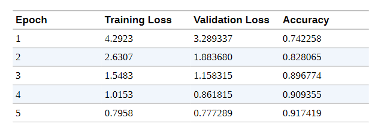

与BERT-base教师模型取得的94%的准确率相比，验证集上的92%的准确率看起来相当不错。现在我们已经对DistilBERT进行了微调，让我们把模型推送到Hub，这样我们以后就可以重复使用它了：

```
distilbert_trainer.push_to_hub("Training completed!")

```

随着我们的模型现在安全地存储在Hub上，我们可以立即在管道中使用它来进行性能基准测试：

```
finetuned_ckpt = "transformersbook/distilbert-base-uncased-finetuned-clinc" 
pipe = pipeline("text-classification", model=finetuned_ckpt)

```

然后我们可以将这个管道传递给我们的PerformanceBenchmark类，以计算与这个模型相关的指标：

```
optim_type = "DistilBERT" 
pb = PerformanceBenchmark(pipe, clinc["test"], optim_type=optim_type) 
perf_metrics.update(pb.run_benchmark()) 

Model size (MB) - 255.89 
Average latency (ms) - 27.53 +\- 0.60 
Accuracy on test set - 0.858

```

为了将这些结果与我们的基线进行比较，让我们创建一个准确性与延迟的散点图，每个点的半径对应于磁盘上的模型大小。下面的函数做了我们需要的事情，并将当前的优化类型标记为虚线圈，以帮助与以前的结果进行比较：

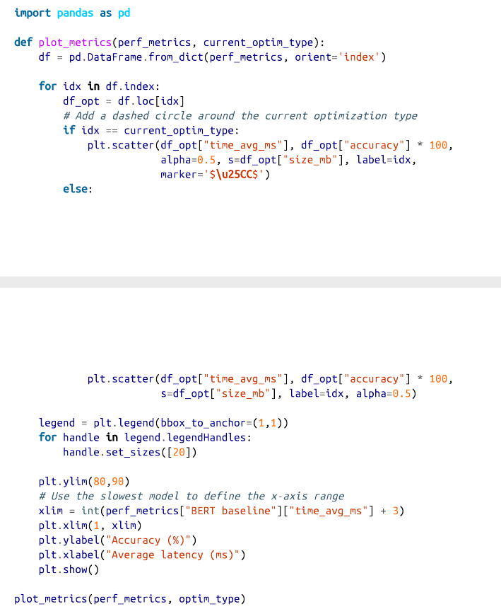

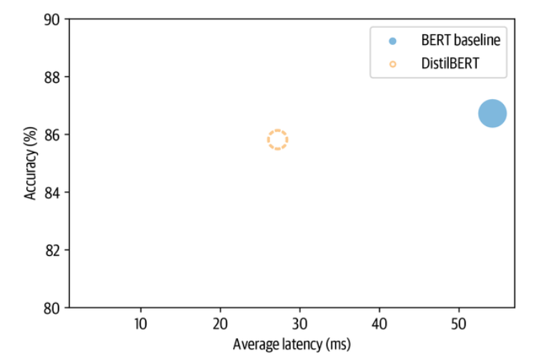

从图中我们可以看到，通过使用一个较小的模型，我们已经成功地大大降低了平均延迟。而这一切的代价是准确度下降了1%多一点! 让我们看看我们是否可以通过包括教师模型的蒸馏损失和找到α和T的良好值来缩小最后的差距。

### 用Optuna寻找好的超参数

为了找到α和T的良好值，我们可以在二维参数空间上进行网格搜索。但一个更好的选择是使用Optuna，它是一个优化框架，正是为这种类型的任务设计的。Optuna用一个通过多次试验进行优化的目标函数来表述搜索问题。例如，假设我们希望最小化罗森布洛克的 "香蕉函数"：

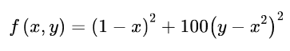

这是一个著名的优化框架的测试案例。如图8-5所示，该函数的名字来自于弯曲的轮廓，在（x，y）=（1，1）有一个全局最小值。寻找山谷是一个容易的优化问题，但收敛到全局最小值却不是。

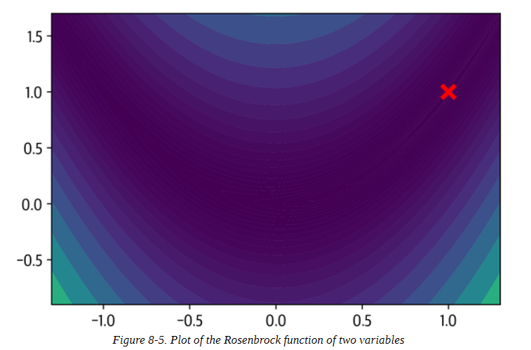

在Optuna中，我们可以通过定义一个返回f(x, y)值的objective()函数来寻找f(x, y)的最小值：

```
def objective(trial):
	x = trial.suggest_float("x", -2, 2) 
	y = trial.suggest_float("y", -2, 2) 
	return (1 - x) ** 2 + 100 * (y - x ** 2) ** 2

```

trial.suggest_float对象指定了要统一取样的参数范围；Optuna还为整数和分类参数分别提供了 suggest_int和 suggest_categorical。Optuna将多个试验作为一项研究来收集，因此要创建一个试验，我们只需将objective()函数传递给study.optimize()，如下所示:

```
import optuna 
study = optuna.create_study() 
study.optimize(objective, n_trials=1000)

```

一旦研究完成，我们就可以找到如下的最佳参数:

```
study.best_params 

{'x': 1.003024865971437, 'y': 1.00315167589307}

```

我们看到，通过一千次试验，Optuna已经成功地找到了相当接近全局最小值的x和y的值。为了在Transformers中使用Optuna，我们使用类似的逻辑，首先定义我们希望优化的超参数空间。除了α和T之外，我们还将包括如下的训练历时数:

```
def hp_space(trial): 
	return {"num_train_epochs": trial.suggest_int("num_train_epochs", 5, 10), "alpha": trial.suggest_float("alpha", 0, 1), "temperature": trial.suggest_int("temperature", 2, 20)}

```

用训练器运行超参数搜索是非常简单的；我们只需要指定要运行的试验数量和优化的方向。因为我们想获得最好的精度，所以我们在训练器的hyperparameter_search()方法中指定方向="最大化"，并传递超参数搜索空间如下:

```
best_run = distilbert_trainer.hyperparameter_search( n_trials=20, direction="maximize", hp_space=hp_space)

```

hyperparameter_search()方法返回一个BestRun对象，其中包含被最大化的目标值（默认为所有指标的总和）和它用于该运行的超参数:

```
print(best_run)

BestRun(run_id='1', objective=0.927741935483871, hyperparameters={'num_train_epochs': 10, 'alpha': 0.12468168730193585, 'temperature': 7})

```

α的这个值告诉我们，大部分的训练信号都来自于知识蒸馏项。让我们用这些值更新我们的训练参数，并运行最终的训练运行:

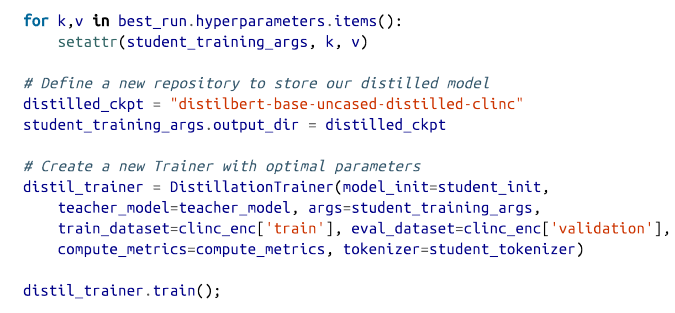

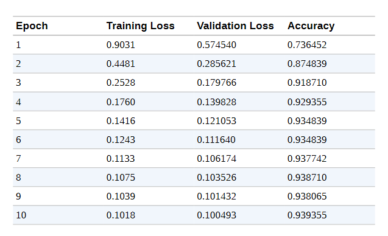

值得注意的是，尽管学生模型的参数数量几乎只有教师模型的一半，但我们已经能够训练出与教师模型相匹配的准确度！我们将模型推送到Hub上，以便将来使用。让我们把这个模型推送到Hub，以便将来使用:

```
distil_trainer.push_to_hub("Training complete")

```

### 为我们的蒸馏模型制定基准

现在我们有了一个准确的学生模型，让我们创建一个管道，重新做我们的基准测试，看看我们在测试集上的表现如何:

```
distilled_ckpt = "transformersbook/distilbert-base-uncased-distilled-clinc" 
pipe = pipeline("text-classification", model=distilled_ckpt) 
optim_type = "Distillation" 
pb = PerformanceBenchmark(pipe, clinc["test"], optim_type=optim_type) 
perf_metrics.update(pb.run_benchmark())

Model size (MB) - 255.89 
Average latency (ms) - 25.96 +\- 1.63 
Accuracy on test set - 0.868

```

为了把这些结果放在背景中，让我们也用plot_metrics()函数把它们可视化:

```
plot_metrics(perf_metrics, optim_type)

```

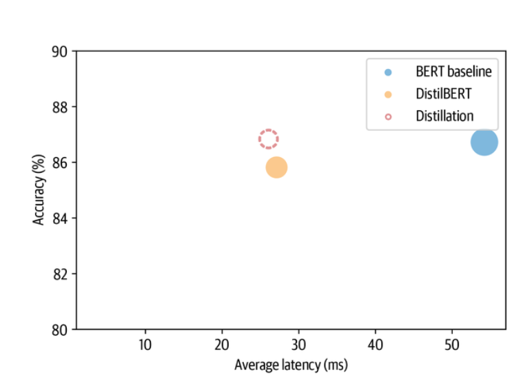

正如预期的那样，与DistilBERT基准相比，模型的大小和延迟基本没有变化，但准确度却有所提高，甚至超过了教师模型的表现！这就是为什么教师模型的表现比学生模型好。对这一令人惊讶的结果的一种解释是，教师模型很可能没有像学生模型那样被系统地微调过。这很好，但实际上我们可以使用一种被称为量化的技术进一步压缩我们提炼的模型。这就是下一节的主题。

## 用量化技术使模型更快

我们现在已经看到，通过知识蒸馏，我们可以通过将信息从教师模型转移到较小的学生模型身上来减少运行推理的计算和内存成本。量化采取了一种不同的方法；它不是减少计算的数量，而是通过用8位整数（INT8）而不是通常的32位浮点（FP32）这样的低精度数据类型来表示权重和激活，从而使它们更有效率。减少比特数意味着所产生的模型需要更少的内存存储，而且像矩阵乘法这样的操作可以通过整数运算更快地进行。值得注意的是，这些性能的提高可以在几乎没有精度损失的情况下实现。

------

**浮点数和定点数的入门知识**

今天，大多数转化器都是用浮点数（通常是FP32或FP16和FP32的混合）进行预训练和微调的，因为它们提供了适应权重、激活和梯度不同范围所需的精度。像FP32这样的浮点数代表了一串32位的数字，这些数字是由符号、指数和尾数组成的。符号决定了这个数字是正数还是负数，而尾数对应的是有效数字的数量，它是用指数在某个固定的基数（通常是二进制的2或十进制的10）上进行缩放。

例如，数字137.035可以通过以下算式表示为一个十进制浮点数：137. 035 = (-1)^0 × 1. 37035 × 10^2，其中1.37035是尾数，2是以10为基数的指数。通过指数，我们可以表示广泛的实数，而且小数点或二进制点可以放在相对于有效数字的任何位置（因此被称为 "浮点"）。

然而，一旦模型被训练好，我们只需要前向传递来运行推理，所以我们可以降低数据类型的精度，而不会对精度产生太大影响。对于神经网络来说，低精度的数据类型通常使用定点格式，实数被表示为B位整数，对于同一类型的所有变量来说，这些整数被一个共同的因子所缩放。例如，137.035可以表示为被1/1000缩放的整数137,035。我们可以通过调整缩放系数来控制定点数字的范围和精度。

------

量化的基本思想是，我们可以将每个张量中的浮点值f "离散化"，将其范围[fmax, fmin]映射到一个更小的[qmax]的定点数字q中。定点数字q的范围[qmax, qmin]，并对两者之间的所有数值进行线性分配。在数学上，这种映射可以用下面的方程来描述:

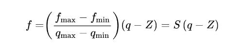

其中比例因子S是一个正的浮点数，常数Z的类型与q相同，被称为零点，因为它对应的是浮点数f=0的量化值。注意，这个映射需要是仿射的，这样我们在对定点的数字进行反量化时，就可以得到浮点数。图8-6展示了转换的过程。

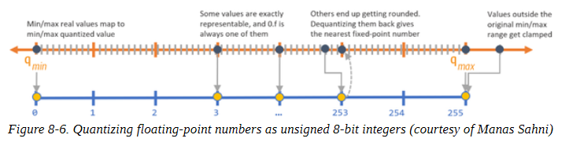

现在，Transformers（以及更普遍的深度神经网络）成为量化的主要候选者的主要原因之一是，权重和激活往往在相对较小的范围内取值。这意味着我们不必将整个可能的FP32数字的范围挤压到，例如，INT8所代表的28=256的数字。为了看到这一点，让我们从我们提炼的模型中挑选出一个注意力权重矩阵，并绘制出数值的频率分布：

```
import matplotlib.pyplot as plt 
state_dict = pipe.model.state_dict() 
weights = state_dict["distilbert.transformer.layer.0.attention.out_lin.weight"]

plt.hist(weights.flatten().numpy(), bins=250, range=(-0.3,0.3), edgecolor="C0") 

plt.show()

```

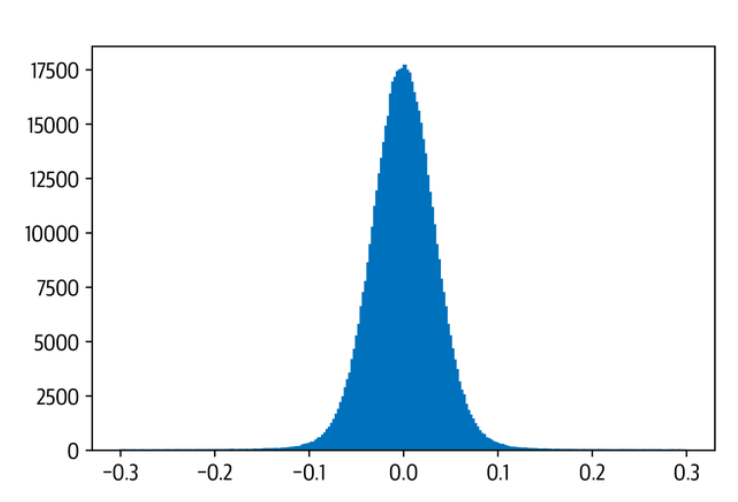

我们可以看到，权重值分布在零附近的小范围内[ -0. 1, 0. 1]。现在，假设我们想把这个张量量化为一个有符号的8位整数。在这种情况下，我们的整数的可能值范围是[qmax, qmin] = [-128, 127]。零点与FP32的零点相吻合，比例因子根据前面的公式计算：

```
zero_point = 0 
scale = (weights.max() - weights.min()) / (127 - (-128))

```

为了得到量化的张量，我们只需要反转映射q = f/S + Z，夹紧这个数值，四舍五入到最接近的整数，并使用Tensor.char()函数在torch.int8数据类型中表示结果：

```
(weights / scale + zero_point).clamp(-128, 127).round().char() 

tensor([
[ -5, -8, 0, ..., -6, -4, 8], 
[ 8, 3, 1, ..., -4, 7, 0], 
[ -9, -6, 5, ..., 1, 5, -3], ..., 
[ 6, 0, 12, ..., 0, 6, -1]，
[ 0, -2, -12, ..., 12, -7, -13],
[-13, -1, -10, ..., 8, 2, -2]], dtype=torch.int8)

```

很好，我们刚刚量化了我们的第一个张量! 在PyTorch中，我们可以通过使用quantize_per_tensor()函数和一个量化的数据类型torch.qint来简化转换，该类型为整数算术运算而优化：

```
from torch import quantize_per_tensor 
dtype = torch.qint8 
quantized_weights = quantize_per_tensor(weights, scale, zero_point, dtype) 
quantized_weights.int_repr() 

tensor([[ -5, -8, 0, ..., -6, -4, 8], [ 8, 3, 1, ..., -4, 7, 0], [ -9, -6, 5, ..., 1, 5, -3], ..., [ 6, 0, 12, ..., 0, 6, -1], [ 0, -2, -12, ..., 12, -7, -13], [-13, -1, -10, ..., 8, 2, -2]], dtype=torch.int8)

```

图8-7中的图表非常清楚地显示了只对部分权重值进行精确映射而对其余部分进行四舍五入所引起的离散化。

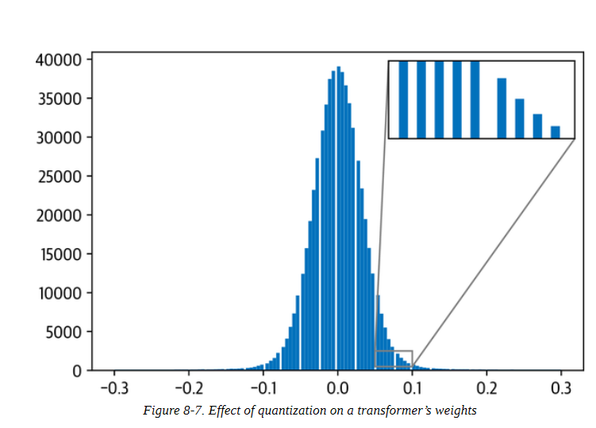

为了完善我们的小分析，让我们比较一下计算两个具有FP32和INT8值的权重张量的乘法需要多长时间。对于FP32的张量，我们可以使用PyTorch的漂亮的@操作符将其相乘：

```
%%timeit 
weights @ weights 
393 μs ± 3.84 μs per loop (mean ± std. dev. of 7 runs, 1000 loops each)

```

对于量化的张量，我们需要QFunctional包装类，这样我们就可以用特殊的Torch.qint8数据类型进行操作：

```
from torch.nn.quantized import QFunctional 

q_fn = QFunctional()
```

这个类支持各种基本操作，如加法，在我们的例子中，我们可以对我们的量化张量进行如下的乘法运算：

```
%%timeit 
q_fn.mul(quantized_weights, quantized_weights)
23.3 μs ± 298 ns per loop (mean ± std. dev. of 7 runs, 10000 loops each)

```

与我们的FP32计算相比，使用INT8张量的速度几乎快了100倍! 通过使用专门的后端来有效地运行量化运算符，甚至可以获得更大的收益。截至本书编写时，PyTorch支持：

- 支持AVX2或更高的x86 CPUs

- ARM CPU（通常在移动/嵌入式设备中发现）

由于INT8数字的位数比FP32数字少四倍，量化也将内存的存储需求减少了四倍之多。在我们的简单例子中，我们可以通过使用Tensor.storage()函数和Python'sys模块的getsizeof()函数，比较我们的权重张量和其量化的表弟的基础存储大小来验证这一点：

```
import sys 
sys.getsizeof(weights.storage()) / sys.getsizeof(quantized_weights.storage()) 

3.999633833760527

```

对于一个完整的Transformers来说，实际的压缩率取决于哪些层被量化了（正如我们在下一节看到的，通常只有线性层被量化了）。

那么，量化的问题是什么呢？改变我们模型中所有计算的精度会在模型计算图的每一点上引入小的干扰，这可能会加重并影响模型的性能。有几种方法来量化一个模型，它们都有优点和缺点。对于深度神经网络，通常有三种主要的量化方法：

**动态量化** 
当使用动态量化时，在训练过程中没有任何变化，只有在推理过程中才会进行调整。与我们将要讨论的所有量化方法一样，模型的权重在推理前被转换为INT8。在推理时间之前转换为INT8。除了权重之外，模型的激活也被量化了。这种方法是动态的，因为量化是即时进行的。这意味着，所有的矩阵乘法都可以用高度优化的INT8函数来计算。在这里讨论的所有量化方法中，动态量化是最简单的一种。然而，在动态量化中，激活的数据是以浮点格式写入和读入内存的。这种整数和浮点之间的转换可能是一个性能瓶颈。

**静态量化** 

我们可以通过预先计算量化方案来避免对浮点的转换，而不是在运行中计算激活的量化。静态量化是通过在推理时间之前观察数据的代表性样本的激活模式来实现的。理想的量化方案被计算出来，然后保存。这使我们能够跳过INT8和FP32值之间的转换，加快计算速度。然而，这需要获得一个好的数据样本，并在管道中引入一个额外的步骤，因为我们现在需要在进行推理之前训练和确定量化方案。还有一个方面是静态量化没有解决的：训练和推理过程中精度的差异，这导致了模型的指标（如准确度）的性能下降。

**量化训练** 

量化的影响可以在训练期间通过FP32值的 "假 "量化来有效模拟。在训练中不使用INT8值，而是对FP32值进行四舍五入，以模拟量化的效果。这是在前向和后向通道中进行的，在模型指标方面比静态和动态量化提高了性能。


用Transformers运行推理的主要瓶颈是与这些模型中巨大数量的权重有关的计算和内存带宽。由于这个原因，动态量化是目前NLP中基于Transformers的模型的最佳方法。在较小的计算机视觉模型中，限制因素是激活的内存带宽，这就是为什么通常使用静态量化（或者在性能下降太明显的情况下使用量化感知训练）。

在PyTorch中实现动态量化非常简单，只需一行代码就可以完成：

```
from torch.quantization import quantize_dynamic
model_ckpt = "transformersbook/distilbert-base-uncased-distilled-clinc" 
tokenizer = AutoTokenizer.from_pretrained(model_ckpt) 
model = (AutoModelForSequenceClassification .from_pretrained(model_ckpt).to("cpu")) 
model_quantized = quantize_dynamic(model, {nn.Linear}, dtype=torch.qint8)

```

在这里，我们向quantize_dynamic()传递全精度模型，并指定该模型中我们要量化的PyTorch层类的集合。dtype参数指定了目标精度，可以是fp16或qint8。一个好的做法是选择你能容忍的最低精度，以满足你的评估指标。在本章中，我们将使用INT8，正如我们很快就会看到的那样，它对我们模型的准确性影响很小。

## 对我们的量化模型进行基准测试

现在我们的模型已经量化了，让我们把它通过基准测试，并把结果可视化：

```
pipe = pipeline("text-classification", model=model_quantized, tokenizer=tokenizer) 
optim_type = "Distillation + quantization"
pb = PerformanceBenchmark(pipe, clinc["test"], optim_type=optim_type) 
perf_metrics.update(pb.run_benchmark()) 

Model size (MB) - 132.40 
Average latency (ms) - 12.54 +\- 0.73 
Accuracy on test set - 0.876 

plot_metrics(perf_metrics, optim_type)

```

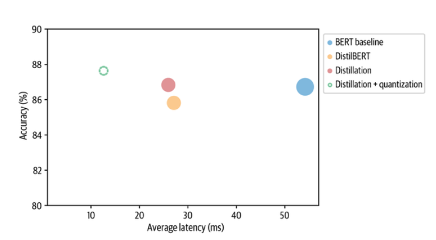

很好，量化后的模型几乎只有我们提炼后的模型的一半大小，甚至还获得了轻微的准确度提升! 让我们来看看，我们是否能用一个名为ONNX Runtime的强大框架将我们的优化推向极限。

## 用ONNX和ONNXRuntime优化推理

ONNX是一个开放的标准，它定义了一套通用的运算符和通用的文件格式，以表示各种框架的深度学习模型，包括PyTorch和TensorFlow。当一个模型被导出到ONNX格式时，这些运算符被用来构建一个计算图（通常称为中间表示法），表示数据在神经网络中的流动。图8-8显示了BERT-base的这种图的一个例子，其中每个节点接收一些输入，应用一个操作，如添加或挤压，然后将输出送入下一组节点。

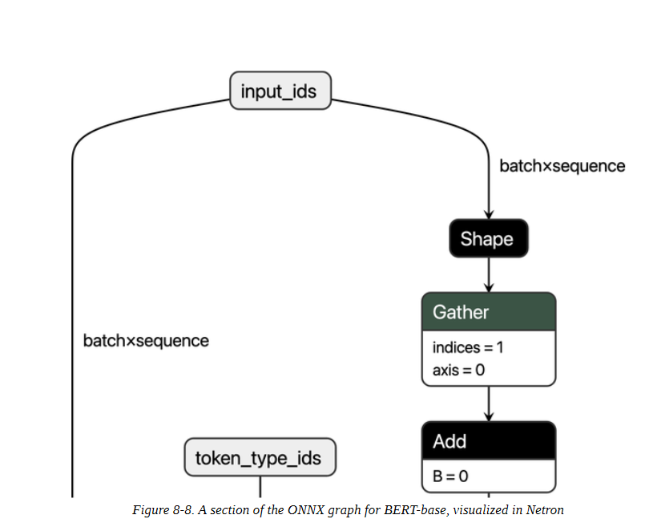

通过公开具有标准化运算符和数据类型的图，ONNX使得在框架之间的切换变得容易。例如，在PyTorch中训练的模型可以导出为ONNX格式，然后导入TensorFlow中（反之亦然）。

当ONNX与ONNX Runtime（简称ORT）这样的专用加速器结合时，它才真正发挥了作用。ORT提供了通过运算符融合和常数折叠等技术优化ONNX图的工具，并定义了与执行提供者的接口，允许你在不同类型的硬件上运行该模型。这是一个强大的抽象。图8-9显示了ONNX和ORT生态系统的高层架构。

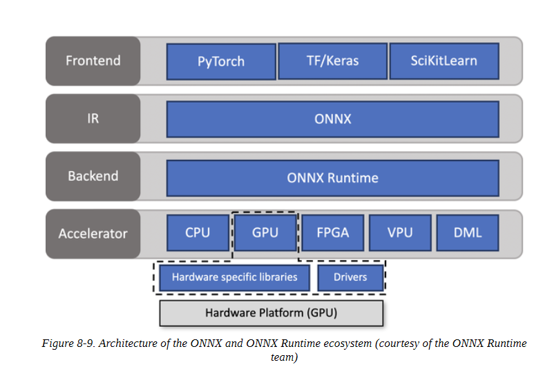

为了看到ORT的运作，我们需要做的第一件事是将我们的蒸馏模型转换成ONNX格式。变形器库有一个内置函数，叫做convert_graph_to_onnx.convert()，它通过以下步骤简化了这个过程:

1. 将模型初始化为一个管道。

2. 通过管道运行占位输入，以便ONNX能够记录计算图。

3. 定义动态轴以处理动态序列长度。

4.  保存带有网络参数的图形。

为了使用这个函数，我们首先需要为ONNX设置一些OpenMP环境变量:

```
import os 
from psutil import cpu_count 
os.environ["OMP_NUM_THREADS"] = f"{cpu_count()}" 
os.environ["OMP_WAIT_POLICY"] = "ACTIVE"

```

OpenMP 是一种为开发高度并行化应用程序而设计的应用程序接口。OMP_NUM_THREADS环境变量设置了用于ONNX运行时并行计算的线程数，而OMP_WAIT_POLICY=ACTIVE则指定等待线程应处于活动状态（即使用CPU处理器周期）。

接下来，让我们把我们的蒸馏模型转换成ONNX格式。这里我们需要指定参数pipeline_name="text-classification"，因为convert()在转换时将模型包裹在Transformers pipeline()函数中。除了model_ckpt之外，我们还传递标记器以初始化管道:

```
from transformers.convert_graph_to_onnx 
import convert 
model_ckpt = "transformersbook/distilbert-base-uncased-distilled-clinc" 
onnx_model_path = Path("onnx/model.onnx") 
convert(framework="pt", model=model_ckpt, tokenizer=tokenizer, output=onnx_model_path, opset=12, pipeline_name="text-classification")

```

ONNX使用运算符集将不可变的运算符规格组合在一起，因此OPSET=12对应于ONNX库的一个特定版本。

现在我们已经保存了我们的模型，我们需要创建一个InferenceSession实例来向模型输入信息:

```
from onnxruntime import (GraphOptimizationLevel, InferenceSession, SessionOptions) 
def create_model_for_provider(model_path, provider="CPUExecutionProvider"): 
	options = SessionOptions() 
	options.intra_op_num_threads = 1 
	options.graph_optimization_level = GraphOptimizationLevel.ORT_ENABLE_ALL 
	session = InferenceSession(str(model_path), options, providers=[provider]) 
	session.disable_fallback() 
	return session 

onnx_model = create_model_for_provider(onnx_model_path)

```

现在，当我们调用onnx_model.run()时，我们可以从ONNX模型中获得类Logits。[...]  由于convert()的输出告诉我们ONNX只期望输入input_ids和attention_mask，所以我们需要从我们的样本中删除标签列:

```
inputs = clinc_enc["test"][:1] 
del inputs["labels"] l
ogits_onnx = onnx_model.run(None, inputs)[0] 
logits_onnx.shape

(1, 151)

```

一旦我们有了对数，我们就可以通过获取argmax轻松得到预测的标签:

```
np.argmax(logits_onnx)
61

```

这确实与地面真实标签一致:

```
clinc_enc["test"][0]["labels"]
61

```

ONNX模型与文本分类管道不兼容，所以我们将创建我们自己的类来模仿核心行为:

```
from scipy.special import softmax
class OnnxPipeline: 
	def __init__(self, model, tokenizer): 
		self.model = model 
		self.tokenizer = tokenizer 
	def __call__(self, query): 
		model_inputs = self.tokenizer(query, return_tensors="pt") 
		inputs_onnx = {k: v.cpu().detach().numpy() for k, v in model_inputs.items()} 
		logits = self.model.run(None, inputs_onnx)[0][0, :] 
		probs = softmax(logits) 
		pred_idx = np.argmax(probs).item() 
		return [{"label": intents.int2str(pred_idx), "score": probs[pred_idx]}]

```

然后我们可以在我们的简单查询中测试这个，看看我们是否恢复了汽车租赁的意图:

```
pipe = OnnxPipeline(onnx_model, tokenizer) pipe(query)

[{'label': 'car_rental', 'score': 0.7848334}]

```

很好，我们的管道按照预期工作。下一步是为ONNX模型创建一个性能基准。在这里，我们可以通过简单地覆盖compute_size()方法，并保留compute_accuracy()和time_pipeline()方法，在我们对PerformanceBenchmark类所做工作的基础上继续前进。我们需要覆盖compute_size()方法的原因是，我们不能依靠state_dict和torch.save()来测量模型的大小，因为onnx_model在技术上是一个ONNX的InferenceSession对象，不能访问PyTorch的nn.Module的属性。在任何情况下，所产生的逻辑都很简单，可以按以下方式实现:

```
class OnnxPerformanceBenchmark(PerformanceBenchmark): 
	def __init__(self, *args, model_path, **kwargs): 
		super().__init__(*args, **kwargs) 
		self.model_path = model_path 
	def compute_size(self): 
		size_mb = Path(self.model_path).stat().st_size / (1024 * 1024) 
		print(f"Model size (MB) - {size_mb:.2f}") 
		return {"size_mb": size_mb}

```

有了我们的新基准，让我们看看我们的蒸馏模型在转换为ONNX格式时的表现如何:

```
optim_type = "Distillation + ORT" 
pb = OnnxPerformanceBenchmark(pipe, clinc["test"], optim_type, model_path="onnx/model.onnx") 
perf_metrics.update(pb.run_benchmark())
Model size (MB) - 255.88 
Average latency (ms) - 21.02 +\- 0.55 
Accuracy on test set - 0.868 

plot_metrics(perf_metrics, optim_type)

```

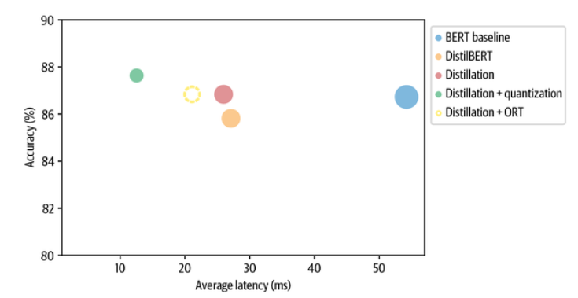

值得注意的是，转换为ONNX格式并使用ONNX Runtime给我们的蒸馏模型（即图中的 "蒸馏 "圆圈）带来了延迟方面的提升 让我们看看是否可以通过添加量化来挤出更多的性能。

与PyTorch类似，ORT提供了三种量化模型的方式：动态、静态和量化感知训练。正如我们在PyTorch中所做的那样，我们将把动态量化应用到我们提炼的模型中。在ORT中，量化是通过quantize_dynamic()函数应用的，它需要一个通往ONNX模型的路径来进行量化，一个目标路径来保存量化后的模型，以及数据类型来减少权重：

```
from onnxruntime.quantization import quantize_dynamic, QuantType 
model_input = "onnx/model.onnx" 
model_output = "onnx/model.quant.onnx" 
quantize_dynamic(model_input, model_output, weight_type=QuantType.QInt8)

```

现在，该模型已经量化，让我们通过我们的基准来运行它：

```
nnx_quantized_model = create_model_for_provider(model_output)
pipe = OnnxPipeline(onnx_quantized_model, tokenizer) 
optim_type = "Distillation + ORT (quantized)" 
pb = OnnxPerformanceBenchmark(pipe, clinc["test"], optim_type, model_path=model_output) 
perf_metrics.update(pb.run_benchmark()

Model size (MB) - 64.20 
Average latency (ms) - 9.24 +\- 0.29 
Accuracy on test set - 0.877

plot_metrics(perf_metrics, optim_type)

```

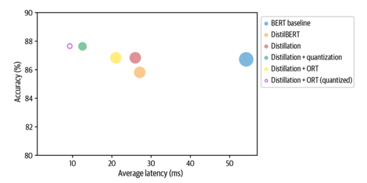

与PyTorch量化得到的模型（蒸馏+量化blob）相比，ORT量化将模型大小和延迟降低了约30%。其中一个原因是，PyTorch只优化了nn.Linear模块，而ONNX对嵌入层也进行了量化。从图中我们还可以看到，与BERT基线相比，将ORT量化应用于我们的蒸馏模型，几乎提供了三倍的增益！这就是我们的分析。

这就结束了我们对加速推理Transformers的技术的分析。我们已经看到，量化等方法通过降低表示的精度来减少模型的大小。另一个减少尺寸的策略是完全删除一些权重。这种技术被称为权重修剪，它是下一节的重点。

## 用权重修剪使模型更加稀疏

到目前为止，我们已经看到知识蒸馏和权重量化在产生更快的推理模型方面相当有效，但在某些情况下，你也可能对模型的内存占用有强烈的约束。例如，如果我们的产品经理突然决定我们的文本助手需要部署在移动设备上，那么我们就需要我们的意图分类器尽可能少地占用存储空间。为了完善我们对压缩方法的调查，让我们来看看我们如何通过识别和删除网络中最不重要的权重来缩减模型中的参数数量。

### 深度神经网络中的稀疏性

如图8-10所示，修剪的主要思想是在训练过程中逐渐去除权重连接（可能还有神经元），使模型逐渐变得更稀疏。修剪后的模型具有较少的非零参数，然后可以以紧凑的稀疏矩阵格式存储。修剪也可以与量化相结合，以获得进一步的压缩。

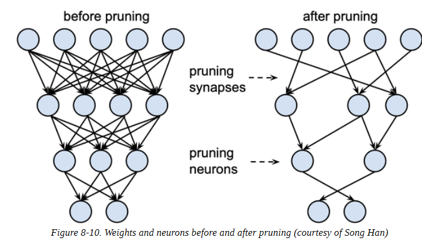

### 修剪权重的方法

在数学上，大多数权重修剪方法的工作方式是计算重要性分数的矩阵S，然后按重要性选择前k%的权重：


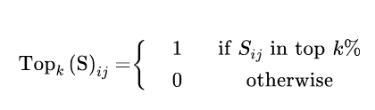

实际上，k作为一个新的超参数来控制模型中的稀疏程度，也就是零值权重的比例。较低的k值对应于较稀疏的矩阵。从这些分数中，我们可以定义一个掩码矩阵M，在前向传递过程中用一些输入xi掩码权重Wij，并有效地创建一个稀疏的激活网络ai：

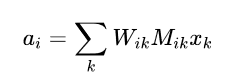

正如 "最佳脑外科医生 "论文中所讨论的那样，每种修剪方法的核心是需要考虑的一系列问题：

- 哪些权重应该被取消？
- 应该如何调整剩余的权重以获得最佳性能？
- 如何以一种计算效率高的方式进行这种网络修剪？

这些问题的答案告知我们如何计算分数矩阵S，所以我们首先看看最早和最流行的修剪方法之一：幅度修剪。

#### 幅度修剪

顾名思义，幅度修剪是根据权重S = (∣ Wij ∣)1≤j,j≤n的幅度来计算分数，然后从M = Topk (S)得出掩码。在文献中，通常以迭代的方式应用幅度修剪，首先训练模型以学习哪些连接是重要的，然后修剪最不重要的权重。然后重新训练稀疏模型，重复这一过程，直到达到理想的稀疏度。这种方法的一个缺点是它的计算要求很高：在修剪的每一步我们都需要训练模型到收敛。由于这个原因，一般来说，最好是逐步增加初始稀疏度si（通常为零），在经过一定数量的步骤N后，达到最终值sf：

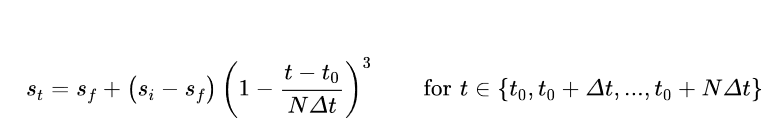

这里的想法是每隔Δt步更新二进制掩码M，以允许被掩码的权重在训练期间重新激活，并从修剪过程引起的任何潜在的准确性损失中恢复。如图8-11所示，立方系数意味着权重修剪的速度在早期阶段是最高的（当冗余权重的数量很大时），并逐渐减弱。

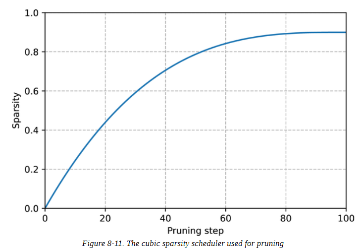

幅度修剪的一个问题是，它实际上是为纯粹的监督学习设计的，在这种学习中，每个权重的重要性都与手头的任务直接相关。相比之下，在迁移学习中，权重的重要性主要是由预训练阶段决定的，所以幅度修剪可以删除对微调任务很重要的连接。最近，Hugging Face的研究人员提出了一种叫做运动修剪的自适应方法--让我们来看一看。

#### 运动修剪

运动修剪的基本思想是在微调过程中逐渐去除权重，从而使模型逐渐变得稀疏。关键的创新之处在于，权重和分数都是在微调过程中学习的。因此，运动修剪中的分数不是直接来自权重（像幅度修剪那样），而是任意的，像其他神经网络参数一样通过梯度下降学习。这意味着，在后向传递中，我们也要跟踪损失L相对于分数Sij的梯度。

一旦学会了分数，就可以直接用M = Topk (S)生成二进制掩码。

运动修剪背后的直觉是，从零开始 "移动 "最多的权重是最需要保留的。换句话说，在微调过程中，正的权重会增加（反之，负的权重也会增加），这相当于说，随着权重远离零，分数也会增加。如图8-12所示，这种行为与幅度修剪不同，幅度修剪选择那些离零最远的权重作为最重要的权重。

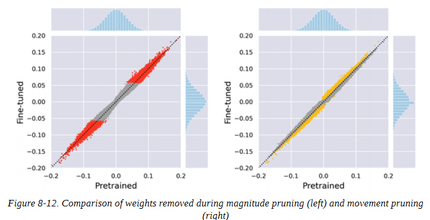

这两种修剪方法之间的差异在剩余权重的分布上也很明显。如图8-13所示，幅度修剪产生两个权重簇，而运动修剪产生一个更平滑的分布。

在本书写作时，Transformers并不支持开箱即用的修剪方法。幸运的是，有一个叫神经网络块运动修剪的漂亮库，实现了许多这样的想法，如果内存限制是一个问题，我们建议检查它。

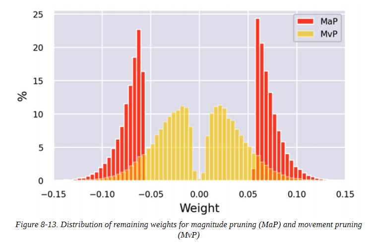

## 小结

我们已经看到，为在生产环境中的部署优化Transformers涉及两个方面的压缩：延迟和内存占用。从一个微调的模型开始，我们通过ORT应用蒸馏、量化和优化来显著减少这两个方面。特别是，我们发现ORT中的量化和转换以最小的努力获得了最大的收益。尽管修剪是减少Transformers模型存储大小的有效策略，但目前的硬件没有针对稀疏矩阵操作进行优化，这限制了这种技术的实用性。然而，这是一个活跃的研究领域，到本书上架时，这些限制可能已经得到解决。
那么，从这里开始该怎么办？本章中的所有技术都可以适用于其他任务，如问题回答、命名实体识别或语言建模。如果你发现自己正在努力满足延迟要求，或者你的模型正在吞噬你所有的计算预算，我们建议尝试一下其中的一个。

在下一章中，我们将从性能优化的角度出发，探讨每个数据科学家最糟糕的噩梦：处理少标签或无标签情形。
