# 第9章  处理少标签或零标签情形

有一个问题在每个数据科学家的脑海中根深蒂固，通常是他们在新项目开始时问的第一件事：是否有任何标注的数据？更多的时候，答案是 "没有 "或 "有一点"，然后客户的期望是，你的团队花哨的机器学习模型应该仍然表现良好。由于在非常小的数据集上训练模型通常不会产生好的结果，一个明显的解决方案是标注更多的数据。然而，这需要时间，而且可能非常昂贵，特别是如果每个标注都需要领域的专业知识来验证。

幸运的是，有几种方法很适合处理很少甚至没有标签的情况！你可能已经熟悉了一些方法。你可能已经熟悉了其中的一些方法，比如零样本学习或少样本学习，GPT-3仅用几十个例子就能完成各种不同的任务，这一点令人印象深刻。

一般来说，表现最好的方法将取决于任务、可用的数据量以及这些数据中被标注的部分。图9-1所示的决策树可以帮助指导我们完成挑选最合适的方法的过程。

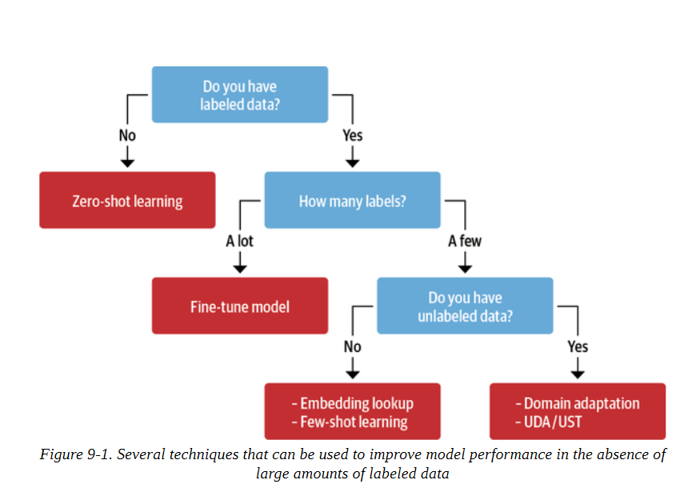

让我们一步步走过这个决策树：

1.你有标记的数据吗？

​			在哪种方法最有效的问题上，即使是少数几个有标签的样本也会产生差异。如果你根本没有标记的数据，你可以从零点学习方法开始，这通常会设定一个强大的基线来工作。

2. 有多少标签？

   如果有标记的数据，决定性的因素是有多少。如果你有大量的训练数据可用，你可以使用第2章中讨论的标准微调方法。

3.  你有未标注的数据吗？

​		如果你只有少量的标记样本，那么如果你能获得大量的无标记数据，就会有极大的帮助。如果你能获得未标记的数据，你可以在训练分类器之前用它来微调领域的语言模型，或者你可以使用更复杂的方法，如无监督数据增强（UDA）或不确定性感知自我训练（UST）。如果你没有任何未标记的数据可用，你就不能选择注释更多的数据。在这种情况下，你可以使用少量学习或使用来自预训练语言模型的嵌入，用最近的邻居搜索来进行查找。

在这一章中，我们将通过解决许多使用Jira或GitHub等问题跟踪器来帮助用户的支持团队所面临的一个常见问题来完成这个决策树：根据问题的描述给问题加上元数据的标签。这些标签可以定义问题的类型，引起问题的产品，或者哪个团队负责处理报告的问题。自动化这一过程可以对生产力产生很大的影响，使支持团队能够专注于帮助他们的用户。作为一个运行的例子，我们将使用与一个流行的开源项目相关的GitHub问题, Transforerms! 现在让我们来看看这些问题中包含哪些信息，如何构建任务，以及如何获得数据。

**注意事项**

本章介绍的方法在文本分类方面效果很好，但在处理命名实体识别、问题回答或总结等更复杂的任务时，可能需要其他技术，如数据扩充。

## 构建一个GitHub Issue标注程序

如果你导航到Transformers资源库的Issues标签，你会发现像图9-2所示的问题，其中包含一个标题、一个描述和一组标签或描述该问题的标签。这表明有一种自然的方式来构建监督学习任务：给定一个问题的标题和描述，预测一个或多个标签。由于每个问题可以被分配不同数量的标签，这意味着我们正在处理一个多标签文本分类问题。这通常比我们在第二章中遇到的多类问题更具挑战性，在第2章中，每条推文只被分配给一种情绪。

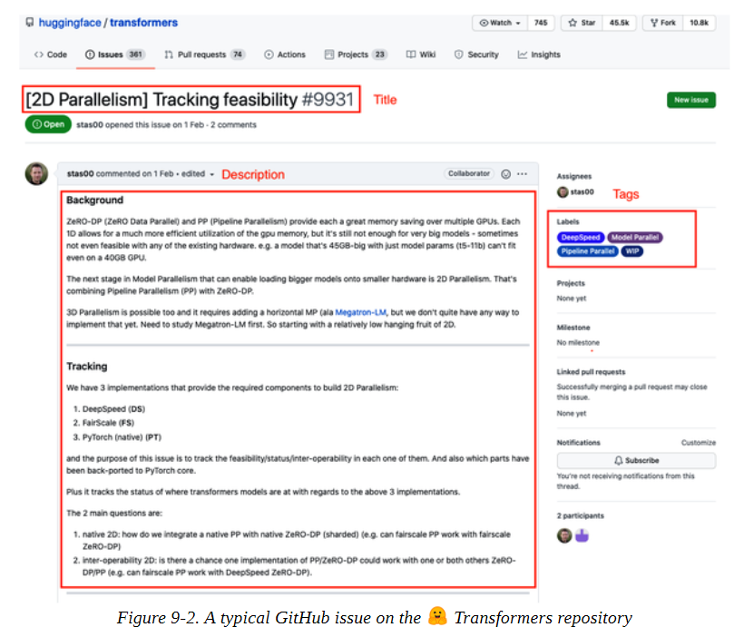

现在我们已经看到了GitHub问题的模样，让我们看看如何下载它们来创建我们的数据集。

### 获取数据

为了抓取仓库中的所有问题，我们将使用GitHub REST API来轮询问题端点。这个端点会返回一个 JSON 对象的列表，每个对象都包含大量关于当前问题的字段，包括其状态（打开或关闭）、谁打开了这个问题，以及我们在图 9-2 中看到的标题、正文和标签。

由于获取所有问题需要一段时间，我们在本书的GitHub仓库中包含了一个github-issuestransformers.jsonl文件，以及一个fetch_issues()函数，你可以用来自己下载它们。

**注意事项**

GitHub的REST API将pull请求视为问题，因此我们的数据集包含了两者的混合。为了保持简单，我们将为这两种类型的问题开发分类器，尽管在实践中你可能会考虑建立两个独立的分类器，以便对模型的性能进行更精细的控制。

现在我们知道了如何抓取数据，让我们来看看如何清理它。

### 准备数据

一旦我们下载了所有的问题，我们就可以用Pandas加载它们:

```
import pandas as pd 
dataset_url = "https://git.io/nlp-with-transformers" 
df_issues = pd.read_json(dataset_url, lines=True) 
print(f"DataFrame shape: {df_issues.shape}") 

DataFrame shape: (9930, 26)

```

我们的数据集中有近一万个问题，通过查看单行，我们可以看到从GitHub API中检索的信息包含许多字段，如URL、ID、日期、用户、标题、正文以及标签:

```
cols = ["url", "id", "title", "user", "labels", "state", "created_at", "body"] 

df_issues.loc[2, cols].to_frame()

```

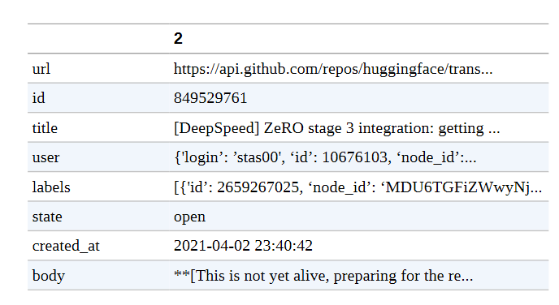

标签列是我们感兴趣的东西，每一行都包含一个JSON对象的列表，其中有关于每个标签的元数据:

```
[ 
    { 
        "id":2659267025, "node_id":"MDU6TGFiZWwyNjU5MjY3MDI1", 
        "url":"https://api.github.com/repos/huggingface...", 
        "name":"DeepSpeed", 
        "color":"4D34F7", 
        "default":false, 
        "description":"" 
    } 
]

```

为了我们的目的，我们只对每个标签对象的名称字段感兴趣，所以让我们用标签名称覆盖标签列:

```
df_issues["labels"] = (df_issues["labels"] .apply(lambda x: [meta["name"] for meta in x])) 
df_issues[["labels"]].head()

```

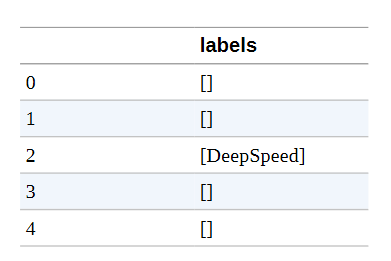

现在，标签栏中的每一行都是GitHub的标签列表，所以我们可以计算每一行的长度，以找出每个问题的标签数量:

```
df_issues["labels"].apply(lambda x : len(x)).value_counts().to_frame().T

```

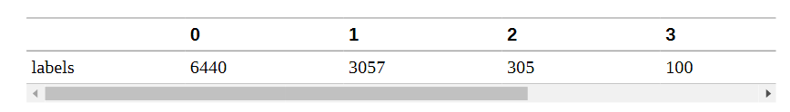

这表明，大多数问题都有零个或一个标签，而有一个以上标签的则少得多。接下来，让我们看看数据集中最频繁出现的前10个标签。在Pandas中，我们可以通过 "explode  (展开)"标签列来实现，这样列表中的每个标签都会成为一行，然后简单地计算每个标签的出现次数:

```
df_counts = df_issues["labels"].explode().value_counts() 
print(f"Number of labels: {len(df_counts)}") 
# Display the top-8 label categories df_counts.to_frame().head(8).T

Number of labels: 65

```

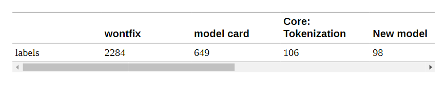

我们可以看到，数据集中有65个独特的标签，这些类别非常不平衡，其中wontfix和model card是最常见的标签。为了使分类问题更容易解决，我们将专注于为标签的一个子集建立一个标签器。例如，一些标签，如Good First Issue或Help Wanted，有可能很难从问题的描述中预测出来，而另一些标签，如model card，可以用一个简单的规则来分类，即检测Hugging Face Hub上何时添加了model card。

下面的代码对数据集进行过滤，以获得我们要处理的标签子集，同时对名称进行标准化处理，使其更容易阅读：

```
label_map = {"Core: Tokenization": "tokenization", "New model": "new model", "Core: Modeling": "model training", "Usage": "usage", "Core: Pipeline": "pipeline", "TensorFlow": "tensorflow or tf", "PyTorch": "pytorch", "Examples": "examples", "Documentation": "documentation"} 

def filter_labels(x): 
	return [label_map[label] for label in x if label in label_map] 

df_issues["labels"] = df_issues["labels"].apply(filter_labels) 
all_labels = list(label_map.values())

```

现在我们来看看新标签的分布情况：

```
df_counts = df_issues["labels"].explode().value_counts() 
df_counts.to_frame().T

```

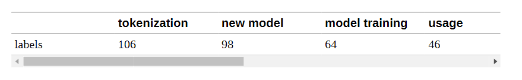

在本章的后面，我们会发现将未标记的问题作为一个单独的训练分割来处理是很有用的，所以我们创建一个新的列，表示该问题是否是未标记的:

```
df_issues["split"] = "unlabeled" 
mask = df_issues["labels"].apply(lambda x: len(x)) > 0 
df_issues.loc[mask, "split"] = "labeled"
df_issues["split"].value_counts().to_frame()

```

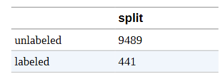

现在让我们来看一个例子:

```
for column in ["title", "body", "labels"]: 
	print(f"{column}: {df_issues[column].iloc[26][:500]}\n") 

title: Add new CANINE model 
body: # New model addition 
## Model description 
Google recently proposed a new **C**haracter **A**rchitecture with **N**o tokenization **I**n **N**eural **E**ncoders architecture (CANINE). Not only the title is exciting: 

Pipelined NLP systems have largely been superseded by end-to-end neural modeling, yet nearly all commonly-used models still require an explicit tokenization step. While recent tokenization approaches based on data-derived subword lexicons are less brittle than manually en 

labels: ['new model']

```

在这个例子中，我们提出了一个新的模型架构，所以新模型标签是有意义的。我们还可以看到，标题包含了对我们的分类器有用的信息，所以让我们把它与正文字段中的问题描述连接起来:

```
df_issues["text"] = (df_issues .apply(lambda x: x["title"] + "\n\n" + x["body"], axis=1))

```

在我们看其余的数据之前，让我们检查一下数据中是否有重复的部分，并通过drop_duplicates()方法将它们删除:

```
len_before = len(df_issues) 
df_issues = df_issues.drop_duplicates(subset="text") 
print(f"Removed {(len_before-len(df_issues))/len_before:.2%} duplicates.")

Removed 1.88% duplicates.

```

我们可以看到，在我们的数据集中有一些重复的问题，但它们只占很小的比例。正如我们在其他章节中所做的那样，快速看一下我们文本中的字数也是一个好主意，看看当我们截断到每个模型的上下文大小时，我们是否会失去很多信息:

```
import numpy as np import matplotlib.pyplot as plt 

(df_issues["text"].str.split().apply(len) .hist(bins=np.linspace(0, 500, 50), grid=False, edgecolor="C0")) 
plt.title("Words per issue") 
plt.xlabel("Number of words") 
plt.ylabel("Number of issues") 
plt.show()

```


该分布具有许多文本数据集的长尾特征。大多数文本都相当短，但也有超过500字的问题。有一些很长的问题是很常见的，特别是当错误信息和代码片段一起发布时。鉴于大多数转化器模型的上下文大小为512个标记或更大，截断少数长问题不可能影响整体性能。现在我们已经探索并清理了我们的数据集，最后要做的是定义我们的训练集和验证集，以便为我们的分类器设定基准。让我们来看看如何做到这一点。

### 创建训练集

对于多标签问题来说，创建训练集和验证集是比较麻烦的，因为没有保证所有标签的平衡。然而，它可以被近似，我们可以使用Scikit-multilearn库，它是专门为此目的而设置的。我们需要做的第一件事是将我们的标签集，如pytorch和标记化，转换成模型可以处理的格式。在这里，我们可以使用Scikit-learn的MultiLabel Binarizer类，它接收一个标签名称的列表，并创建一个矢量，其中零代表没有的标签，一代表现在的标签。我们可以通过在all_labels上拟合MultiLabelBinarizer来测试，学习标签名称到ID的映射，如下所示:

```
from sklearn.preprocessing import MultiLabelBinarizer 
mlb = MultiLabelBinarizer() 
mlb.fit([all_labels]) 
mlb.transform([["tokenization", "new model"], ["pytorch"]])

array([[0, 0, 0, 1, 0, 0, 0, 1, 0], [0, 0, 0, 0, 0, 1, 0, 0, 0]])

```

在这个简单的例子中，我们可以看到第一行有两个对应于标记化和新模型标签的，而第二行只有一个pytorch的命中。

为了创建分割，我们可以使用Scikit-multilearn的iterative_train_test_split()函数，它可以迭代地创建训练/测试分割以实现平衡标签。我们把它包装成一个可以应用于DataFrames的函数。由于该函数期望有一个二维特征矩阵，我们需要在进行分割之前给可能的索引增加一个维度。

```
from skmultilearn.model_selection import iterative_train_test_split 
def balanced_split(df, test_size=0.5): 
	ind = np.expand_dims(np.arange(len(df)), axis=1) 
	labels = mlb.transform(df["labels"]) 
	ind_train, _, ind_test, _ = iterative_train_test_split(ind, labels, test_size)
    return df.iloc[ind_train[:, 0]], df.iloc[ind_test[:,0]]

```

有了balanced_split()函数，我们可以把数据分成有监督和无监督的数据集，然后为有监督的部分创建平衡的训练、验证和测试集:

```
from sklearn.model_selection import train_test_split 
df_clean = df_issues[["text", "labels", "split"]].reset_index(drop=True).copy() 
df_unsup = df_clean.loc[df_clean["split"] == "unlabeled", ["text", "labels"]] 
df_sup = df_clean.loc[df_clean["split"] == "labeled", ["text", "labels"]] 

np.random.seed(0) 
df_train, df_tmp = balanced_split(df_sup, test_size=0.5) 
df_valid, df_test = balanced_split(df_tmp, test_size=0.5)

```

最后，让我们创建一个包含所有分片的DatasetDict，这样我们就可以轻松地对数据集进行标记，并与Trainer整合。在这里，我们将使用漂亮的from_pandas()方法，直接从相应的Pandas DataFrame中加载每个分片:

```
from datasets import Dataset, DatasetDict 

ds = DatasetDict({ "train": Dataset.from_pandas(df_train.reset_index(drop=True)), "valid": Dataset.from_pandas(df_valid.reset_index(drop=True)), "test": Dataset.from_pandas(df_test.reset_index(drop=True)), "unsup": Dataset.from_pandas(df_unsup.reset_index(drop=True))})

```

这看起来不错，所以最后要做的是创建一些训练片，以便我们可以评估每个分类器的性能与训练集大小的关系。

### 创建训练切片

该数据集具有我们在本章要研究的两个特点：稀疏的标记数据和多标签分类。训练集只有220个例子可供训练，即使是迁移学习，这也是一个挑战。为了深入研究本章中每种方法在很少的标签数据下的表现，我们还将创建样本更少的训练数据片。然后，我们可以将样本的数量与性能作对比，研究各种制度。我们将从每个标签只有8个样本开始，然后使用iterative_train_test_split()函数建立切片，直到覆盖全部的训练集:

```
np.random.seed(0) 
all_indices = np.expand_dims(list(range(len(ds["train"]))), axis=1) 
indices_pool = all_indices 
labels = mlb.transform(ds["train"]["labels"]) 
train_samples = [8, 16, 32, 64, 128] 
train_slices, last_k = [], 0 
for i, k in enumerate(train_samples):
	# Split off samples necessary to fill the gap to the next split size 
	indices_pool, labels, new_slice, _ = iterative_train_test_split( indices_pool, labels, (k-last_k)/len(labels)) 
	last_k = k 
	if i==0: 
		train_slices.append(new_slice) 
	else: 
		train_slices.append(np.concatenate((train_slices[-1], new_slice))) 
# Add full dataset as last slice 
train_slices.append(all_indices), train_samples.append(len(ds["train"])) 
train_slices = [np.squeeze(train_slice) for train_slice in train_slices]

```

请注意，这种迭代方法只是将样本近似地分割成所需的大小，因为在给定的分割大小下并不总是能够找到平衡的分割:

```
print("Target split sizes:") 
print(train_samples) 
print("Actual split sizes:") 
print([len(x) for x in train_slices]) 

Target split sizes: [8, 16, 32, 64, 128, 223] Actual split sizes: [10, 19, 36, 68, 134, 223]

```

我们将使用指定的分割大小作为以下图表的标签。很好，我们终于准备好了我们的数据集的训练分片--接下来让我们看看如何训练一个强大的基线模型!

## 实现朴素贝叶斯基线

每当你开始一个新的NLP项目时，实施一套强有力的基线总是一个好主意。这有两个主要原因:

1. 一个基于正则表达式、手工制作的规则或非常简单的模型的基线可能已经能很好地解决这个问题。在这些情况下，没有理由拿出像Transformers这样的大炮，因为在生产环境中，Transformers的部署和维护通常比较复杂。
2. 当你探索更复杂的模型时，基线提供快速检查。例如，假设你训练BERT-large，并在验证集上获得80%的准确率。你可能会把它作为一个硬数据集来处理，然后就此打住。但是，如果你知道像逻辑回归这样的简单分类器可以得到95%的准确率呢？这就会引起你的怀疑，并促使你去调试你的模型。

因此，让我们通过训练一个基线模型来开始我们的分析。对于文本分类来说，一个很好的基线是Naive Bayes分类器，因为它非常简单，可以快速训练，并且对输入的扰动相当稳健。Naive Bayes的Scikit-learn实现并不支持开箱即用的多标签分类，但幸运的是，我们可以再次使用Scikitmultilearn库，将这个问题作为一个单对单的分类任务，我们为L标签训练L个二进制分类器。首先，让我们使用一个多标签二值化器，在我们的训练集中创建一个新的标签_ids列。我们可以使用map()函数来一次性搞定所有的处理:

```
ef prepare_labels(batch): 
	batch["label_ids"] = mlb.transform(batch["labels"]) 
	return batch 
ds = ds.map(prepare_labels, batched=True)

```

为了衡量我们的分类器的性能，我们将使用微观和宏观的F-scores，其中前者跟踪频繁标签的性能，后者跟踪不考虑频率的所有标签。由于我们将在不同大小的训练片段中评估每个模型，让我们创建一个defaultdict，用一个列表来存储每个片段的得分:

```
from collections import defaultdict

macro_scores, micro_scores = defaultdict(list), defaultdict(list)

```

现在我们终于准备好训练我们的基线了! 下面是训练模型的代码，并在不断增加的训练集规模中评估我们的分类器:

```
from sklearn.naive_bayes import MultinomialNB 
from sklearn.metrics import classification_report 
from skmultilearn.problem_transform import BinaryRelevance 
from sklearn.feature_extraction.text import CountVectorizer 
for train_slice in train_slices: 
	# Get training slice and test data 
	ds_train_sample = ds["train"].select(train_slice) 
	y_train = np.array(ds_train_sample["label_ids"]) 
	y_test = np.array(ds["test"]["label_ids"]) 
	# Use a simple count vectorizer to encode our texts as token counts 
	count_vect = CountVectorizer() 
	X_train_counts = count_vect.fit_transform(ds_train_sample["text"]) 
	X_test_counts = count_vect.transform(ds["test"]["text"]) 
	# Create and train our model! 
	classifier = BinaryRelevance(classifier=MultinomialNB()) classifier.fit(X_train_counts, y_train) 
	# Generate predictions and evaluate 
	y_pred_test = classifier.predict(X_test_counts) 
	clf_report = classification_report( y_test, y_pred_test, target_names=mlb.classes_, zero_division=0, output_dict=True) 
	# Store metrics 
	macro_scores["Naive Bayes"].append(clf_report["macro avg"]["f1-score"]) 
	micro_scores["Naive Bayes"].append(clf_report["micro avg"]["f1-score"])

```

在这段代码中，有很多事情要做，所以让我们来解开它。首先，我们得到训练片并对标签进行编码。然后，我们使用计数向量器对文本进行编码，简单地创建一个词汇量大小的向量，其中每个条目对应于文本中某一标记出现的频率。这被称为 "词包 "方法，因为所有关于词的顺序的信息都会丢失。然后，我们训练分类器，并在测试集上使用预测结果，通过分类报告获得微观和宏观的F-scores。

通过下面的辅助函数，我们可以绘制这个实验的结果:

```
import matplotlib.pyplot as plt 
def plot_metrics(micro_scores, macro_scores, sample_sizes, current_model): 
	fig, (ax0, ax1) = plt.subplots(1, 2, figsize=(10, 4), sharey=True) 
	for run in micro_scores.keys(): 
		if run == current_model: 
			ax0.plot(sample_sizes, micro_scores[run], label=run, linewidth=2) 
			ax1.plot(sample_sizes, macro_scores[run], label=run, linewidth=2) 
		else: 
			ax0.plot(sample_sizes, micro_scores[run], label=run, linestyle="dashed") 
			ax1.plot(sample_sizes, macro_scores[run], label=run, linestyle="dashed") 
	ax0.set_title("Micro F1 scores") 
	ax1.set_title("Macro F1 scores") 
	ax0.set_ylabel("Test set F1 score") 
	ax0.legend(loc="lower right") 
	for ax in [ax0, ax1]: 
		ax.set_xlabel("Number of training samples") 
		ax.set_xscale("log") 
		ax.set_xticks(sample_sizes) 
		ax.set_xticklabels(sample_sizes) 
		ax.minorticks_off() 
	plt.tight_layout() 
	plt.show() 
plot_metrics(micro_scores, macro_scores, train_samples, "Naive Bayes")

```

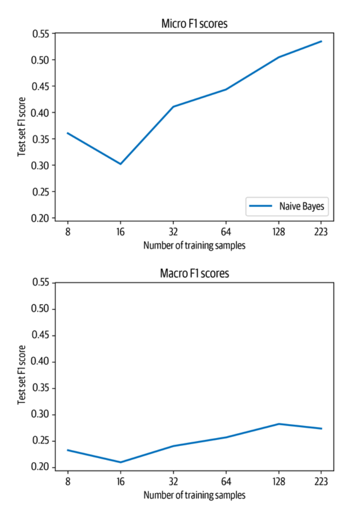

请注意，我们将样本的数量绘制在对数刻度上。从图中我们可以看到，随着训练样本数量的增加，微观和宏观的F-scores都有所提高。由于可以训练的样本太少，结果也略显嘈杂，因为每个片断都可能有不同的类别分布。尽管如此，这里最重要的是趋势，所以现在让我们看看这些结果与基于Transformers的方法相比如何吧!

## 零样本学习

我们要考虑的第一个技术是零样本分类，它适用于你完全没有标签数据的环境。这种情况在工业界出奇地普遍，可能是因为没有带标签的历史数据，或者因为获取数据的标签很困难。在这一节中，我们会有一点欺骗，因为我们仍然会使用测试数据来衡量性能，但我们不会使用任何数据来训练模型（否则与以下方法的比较会很困难）。

零样本分类的目标是利用预先训练好的模型，而不需要对你的特定任务语料进行任何额外的微调。为了更好地了解这一点，请回顾一下，像BERT这样的语言模型是经过预训练的，以预测成千上万的书籍和大型维基百科转储的文本中的掩蔽标记。为了成功地预测一个缺失的标记，该模型需要意识到上下文中的主题。我们可以尝试通过提供这样一个句子来欺骗模型为我们分类文件：

“This section was about the topic [MASK].”

然后，该模型应该对该文件的主题给出一个合理的建议，因为这是一个在数据集中自然出现的文本。

让我们用下面这个玩具问题来进一步说明：假设你有两个孩子，其中一个喜欢有汽车的电影，而另一个更喜欢有动物的电影。不幸的是，他们已经看过所有你知道的电影，所以你想建立一个函数，告诉你新电影是关于什么主题的。自然而然地，你转向Transformers来完成这项任务。首先要尝试的是将BERT-base加载到fill-mask流水线中，该流水线使用掩码语言模型来预测掩码标记的内容：

```
from transformers import pipeline 
pipe = pipeline("fill-mask", model="bert-base-uncased")

```

接下来，让我们构建一个小的电影描述，并在其中添加一个带有遮蔽词的提示。提示的目的是引导模型，帮助我们进行分类。填充-屏蔽流水线会返回最可能的标记来填充被屏蔽的地方：

```
movie_desc = "The main characters of the movie madacascar \ are a lion, a zebra, a giraffe, and a hippo. " 
prompt = "The movie is about [MASK]." 
output = pipe(movie_desc + prompt) 
for element in output: 
	print(f"Token {element['token_str']}:\t{element['score']:.3f}%") 
	
Token animals: 0.103% 
Token lions: 0.066% 
Token birds: 0.025% 
Token love: 0.015% 
Token hunting: 0.013%

```

显然，该模型只预测了与动物有关的标记。我们也可以把这个问题转过来，我们可以向流水线查询几个给定标记的概率，而不是获得最可能的标记。对于这个任务，我们可能会选择汽车和动物，所以我们可以把它们作为目标传递给流水线：

```
output = pipe(movie_desc + prompt, targets=["animals", "cars"]) 
for element in output: 
	print(f"Token {element['token_str']}:\t{element['score']:.3f}%") 
	
Token animals: 0.103% 
Token cars: 0.001%

```

不出所料，对象征性的汽车的预测概率要比对动物的预测概率小得多。让我们看看这是否也适用于更接近于汽车的描述：

```
movie_desc = "In the movie transformers aliens \ can morph into a wide range of vehicles." 
output = pipe(movie_desc + prompt, targets=["animals", "cars"]) 
for element in output: 
	print(f"Token {element['token_str']}:\t{element['score']:.3f}%") 

Token cars: 0.139% 
Token animals: 0.006%

```

它是这样的! 这只是一个简单的例子，如果我们想确保它运行良好，我们应该对它进行彻底的测试，但它说明了本章所讨论的许多方法的关键思想：找到一种方法，使一个预训练的模型适应另一个任务，而不需要训练它。在这种情况下，我们设置了一个带有掩码的提示，这样我们就可以直接使用掩码的语言模型进行分类。让我们来看看我们是否可以通过调整一个已经在一个更接近文本分类的任务上进行微调的模型来做得更好：自然语言推理（NLI）。

使用屏蔽语言模型进行分类是一个很好的技巧，但我们还可以通过使用一个在更接近分类的任务上训练出来的模型来做得更好。有一个整洁的代理任务，叫做文本连带关系，符合这个条件。在文本连带关系中，模型需要确定两个文本段落是否有可能相互跟随或相互矛盾。模型通常被训练来检测多流派NLI语料库（MNLI）或跨语言NLI语料库（XNLI）等数据集的衔接和矛盾。

这些数据集中的每个样本都由三部分组成：一个前提、一个假设和一个标签，标签可以是连带、中性或矛盾的。当假设文本在前提下必然为真时，就会被分配到entailment标签。当假设在前提下必然是假的或不合适时，就会使用矛盾标签。

如果这两种情况都不适用，那么就会分配中性标签。每种情况的例子见表9-1。

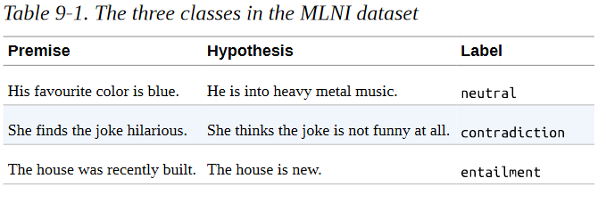

现在，事实证明，我们可以劫持一个在MNLI数据集上训练的模型来建立一个分类器，而根本不需要任何标签！关键的想法是将我们希望分类的文本视为前提。关键的想法是将我们希望分类的文本作为前提，然后将假设表述为：

“This example is about {label}.”

其中我们插入了标签的类别名称。然后，连带分数告诉我们，该前提与该主题有关的可能性有多大，我们可以对任何数量的类依次运行这个方法。这种方法的缺点是，我们需要对每个类别执行一个前向传递，这使得它的效率低于标准分类器。另一个稍显棘手的方面是，标签名称的选择会对准确性产生很大的影响，选择具有语义的标签通常是最好的方法。例如，如果标签只是简单的第1类，那么模型就没有提示这可能意味着什么，以及这是否构成了矛盾或包含关系。

Transformers有一个内置的MNLI模型用于零样本分类。我们可以通过一个流水线来初始化它，如下所示：

```
from transformers import pipeline 
pipe = pipeline("zero-shot-classification", device=0)

```

device=0的设置可以确保模型在GPU上运行，而不是默认的CPU，以加快推理速度。要对一个文本进行分类，我们只需要把它和标签名称一起传递给流水线。此外，我们可以设置multi_label=True，以确保返回所有的分数，而不是只返回单标签分类的最大分数：

```
sample = ds["train"][0] 
print(f"Labels: {sample['labels']}") 
output = pipe(sample["text"], all_labels, multi_label=True) 
print(output["sequence"][:400]) 
print("\nPredictions:") 
for label, score in zip(output["labels"], output["scores"]): 
	print(f"{label}, {score:.2f}") 

Labels: ['new model'] 
Add new CANINE model 
# New model addition 
## Model description 

Google recently proposed a new **C**haracter **A**rchitecture with **N**o tokenization **I**n **N**eural **E**ncoders architecture (CANINE). Not only the title is exciting: 

> Pipelined NLP systems have largely been superseded by end-to-end neural modeling, yet nearly all commonly-used models still require an explicit tokeni 
Predictions: 
new model, 0.98 
tensorflow or tf, 0.37 
examples, 0.34 
usage, 0.30 
pytorch, 0.25 
documentation, 0.25 
model training, 0.24 
tokenization, 0.17 
pipeline, 0.16

```

**注意事项**

由于我们使用的是子词标记器，我们甚至可以将代码传递给模型 标记化可能不是很有效，因为只有一小部分零样本流水线的预训练数据集是由代码片段组成的，但由于代码也是由很多自然词组成的，这不是一个大问题。另外，代码块可能包含重要的信息，如框架（PyTorch或TensorFlow）。

我们可以看到，该模型对这个文本是关于一个新模型非常有信心，但它对其他标签也产生了相对较高的分数。零点分类的一个重要方面是我们所处的领域。我们在这里处理的文本是非常技术性的，大部分是关于编码的，这使得它们与MNLI数据集中的原始文本分布有很大不同。因此，这对模型来说是一项具有挑战性的任务也就不足为奇了；它对某些领域的效果可能比其他领域好得多，这取决于它们与训练数据的接近程度。

让我们写一个函数，通过零拍流水线送入一个例子，然后通过运行map()将其扩展到整个验证集：

```
def zero_shot_pipeline(example): 
	output = pipe(example["text"], all_labels, multi_label=True) 
	example["predicted_labels"] = output["labels"] 
	example["scores"] = output["scores"] 
	return example 
ds_zero_shot = ds["valid"].map(zero_shot_pipeline)

```

现在我们有了我们的分数，下一步是确定应该给每个例子分配哪一组标签。有几个选项我们可以进行试验：

- 定义一个阈值并选择所有高于阈值的标签。
- 挑选分数最高的k个标签。


为了帮助我们确定哪种方法最好，让我们写一个get_preds()函数，应用其中一种方法来检索预测结果：

```
def get_preds(example, threshold=None, topk=None): 
	preds = [] 
	if threshold: 
		for label, score in zip(example["predicted_labels"], example["scores"]): 
			if score >= threshold: 
				preds.append(label) 
	elif topk: 
		for i in range(topk):
            preds.append(example["predicted_labels"][i]) 
    else: 
         raise ValueError("Set either `threshold` or `topk`.") 
    return {"pred_label_ids": list(np.squeeze(mlb.transform([preds])))}

```

接下来，让我们写第二个函数，get_clf_report()，它从数据集中返回带有预测标签的Scikit-learn分类报告：

```
def get_clf_report(ds): 
	y_true = np.array(ds["label_ids"]) 
	y_pred = np.array(ds["pred_label_ids"]) 
	return classification_report( y_true, y_pred, target_names=mlb.classes_, zero_division=0, output_dict=True)

```

有了这两个函数，让我们从top-k方法开始，增加k的几个值，然后绘制整个验证集的微观和宏观F分数：

```
macros, micros = [], [] 
topks = [1, 2, 3, 4] 
for topk in topks: 
	ds_zero_shot = ds_zero_shot.map(get_preds, batched=False, fn_kwargs={'topk': topk}) 
	clf_report = get_clf_report(ds_zero_shot) 
	micros.append(clf_report['micro avg']['f1-score']) 
	macros.append(clf_report['macro avg']['f1-score']) 
plt.plot(topks, micros, label='Micro F1') 
plt.plot(topks, macros, label='Macro F1') 
plt.xlabel("Top-k") 
plt.ylabel("F1-score") 
plt.legend(loc='best') 
plt.show()

```

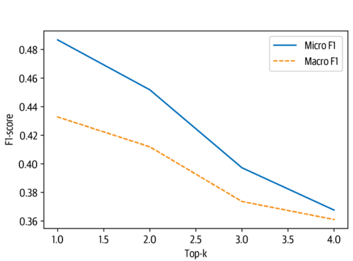

从图中我们可以看出，通过选择每个例子中得分最高的标签（顶部1），可以获得最佳结果。考虑到我们的数据集中的大多数例子只有一个标签，这也许并不令人惊讶。现在让我们来比较一下这与设置阈值的区别，这样我们就有可能预测每个例子有一个以上的标签：

```
macros, micros = [], [] 
thresholds = np.linspace(0.01, 1, 100) 
for threshold in thresholds: 
	ds_zero_shot = ds_zero_shot.map(get_preds, fn_kwargs={"threshold": threshold}) 
	clf_report = get_clf_report(ds_zero_shot)
    micros.append(clf_report["micro avg"]["f1-score"]) 
    macros.append(clf_report["macro avg"]["f1-score"]) 
plt.plot(thresholds, micros, label="Micro F1") 
plt.plot(thresholds, macros, label="Macro F1") 
plt.xlabel("Threshold") 
plt.ylabel("F1-score") 
plt.legend(loc="best")
plt.show()

```


```
best_t, best_micro = thresholds[np.argmax(micros)], np.max(micros) 
print(f'Best threshold (micro): {best_t} with F1-score {best_micro:.2f}.') best_t, best_macro = thresholds[np.argmax(macros)], np.max(macros) 
print(f'Best threshold (micro): {best_t} with F1-score {best_macro:.2f}.')

Best threshold (micro): 0.75 with F1-score 0.46. 
Best threshold (micro): 0.72 with F1-score 0.42.

```

这种方法的表现比top-1的结果要差一些，但是我们可以在这个图中清楚地看到精度/召回率的权衡。如果我们把阈值设置得太低，那么就会有太多的预测，这导致了低精度。如果我们把阈值设置得太高，那么我们几乎不会做出任何预测，这就产生了低召回率。从图中我们可以看出，0.8左右的阈值是这两者之间的甜蜜点。

由于top-1方法表现最好，让我们用它来比较零样本分类与测试集上的Naive Bayes：

```
ds_zero_shot = ds['test'].map(zero_shot_pipeline) 
ds_zero_shot = ds_zero_shot.map(get_preds, fn_kwargs={'topk': 1})
clf_report = get_clf_report(ds_zero_shot) 
for train_slice in train_slices: 
	macro_scores['Zero Shot'].append(clf_report['macro avg']['f1-score']) 
	micro_scores['Zero Shot'].append(clf_report['micro avg']['f1-score']) 
plot_metrics(micro_scores, macro_scores, train_samples, "Zero Shot")

```

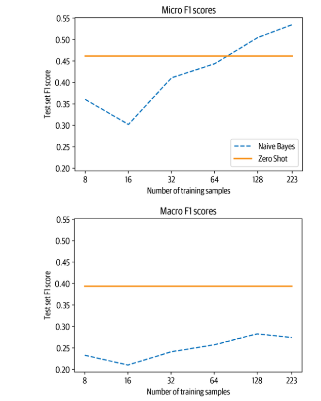

对比零次拍摄的流水线和基线，我们观察到两件事:

1. 如果我们有少于50个标记的样本，那么零点拍摄流水线的表现就会大大超过基线。

2. 即使超过50个样本，在考虑微观和宏观的F-scores时，零拍流水线的性能也很优越。微观F-score的结果告诉我们，基线在频繁的类别上表现良好，而零点拍摄流水线在这些方面表现出色，因为它不需要任何例子来学习。


**注意事项**


你可能会注意到本节中的一个小矛盾：虽然我们谈到了处理无标签的问题，但我们仍然使用验证集和测试集。我们用它们来展示不同的技术，并使它们之间的结果具有可比性。即使在一个真实的使用案例中，收集一些有标签的例子来进行一些快速评估也是有意义的。重要的一点是，我们没有用数据来调整模型的参数；相反，我们只是调整了一些超参数。


如果你发现在你自己的数据集上很难得到好的结果，这里有几件事你可以做，以改善零样本流水线：

- 该流水线的工作方式使其对标签的名称非常敏感。如果这些名字没有什么意义，或者不容易与文本联系起来，那么流水线很可能会表现不佳。要么尝试使用不同的名字，要么平行使用几个名字，并在一个额外的步骤中聚合它们。

- 你可以改进的另一件事是假设的形式。默认情况下，它是hypothesis="这个例子是关于{}的"，但你可以向流水线传递任何其他文本。根据不同的用例，这可能会提高性能。

现在让我们转向制度，我们有一些标记的例子，我们可以用来训练一个模型。

## 少样本学习

在大多数NLP项目中，你至少会有机会接触到一些有标签的例子。这些标签可能直接来自客户或跨公司团队，或者你可能决定自己坐下来注释几个例子。即使是以前的方法，我们也需要一些有标签的例子来评估零拍方法的效果如何。在这一节中，我们将看看我们如何能够最好地利用我们所拥有的少数珍贵的标注过的例子。让我们先来看看一种被称为数据增强的技术，它可以帮助我们增加我们所拥有的少量标记的数据。


### 数据增强

在小数据集上提高文本分类器性能的一个简单而有效的方法是应用数据增强技术，从现有的数据中产生新的训练实例。这是计算机视觉中的一种常见策略，即在不改变数据意义的情况下对图像进行随机扰动（例如，一只稍微旋转的猫仍然是一只猫）。对于文本来说，数据增强有些棘手，因为扰动单词或字符会完全改变其含义。例如，"大象比老鼠重吗？"和 "老鼠比大象重吗？"这两个问题只有一个词的互换，但答案却相反。然而，如果文本由几个句子组成（就像我们的GitHub问题那样），那么这些类型的转换所引入的噪音一般不会影响标签。在实践中，有两种类型的数据增强技术是常用的：


**回译** 

将源语言的文本，用机器翻译成一种或多种目标语言，然后再将其翻译回源语言。逆向翻译往往对高资源语言或不包含太多特定领域词汇的语料库效果最好。

**标记扰动**
从训练集中给定一个文本，随机选择并执行简单的转换，如随机同义词替换、词的插入、交换或删除等

这些转换的例子见表9-2。关于NLP的其他数据增强技术的详细列表，我们建议阅读Amit Chaudhary的博文 "[A Visual Survey of Data Augmentation in NLP](https://oreil.ly/j6euX)"。

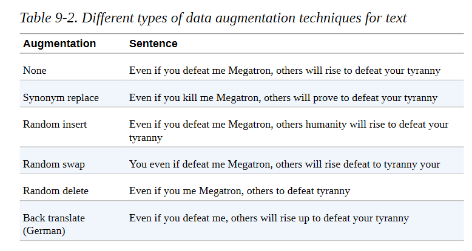


你可以使用M2M100这样的机器翻译模型来实现回译，而NlpAug和TextAttack这样的库提供了各种标记扰动的配方。在本节中，我们将重点讨论使用同义词替换，因为它实现起来很简单，并能体现出数据增强背后的主要理念。

我们将使用NlpAug的ContextualWordEmbsAug增强器来利用DistilBERT的上下文词嵌入来替换同义词。让我们从一个简单的例子开始:


```
from transformers import set_seed 
import nlpaug.augmenter.word as naw

set_seed(3) 
aug = naw.ContextualWordEmbsAug(model_path="distilbert-base-uncased", device="cpu", action="substitute") 
text = "Transformers are the most popular toys" 
print(f"Original text: {text}") 
print(f"Augmented text: {aug.augment(text)}") 

Original text: Transformers are the most popular toys 
Augmented text: transformers'the most popular toys

```

在这里，我们可以看到 "are "这个词是如何被替换成一撇的，以生成一个新的合成训练例子。我们可以用一个简单的函数来包装这个增量，如下所示:


```
def augment_text(batch, transformations_per_example=1): 
	text_aug, label_ids = [], [] 
	for text, labels in zip(batch["text"], batch["label_ids"]): 
		text_aug += [text] 
		label_ids += [labels] 
		for _ in range(transformations_per_example): 
			text_aug += [aug.augment(text)] 
			label_ids += [labels]
    return {"text": text_aug, "label_ids": label_ids}

```


现在，当我们把这个函数传递给map()方法时，我们可以用transformations_per_example这个参数生成任意数量的新例子。我们可以在我们的代码中使用这个函数来训练Naive Bayes分类器，只需在我们选择分片后添加一行:

```
ds_train_sample = ds_train_sample.map(augment_text, batched=True, remove_columns=ds_train_sample.column_names).shuffle(seed=42)

```

包括这一点并重新运行分析，产生了这里所示的图表:

```
plot_metrics(micro_scores, macro_scores, train_samples, "Naive Bayes + Aug")

```

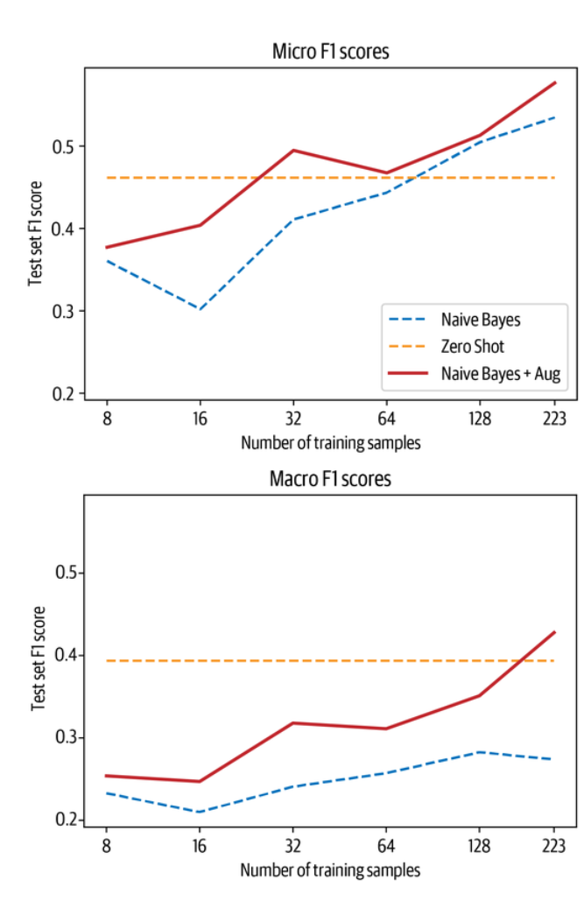


从图中我们可以看到，少量的数据扩充就能使Naive Bayes分类器的F-score提高5分左右，而且一旦我们有了170个左右的训练样本，它就会在宏观分数上超过零分流水线。现在让我们来看看基于使用大型语言模型的嵌入的方法。


### 使用嵌入向量作为查询表


像GPT-3这样的大型语言模型已经被证明在解决有限数据的任务方面表现出色。原因是这些模型学习了有用的文本表征，这些表征编码了许多维度的信息，如情感、主题、文本结构等等。为此，大型语言模型的嵌入可用于开发语义搜索引擎，寻找类似的文件或评论，甚至是对文本进行分类。


在本节中，我们将创建一个仿照OpenAI API分类端点的文本分类器。这个想法遵循一个三步骤的过程:

1. 使用语言模型来嵌入所有标记的文本。
2. 对存储的嵌入文本进行近邻搜索。
3. 汇总最近邻居的标签，以获得预测结果。

这个过程如图9-3所示，它显示了标签数据是如何被嵌入模型并与标签一起存储的。当一个新的文本需要被分类时，它也被嵌入，并根据最近的邻居的标签给出标签。校准要搜索的邻居的数量是很重要的，因为太少可能会有噪音，太多可能会混入邻居组。

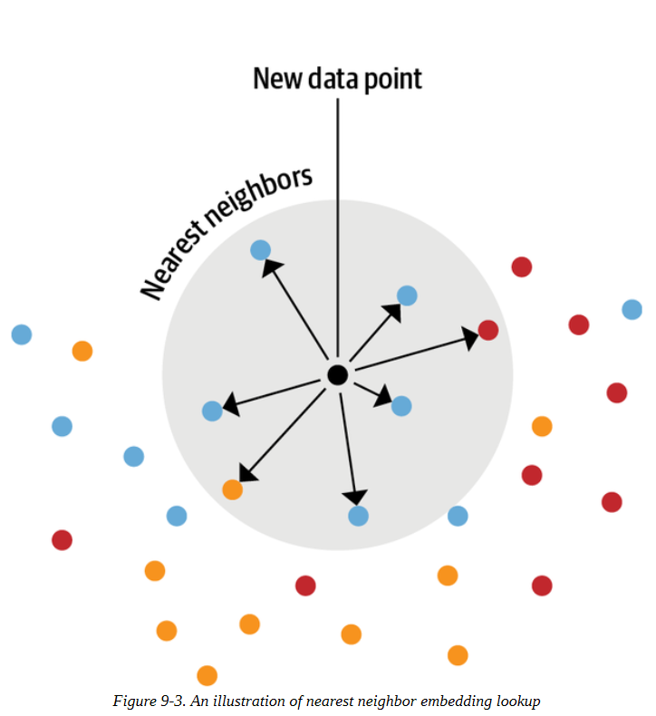


这种方法的好处是，不需要对模型进行微调来利用少数可用的标记数据点。相反，使这种方法发挥作用的主要决定是选择一个适当的模型，最好是在与你的数据集类似的领域中进行预训练。


由于GPT-3只能通过OpenAI的API获得，我们将使用GPT-2来测试该技术。具体来说，我们将使用GPT-2的一个变体，该变体是在Python代码上训练的，这将有望捕捉到我们的GitHub问题中包含的一些背景。


让我们写一个辅助函数，它接收一个文本列表，并使用模型为每个文本创建一个单向量表示。我们必须处理的一个问题是，像GPT-2这样的转化器模型实际上将返回每个标记的一个嵌入向量。例如，给定句子 "我带着我的狗去散步"，我们可以期待几个嵌入向量，每个标记一个。但我们真正想要的是整个句子（或我们应用中的GitHub问题）的单一嵌入向量。为了处理这个问题，我们可以使用一种叫做池化的技术。最简单的集合方法之一是对标记嵌入进行平均，这被称为平均集合。使用均值池，我们唯一需要注意的是，在平均值中不包括填充标记，所以我们可以使用注意力掩码来处理这个问题。

为了看看这是如何工作的，让我们加载一个GPT-2标记器和模型，定义平均池操作，并将整个过程包裹在一个简单的embed_text()函数中:


```
import torch 
from transformers import AutoTokenizer, AutoModel 
model_ckpt = "miguelvictor/python-gpt2-large" 
tokenizer = AutoTokenizer.from_pretrained(model_ckpt)
model = AutoModel.from_pretrained(model_ckpt) 
def mean_pooling(model_output, attention_mask): 
	# Extract the token embeddings 
	token_embeddings = model_output[0] 
	# Compute the attention mask 
	input_mask_expanded = (attention_mask .unsqueeze(-1) .expand(token_embeddings.size()) .float()) 
	# Sum the embeddings, but ignore masked tokens 
	sum_embeddings = torch.sum(token_embeddings * input_mask_expanded, 1) 
	sum_mask = torch.clamp(input_mask_expanded.sum(1), min=1e-9) 
	# Return the average as a single vector 
	return sum_embeddings / sum_mask 
def embed_text(examples): 
	inputs = tokenizer(examples["text"], padding=True, truncation=True, max_length=128, return_tensors="pt") 
	with torch.no_grad():
		model_output = model(**inputs) 
	pooled_embeds = mean_pooling(model_output, inputs["attention_mask"]) 
	return {"embedding": pooled_embeds.cpu().numpy()}

```

现在我们可以得到每个分割的嵌入。请注意，GPT风格的模型没有填充标记，因此我们需要添加一个，然后才能像前面的代码中实现的那样以分批的方式获得嵌入。我们将为此目的回收字符串末尾的标记:

```
tokenizer.pad_token = tokenizer.eos_token 
embs_train = ds["train"].map(embed_text, batched=True, batch_size=16) 
embs_valid = ds["valid"].map(embed_text, batched=True, batch_size=16) 
embs_test = ds["test"].map(embed_text, batched=True, batch_size=16)

```

现在我们有了所有的嵌入，我们需要建立一个系统来搜索它们。我们可以写一个函数来计算，比如说，我们要查询的一个新的文本嵌入和训练集中现有的嵌入之间的余弦相似度。另外，我们也可以使用数据集的一个内置结构，叫做FAISS索引。我们已经在第七章中遇到了FAISS。你可以把它看作是一个嵌入的搜索引擎，我们一会儿会仔细看看它是如何工作的。我们可以通过add_faiss_index()使用数据集的一个现有字段来创建一个FAISS索引，也可以通过add_faiss_index_from_external_arrays()将新的嵌入数据加载到数据集。让我们使用前一个函数将我们的训练嵌入物添加到数据集中，如下所示:

```
embs_train.add_faiss_index("embedding")

```

这创建了一个新的FAISS索引，称为嵌入。我们现在可以通过调用函数get_nearest_examples()来进行最近的邻居查询。它返回最近的邻居，以及每个邻居的匹配分数。我们需要指定查询的嵌入以及要检索的最近的邻居的数量。让我们转一转，看一看与一个例子最接近的文件:


```
i, k = 0, 3
# Select the first query and 3 nearest neighbors 
rn, nl = "\r\n\r\n", "\n"
# Used to remove newlines in text for compact display 
query = np.array(embs_valid[i]["embedding"], dtype=np.float32) 
scores, samples = embs_train.get_nearest_examples("embedding", query, k=k) 
print(f"QUERY LABELS: {embs_valid[i]['labels']}") 
print(f"QUERY TEXT:\n{embs_valid[i]['text'][:200].replace(rn, nl)} [...]\n") 
print("="*50) 
print(f"Retrieved documents:") 
for score, label, text in zip(scores, samples["labels"], samples["text"]): 
	print("="*50) 
	print(f"TEXT:\n{text[:200].replace(rn, nl)} [...]") 
	print(f"SCORE: {score:.2f}") 
	print(f"LABELS: {label}") 


QUERY LABELS: ['new model'] 
QUERY TEXT: 
Implementing efficient self attention in T5 # New model addition My teammates and I (including @ice-americano) would like to use efficient self attention methods such as Linformer, Performer and [...]
================================================== 
Retrieved documents: 
================================================== 
TEXT: Add Linformer model 

# New model addition 
## Model description 
### Linformer: Self-Attention with Linear Complexity 

Paper published June 9th on ArXiv: https://arxiv.org/abs/2006.04768 La [...] SCORE: 54.92 LABELS: ['new model'] 
================================================== 
TEXT: Add FAVOR+ / Performer attention 
# FAVOR+ / Performer attention addition Are there any plans to add this new attention approximation block to 
Transformers library?
## Model description The n [...] 
SCORE: 57.90 
LABELS: ['new model']
================================================== 
TEXT: 
Implement DeLighT: Very Deep and Light-weight Transformers 

# New model addition ## Model description DeLight, that delivers similar or better performance than transformer-based models with sign [...] 
SCORE: 60.12 
LABELS: ['new model']


```


很好! 这正是我们所希望的：我们通过嵌入查找得到的三个检索文件都有相同的标签，我们已经可以从标题中看到它们都非常相似。查询以及检索到的文件都是围绕着增加新的、高效的转化器模型进行的。然而，问题仍然是，什么是k的最佳值？同样地，我们应该如何汇总检索到的文件的标签？例如，我们是否应该检索三个文档，并分配所有至少出现两次的标签？或者我们应该检索20个，使用所有至少出现5次的标签？让我们系统地研究一下这个问题：我们将尝试几个k的值，然后用一个辅助函数改变标签分配的阈值m < k。我们将记录每个设置的宏观和微观性能，这样我们就可以在以后决定哪一个运行表现最好。我们可以利用函数get_nearest_examples_batch()，它接受一批查询，而不是在验证集中的每个样本上循环:


```
def get_sample_preds(sample, m): 
	return (np.sum(sample["label_ids"], axis=0) >= m).astype(int) 
def find_best_k_m(ds_train, valid_queries, valid_labels, max_k=17):
	max_k = min(len(ds_train), max_k) 
	perf_micro = np.zeros((max_k, max_k)) 
	perf_macro = np.zeros((max_k, max_k)) 
	for k in range(1, max_k): 
		for m in range(1, k + 1):
        	_, samples = ds_train.get_nearest_examples_batch("embedding", valid_queries, k=k) 
        	y_pred = np.array([get_sample_preds(s, m) for s in samples]) 
        	clf_report = classification_report(valid_labels, y_pred
target_names=mlb.classes_, zero_division=0, output_dict=True) 
			perf_micro[k, m] = clf_report["micro avg"]["f1-score"] 
			perf_macro[k, m] = clf_report["macro avg"]["f1-score"] 
	return perf_micro, perf_macro

```


让我们检查一下所有训练样本的最佳值是多少，并将所有k和m配置的分数可视化:

```
valid_labels = np.array(embs_valid["label_ids"]) 
valid_queries = np.array(embs_valid["embedding"], dtype=np.float32) 
perf_micro, perf_macro = find_best_k_m(embs_train, valid_queries, valid_labels) 
fig, (ax0, ax1) = plt.subplots(1, 2, figsize=(10, 3.5), sharey=True) 
ax0.imshow(perf_micro)
ax1.imshow(perf_macro) 
ax0.set_title("micro scores")
ax0.set_ylabel("k") 
ax1.set_title("macro scores") 
for ax in [ax0, ax1]: 
	ax.set_xlim([0.5, 17 - 0.5]) 
	ax.set_ylim([17 - 0.5, 0.5]) 
	ax.set_xlabel("m") 
plt.show()

```

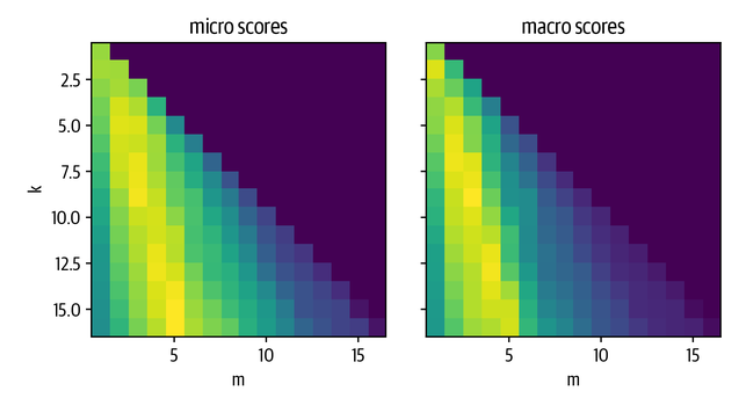

从图中我们可以看出，有一个模式：对于给定的k，选择m过大或过小都会产生次优结果。当选择大约m/k=1/3的比例时，会产生最佳的性能。让我们看看哪一个k和m在整体上能产生最好的结果:


```
k, m = np.unravel_index(perf_micro.argmax(), perf_micro.shape) 
print(f"Best k: {k}, best m: {m}") 
Best k: 15, best m: 5

```


当我们选择k=15和m=5时，或者换句话说，当我们检索15个最近的邻居，然后分配至少出现5次的标签时，表现最好。现在我们有了一个很好的方法来寻找嵌入查找的最佳值，我们可以玩和Naive Bayes分类器一样的游戏，我们通过训练集的切片来评估性能。在我们对数据集进行切片之前，我们需要删除索引，因为我们不能像数据集那样对FAISS索引进行切片。循环的其余部分完全保持不变，只是增加了使用验证集来获得最佳的k和m值:


```
embs_train.drop_index("embedding") 
test_labels = np.array(embs_test["label_ids"]) 
test_queries = np.array(embs_test["embedding"], dtype=np.float32) 
for train_slice in train_slices: 
# Create a Faiss index from training slice 
	embs_train_tmp = embs_train.select(train_slice) 	
	embs_train_tmp.add_faiss_index("embedding")
    # Get best k, m values with validation set 
    perf_micro, _ = find_best_k_m(embs_train_tmp, valid_queries, valid_labels) 
    k, m = np.unravel_index(perf_micro.argmax(), perf_micro.shape) 
    # Get predictions on test set 
    _, samples = embs_train_tmp.get_nearest_examples_batch("embedding", test_queries, k=int(k)) 
    y_pred = np.array([get_sample_preds(s, m) for s in samples]) 
    # Evaluate predictions 
    clf_report = classification_report(test_labels, y_pred, target_names=mlb.classes_, zero_division=0, output_dict=True,) 
    macro_scores["Embedding"].append(clf_report["macro avg"]["f1-score"]) 
    micro_scores["Embedding"].append(clf_report["micro avg"]["f1-score"]
    
plot_metrics(micro_scores, macro_scores, train_samples, "Embedding")

```


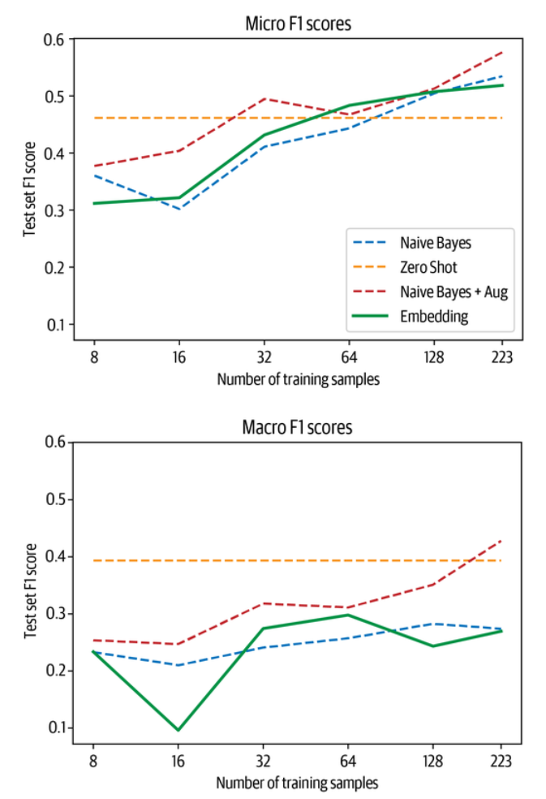


嵌入查找法在微观分数上与以前的方法有竞争性，同时只有两个 "可学习 "的参数，即k和m，但在宏观分数上的表现略差。

对这些结果持谨慎态度；哪种方法最有效在很大程度上取决于领域。零拍流水线的训练数据与我们正在使用的GitHub问题数据集有很大不同，后者包含了大量模型以前可能没有遇到过的代码。对于一个更常见的任务，如评论的情感分析，该流水线可能工作得更好。同样地，嵌入的质量也取决于模型和它所训练的数据。我们尝试了半打模型，如sentence-transformers/stsb-roberta-large，它被训练为提供高质量的句子嵌入，以及microsoft/codebertbase和dbernsohn/roberta-python，它们被训练为代码和文档。对于这个特定的用例，在Python代码上训练的GPT-2效果最好。

因为除了替换模型检查点名称以测试另一个模型外，你实际上不需要改变你的代码中的任何东西，一旦你建立了评估流水线，你可以快速尝试一些模型。现在让我们把这个简单的嵌入技巧与在有限的数据上简单地微调一个转化器进行比较。

------

**用Faiss进行高效的相似性搜索**


我们在第七章中第一次接触到FAISS，在那里我们用它通过DPR嵌入来检索文档。这里我们将简要地解释FAISS库是如何工作的，以及为什么它是ML工具箱中的一个强大工具。我们习惯于在巨大的数据集上进行快速的文本查询，如维基百科或网络上的搜索引擎，如谷歌。当我们从文本转移到嵌入时，我们希望保持这种性能；然而，用于加快文本查询的方法并不适用于嵌入。为了加快文本搜索的速度，我们通常会创建一个倒置的索引，将术语映射到文档。倒置索引的工作原理类似于书末的索引：每个词都被映射到它所出现的页面（或者在我们的例子中，是文档）。当我们以后运行一个查询时，我们可以快速查找搜索词出现在哪些文档中。这对离散的对象（如单词）很有效，但对连续的对象（如矢量）则无效。每个文档都可能有一个独特的向量，因此索引将永远不会与新的向量相匹配。我们不需要寻找精确的匹配，而是需要寻找接近或类似的匹配。当我们想找到数据库中与查询向量最相似的向量时，理论上我们需要将查询向量与数据库中的每个向量进行比较。对于像本章中的小数据库来说，这是没有问题的，但是如果我们将其扩大到几千甚至几百万条，我们就需要等待一段时间来处理每个查询。FAISS通过一些技巧来解决这个问题。主要的想法是对数据集进行分区。如果我们只需要将查询向量与数据库的一个子集进行比较，我们可以大大加快处理速度。但是，如果我们只是随机地对数据集进行分区，我们如何决定搜索哪个分区，以及我们对找到最相似的条目有何保证？显然，一定有一个更好的解决方案：对数据集进行kmeans聚类！这是对数据集的聚类。这将嵌入物按相似度聚成一组。此外，对于每个组，我们得到一个中心点向量，它是该组所有成员的平均值（图9-4）。

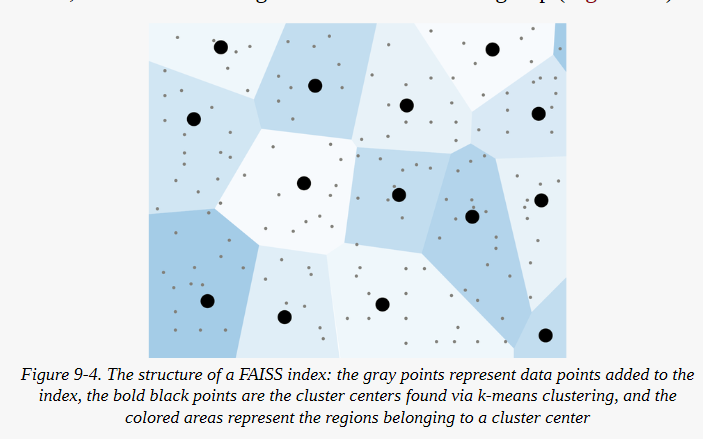


鉴于这样的分组，在n个向量中搜索就容易多了：我们首先在k个中心点中搜索与我们的查询最相似的那个（k个比较），然后在组内搜索（元素比较）。这就把比较的数量从n减少到k+(n/k) 。那么问题来了，k的最佳选择是什么？如果它太小，每组仍然包含许多样本，我们需要在第二步进行比较，如果k太大，有许多中心点我们需要搜索。寻找函数f（k）=k+ (n/k) 关于k的最小值，我们发现k=√n。事实上，我们可以用下面的图形直观地说明这一点，n=2^20。

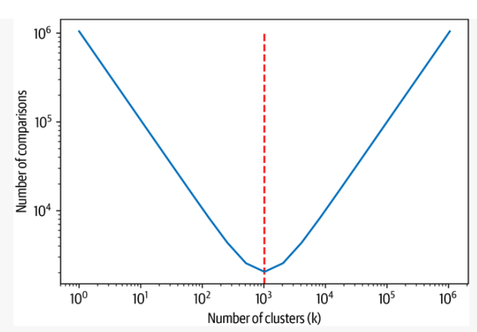


在图中，你可以看到比较的数量是集群数量的一个函数。我们正在寻找这个函数的最小值，即我们需要做最少的比较的地方。我们可以看到，最小值正是我们期望看到的地方，在

√(2^20)=2^10=1024 处。

除了用分区来加快查询速度，FAISS还允许你利用GPU来进一步加快速度。如果内存成为一个问题，也有几个选项可以用高级量化方案压缩向量。如果你想在你的项目中使用FAISS，资源库有一个简单的指南，让你为你的用例选择正确的方法。

使用FAISS的最大项目之一是Facebook创建的CCMatrix语料库。作者使用多语言嵌入来寻找不同语言的平行句子。这个巨大的语料库随后被用来训练M2M100，这是一个大型的机器翻译模型，能够在100种语言中的任何一种之间进行直接翻译。

------


### 微调一个普通的Transformers

如果我们有机会获得标记的数据，我们也可以尝试做一些显而易见的事情：简单地微调预训练的转化器模型。在本节中，我们将使用标准的BERT检查点作为起点。稍后，我们将看到微调语言模型对性能的影响。

**小技巧** 

对于许多应用来说，从一个预训练的类似BERT的模型开始是一个好主意。然而，如果你的语料库的领域与预训练语料库（通常是维基百科）有很大的不同，你应该探索在Hugging Face Hub上的许多模型。很有可能有人已经在你的领域上预训练了一个模型!


让我们从加载预训练的标记器开始，对我们的数据集进行标记，并去掉我们在训练和评估中不需要的列:


```
import torch 
from transformers import (AutoTokenizer, AutoConfig, AutoModelForSequenceClassification) 

model_ckpt = "bert-base-uncased" 
tokenizer = AutoTokenizer.from_pretrained(model_ckpt) 
def tokenize(batch): 
	return tokenizer(batch["text"], truncation=True, max_length=128) 
ds_enc = ds.map(tokenize, batched=True) 
ds_enc = ds_enc.remove_columns(['labels', 'text'])

```


多标签损失函数希望标签的类型是浮动的，因为它也允许类概率而不是离散的标签。因此，我们需要改变列 label_ids 的类型。由于从元素上改变列的格式与Arrow的类型格式不相称，我们将做一个小小的变通。首先，我们创建一个带有标签的新列。该列的格式是由第一个元素推断出来的。然后，我们删除原来的列，重命名新的列以取代原来的列:

```
ds_enc.set_format("torch") 
ds_enc = ds_enc.map(lambda x: {"label_ids_f": x["label_ids"].to(torch.float)}, remove_columns=["label_ids"]) 
ds_enc = ds_enc.rename_column("label_ids_f", "label_ids")

```


由于训练数据的规模有限，我们很可能很快过度拟合，所以我们设置load_best_model_at_end=True，并根据微观F - score选择最佳模型:


```
from transformers import Trainer, TrainingArguments 
training_args_fine_tune = TrainingArguments( output_dir="./results", num_train_epochs=20, learning_rate=3e-5, lr_scheduler_type='constant', per_device_train_batch_size=4, per_device_eval_batch_size=32, weight_decay=0.0, evaluation_strategy="epoch", save_strategy="epoch",logging_strategy="epoch", load_best_model_at_end=True, metric_for_best_model='micro f1', save_total_limit=1, log_level='error')

```


我们需要F-score来选择最佳模型，所以我们需要确保在评估期间计算它。因为模型返回的是对数，我们首先需要用sigmoid函数对预测进行归一化，然后可以用一个简单的阈值对其进行二进制化。然后，我们从分类报告中返回我们感兴趣的分数:


```
from scipy.special import expit as sigmoid 
def compute_metrics(pred): 
	y_true = pred.label_ids
    y_pred = sigmoid(pred.predictions) 
    y_pred = (y_pred>0.5).astype(float) 
    clf_dict = classification_report(y_true, y_pred, target_names=all_labels, zero_division=0, output_dict=True) 
    return {"micro f1": clf_dict["micro avg"]["f1-score"], "macro f1": clf_dict["macro avg"]["f1-score"]}

```


现在，我们已经准备好了。对于每个训练集片，我们从头开始训练一个分类器，在训练循环结束时加载最佳模型，并将结果存储在测试集上:


```
config = AutoConfig.from_pretrained(model_ckpt) 
config.num_labels = len(all_labels) 
config.problem_type = "multi_label_classification" 
for train_slice in train_slices: 
	model = AutoModelForSequenceClassification.from_pretrained(model_ckpt, config=config) 
	trainer = Trainer( model=model, tokenizer=tokenizer, args=training_args_fine_tune, compute_metrics=compute_metrics, train_dataset=ds_enc["train"].select(train_slice), eval_dataset=ds_enc["valid"],) 
	trainer.train() 
	pred = trainer.predict(ds_enc["test"]) 
	metrics = compute_metrics(pred) 
	macro_scores["Fine-tune (vanilla)"].append(metrics["macro f1"]) 
	micro_scores["Fine-tune (vanilla)"].append(metrics["micro f1"]) 

plot_metrics(micro_scores, macro_scores, train_samples, "Fine-tune (vanilla)")

```


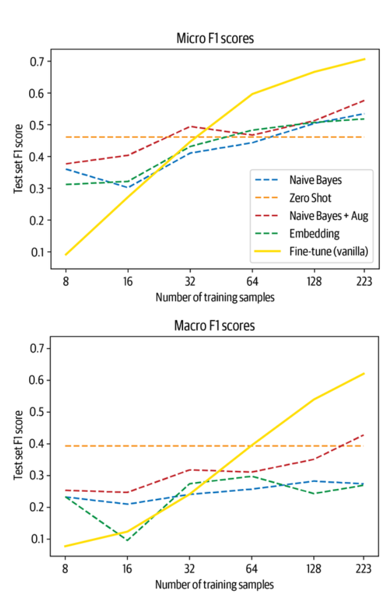


首先，我们看到，当我们有机会接触到大约64个例子时，在数据集上简单地微调一个虚构的BERT模型就能得到有竞争力的结果。我们还看到，在这之前，行为有点不稳定，这也是由于在小样本上训练模型，其中一些标签可能是不利的不平衡的。在我们利用我们的数据集的无标签部分之前，让我们快速看一下另一种有前途的方法，即在少有的领域中使用语言模型。


### 基于提示的上下文学习和少样本学习


我们在本章前面看到，我们可以使用像BERT或GPT-2这样的语言模型，并通过使用提示语和解析模型的标记预测来使其适应监督任务。这与添加一个特定任务的头并为任务调整模型参数的经典方法不同。从好的方面看，这种方法不需要任何训练数据，但从坏的方面看，如果我们有机会获得标签数据，似乎就不能利用。有一个中间地带，我们有时可以利用它，叫做in-context或sew-shot学习。


为了说明这个概念，请考虑一个英语到法语的翻译任务。在0-shot范式中，我们将构建一个提示，可能看起来如下：


```
prompt = """\ Translate English to French: thanks => """

```

这希望能促使模型预测 "merci "这个词的标记。我们在第六章中使用GPT-2进行总结时已经看到，在文本中加入 "TL;DR "会促使模型产生一个总结，而不需要明确地进行训练。GPT-3论文的一个有趣的发现是大型语言模型能够有效地从提示中提出的例子中学习--因此，前面的翻译例子可以用几个英译德的例子来增加，这将使模型在这个任务中表现得更好。

此外，作者发现，模型的规模越大，它们在使用语境中的例子时就越好，从而导致性能的大幅提升。尽管GPT-3大小的模型在生产中的使用具有挑战性，但这是一个令人兴奋的新兴研究领域，人们已经建立了很酷的应用，比如一个自然语言的外壳，用自然语言输入命令并由GPT-3解析为外壳命令。

使用标记数据的另一种方法是创建提示和预期预测的例子，并在这些例子上继续训练语言模型。一种名为ADAPET的新方法采用了这种方法，并在各种任务上击败了GPT-3，用生成的提示语来调整模型。Hugging Face的研究人员最近的工作表明，这样的方法可以比微调一个自定义的头更具有数据效率。


在这一节中，我们简要地看了各种方法，以很好地利用我们所拥有的少数标记的例子。很多时候，除了标注的例子之外，我们还可以获得大量未标注的数据；在下一节，我们将讨论如何很好地利用这些数据。


## 利用无标签的数据

尽管能够获得大量高质量的标记数据是训练分类器的最佳情况，但这并不意味着无标记数据毫无价值。只要想想我们所使用的大多数模型的预训练：即使它们是在互联网上的大部分不相关的数据上训练的，我们也可以利用预训练的权重在各种文本上进行其他任务。这就是NLP中转移学习的核心思想。当然，如果下游任务的文本结构与预训练的文本相似，那么迁移的效果会更好，所以如果我们能使预训练的任务更接近下游的目标，我们就有可能提高迁移的效果。

让我们从我们的具体用例来思考这个问题。BERT在BookCorpus和英语维基百科上进行了预训练，而包含代码和GitHub问题的文本在这些数据集中绝对是一个小众的。如果我们从头开始预训练BERT，我们可以在抓取GitHub上的所有问题时进行训练，比如说。然而，这将是昂贵的，而且BERT所学到的关于语言的很多方面仍然对GitHub问题有效。那么，在从头开始重新训练和仅仅使用模型进行分类之间是否有一个中间地带？有的，这就是所谓的领域适应（我们在第7章也看到了问题回答的情况）。与其从头开始重新训练语言模型，我们可以在我们领域的数据上继续训练它。在这一步中，我们使用经典的语言模型目标，即预测屏蔽词，这意味着我们不需要任何标记的数据。之后，我们可以将适应的模型加载为分类器，并对其进行微调，从而利用未标记的数据。

领域适应的好处是，与标记的数据相比，未标记的数据往往是大量可用的。此外，适应的模型可以在许多用例中重复使用。想象一下，你想建立一个电子邮件分类器，并在你所有的历史邮件上应用域适应。你以后可以将同一个模型用于命名实体识别或另一个分类任务，如情感分析，因为该方法对下游任务是不可知的。

现在让我们看看我们需要采取哪些步骤来微调一个预训练的语言模型。


### 对语言模型进行微调

在这一节中，我们将在数据集的未标记部分用屏蔽语言建模来微调预训练的BERT模型。要做到这一点，我们只需要两个新的概念：在对数据进行标记时的一个额外步骤和一个特殊的数据整理器。让我们从标记化开始。


除了文本中的普通标记外，标记器还将特殊标记添加到序列中，如用于分类和下句预测的[CLS]和[SEP]标记。当我们做屏蔽式语言建模时，我们要确保我们不会训练模型来预测这些标记。出于这个原因，我们将它们从损失中屏蔽掉，我们可以通过设置return_special_tokens_mask=True，在标记化时得到一个屏蔽。让我们用这个设置对文本进行重新标记。

```
def tokenize(batch):
	return tokenizer(batch["text"], truncation=True, max_length=128, return_special_tokens_mask=True) 
	ds_mlm = ds.map(tokenize, batched=True) 
	ds_mlm = ds_mlm.remove_columns(["labels", "text", "label_ids"])

```


在开始进行遮蔽语言建模时，缺少的是在输入序列中遮蔽标记并在输出中拥有目标标记的机制。我们可以采取的一种方法是，设置一个掩蔽随机标记的函数，并为这些序列创建标签。但这将使数据集的大小增加一倍，因为我们还要在数据集中存储目标序列，而且这意味着我们将在每个时代使用相同的序列掩码。

一个更优雅的解决方案是使用一个数据整理器。记住，数据整理器是在数据集和模型调用之间建立桥梁的函数。一个批次从数据集中取样，数据整理器准备好批次中的元素并将其送入模型。在我们遇到的最简单的情况下，它只是将每个元素的张量连接成一个张量。在我们的案例中，我们可以用它来做屏蔽和标签的生成。这样我们就不需要存储标签，而且每次采样都会得到新的掩码。这个任务的数据整理器被称为DataCollatorForLanguageModeling。我们用模型的标记器和我们想通过mlm_probability参数掩盖的标记的比例来初始化它。我们将使用这个整理器来屏蔽15%的标记，这与BERT论文中的程序一致：


```
from transformers import DataCollatorForLanguageModeling, set_seed 
data_collator = DataCollatorForLanguageModeling(tokenizer=tokenizer, mlm_probability=0.15)

```

让我们快速看一下数据整理器的运行情况，看看它到底做了什么。为了在DataFrame中快速显示结果，我们将标记器和数据整理器的返回格式切换为NumPy：


```
set_seed(3) 
data_collator.return_tensors = "np" 
inputs = tokenizer("Transformers are awesome!", return_tensors="np") 
outputs = data_collator([{"input_ids": inputs["input_ids"][0]}])

pd.DataFrame({ "Original tokens": tokenizer.convert_ids_to_tokens(inputs["input_ids"] [0]), "Masked tokens": tokenizer.convert_ids_to_tokens(outputs["input_ids"][0]), "Original input_ids": original_input_ids, "Masked input_ids": masked_input_ids, "Labels": outputs["labels"][0]}).T

```


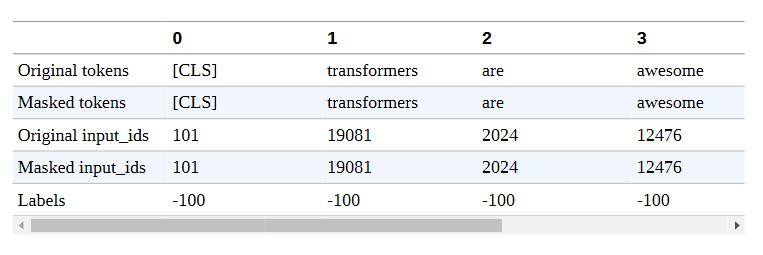

我们看到对应于感叹号的令牌已经被替换成了一个屏蔽令牌。此外，数据整理器返回了一个标签数组，其中原始令牌为-100，被屏蔽的令牌为令牌ID。正如我们之前看到的，在计算损失时，包含-100的条目被忽略。让我们把数据整理器的格式换回PyTorch：


```
data_collator.return_tensors = "pt"

```


随着标记器和数据整理器的到位，我们准备对屏蔽的语言模型进行微调。我们像往常一样设置TrainingArguments和Trainer：


```
from transformers import AutoModelForMaskedLM 

training_args = TrainingArguments( output_dir = f"{model_ckpt}-issues-128", per_device_train_batch_size=32, logging_strategy="epoch", evaluation_strategy="epoch", save_strategy="no", num_train_epochs=16, push_to_hub=True, log_level="error", report_to="none") 

trainer = Trainer( model=AutoModelForMaskedLM.from_pretrained("bert-base-uncased"), tokenizer=tokenizer, args=training_args, data_collator=data_collator, train_dataset=ds_mlm["unsup"], eval_dataset=ds_mlm["train"]) 

trainer.train() 
trainer.push_to_hub("Training complete!")

```


我们可以访问训练器的日志历史，查看模型的训练和验证损失。所有的日志都存储在trainer.state.log_history中，作为一个字典列表，我们可以很容易地加载到Pandas DataFrame中。由于训练和验证损失是在不同的步骤中记录的，所以数据框架中存在缺失值。出于这个原因，我们在绘制指标之前，先把缺失的值删除：


```
df_log = pd.DataFrame(trainer.state.log_history) 

(df_log.dropna(subset=["eval_loss"]).reset_index()["eval_loss"] .plot(label="Validation")) 

df_log.dropna(subset=["loss"]).reset_index()["loss"].plot(label="Train")
plt.xlabel("Epochs") 
plt.ylabel("Loss") 
plt.legend(loc="upper right")
plt.show()

```

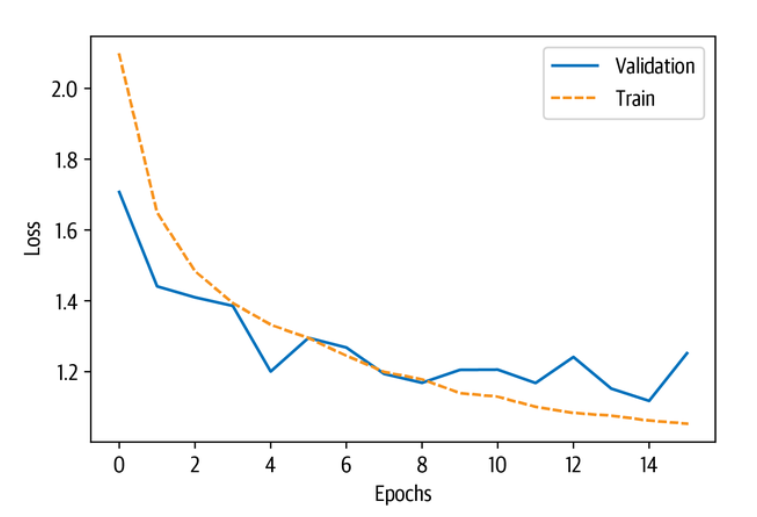


看来，训练和验证损失都大大降低了。因此，让我们检查一下，当我们对基于这个模型的分类器进行微调时，是否也能看到改进。


### 对分类器进行微调

现在，我们将重复微调程序，但有一点不同的是，我们将加载我们自己的自定义模型：


```
model_ckpt = f'{model_ckpt}-issues-128' 
config = AutoConfig.from_pretrained(model_ckpt) 
config.num_labels = len(all_labels) 
config.problem_type = "multi_label_classification" 
for train_slice in train_slices: 
	model = AutoModelForSequenceClassification.from_pretrained(model_ckpt, config=config) 
	trainer = Trainer( model=model, tokenizer=tokenizer, args=training_args_fine_tune, compute_metrics=compute_metrics
train_dataset=ds_enc["train"].select(train_slice), eval_dataset=ds_enc["valid"], )
	trainer.train() 
	pred = trainer.predict(ds_enc['test'])
	 metrics = compute_metrics(pred) 
	 # DA refers to domain adaptation 
	 macro_scores['Fine-tune (DA)'].append(metrics['macro f1']) 
	 micro_scores['Fine-tune (DA)'].append(metrics['micro f1'])

```

将结果与基于vanilla BERT的微调进行比较，我们看到，我们得到了一个优势，特别是在低数据领域。在有更多标记数据的情况下，我们也获得了几个百分点：

```
plot_metrics(micro_scores, macro_scores, train_samples, "Fine-tune (DA)")

```

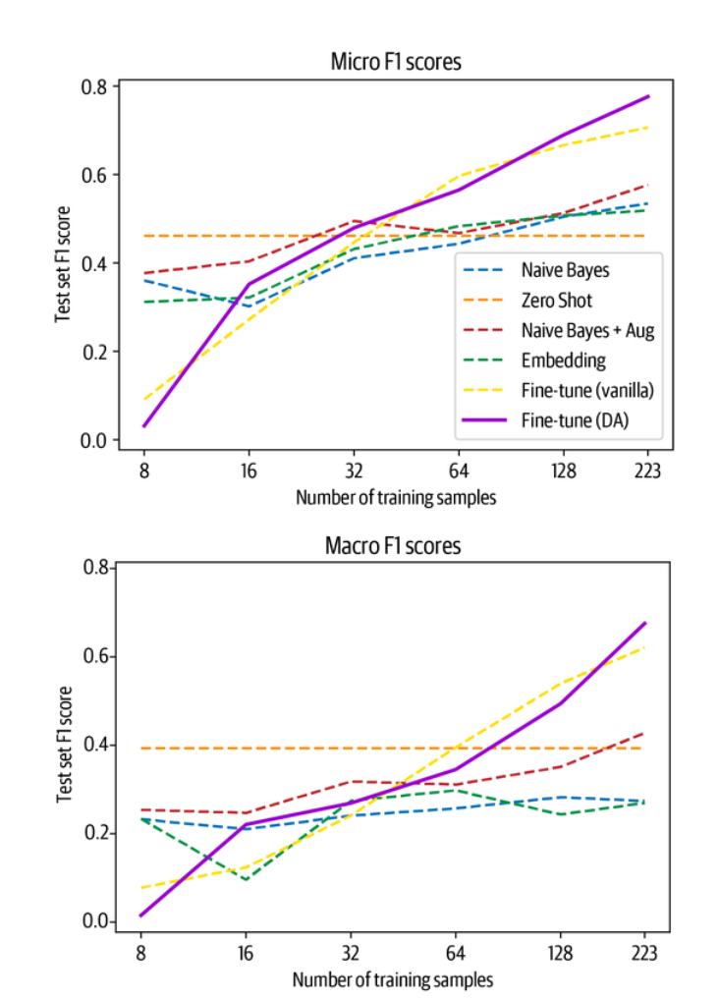

这突出表明，领域适应可以通过未标记的数据和少量的努力为模型的性能提供轻微的提升。自然，未标注的数据越多，标注的数据越少，你用这种方法得到的影响就越大。在结束本章之前，我们将向你展示一些利用无标签数据的更多技巧。


### 高级方法

在调整分类头之前对语言模型进行微调是一个简单而可靠的方法，可以提高性能。然而，还有一些复杂的方法比可以进一步利用未标记的数据。我们在此总结了其中的一些方法，如果你需要更多的性能，这些方法应该提供一个很好的起点。

#### 无监督的数据增强

无监督数据增强（UDA）的关键思想是，一个模型的预测对于一个没有标签的例子和一个稍微扭曲的例子应该是一致的。这种扭曲是通过标准的数据增强策略引入的，如标记替换和回译。然后，通过最小化原始例子和扭曲的例子的预测之间的KL分歧来强制实现一致性。这个过程如图9-5所示，其中一致性要求是通过增加交叉熵损失和来自未标记的例子的额外项来实现的。这意味着，我们用标准的监督方法在有标签的数据上训练一个模型，但限制该模型对无标签的数据做出一致的预测。

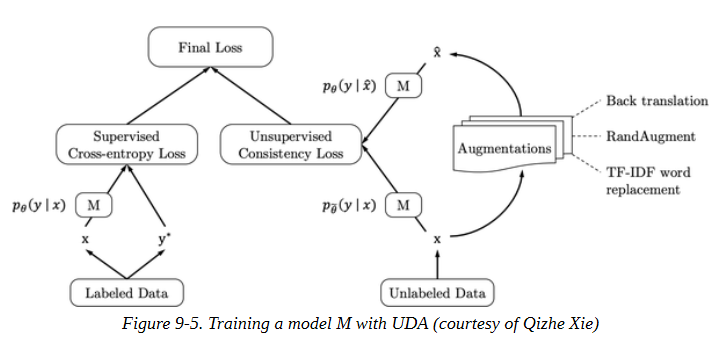


这种方法的性能相当令人印象深刻：用UDA训练的BERT模型在少数有标签的例子中得到的性能与在成千上万的例子中训练的模型相似。缺点是，你需要一个数据增强流水线，而且训练时间更长，因为你需要多个前向通道来生成对未标记和增强的例子的预测分布。


#### 不确定性感知自训练

另一种有前途的利用无标签数据的方法是不确定性感知自我训练（UST）。这里的想法是在有标签的数据上训练一个教师模型，然后用这个模型在未标记的数据上创建伪标签。然后在伪标签数据上训练一个学生模型，训练结束后它就成为下一次迭代的教师模型。

这种方法的一个有趣的方面是伪标签是如何产生的：为了得到模型预测的不确定性测量，在开启滤波的情况下，同一输入被多次送入模型。然后，预测的方差可以代表模型对特定样本的确定性。有了这个不确定性的测量，假标签就可以用一种叫做 "基于分歧的贝叶斯主动学习"（BALD）的方法进行采样。图9-6说明了完整的训练流水线。

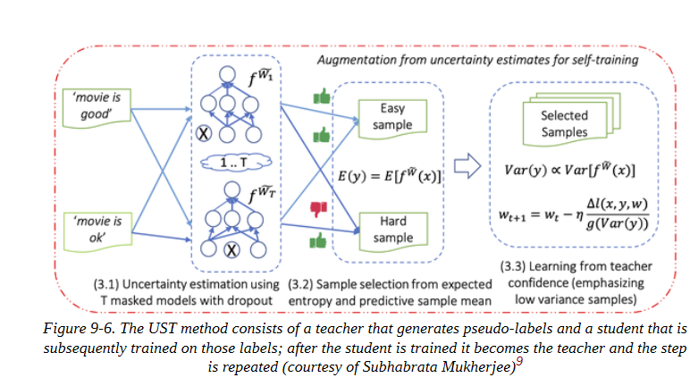

通过这种迭代方案，教师模型在创建伪标签方面不断变得更好，从而提高了模型的性能。最后，这种方法在数千个样本的完整训练数据上训练出来的模型中只占百分之几，甚至在几个数据集上击败了UDA。

现在我们已经看到了一些先进的方法，让我们回过头来总结一下我们在本章中所学到的东西。


## 小结

在本章中，我们已经看到，即使我们只有几个甚至没有标签，也不是没有希望。我们可以利用在其他任务上预训练过的模型，比如在Python代码上训练的BERT语言模型或GPT-2，来对GitHub问题分类这个新任务进行预测。此外，我们可以利用领域适应性，在用普通分类头训练模型时获得额外的提升。

所介绍的哪种方法在特定的用例中效果最好，取决于多个方面：你有多少标记的数据，它有多大的噪声，数据与预训练语料库有多接近，等等。为了找出最有效的方法，建立一个评估流水线，然后快速迭代是个好主意。变形金刚灵活的API允许你快速加载少量的模型并进行比较，而不需要修改任何代码。在Hugging Face Hub上有超过10,000个模型，有可能有人在过去曾处理过类似的问题，你可以在此基础上建立。超出本书范围的一个方面是像UDA或UST这样更复杂的方法与获得更多数据之间的权衡。为了评估你的方法，至少在早期建立一个验证和测试集是有意义的。在每一步，你也可以收集更多的标注数据。通常情况下，对几百个例子进行标注是几个小时或几天的工作，有很多工具可以帮助你这样做。根据你想要实现的目标，投入一些时间来创建一个小型的、高质量的数据集，而不是用一个非常复杂的方法来弥补数据集的不足，是有意义的。通过我们在本章介绍的方法，你可以确保从你宝贵的标签数据中获得最大的价值。

在这里，我们已经冒险进入了低数据系统，并看到即使只有一百个例子，转化器模型仍然是强大的。在下一章中，我们将看看完全相反的情况：我们将看看当我们有数百GB的数据和大量的计算时，我们能做什么。我们将从头开始训练一个大型的转化器模型来为我们自动完成代码。

