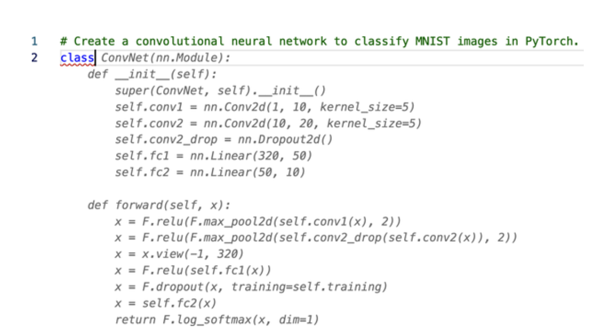

 &emsp;&emsp;自2017年推出以来，Transformers已经成为处理学术界和工业界广泛的自然语言处理（NLP）任务的事实标准。 在没有注意到的情况下，你今天可能与Transformer发生了互动。 谷歌现在使用BERT，通过更好地理解用户的搜索查询来增强其搜索引擎。 同样，OpenAI的GPT系列模型因其生成类似人类的文本和图像的能力而多次成为主流媒体的头条。 这些Transformers现在为GitHub的Copilot (一种自动编写代码的AI程序）等应用提供了动力，如图P-1所示，它可以将一条评论转化为源代码，自动为你创建一个神经网络 那么，是什么让变压器几乎在一夜之间改变了这个领域？ 像许多伟大的科学突破一样，它是几个想法的综合，如注意力、转移学习和扩大神经网络的规模，这些想法当时在研究界都在酝酿。 但是，无论它多么有用，任何花哨的新方法要想在工业界获得牵引力，都需要有工具来使其易于使用。 Hugging face的Transformers库及其周围的生态系统响应了这一号召，使从业人员能够轻松使用、训练和分享模型。 这大大加快了变压器的采用，该图书馆现在被五千多个组织使用。 在本书中，我们将指导你如何训练和优化这些模型的实际应用。

图P-1  来自GitHub Copilot的一个例子，给定任务的简要描述，应用程序为整个类提供了一个建议（下面的所有类都是自动生成的）。
